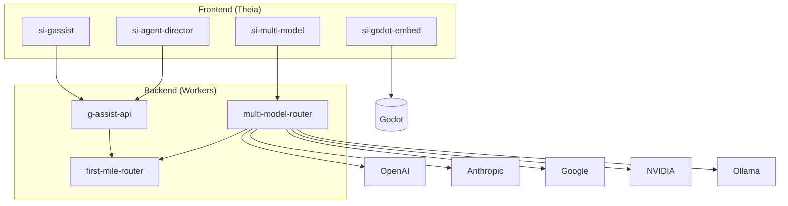

# COMPONENTS.md - SuperInstance.AI Component Rolodex

> Quick-reference card catalog of reusable components.

---

## Workers (Cloudflare)

### first-mile-router
**Location:** `/backend/workers/first-mile-router/index.ts`
**Purpose:** Fast intent classification before expensive LLM calls (keyword + Workers AI)
**Dependencies:** `AI: Ai`, KV `CLASSIFICATION_CACHE`, optional D1 `STUDENT_STATE`
**Used by:** `multi-model-router`, `g-assist-api`
**Endpoints:** `POST /classify`, `GET /intents`, `GET /recommendations`

### multi-model-router
**Location:** `/backend/workers/multi-model-router/index.ts`
**Purpose:** Routes LLM requests to cheapest provider with fallback, caching, cost tracking
**Dependencies:** API keys (OpenAI/Anthropic/Google/NVIDIA/Ollama), KV `CACHE`, optional D1 `DB`
**Used by:** `si-multi-model`, `g-assist-api`
**Endpoints:** `POST /v1/chat/completions`, `GET /providers`, `GET /costs/:userId`

### g-assist-api
**Location:** `/backend/workers/g-assist-api/index.ts`
**Purpose:** Voice-enabled AI assistant - routes intents to agents, handles chat
**Dependencies:** `AI: Ai`, KV `ASSISTANT_CACHE`/`RATE_LIMITS`, optional `MULTI_MODEL_ROUTER_URL`
**Used by:** `si-gassist`
**Endpoints:** `POST /route`, `POST /chat`, `POST /stt`, `POST /tts`, `GET /agents`
**Agents:** captain, teacher, builder, tester, director

---

## Theia Extensions

### si-gassist
**Location:** `/apps/theia-ide/extensions/si-gassist/`
**Purpose:** G-Assist widget for voice interaction with AI agents
**Dependencies:** `g-assist-api`, Theia core
**Key file:** `src/browser/gassist-frontend-service.ts` (API client)

### si-multi-model
**Location:** `/apps/theia-ide/extensions/si-multi-model/`
**Purpose:** Multi-model router UI for provider selection and cost tracking
**Dependencies:** `multi-model-router`, Theia core
**Key files:** `src/browser/multi-model-frontend-service.ts`, `src/node/model-router.ts`

### si-godot-embed
**Location:** `/apps/theia-ide/extensions/si-godot-embed/`
**Purpose:** Godot 4.3 panel embedding for live simulation visualization
**Dependencies:** Godot 4.3+, Theia core
**Key files:** `src/browser/godot-widget-contribution.ts`, `src/node/godot-process-manager.ts`
**Commands:** `studylog.godot.toggle`, `studylog.godot.reload`

### si-agent-director
**Location:** `/apps/theia-ide/extensions/si-agent-director/`
**Purpose:** Agent dashboard, orchestration, progressive unlock system
**Dependencies:** Theia core, optional LLM backend
**Key files:** `src/browser/director-service.ts`, `src/node/progress-tracker.ts`
**Agents:** director, captain, teacher, builder, tester

---

## Integration Diagram

---

## Intent Mapping

| Intent | first-mile | g-assist Agent | Provider |
|--------|------------|----------------|----------|
| code-help | claude-3-5-sonnet | builder | anthropic |
| explanation | gpt-4o | teacher | openai |
| simulation | claude-3-5-sonnet | builder | anthropic |
| bazaar | gpt-4o-mini | captain | google |
| creative | gpt-4o | director | openai |
| analysis | gemini-1.5-pro | tester | google |

**Cascade:** User -> first-mile-router -> g-assist-api -> multi-model-router -> LLM
