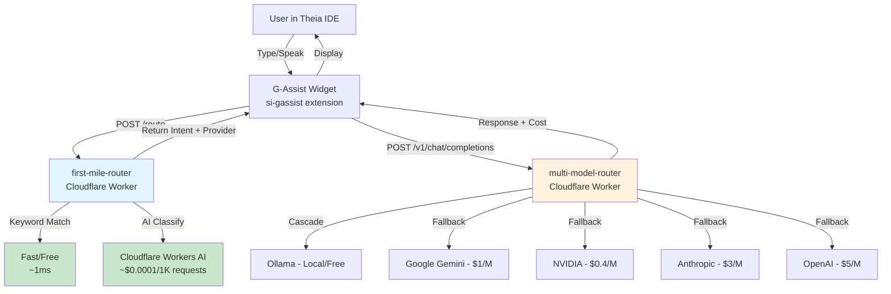

# StudyLoG.AI Implementation Guide

> Current implementation status of G-Assist Integration Phase

**Version**: 1.1
**Last Updated**: 2026-01-10
**Status**: Active Development

---

## Table of Contents

1. [Overview](#overview)
2. [Phase 1: G-Assist Integration (Current)](#phase-1-g-assist-integration-current)
3. [Roadmap - Future Phases](#roadmap---future-phases)

---

## Overview

This guide documents the **current implementation** of StudyLoG.AI's G-Assist Integration. For future roadmap items, see the [Roadmap section](#roadmap---future-phases).

### Architecture Principles

1. **Every Layer is a Mill** - Components transform inputs to outputs
2. **Progressive Disclosure** - Complexity reveals through mastery
3. **No Code Lies** - All AI output is verifiable
4. **Simulation First** - Everything can be simulated before deployment
5. **Product-Agnostic** - Backend serves StudyLoG.AI now but adapts to DMLoG, MakerLoG, etc.

### Architecture Diagram



### Cascade Cost Savings

| Layer | Cost | Latency | Purpose |
|-------|------|---------|---------|
| Keyword Match | Free | ~1ms | Regex pattern matching |
| Workers AI Classify | ~$0.0001/1K | ~50ms | Intent classification |
| Ollama (local) | Free | ~100ms | Open source models |
| Google Gemini | $1/M tokens | ~300ms | Cost-effective |
| NVIDIA | $0.4/M tokens | ~350ms | GPU-optimized |
| Anthropic Claude | $3/M tokens | ~400ms | Code/reasoning |
| OpenAI GPT-4 | $5/M tokens | ~400ms | Premium quality |

---

## Phase 1: G-Assist Integration (Current)

Voice-enabled AI assistant with intelligent first-mile routing to optimize LLM costs.

### 1. si-gassist Extension (Theia Frontend)

**Purpose:** Chat widget UI for voice-enabled AI assistant with agent routing display.

**Location:** `/mnt/c/cognitivemill/studylog-github/apps/theia-ide/extensions/si-gassist/`

**Files:**
| File | Purpose |
|------|---------|
| `src/browser/gassist-widget.tsx` | React widget with chat UI, route indicators, voice button |
| `src/browser/gassist-frontend-service.ts` | API client for STT/TTS/route/chat |
| `src/browser/si-gassist-frontend-module.ts` | Theia IoC registration |
| `src/common/index.ts` | TypeScript types, agent info, API endpoints |
| `src/browser/style/index.css` | Widget styling |
| `package.json` | NPM package config |
| `tsconfig.json` | TypeScript config |

**Agents (GAssistAgent type):**
| Agent | Role | Icon |
|-------|------|------|
| `captain` | Game simulation, NPC behavior | `fa-anchor` |
| `teacher` | Explanations, hints, tutoring | `fa-graduation-cap` |
| `builder` | Code generation and review | `fa-hammer` |
| `tester` | Verification, error analysis | `fa-check-circle` |
| `director` | Orchestration, meta-questions | `fa-sitemap` |

**Expected API Endpoints (g-assist-api - TO BE CREATED):**
```
POST /api/v1/g-assist/stt     - Speech-to-text transcription
POST /api/v1/g-assist/tts     - Text-to-speech synthesis
POST /api/v1/g-assist/route   - Intent classification (proxies to first-mile-router)
POST /api/v1/g-assist/chat    - Agent chat (proxies to multi-model-router)
```

**Integration Points:**
- Theia WidgetFactory for IDE integration
- ReactWidget base class for UI rendering
- MessageService for user notifications
- Fetch API for backend communication

---

### 2. first-mile-router Worker

**Purpose:** Fast intent classification before expensive LLM calls. Uses keyword matching + Workers AI for routing decisions.

**Location:** `/mnt/c/cognitivemill/studylog-github/backend/workers/first-mile-router/`

**Files:**
| File | Purpose |
|------|---------|
| `index.ts` | Router implementation with classify endpoints |
| `wrangler.toml` | Cloudflare Workers config |
| `package.json` | Dependencies (itty-router) |
| `README.md` | Documentation |

**API Endpoints:**
| Method | Endpoint | Purpose |
|--------|----------|---------|
| GET | `/` | Health check |
| POST | `/classify` | Classify single message |
| POST | `/classify-batch` | Classify multiple messages |
| GET | `/intents` | List available intents |
| GET | `/recommendations` | Provider/model recommendations |

**Intent Types:**
| Intent | Description | Recommended Provider | Model |
|--------|-------------|---------------------|-------|
| `code-help` | Code generation, debugging | `anthropic` | `claude-3-5-sonnet` |
| `explanation` | Concepts, tutorials | `openai` | `gpt-4o` |
| `simulation` | Godot scenes, physics | `anthropic` | `claude-3-5-sonnet` |
| `bazaar` | Community, sharing | `fast` | `gpt-4o-mini` |
| `creative` | Writing, storytelling | `openai` | `gpt-4o` |
| `analysis` | Data analysis, patterns | `google` | `gemini-1.5-pro` |
| `general` | Fallback | `openai` | `gpt-4o-mini` |

**Classification Flow:**
1. Keyword matching (free, ~1ms)
2. Workers AI classification if needed (~$0.0001/1K requests, ~50ms)
3. KV cache lookup for repeated queries
4. Returns provider/model recommendation to caller

**Cost Savings:**
- Keyword classification: Free, ~1ms
- Workers AI classification: ~$0.0001/1K requests, ~50ms
- Multi-model-router: $0.002-$0.03/request, ~500ms
- By classifying first, route to cheapest appropriate provider

---

### 3. multi-model-router Worker

**Purpose:** Routes LLM requests to cheapest available provider with fallback support, KV caching, and D1 cost tracking.

**Location:** `/mnt/c/cognitivemill/studylog-github/backend/workers/multi-model-router/`

**Files:**
| File | Purpose |
|------|---------|
| `index.ts` | Router with provider fallback chain |
| `wrangler.toml` | Cloudflare config (KV, D1 bindings) |
| `schema.sql` | D1 cost tracking table schema |

**API Endpoints:**
| Method | Endpoint | Purpose |
|--------|----------|---------|
| GET | `/` | Health check |
| GET | `/providers` | List available providers |
| POST | `/v1/chat/completions` | OpenAI-compatible chat endpoint |
| GET | `/costs/:userId` | User cost breakdown |

**Provider Chain (fallback order):**
1. `ollama` - Local, free (if available)
2. `google` - Gemini 1.5 Pro, $1/M tokens
3. `nvidia` - Llama 3.1 405B, $0.4/M tokens
4. `anthropic` - Claude 3.5 Sonnet, $3/M tokens
5. `openai` - GPT-4o, $5/M tokens

**Features:**
- Automatic fallback on provider failure
- KV response caching (5-minute TTL)
- D1 cost tracking per user
- OpenAI-compatible API format

---

## Integration Points

### Widget to first-mile-router
```typescript
// gassist-frontend-service.ts
async route(query: string, context: IDEContext): Promise<RouteDecision> {
  const response = await fetch(`${this.apiBase}/route`, {
    method: 'POST',
    headers: { 'Content-Type': 'application/json' },
    body: JSON.stringify({ query, context }),
  });
  return response.json();
}
```

### first-mile-router to multi-model-router
The first-mile-router returns `recommendedProvider` and `recommendedModel` which should be passed to multi-model-router's `/v1/chat/completions` endpoint.

---

## Deployment

### first-mile-router
```bash
cd /mnt/c/cognitivemill/studylog-github/backend/workers/first-mile-router
npm install
wrangler publish
```

### multi-model-router
```bash
cd /mnt/c/cognitivemill/studylog-github/backend/workers/multi-model-router
npm install
wrangler secret put OPENAI_API_KEY
wrangler secret put ANTHROPIC_API_KEY
wrangler secret put GOOGLE_API_KEY
wrangler secret put NVIDIA_API_KEY
wrangler publish
```

---

## Next Steps

1. **Create g-assist-api worker** - Backend proxy worker for STT/TTS/route/chat endpoints
2. **Integrate cascade routing** - Connect first-mile recommendations to multi-model calls
3. **Implement voice input** - Audio capture in widget (Task 1.1.3)
4. **Implement context extraction** - IDE context in widget (Task 1.2.4)

---

## Roadmap - Future Phases

### Phase 2: PersonalLog Messenger UI (Planned)
Tutor-focused chat interface for AI-powered learning with progressive hints.

### Phase 3: Component Rolodex (Planned)
Reusable AI agent components with drag-and-drop orchestration.

### Phase 4: Multi-Agent Swarm Orchestration (Planned)
Complex multi-agent systems with emergent behavior, A2A communication protocols.

---

## Dependencies

```
Phase 1 (G-Assist) - CURRENT
    ├── si-gassist extension (Theia frontend) - DONE
    ├── first-mile-router worker (intent classification) - DONE
    ├── multi-model-router worker (LLM cascade) - DONE
    └── g-assist-api worker (backend routes) - TO BE DONE

Phase 2 (PersonalLog) - Depends on Phase 1 voice
Phase 3 (Rolodex) - Independent
Phase 4 (Swarm) - Depends on Rolodex components
```

---

**Remember**: Every layer is a mill. Every agent is a millwright. Every user graduates to building mills.
