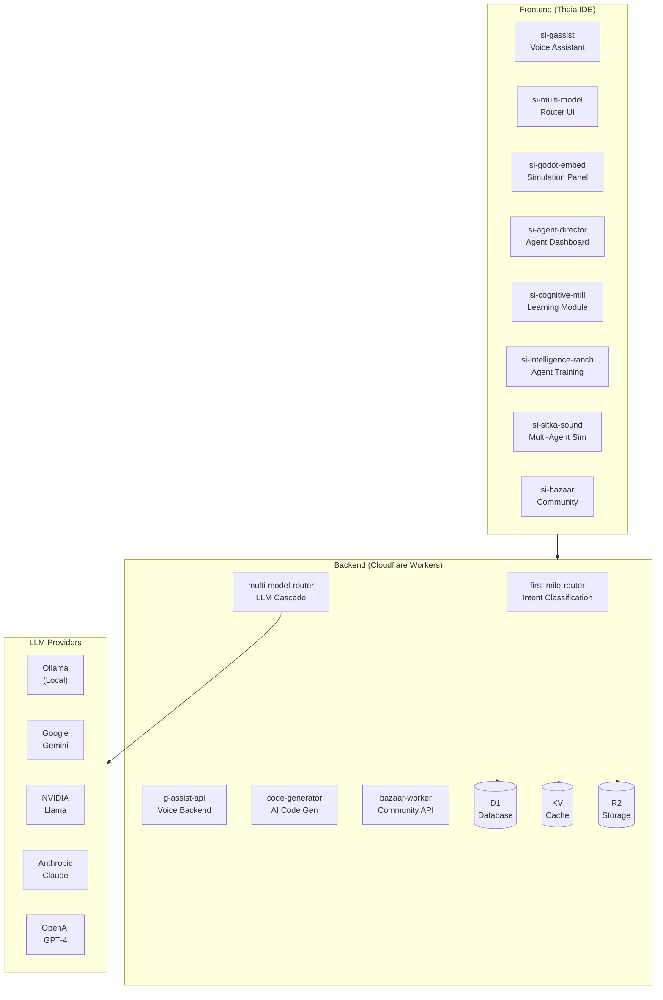

# StudyLoG.AI

[](https://github.com/SuperInstance-AI/studylog)
[](https://github.com/SuperInstance-AI/studylog)
[](LICENSE)
[](https://nodejs.org)

**The Minecraft of generative AI** - A gamified IDE where students learn AI/STEM through progressive simulation, build their own tools, and share creations with a community of thinkers and makers.

---

## Project Summary

StudyLoG.AI is an educational platform built on **Eclipse Theia** that students can customize - even the IDE itself. Starting with **Cognitive Mill** (learn how AI works), progressing to **Intelligence Ranch** (train and breed AI agents), and advancing to **Sitka Sound** (multi-agent systems and game theory), students gain hands-on experience with the tools powering the AI revolution.

Unlike traditional learning platforms, StudyLoG.AI is designed as a **network of mills** - every component transforms inputs to outputs, every agent is a millwright, and every user graduates to building their own mills. The platform includes a community **Bazaar** where creations can be shared, forked, and improved - with reputation and rewards for valuable contributions.

---

## Features

### Core IDE
- **Theia-based IDE** - Customizable development environment with embedded Godot 4.3 game engine
- **Multi-model AI router** - Intelligent routing to cheapest available LLM provider with fallbacks
- **Godot panel embedding** - Live simulation visualization alongside code
- **Voice-enabled assistant** - G-Assist widget with speech-to-text and text-to-speech
- **Agent dashboard** - Progressive unlock system with director, captain, teacher, builder, and tester agents

### Learning Modules
- **Cognitive Mill** - Learn how AI models work through interactive simulations
- **Intelligence Ranch** - Train and breed AI agents with LoRA adapters
- **Sitka Sound** - Multi-agent ecosystems and game theory scenarios
- **Bazaar** - Community marketplace for sharing, forking, and rating creations

### Developer Experience
- **Monorepo with Turborepo** - Efficient build system for apps and packages
- **TypeScript throughout** - Full type safety across frontend and backend
- **Cloudflare Workers backend** - Serverless API with D1 database, R2 storage, and KV caching
- **Extensibility** - Create custom Theia extensions and Godot scenes

---

## Quick Start

Get up and running in 5 minutes:

```bash
# 1. Clone the repository
git clone https://github.com/SuperInstance-AI/studylog.git
cd studylog

# 2. Install dependencies (requires pnpm)
pnpm install

# 3. Start development servers
pnpm dev

# 4. Open your browser
# Navigate to http://localhost:3000
```

### Prerequisites

- **Node.js** >= 20.0.0
- **pnpm** >= 9.0.0
- **Godot** 4.3+ (optional, for simulation development)
- **Cloudflare account** (for backend deployment)

### Optional: Local AI

```bash
# Install Ollama for local LLM inference
pnpm setup-ollama

# Or configure for NVIDIA Jetson
pnpm setup-jetson
```

---

## Architecture



### Technology Stack

| Component | Technology | Purpose |
|-----------|------------|---------|
| IDE Shell | Eclipse Theia 1.54+ | Extensible web IDE |
| Language | TypeScript 5.7+ | Type-safe development |
| Build | Turborepo 2.3+ | Monorepo build system |
| Backend | Cloudflare Workers | Serverless compute |
| Database | D1 (SQLite) | Relational data |
| Storage | R2 | Object storage |
| Cache | KV | Key-value caching |
| Simulation | Godot 4.3 | Game engine |
| Runtime | Node.js 20+ | JavaScript runtime |

---

## Components

For a detailed rolodex of reusable components, see [COMPONENTS.md](COMPONENTS.md).

### Theia Extensions

| Extension | Description | Location |
|-----------|-------------|----------|
| si-gassist | Voice-enabled AI assistant widget | `apps/theia-ide/extensions/si-gassist/` |
| si-multi-model | Multi-model router UI | `apps/theia-ide/extensions/si-multi-model/` |
| si-godot-embed | Godot panel embedding | `apps/theia-ide/extensions/si-godot-embed/` |
| si-agent-director | Agent orchestration dashboard | `apps/theia-ide/extensions/si-agent-director/` |
| si-cognitive-mill | AI learning simulations | `apps/theia-ide/extensions/si-cognitive-mill/` |
| si-intelligence-ranch | Agent breeding/training | `apps/theia-ide/extensions/si-intelligence-ranch/` |
| si-sitka-sound | Multi-agent ecosystems | `apps/theia-ide/extensions/si-sitka-sound/` |
| si-a2ui-renderer | Agent-to-UI protocol | `apps/theia-ide/extensions/si-a2ui-renderer/` |
| si-bazaar | Community marketplace | `apps/theia-ide/extensions/si-bazaar/` |

### Backend Workers

| Worker | Description | Location |
|--------|-------------|----------|
| first-mile-router | Intent classification | `backend/workers/first-mile-router/` |
| multi-model-router | LLM routing with fallbacks | `backend/workers/multi-model-router/` |
| g-assist-api | Voice assistant backend | `backend/workers/g-assist-api/` |
| code-generator | AI code generation | `backend/workers/code-generator/` |
| bazaar-worker | Community API | `backend/workers/bazaar/` |

---

## Documentation

- [Documentation Index](docs/INDEX.md) - Complete documentation overview
- [Architecture Overview](docs/ARCHITECTURE.md) - High-level system design
- [Component Reference](COMPONENTS.md) - Reusable component catalog
- [Deployment Guide](docs/DEPLOYMENT.md) - Production deployment instructions
- [API Reference](docs/API_REFERENCE.md) - Complete API documentation
- [Troubleshooting](docs/TROUBLESHOOTING.md) - Common issues and solutions

### Architecture Decision Records

- [ADR-001: Cascade Routing Architecture](docs/adr/ADR-001-cascade-routing-architecture.md)
- [ADR-002: Theia Extension Architecture](docs/adr/ADR-002-theia-extension-architecture.md)
- [ADR-003: Cloudflare Workers Backend](docs/adr/ADR-003-cloudflare-workers-backend.md)
- [ADR-004: Agent-Based Voice Assistant](docs/adr/ADR-004-agent-based-voice-assistant.md)

---

## Development

### Setting Up Development Environment

```bash
# Install dependencies
pnpm install

# Start all development servers
pnpm dev

# Run type checking
pnpm typecheck

# Run linter
pnpm lint

# Run tests
pnpm test
```

### Working on Specific Packages

```bash
# Work on a specific Theia extension
pnpm dev --filter=@studylog/si-gassist

# Work on a backend worker
pnpm dev --filter=@studylog/multi-model-router

# Build specific package
pnpm build --filter=@studylog/si-bazaar
```

### Backend Development

```bash
# Start backend in development mode
pnpm backend:dev

# Deploy to Cloudflare
pnpm backend:deploy

# Run database migrations locally
cd backend && wrangler d1 execute studylog-students --local --file=./d1/schema.sql

# Load seed data
cd backend && wrangler d1 execute studylog-students --local --file=./d1/seed-bazaar.sql
```

---

## Project Status

| Phase | Description | Status |
|-------|-------------|--------|
| Phase 1: Foundation | Theia shell, Godot panel, Multi-model router, Agent dashboard | Mostly Complete |
| Phase 2: Code Generation | AI generates Theia extensions and Godot scenes | Complete |
| Phase 3: Bazaar | Community sharing, forking, ratings, reputation | Complete |
| Phase 4: Self-Generation | Adaptive puzzles, remix engine, challenges | Planned |
| Phase 5: Multi-Product | DMLoG.AI, MakerLoG.AI, FishingLoG.AI | Planned |

See [ROADMAP.md](ROADMAP.md) for detailed roadmap and [IMPLEMENTATION.md](IMPLEMENTATION.md) for current implementation status.

---

## Contributing

We welcome contributions! Please see [CONTRIBUTING.md](CONTRIBUTING.md) for guidelines.

### Quick Contribution Checklist

- [ ] Follow the [Code of Conduct](CONTRIBUTING.md#code-of-conduct)
- [ ] Set up development environment per [CONTRIBUTING.md](CONTRIBUTING.md#development-setup)
- [ ] Write tests for new features
- [ ] Update documentation as needed
- [ ] Submit pull request with clear description

---

## License

MIT License - see [LICENSE](LICENSE) for details.

---

## Philosophy

**Every layer is a mill. Every agent is a millwright. Every user graduates to building mills.**

We're building a network of thinkers and makers who design products on tools they grew up playing with. StudyLoG.AI is just the first of many products (DMLoG.AI, MakerLoG.AI, FishingLoG.AI) that will share this backend platform.

---

## Links

- **Website**: https://studylog.ai
- **Documentation**: https://docs.studylog.ai
- **Community**: https://bazaar.studylog.ai
- **Company**: https://superinstance.ai

---

**Remember**: We're not trying to make students. We're building a network of thinkers and makers who will later design products on tools they grew up playing with.
