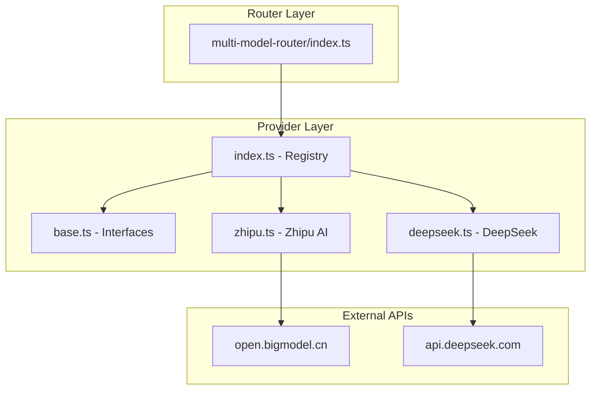

# Provider Architecture

AI provider abstraction layer for the StudyLoG.AI multi-model router.

## Overview

This directory contains the provider implementations that abstract different AI APIs behind a common interface. The provider system enables:

- **Unified API:** All providers respond to the same interface
- **Automatic fallback:** Chain through providers on failure
- **Cost tracking:** Transparent cost calculation per request
- **Capability detection:** Know which providers support which features

## Architecture



## Base Interface

All providers implement the `AIProvider` interface defined in `base.ts`:

```typescript
interface AIProvider {
  readonly config: ProviderConfig;

  initialize(): Promise<void>;
  isAvailable(): Promise<boolean>;
  getHealth(): Promise<ProviderHealth>;

  chat(request: ChatRequest): Promise<ChatResponse>;
  generateImage?(request: ImageRequest): Promise<ImageResponse>;
  generateAudio?(request: AudioRequest): Promise<AudioResponse>;
  generateVideo?(request: VideoRequest): Promise<VideoResponse>;

  estimateCost(request: CostRequest): Promise<CostEstimate>;
  listModels(): ModelInfo[];
  getCapabilities(): ProviderCapabilities;

  dispose(): void;
}
```

### Provider Capabilities

Each provider reports its capabilities:

```typescript
interface ProviderCapabilities {
  streaming: boolean;          // Supports streaming responses
  functionCalling: boolean;    // Supports tool/function calling
  vision: boolean;             // Supports vision/image inputs
  maxContext: number;          // Maximum context window
  imageGeneration: boolean;    // Supports image generation
  audioGeneration: boolean;    // Supports audio generation
  videoGeneration: boolean;    // Supports video generation
  jsonMode: boolean;           // Supports JSON mode output
  systemPrompt: boolean;       // Supports system prompts
}
```

## Available Providers

### Zhipu AI (Z.ai)

**File:** `zhipu.ts`

**Models:**
- `glm-4.7` - Latest flagship, coding specialist
- `glm-4.5` - General purpose
- `glm-4-plus` - High-quality reasoning
- `glm-4-flash` - Fast, low-cost
- `glm-4-long` - 200K context
- `cogview-4` - Image generation
- `cogvideox` - Video generation

**Cost:** $0.08 (input) / $0.30 (output) per 1M tokens

**Example:**
```typescript
const provider = new ZhipuProvider({ apiKey: 'id.secret' });
await provider.initialize();

const response = await provider.chat({
  model: 'glm-4.7',
  messages: [{ role: 'user', content: 'Write a function' }],
  temperature: 0.3
});
```

### DeepSeek

**File:** `deepseek.ts`

**Models:**
- `deepseek-chat` - General purpose
- `deepseek-coder` - Code specialist
- `deepseek-reasoner` - Complex reasoning with thinking tokens

**Cost:** $0.14 (input) / $0.28 (output) per 1M tokens

**Example:**
```typescript
const provider = new DeepSeekProvider({ apiKey: 'sk-...' });
await provider.initialize();

const response = await provider.chat({
  model: 'deepseek-coder',
  messages: [{ role: 'user', content: 'Debug this code' }],
  temperature: 0.2
});
```

## Planned Providers

| Provider | File | Type | Priority |
|----------|------|------|----------|
| Kimi (Moonshot) | `kimi.ts` | LLM | P1 |
| X.ai (Grok) | `xai.ts` | LLM | P1 |
| DeepInfra | `deepinfra.ts` | LLM | P1 |
| Replicate | `replicate.ts` | Image, Video | P2 |
| ElevenLabs | `elevenlabs.ts` | Audio | P2 |

## Adding a New Provider

### 1. Create the Provider File

Create a new file in this directory (e.g., `providername.ts`):

```typescript
/**
 * ProviderName Provider Implementation
 *
 * Supports:
 * - model-1: Description
 * - model-2: Description
 */

import type {
  AIProvider,
  ProviderConfig,
  ProviderCapabilities,
  ModelInfo,
  ChatRequest,
  ChatResponse,
  CostRequest,
  CostEstimate,
  ProviderHealth,
} from './base';

// Define available models
const PROVIDER_MODELS: ModelInfo[] = [
  {
    id: 'model-1',
    name: 'Model 1',
    type: 'llm',
    context: 128000,
    isDefault: true,
    features: ['feature-1', 'feature-2'],
  },
];

// Define capabilities
const PROVIDER_CAPABILITIES: ProviderCapabilities = {
  streaming: true,
  functionCalling: true,
  vision: false,
  maxContext: 128000,
  imageGeneration: false,
  audioGeneration: false,
  videoGeneration: false,
  jsonMode: true,
  systemPrompt: true,
};

// Cost per million tokens
const COST_PER_MILLION = {
  input: 1.0,
  output: 2.0,
};

export class ProviderNameProvider implements AIProvider {
  readonly config: ProviderConfig;

  constructor(config: Partial<ProviderConfig> & { apiKey: string }) {
    this.config = {
      name: 'providername',
      type: 'llm',
      baseUrl: config.baseUrl || 'https://api.provider.com',
      apiKey: config.apiKey,
      models: PROVIDER_MODELS,
      costPerMillion: config.costPerMillion || 1.5,
      capabilities: PROVIDER_CAPABILITIES,
      apiFormat: 'openai', // or 'anthropic', 'google', 'custom'
      region: 'us',
    };
  }

  async initialize(): Promise<void> {
    // Validate API key and test connection
    if (!this.config.apiKey || this.config.apiKey.length < 20) {
      throw new Error('Invalid Provider API key');
    }
    const health = await this.getHealth();
    if (health.status !== 'available') {
      throw new Error(`Provider not available: ${health.error}`);
    }
  }

  async isAvailable(): Promise<boolean> {
    const health = await this.getHealth();
    return health.status === 'available';
  }

  async getHealth(): Promise<ProviderHealth> {
    const startTime = Date.now();
    try {
      const response = await fetch(`${this.config.baseUrl}/models`, {
        method: 'GET',
        headers: {
          'Authorization': `Bearer ${this.config.apiKey}`,
        },
        signal: AbortSignal.timeout(5000),
      });

      const latency = Date.now() - startTime;

      if (response.ok) {
        return {
          name: this.config.name,
          status: 'available',
          latencyMs: latency,
          lastCheck: Date.now(),
        };
      }

      if (response.status === 401) {
        return {
          name: this.config.name,
          status: 'unconfigured',
          latencyMs: latency,
          lastCheck: Date.now(),
          error: 'Invalid API key',
        };
      }

      return {
        name: this.config.name,
        status: 'error',
        latencyMs: latency,
        lastCheck: Date.now(),
        error: `HTTP ${response.status}`,
      };
    } catch (error) {
      return {
        name: this.config.name,
        status: 'error',
        latencyMs: Date.now() - startTime,
        lastCheck: Date.now(),
        error: error instanceof Error ? error.message : 'Unknown error',
      };
    }
  }

  async chat(request: ChatRequest): Promise<ChatResponse> {
    // Implement chat completion
    const response = await fetch(`${this.config.baseUrl}/chat/completions`, {
      method: 'POST',
      headers: {
        'Authorization': `Bearer ${this.config.apiKey}`,
        'Content-Type': 'application/json',
      },
      body: JSON.stringify({
        model: request.model,
        messages: request.messages,
        temperature: request.temperature ?? 0.7,
        max_tokens: request.maxTokens ?? 1024,
      }),
    });

    if (!response.ok) {
      const error = await response.text();
      throw new Error(`Provider chat error: ${error}`);
    }

    const data = await response.json();
    const choice = data.choices[0];

    const inputTokens = data.usage?.prompt_tokens || 0;
    const outputTokens = data.usage?.completion_tokens || 0;
    const cost = this.calculateCost(inputTokens, outputTokens);

    return {
      content: choice.message?.content || '',
      model: data.model,
      provider: this.config.name,
      cost,
      tokens: { input: inputTokens, output: outputTokens },
      finishReason: choice.finish_reason,
      cached: false,
    };
  }

  async estimateCost(request: CostRequest): Promise<CostEstimate> {
    const inputCost = (request.inputTokens / 1_000_000) * COST_PER_MILLION.input;
    const outputCost = (request.outputTokens / 1_000_000) * COST_PER_MILLION.output;

    return {
      estimatedCost: inputCost + outputCost,
      currency: 'USD',
      breakdown: { input: inputCost, output: outputCost },
      provider: this.config.name,
      model: request.model,
    };
  }

  listModels(): ModelInfo[] {
    return this.config.models;
  }

  getCapabilities(): ProviderCapabilities {
    return this.config.capabilities;
  }

  dispose(): void {
    // Cleanup resources
  }

  private calculateCost(inputTokens: number, outputTokens: number): number {
    return (
      (inputTokens / 1_000_000) * COST_PER_MILLION.input +
      (outputTokens / 1_000_000) * COST_PER_MILLION.output
    );
  }
}
```

### 2. Export from Index

Add your provider to `index.ts`:

```typescript
import { ProviderNameProvider } from './providername';

// Export the class
export { ProviderNameProvider } from './providername';

// Add to DEFAULT_PROVIDER_CONFIGS
export const DEFAULT_PROVIDER_CONFIGS: Record<string, Partial<ProviderConfig>> = {
  // ... existing providers
  providername: {
    name: 'providername',
    type: 'llm',
    baseUrl: 'https://api.provider.com',
    costPerMillion: 1.5,
    apiFormat: 'openai',
  },
};

// Add to createProvider switch statement
switch (name) {
  // ... existing cases
  case 'providername':
    provider = new ProviderNameProvider({ apiKey, ...configOverrides });
    break;
}
```

### 3. Add to Multi-Model Router

Update the multi-model router to include your provider:

```typescript
// In backend/workers/multi-model-router/index.ts
const PROVIDERS: Record<string, Provider> = {
  // ... existing providers
  providername: {
    name: 'providername',
    models: ['model-1', 'model-2'],
    baseUrl: 'https://api.provider.com',
    costPerMillion: 1.5,
  },
};

// Update hasApiKey function
function hasApiKey(provider: string, env: Env): boolean {
  switch (provider) {
    // ... existing cases
    case 'providername':
      return !!env.PROVIDERNAME_API_KEY;
    default:
      return false;
  }
}
```

### 4. Add Tests

Create a test file `__tests__/providername.test.ts`:

```typescript
import { describe, it, expect } from 'vitest';
import { ProviderNameProvider } from '../providername';

describe('ProviderNameProvider', () => {
  it('should initialize with valid API key', async () => {
    const provider = new ProviderNameProvider({
      apiKey: 'test_key_12345678901234567890'
    });
    // Test initialization
  });

  it('should estimate costs correctly', async () => {
    const provider = new ProviderNameProvider({
      apiKey: 'test_key_12345678901234567890'
    });
    await provider.initialize();

    const estimate = await provider.estimateCost({
      provider: 'providername',
      model: 'model-1',
      inputTokens: 1000,
      outputTokens: 500,
      requestType: 'chat'
    });

    expect(estimate.estimatedCost).toBeCloseTo(0.002, 3);
  });
});
```

### 5. Update Documentation

- Add provider to `/docs/PROVIDER_GUIDE.md`
- Add provider to `/docs/API_REFERENCE.md` provider comparison table
- Add to `/docs/DEPLOYMENT.md` environment variables

## Testing

### Unit Tests

```bash
# Run all provider tests
pnpm test backend/workers/providers

# Run specific provider test
pnpm test providername.test.ts
```

### Integration Tests

Test provider against live API:

```typescript
import { ZhipuProvider } from './zhipu';

const provider = new ZhipuProvider({
  apiKey: process.env.ZHIPU_API_KEY!
});

await provider.initialize();

const response = await provider.chat({
  model: 'glm-4.7',
  messages: [{ role: 'user', content: 'Hello!' }],
  temperature: 0.7,
  maxTokens: 100,
});

console.log(response);
```

### Health Check

```bash
# Check provider health via API
curl https://multi-model-router.workers.dev/providers/health
```

## API Format Mapping

| Provider | Format | Notes |
|----------|--------|-------|
| Zhipu AI | OpenAI | Compatible with OpenAI SDK |
| DeepSeek | OpenAI | Compatible with OpenAI SDK |
| Anthropic | Anthropic | Custom format, /v1/messages |
| OpenAI | OpenAI | Reference format |
| Google | Google | /v1/models/{model}:generateContent |
| NVIDIA | OpenAI | Compatible with OpenAI SDK |

## Cost Tracking

All providers calculate and return costs in USD:

```typescript
interface ChatResponse {
  cost: number;              // Total cost in USD
  tokens: {
    input: number;           // Input token count
    output: number;          // Output token count
    cacheRead?: number;      // Cached tokens (if supported)
    cacheWrite?: number;     // Cache write tokens
  };
}
```

Costs are tracked per-user in the D1 database:

```sql
CREATE TABLE IF NOT EXISTS costs (
  id INTEGER PRIMARY KEY AUTOINCREMENT,
  user_id TEXT NOT NULL,
  model TEXT NOT NULL,
  provider TEXT NOT NULL,
  input_tokens INTEGER NOT NULL,
  output_tokens INTEGER NOT NULL,
  cost REAL NOT NULL,
  timestamp INTEGER NOT NULL
);
```

## Troubleshooting

### Common Issues

**Issue: Provider not available**

```typescript
// Check health status
const health = await provider.getHealth();
console.log(health);
```

**Issue: Invalid API key**

- Verify key format matches provider requirements
- Check key has necessary permissions
- Ensure key is set as Wrangler secret

**Issue: Rate limiting**

- Implement exponential backoff
- Use fallback chain
- Consider upgrading API tier

**Issue: High latency**

- Check provider region
- Enable response caching
- Use local Ollama for testing

### Debug Mode

Enable debug logging:

```typescript
// In wrangler.toml
[vars]
LOG_LEVEL = "debug"
```

## Provider Configuration

Providers are configured via environment variables in Cloudflare Workers:

```bash
# Set secrets via Wrangler
cd backend/workers/multi-model-router
wrangler secret put ZHIPU_API_KEY
wrangler secret put DEEPSEEK_API_KEY
```

```toml
# wrangler.toml
[vars]
ENVIRONMENT = "production"
CASCADING_ENABLED = "true"
```

## References

### Internal

- `base.ts` - Interface definitions
- `index.ts` - Provider registry and factory
- `zhipu.ts` - Zhipu AI implementation
- `deepseek.ts` - DeepSeek implementation

### External Documentation

- [Zhipu AI Documentation](https://open.bigmodel.cn/)
- [DeepSeek Documentation](https://api-docs.deepseek.com/)
- [Provider Guide](../../../docs/PROVIDER_GUIDE.md)
- [API Reference](../../../docs/API_REFERENCE.md)
- [Provider Expansion Plan](../../../docs/PROVIDER_EXPANSION_PLAN.md)
