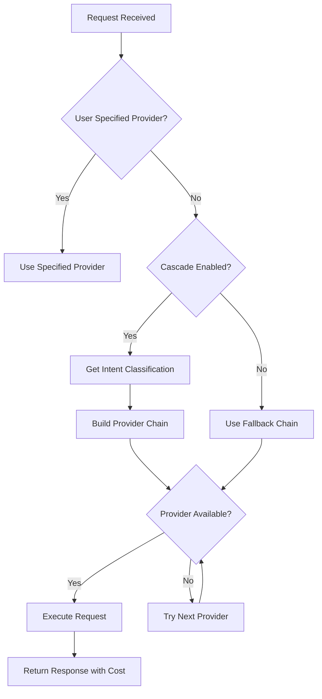
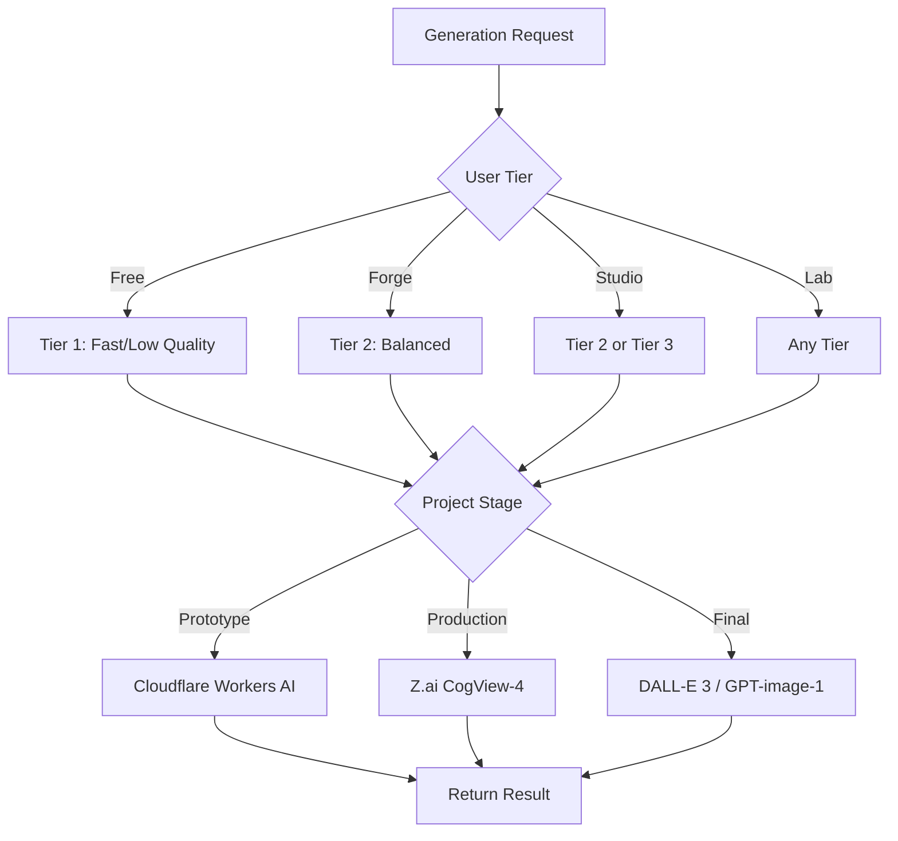

# StudyLoG.AI API Reference

Complete API documentation for all StudyLoG.AI backend services.

## Table of Contents

1. [G-Assist API](#g-assist-api)
2. [First-Mile Router](#first-mile-router)
3. [Multi-Model Router](#multi-model-router)
4. [Provider API](#provider-api)
5. [Quality Tier Endpoints](#quality-tier-endpoints)
6. [Main Backend API](#main-backend-api)
7. [Cost Dashboard Endpoints](#cost-dashboard-endpoints)
8. [Error Codes](#error-codes)

---

## G-Assist API

Base URL: `https://g-assist-api.workers.dev`

Voice-enabled AI assistant for StudyLoG.AI with agent routing.

### POST /route

Intent classification and agent routing.

**Request:**

```json
{
  "message": "How do I debug TypeScript errors?",
  "context": {
    "module": "cognitive-mill",
    "studentId": "user_123"
  }
}
```

**Response:**

```json
{
  "agent": "builder",
  "confidence": 0.9,
  "reasoning": "Code keywords detected, routing to Builder agent",
  "suggestedModel": "claude-3-5-sonnet",
  "usedFirstMile": true
}
```

**Agent Types:**

| Agent | Purpose | Model |
|-------|---------|-------|
| `captain` | Orchestration | claude-3-5-sonnet |
| `teacher` | Explanations | gpt-4o |
| `builder` | Code/implementation | claude-3-5-sonnet |
| `tester` | QA/testing | gpt-4o-mini |
| `director` | Architecture | claude-opus-4-5 |

**Curl Example:**

```bash
curl -X POST https://g-assist-api.workers.dev/route \
  -H "Content-Type: application/json" \
  -d '{
    "message": "Explain how neural networks learn",
    "context": {"module": "cognitive-mill"}
  }'
```

### POST /chat

Send message to specific agent.

**Request:**

```json
{
  "agent": "teacher",
  "messages": [
    {"role": "user", "content": "What is a transformer?"}
  ],
  "context": {
    "module": "cognitive-mill",
    "studentId": "user_123"
  },
  "temperature": 0.7,
  "model": "gpt-4o"
}
```

**Response:**

```json
{
  "content": "A transformer is a neural network architecture...",
  "agent": "teacher",
  "model": "gpt-4o",
  "provider": "openai",
  "tokens": {
    "input": 15,
    "output": 150
  },
  "cached": false
}
```

**Curl Example:**

```bash
curl -X POST https://g-assist-api.workers.dev/chat \
  -H "Content-Type: application/json" \
  -d '{
    "agent": "builder",
    "messages": [{"role": "user", "content": "Write a hello world function"}],
    "temperature": 0.5
  }'
```

### POST /stt

Speech-to-text transcription (stub).

**Request:**

```json
{
  "audio": "base64_encoded_audio_data",
  "format": "wav"
}
```

**Response:**

```json
{
  "text": "transcribed text here",
  "confidence": 0.95,
  "language": "en",
  "note": "STT endpoint is a stub"
}
```

### POST /tts

Text-to-speech synthesis (stub).

**Request:**

```json
{
  "text": "Hello, world!",
  "voice": "alloy",
  "speed": 1.0
}
```

**Response:**

```json
{
  "audio": "base64_encoded_audio",
  "url": "https://...",
  "format": "mp3",
  "note": "TTS endpoint is a stub"
}
```

### GET /agents

List available agents.

**Response:**

```json
{
  "agents": [
    {
      "name": "captain",
      "model": "claude-3-5-sonnet",
      "description": "Orchestration and decision-making"
    },
    {
      "name": "teacher",
      "model": "gpt-4o",
      "description": "Learning and explanations"
    }
  ]
}
```

### Conversation Persistence

#### POST /conversations

Create or update conversation (upsert pattern).

**Request:**

```json
{
  "id": "optional-conversation-id",
  "userId": "user_123",
  "agent": "teacher",
  "title": "Optional custom title",
  "messages": [
    {
      "role": "user",
      "content": "What is a neural network?"
    },
    {
      "role": "assistant",
      "content": "A neural network is...",
      "agent": "teacher"
    }
  ],
  "context": {
    "module": "cognitive-mill",
    "scene": "introduction",
    "openFiles": ["neural-network.ts"]
  }
}
```

**Response:**

```json
{
  "conversationId": "conv_abc123",
  "updatedAt": 1704873600000,
  "title": "What is a neural network?"
}
```

#### GET /conversations/:userId

List user's conversations.

**Response:**

```json
{
  "conversations": [
    {
      "id": "conv_abc123",
      "title": "What is a neural network?",
      "agent": "teacher",
      "messageCount": 5,
      "updatedAt": 1704873600000,
      "createdAt": 1704870000000
    }
  ]
}
```

#### GET /conversations/:userId/:id

Get full conversation details.

**Response:**

```json
{
  "id": "conv_abc123",
  "title": "What is a neural network?",
  "agent": "teacher",
  "messageCount": 5,
  "messages": [
    {
      "role": "user",
      "content": "What is a neural network?",
      "timestamp": 1704870000000
    },
    {
      "role": "assistant",
      "content": "A neural network is...",
      "timestamp": 1704870001000,
      "agent": "teacher"
    }
  ],
  "context": {
    "module": "cognitive-mill"
  },
  "createdAt": 1704870000000,
  "updatedAt": 1704873600000
}
```

#### DELETE /conversations/:userId/:id

Delete a conversation.

**Response:**

```json
{
  "success": true,
  "deletedId": "conv_abc123"
}
```

---

## First-Mile Router

Base URL: `https://first-mile-router.workers.dev`

Fast AI routing before expensive LLM calls.

### POST /classify

Classify user intent and recommend provider.

**Request:**

```json
{
  "message": "Help me debug this TypeScript error",
  "context": {
    "module": "cognitive-mill",
    "studentId": "user_123",
    "previousIntents": ["code-help", "explanation"]
  }
}
```

**Response:**

```json
{
  "intent": "code-help",
  "recommendedProvider": "anthropic",
  "recommendedModel": "claude-3-5-sonnet",
  "confidence": 0.9,
  "reasoning": "Code-related query optimized for Claude's code understanding",
  "bypassRouter": false,
  "suggestedCacheTtl": 3600,
  "cached": false,
  "usedAI": false
}
```

**Intent Types:**

| Intent | Provider | Model | Bypass Router |
|--------|----------|-------|---------------|
| `code-help` | anthropic | claude-3-5-sonnet | No |
| `explanation` | openai | gpt-4o | No |
| `simulation` | anthropic | claude-3-5-sonnet | No |
| `bazaar` | fast | gpt-4o-mini | Yes |
| `creative` | openai | gpt-4o | No |
| `analysis` | google | gemini-1.5-pro | No |
| `general` | openai | gpt-4o-mini | No |

**Curl Example:**

```bash
curl -X POST https://first-mile-router.workers.dev/classify \
  -H "Content-Type: application/json" \
  -d '{
    "message": "How do I create a Godot scene with a rigid body?"
  }'
```

### POST /classify-batch

Classify multiple messages in one request.

**Request:**

```json
{
  "messages": [
    "Explain recursion",
    "Debug this code",
    "Create a character"
  ]
}
```

**Response:**

```json
{
  "results": [
    {
      "message": "Explain recursion",
      "intent": "explanation",
      "recommendedProvider": "openai",
      "recommendedModel": "gpt-4o",
      "confidence": 0.9,
      "cached": false
    }
  ]
}
```

### GET /intents

List available intent categories.

**Response:**

```json
{
  "intents": [
    {
      "value": "code-help",
      "description": "Code generation, debugging, refactoring"
    },
    {
      "value": "explanation",
      "description": "Concept explanation, tutorials"
    },
    {
      "value": "simulation",
      "description": "Godot scene work, physics, game logic"
    },
    {
      "value": "bazaar",
      "description": "Community features, sharing, forking"
    }
  ]
}
```

### GET /recommendations

Get provider recommendation matrix.

**Response:**

```json
{
  "providers": [
    {
      "intent": "code-help",
      "provider": "anthropic",
      "model": "claude-3-5-sonnet",
      "reason": "Best for code"
    },
    {
      "intent": "explanation",
      "provider": "openai",
      "model": "gpt-4o",
      "reason": "Good at teaching"
    }
  ]
}
```

---

## Multi-Model Router

Base URL: `https://multi-model-router.workers.dev`

LLM routing with fallback support and cost tracking.

### POST /v1/chat/completions

Chat completions with automatic provider routing.

**Request:**

```json
{
  "model": "gpt-4o-mini",
  "messages": [
    {"role": "system", "content": "You are a helpful tutor."},
    {"role": "user", "content": "Explain vectors"}
  ],
  "temperature": 0.7,
  "max_tokens": 1024,
  "provider": "openai",
  "userId": "user_123",
  "stream": false
}
```

**Response:**

```json
{
  "content": "Vectors are mathematical objects...",
  "model": "gpt-4o-mini",
  "provider": "openai",
  "cost": 0.00015,
  "tokens": {
    "input": 20,
    "output": 100
  },
  "finish_reason": "stop",
  "cached": false,
  "cascade": {
    "intent": "explanation",
    "recommendedProvider": "openai",
    "usedRecommendedProvider": true,
    "estimatedSaved": 0.000003
  }
}
```

**Provider Fallback Chain:**

1. `ollama` (free, local)
2. `google` (cheapest cloud)
3. `nvidia` (affordable)
4. `anthropic` (premium)
5. `openai` (fallback)

**Curl Example:**

```bash
curl -X POST https://multi-model-router.workers.dev/v1/chat/completions \
  -H "Content-Type: application/json" \
  -d '{
    "model": "claude-3-5-sonnet",
    "messages": [{"role": "user", "content": "Hello!"}],
    "max_tokens": 100
  }'
```

### GET /providers

List available providers.

**Response:**

```json
{
  "providers": [
    {
      "name": "anthropic",
      "models": ["claude-3-5-sonnet", "claude-3-5-haiku"],
      "costPerMillion": 3
    },
    {
      "name": "openai",
      "models": ["gpt-4o", "gpt-4o-mini"],
      "costPerMillion": 5
    },
    {
      "name": "ollama",
      "models": ["llama3.1:8b"],
      "costPerMillion": 0
    }
  ]
}
```

### GET /costs/:userId

Get cost breakdown for user.

**Response:**

```json
{
  "totalCost": 0.0125,
  "breakdown": [
    {
      "provider": "anthropic",
      "model": "claude-3-5-sonnet",
      "input": 1500,
      "output": 3000,
      "total": 0.009
    },
    {
      "provider": "openai",
      "model": "gpt-4o-mini",
      "input": 500,
      "output": 1000,
      "total": 0.0035
    }
  ]
}
```

### GET /costs/cascade

Get cascade cost savings summary.

**Query Parameters:**
- `userId` (optional): User ID to filter

**Response:**

```json
{
  "totalRequests": 150,
  "totalCost": 0.125,
  "cascadeSavings": 0.0085,
  "providerBreakdown": [
    {
      "name": "anthropic",
      "requestCount": 75,
      "costTotal": 0.08,
      "percentage": 50
    },
    {
      "name": "google",
      "requestCount": 50,
      "costTotal": 0.03,
      "percentage": 33.3
    }
  ],
  "intentBreakdown": [
    {
      "intent": "code-help",
      "count": 60,
      "percentage": 40
    },
    {
      "intent": "explanation",
      "count": 45,
      "percentage": 30
    }
  ],
  "period": {
    "start": 1704787200000,
    "end": 1704873600000
  }
}
```

---

## Provider API

Base URL: `https://multi-model-router.workers.dev`

Direct provider access and management endpoints for the multi-provider AI router.

### Provider Selection Flow



### GET /providers

List all available providers with their configurations.

**Response:**

```json
{
  "providers": [
    {
      "name": "anthropic",
      "models": ["claude-3-5-sonnet", "claude-3-5-haiku", "claude-opus-4-5"],
      "costPerMillion": 3.0,
      "capabilities": {
        "streaming": true,
        "functionCalling": true,
        "vision": true,
        "maxContext": 200000,
        "imageGeneration": false,
        "audioGeneration": false,
        "videoGeneration": false
      },
      "status": "available"
    },
    {
      "name": "zhipu",
      "models": ["glm-4.7", "glm-4.5", "glm-4-plus", "glm-4-flash", "glm-4-long"],
      "costPerMillion": 0.15,
      "capabilities": {
        "streaming": true,
        "functionCalling": true,
        "vision": true,
        "maxContext": 200000,
        "imageGeneration": true,
        "audioGeneration": false,
        "videoGeneration": true
      },
      "status": "available"
    },
    {
      "name": "deepseek",
      "models": ["deepseek-chat", "deepseek-coder", "deepseek-reasoner"],
      "costPerMillion": 0.20,
      "capabilities": {
        "streaming": true,
        "functionCalling": true,
        "vision": false,
        "maxContext": 64000,
        "imageGeneration": false,
        "audioGeneration": false,
        "videoGeneration": false
      },
      "status": "available"
    },
    {
      "name": "openai",
      "models": ["gpt-4o", "gpt-4o-mini", "gpt-4-turbo"],
      "costPerMillion": 5.0,
      "capabilities": {
        "streaming": true,
        "functionCalling": true,
        "vision": true,
        "maxContext": 128000,
        "imageGeneration": true,
        "audioGeneration": true,
        "videoGeneration": false
      },
      "status": "available"
    }
  ]
}
```

### Model Comparison Table

| Provider | Model | Context | Input Cost | Output Cost | Best For |
|----------|-------|---------|------------|-------------|----------|
| **Zhipu** | glm-4.7 | 128K | $0.08 | $0.30 | Coding, Chinese markets |
| **Zhipu** | glm-4-long | 200K | $0.08 | $0.30 | Large file analysis |
| **DeepSeek** | deepseek-chat | 64K | $0.14 | $0.28 | General purpose |
| **DeepSeek** | deepseek-coder | 16K | $0.14 | $0.28 | Code generation |
| **DeepSeek** | deepseek-reasoner | 64K | $0.55 | $2.19 | Complex reasoning |
| **Anthropic** | claude-3-5-sonnet | 200K | $3.00 | $15.00 | Complex reasoning |
| **Anthropic** | claude-3-5-haiku | 200K | $0.80 | $4.00 | Fast responses |
| **OpenAI** | gpt-4o | 128K | $2.50 | $10.00 | Multimodal tasks |
| **OpenAI** | gpt-4o-mini | 128K | $0.15 | $0.60 | Cost-effective |
| **Google** | gemini-1.5-pro | 2M | $1.25 | $5.00 | Long context |
| **NVIDIA** | llama-3.1-405b | 128K | $0.40 | $0.40 | Open source |
| **Ollama** | llama3.1:8b | 8K | $0 | $0 | Local, privacy |

### POST /v1/chat/completions (Provider-Specific)

Send request to a specific provider, bypassing cascade routing.

**Request:**

```json
{
  "model": "glm-4.7",
  "messages": [
    {"role": "system", "content": "You are a coding assistant."},
    {"role": "user", "content": "Write a TypeScript function to validate email addresses."}
  ],
  "temperature": 0.3,
  "max_tokens": 1024,
  "provider": "zhipu",
  "userId": "user_123"
}
```

**Response:**

```json
{
  "content": "function validateEmail(email: string): boolean {\n  const regex = /^[^\\s@]+@[^\\s@]+\\.[^\\s@]+$/;\n  return regex.test(email);\n}",
  "model": "glm-4.7",
  "provider": "zhipu",
  "cost": 0.00012,
  "tokens": {
    "input": 45,
    "output": 35
  },
  "finish_reason": "stop",
  "cached": false,
  "cascade": {
    "intent": "code-help",
    "recommendedProvider": "zhipu",
    "usedRecommendedProvider": true,
    "estimatedSaved": 0.00085
  }
}
```

### GET /providers/health

Check health status of all configured providers.

**Response:**

```json
{
  "providers": [
    {
      "name": "zhipu",
      "status": "available",
      "latencyMs": 245,
      "lastCheck": 1704873600000
    },
    {
      "name": "deepseek",
      "status": "available",
      "latencyMs": 189,
      "lastCheck": 1704873600000
    },
    {
      "name": "anthropic",
      "status": "rate_limited",
      "latencyMs": 120,
      "lastCheck": 1704873600000,
      "error": "Rate limit exceeded"
    },
    {
      "name": "openai",
      "status": "unconfigured",
      "lastCheck": 1704873600000,
      "error": "No API key configured"
    }
  ]
}
```

---

## Quality Tier Endpoints

Base URL: `https://multi-model-router.workers.dev`

Quality tier routing for image, audio, and video generation with automatic cascade based on user tier and project stage.

### Quality Tier Selection Flow



### POST /v1/images/generate

Generate images with quality tier routing.

**Request:**

```json
{
  "prompt": "A futuristic cityscape at sunset with flying cars",
  "userTier": "forge",
  "stage": "production",
  "preferredProvider": "zhipu",
  "size": "1024x1024",
  "n": 1
}
```

**Quality Tier Parameters:**

| Parameter | Type | Description |
|-----------|------|-------------|
| `userTier` | string | User tier: `free`, `forge`, `studio`, or `lab` |
| `stage` | string | Project stage: `prototype`, `production`, or `final` |
| `preferredProvider` | string | Optional provider override |
| `size` | string | Image size: `512x512`, `768x768`, `1024x1024`, `1920x1080`, `4096x4096` |
| `n` | number | Number of images to generate (1-4) |

**Response:**

```json
{
  "images": [
    {
      "url": "https://r2.dev/studylog/generated/abc123.jpg",
      "revisedPrompt": "A futuristic cityscape at sunset with flying cars and neon lights"
    }
  ],
  "model": "cogview-4",
  "provider": "zhipu",
  "cost": 0.015,
  "tier": "production",
  "generationTime": 4500
}
```

### Quality Tier Provider Mapping

| Tier | User Tiers | Stage | Providers | Quality | Speed | Est. Cost |
|------|------------|-------|-----------|---------|-------|-----------|
| **Tier 1** | Free, Forge, Studio, Lab | Prototype | Cloudflare SDXL, LCM | Low | Fast (~1s) | $0.001 |
| **Tier 2** | Forge, Studio, Lab | Production | Z.ai CogView-4, CogView-3+ | High | Medium (~5s) | $0.015 |
| **Tier 3** | Studio, Lab | Final | DALL-E 3, GPT-image-1 | Excellent | Slow (~10s) | $0.04 |

### POST /v1/audio/generate

Generate audio using ElevenLabs integration.

**Request:**

```json
{
  "text": "Welcome to StudyLoG.AI, your gateway to learning AI and STEM concepts through interactive simulations.",
  "voice": "eleven_multilingual_v2",
  "speed": 1.0,
  "outputFormat": "mp3",
  "userTier": "studio"
}
```

**Response:**

```json
{
  "audioUrl": "https://r2.dev/studylog/audio/xyz789.mp3",
  "model": "eleven_multilingual_v2",
  "provider": "elevenlabs",
  "cost": 0.008,
  "duration": 8.5,
  "characters": 112
}
```

### POST /v1/videos/generate

Generate videos using CogVideoX (Z.ai) or Replicate.

**Request:**

```json
{
  "prompt": "A waterfall flowing upward in a mystical forest",
  "duration": 4,
  "aspectRatio": "16:9",
  "userTier": "lab",
  "preferredProvider": "zhipu"
}
```

**Response:**

```json
{
  "videoUrl": "https://r2.dev/studylog/video/def456.mp4",
  "model": "cogvideox",
  "provider": "zhipu",
  "cost": 0.40,
  "duration": 4,
  "generationTime": 45000
}
```

### GET /v1/costs/estimate

Estimate cost before generation.

**Request:**

```json
{
  "provider": "zhipu",
  "model": "glm-4.7",
  "inputTokens": 1000,
  "outputTokens": 500,
  "requestType": "chat"
}
```

**Response:**

```json
{
  "estimatedCost": 0.00023,
  "currency": "USD",
  "breakdown": {
    "input": 0.00008,
    "output": 0.00015
  },
  "provider": "zhipu",
  "model": "glm-4.7"
}
```

### GET /v1/capabilities

Get provider capabilities matrix.

**Response:**

```json
{
  "capabilities": [
    {
      "provider": "zhipu",
      "chat": true,
      "imageGeneration": true,
      "videoGeneration": true,
      "audioGeneration": false,
      "streaming": true,
      "functionCalling": true,
      "vision": true
    },
    {
      "provider": "deepseek",
      "chat": true,
      "imageGeneration": false,
      "videoGeneration": false,
      "audioGeneration": false,
      "streaming": true,
      "functionCalling": true,
      "vision": false
    }
  ]
}
```

---

## Main Backend API

Base URL: `https://studylog-backend.workers.dev`

Main backend for student state, progress, and assets.

### GET /health

Health check endpoint.

**Response:**

```json
{
  "status": "healthy",
  "timestamp": "2026-01-10T12:00:00Z",
  "version": "0.1.0"
}
```

### Authentication

#### POST /api/v1/auth/register

Create new account.

**Request:**

```json
{
  "email": "user@example.com",
  "password": "securepassword",
  "displayName": "Student Name"
}
```

**Response:**

```json
{
  "success": true,
  "data": {
    "token": "jwt_token_here",
    "student": {
      "id": "student_abc123",
      "email": "user@example.com",
      "displayName": "Student Name",
      "tier": "free"
    }
  }
}
```

#### POST /api/v1/auth/login

Authenticate user.

**Request:**

```json
{
  "email": "user@example.com",
  "password": "securepassword"
}
```

**Response:**

```json
{
  "success": true,
  "data": {
    "token": "jwt_token_here",
    "student": {
      "id": "student_abc123",
      "email": "user@example.com",
      "displayName": "Student Name",
      "tier": "free"
    }
  }
}
```

#### GET /api/v1/auth/me

Get current user (requires Bearer token).

**Response:**

```json
{
  "success": true,
  "data": {
    "student": {
      "id": "student_abc123",
      "email": "user@example.com",
      "displayName": "Student Name",
      "tier": "free",
      "createdAt": "2026-01-01T00:00:00Z"
    }
  }
}
```

### Student Progress

#### GET /api/v1/student/progress

Get student progress (requires auth).

**Response:**

```json
{
  "success": true,
  "data": {
    "modules": [
      {
        "module": "cognitive-mill",
        "currentStage": 3,
        "xp": 250,
        "timeSpentMinutes": 120,
        "completedAt": null
      }
    ],
    "phase": "reader",
    "achievements": ["first_login", "first_puzzle"]
  }
}
```

#### POST /api/v1/student/progress/:module/start

Start a module.

**Response:**

```json
{
  "success": true,
  "data": {
    "module": "cognitive-mill",
    "startedAt": "2026-01-10T12:00:00Z"
  }
}
```

### AI Inference

#### POST /api/v1/ai/chat

Chat completion (requires auth).

**Request:**

```json
{
  "prompt": "Explain how neural networks learn",
  "maxTokens": 1024,
  "temperature": 0.7,
  "preferLocal": false
}
```

**Response:**

```json
{
  "success": true,
  "data": {
    "text": "Neural networks learn through...",
    "model": "@cf/meta/llama-3.3-70b-instruct-fp8-fast",
    "provider": "cloudflare",
    "tokens": {
      "input": 15,
      "output": 200
    },
    "latencyMs": 1250
  }
}
```

#### POST /api/v1/ai/code

Code completion (requires auth).

**Request:**

```json
{
  "prompt": "function fibonacci(n) {",
  "language": "typescript",
  "maxTokens": 500
}
```

#### POST /api/v1/ai/hint

Get contextual puzzle hint (requires auth).

**Request:**

```json
{
  "puzzleId": "puzzle_123",
  "currentAttempt": "my answer",
  "hintLevel": 2
}
```

**Response:**

```json
{
  "success": true,
  "data": {
    "hint": "Think about the base case first...",
    "type": "generated"
  }
}
```

### Game State

#### POST /api/v1/game/session/start

Start game session (requires auth).

**Request:**

```json
{
  "module": "cognitive-mill",
  "scene": "water-wheel"
}
```

#### POST /api/v1/game/session/:id/save

Save game state (requires auth).

**Request:**

```json
{
  "state": {
    "wheelRadius": 5,
    "waterFlow": 100
  }
}
```

#### GET /api/v1/game/session/:id

Get game session (requires auth).

#### GET /api/v1/game/session/active

Get active session (requires auth).

---

## Cost Dashboard Endpoints

For the si-cost-dashboard extension.

### Get Cascade Metrics

```bash
curl https://multi-model-router.workers.dev/costs/cascade?userId=user_123
```

### Get Provider Breakdown

```bash
curl https://multi-model-router.workers.dev/costs/user_123
```

### WebSocket Updates (Planned)

```javascript
const ws = new WebSocket('wss://multi-model-router.workers.dev/costs/stream');

ws.onmessage = (event) => {
  const data = JSON.parse(event.data);
  // Update dashboard with real-time costs
};
```

---

## Error Codes

### Standard Error Response

```json
{
  "success": false,
  "error": {
    "code": "ERROR_CODE",
    "message": "Human-readable error message",
    "details": {}
  },
  "meta": {
    "requestId": "req_abc123",
    "timestamp": "2026-01-10T12:00:00Z",
    "latencyMs": 50
  }
}
```

### Common Error Codes

| Code | HTTP | Description |
|------|------|-------------|
| `INVALID_INPUT` | 400 | Request body is invalid |
| `MISSING_FIELDS` | 400 | Required fields missing |
| `UNAUTHORIZED` | 401 | No or invalid token |
| `INVALID_TOKEN` | 401 | Token expired or malformed |
| `RATE_LIMITED` | 429 | Too many requests |
| `NOT_FOUND` | 404 | Resource not found |
| `EMAIL_EXISTS` | 409 | Email already registered |
| `INTERNAL_ERROR` | 500 | Server error |
| `PROVIDER_ERROR` | 502 | Upstream provider error |
| `TIMEOUT` | 504 | Request timeout |

### HTTP Status Codes

| Status | Meaning |
|--------|---------|
| 200 | Success |
| 201 | Created |
| 400 | Bad Request |
| 401 | Unauthorized |
| 404 | Not Found |
| 429 | Rate Limited |
| 500 | Internal Server Error |
| 502 | Bad Gateway |
| 504 | Gateway Timeout |

### Rate Limiting

All endpoints are rate limited by default. Rate limit info is returned in headers:

```
X-RateLimit-Limit: 100
X-RateLimit-Remaining: 95
X-RateLimit-Reset: 1704873660
Retry-After: 60
```

---

## Performance Benchmarks

### Expected Latencies

| Endpoint | P50 | P95 | P99 |
|----------|-----|-----|-----|
| POST /route | 50ms | 150ms | 300ms |
| POST /chat | 200ms | 500ms | 2000ms |
| POST /classify | 30ms | 100ms | 200ms |
| GET /costs | 20ms | 50ms | 100ms |

### Cold Start Times

| Worker | First Request | Subsequent |
|--------|--------------|------------|
| Main Backend | ~500ms | ~50ms |
| Multi-Model Router | ~400ms | ~30ms |
| First-Mile Router | ~300ms | ~20ms |
| G-Assist API | ~450ms | ~40ms |

---

## SDK Examples

### JavaScript/TypeScript

```typescript
import { GAssistClient } from '@studylog/g-assist-sdk';

const client = new GAssistClient({
  baseUrl: 'https://g-assist-api.workers.dev',
  token: 'your-auth-token'
});

// Route message
const route = await client.route('How do I debug TypeScript?');
console.log(route.agent); // 'builder'

// Chat with agent
const response = await client.chat('teacher', [
  { role: 'user', content: 'What is a vector?' }
]);
console.log(response.content);
```

### Python

```python
from studylog import GAssistClient

client = GAssistClient(
    base_url="https://g-assist-api.workers.dev",
    token="your-auth-token"
)

# Route message
route = client.route("Explain recursion")
print(route["agent"])  # "teacher"

# Chat with agent
response = client.chat("teacher", [
    {"role": "user", "content": "What is a vector?"}
])
print(response["content"])
```

### cURL

```bash
# Set API base and token
API_BASE="https://g-assist-api.workers.dev"
TOKEN="your-auth-token"

# Route message
curl -X POST $API_BASE/route \
  -H "Content-Type: application/json" \
  -H "Authorization: Bearer $TOKEN" \
  -d '{"message":"How do I debug TypeScript?"}'

# Chat with agent
curl -X POST $API_BASE/chat \
  -H "Content-Type: application/json" \
  -H "Authorization: Bearer $TOKEN" \
  -d '{
    "agent": "teacher",
    "messages": [{"role": "user", "content": "Hello!"}]
  }'
```
