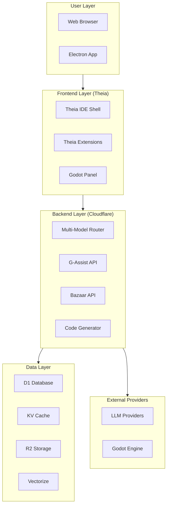
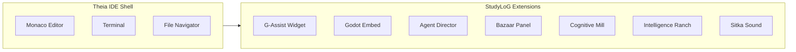
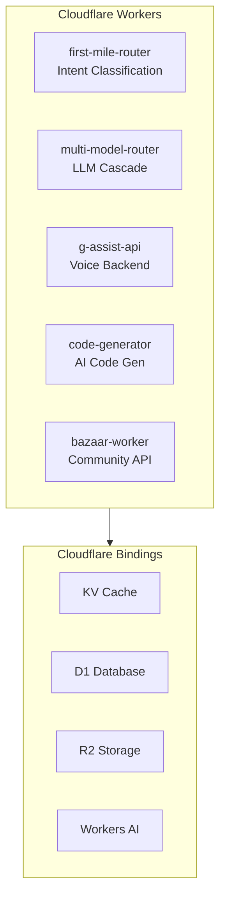
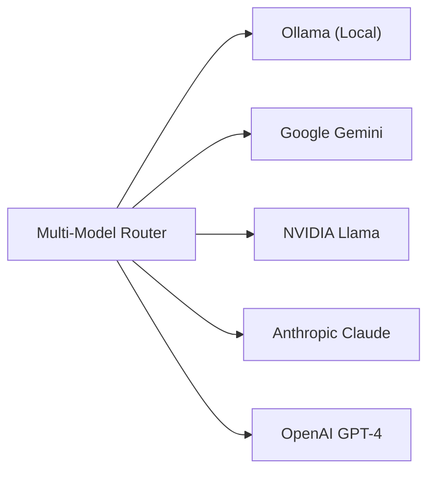
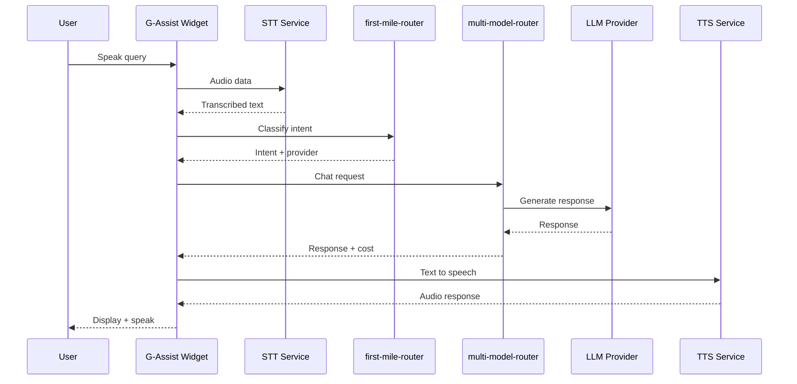
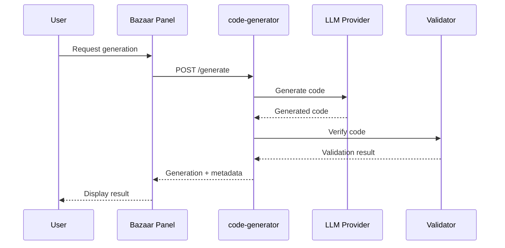
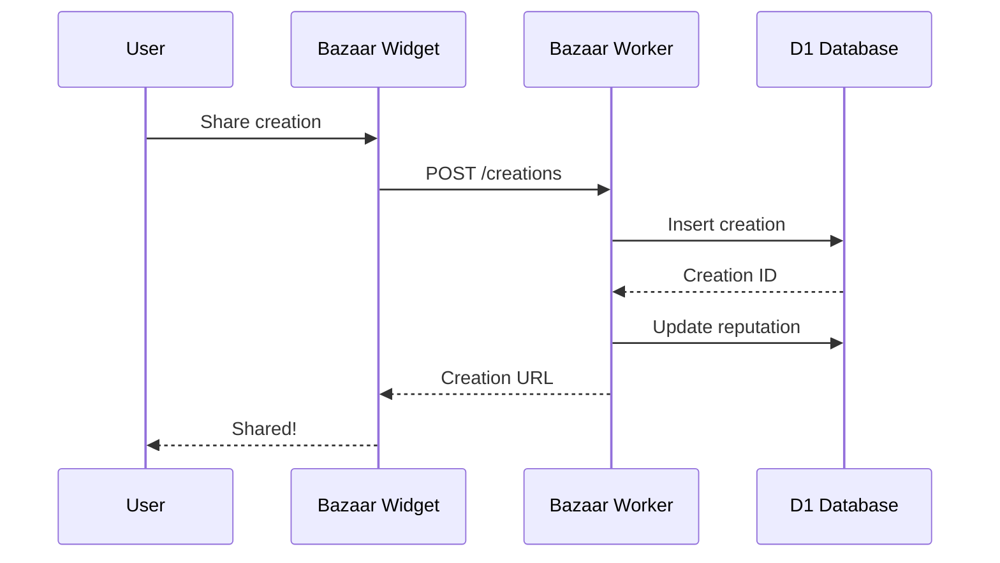

# StudyLoG.AI Architecture Overview

This document provides a high-level architectural overview of StudyLoG.AI.

---

## Table of Contents

1. [System Overview](#system-overview)
2. [Design Principles](#design-principles)
3. [Architecture Layers](#architecture-layers)
4. [Component Communication](#component-communication)
5. [Data Flow](#data-flow)
6. [Security](#security)
7. [Scalability](#scalability)

---

## System Overview

StudyLoG.AI is built as a **monorepo** using **Turborepo** for efficient builds. The system consists of:

- **Theia IDE Frontend** - Customizable web-based IDE
- **Cloudflare Workers Backend** - Serverless API and business logic
- **Godot Simulation Engine** - Real-time game visualization
- **Community Platform** - Sharing, forking, and rating system



---

## Design Principles

### 1. Every Layer is a Mill

Components transform inputs to outputs. Each component should:
- Accept well-defined inputs
- Produce predictable outputs
- Be independently testable
- Have clear responsibilities

### 2. Progressive Disclosure

Complexity reveals through mastery:
- **Toy** - Simple, guided experiences
- **Guide** - Hints and partial control
- **Scribe** - Full control with templates
- **Forge** - Complete freedom

### 3. Product-Agnostic Core

Backend serves multiple products:
- StudyLoG.AI (education) - Reference implementation
- DMLoG.AI (TTRPG) - Planned
- MakerLoG.AI (IoT/Robotics) - Planned
- FishingLoG.AI (fishing simulation) - Partial

### 4. Simulation First

Everything can be simulated before deployment:
- Godot scenes for visual simulations
- Agent behaviors testable without hardware
- Code generation with verification

### 5. Community First

Built-in sharing from the start:
- Millfile format for metadata
- Forking like GitHub
- Quality verification system
- Reputation and rewards

---

## Architecture Layers

### Layer 1: User Interface



**Responsibilities:**
- Code editing and navigation
- Extension hosting
- Widget management
- User preferences

**Technologies:**
- Eclipse Theia 1.54+
- React 18+
- TypeScript 5.7+

### Layer 2: Backend Services



**Responsibilities:**
- API request handling
- Business logic
- Data persistence
- LLM routing

**Technologies:**
- Cloudflare Workers
- Hono/itty-router
- TypeScript

### Layer 3: Data Layer

| Service | Purpose | Data Model |
|---------|---------|------------|
| D1 | Relational data | Users, progress, creations, feedback |
| KV | Fast cache | Session state, classifications, rate limits |
| R2 | Object storage | Projects, assets, Godot scenes |
| Vectorize | Vector search | Puzzle similarity, semantic search |

### Layer 4: External Integrations



---

## Component Communication

### Frontend to Backend

```typescript
// Standard API call pattern
class GAssistFrontendService {
  private apiBase: string;

  async route(query: string, context: IDEContext): Promise<RouteDecision> {
    const response = await fetch(`${this.apiBase}/route`, {
      method: 'POST',
      headers: { 'Content-Type': 'application/json', 'Authorization': `Bearer ${this.token}` },
      body: JSON.stringify({ query, context }),
    });
    if (!response.ok) throw new APIError(response.status);
    return response.json();
  }
}
```

### Backend to LLM Providers

```typescript
// Cascade routing pattern
async function routeToProvider(request: ChatRequest): Promise<ChatResponse> {
  for (const provider of providers) {
    try {
      return await provider.chat(request);
    } catch (error) {
      logger.warn(`${provider.name} failed, trying next`);
      continue;
    }
  }
  throw new Error('All providers failed');
}
```

### Theia Extension Communication

```typescript
// Service injection pattern
export class SiGassistFrontendModule implements FrontendApplicationContribution {
  @inject(MessageService)
  protected readonly messageService: MessageService;

  @inject(GAssistFrontendService)
  protected readonly gassistService: GAssistFrontendService;

  async onStart(): Promise<void> {
    // Initialize extension
  }
}
```

### Godot Communication

```typescript
// WebSocket bridge pattern
class GodotWebSocketBridge {
  private ws: WebSocket;

  sendCommand(command: GodotCommand): void {
    this.ws.send(JSON.stringify({
      type: 'command',
      id: generateId(),
      payload: command,
    }));
  }

  onMessage(callback: (message: GodotMessage) => void): void {
    this.ws.onmessage = (event) => callback(JSON.parse(event.data));
  }
}
```

---

## Data Flow

### Voice Assistant Flow



### Code Generation Flow



### Creation Sharing Flow



---

## Security

### Authentication

- **JWT tokens** for API authentication
- **Token refresh** flow
- **Cloudflare Access** for admin routes

### Authorization

| Role | Permissions |
|------|-------------|
| Student | Create, edit own creations, comment |
| Verified | + Create merge requests, verify creations |
| Moderator | + Approve merges, moderate content |
| Admin | Full access |

### Rate Limiting

- KV-based rate limiting
- Per-user and per-IP limits
- Tiered limits by reputation

### Data Privacy

- Minimal data collection
- User-owned creations
- Optional analytics
- GDPR compliant

---

## Scalability

### Horizontal Scaling

- **Cloudflare Workers** - Auto-scales globally
- **D1** - Read replicas available
- **KV** - Global edge caching

### Performance Optimization

| Layer | Strategy |
|-------|----------|
| Frontend | Code splitting, lazy loading, caching |
| Workers | Response caching, connection pooling |
| Database | Indexing, query optimization |
| LLM | Cascade routing, prompt caching |

### Cost Management

- **First-mile routing** to avoid unnecessary LLM calls
- **Provider cascade** for cost optimization
- **Response caching** in KV
- **Usage tracking** per user

---

## Technology Summary

| Layer | Technology |
|-------|------------|
| IDE Shell | Eclipse Theia 1.54+ |
| Language | TypeScript 5.7+ |
| Build | Turborepo 2.3+ |
| Backend | Cloudflare Workers |
| Database | D1 (SQLite) |
| Cache | KV |
| Storage | R2 |
| Vector Search | Vectorize |
| Simulation | Godot 4.3+ |
| Runtime | Node.js 20+ |

---

## Related Documentation

- [COMPONENTS.md](../COMPONENTS.md) - Detailed component reference
- [ADR Index](adr/README.md) - Architecture decision records
- [API Reference](API_REFERENCE.md) - Complete API documentation
- [Deployment Guide](DEPLOYMENT.md) - Production deployment

---

**Remember**: Every layer is a mill. Every agent is a millwright. Every user graduates to building mills.
