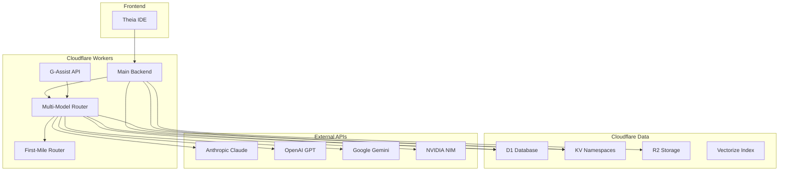

# StudyLoG.AI Deployment Guide

Complete guide for deploying StudyLoG.AI backend and frontend services.

## Table of Contents

1. [Prerequisites](#prerequisites)
2. [Local Development Setup](#local-development-setup)
3. [Database Setup (D1, KV)](#database-setup-d1-kv)
4. [Environment Configuration](#environment-configuration)
5. [Deploying to Production](#deploying-to-production)
6. [Post-Deployment Verification](#post-deployment-verification)
7. [Rollback Procedure](#rollback-procedure)

---

## Prerequisites

### Required Software

| Tool | Version | Purpose |
|------|---------|---------|
| Node.js | >=20.0.0 | Runtime |
| pnpm | 9.0.0 | Package manager |
| Wrangler | >=3.0.0 | Cloudflare CLI |
| Git | latest | Version control |

### Cloudflare Account

1. Create account at https://dash.cloudflare.com/sign-up
2. Verify email address
3. Get API token: Dashboard > My Profile > API Tokens > Create Token
   - Use "Edit Cloudflare Workers" template
   - Save token for CLI authentication

### API Keys (Optional)

| Service | For | Notes |
|---------|-----|-------|
| Zhipu AI | GLM-4.x, CogView, CogVideo | Free tier available |
| DeepSeek | DeepSeek V3, Coder, Reasoner | Lowest cost LLM |
| Anthropic | Claude models | Requires paid account |
| OpenAI | GPT models, DALL-E, TTS | Requires paid account |
| Google | Gemini models | Generous free tier |
| NVIDIA | Llama models | Free tier available |
| Replicate | Image/Video models | Pay-per-use |
| ElevenLabs | TTS voices | Free tier: 10K chars/month |

For detailed provider setup, see [PROVIDER_GUIDE.md](./PROVIDER_GUIDE.md).

---

## Local Development Setup

### 1. Clone Repository

```bash
git clone https://github.com/superinstance-ai/studylog-github.git
cd studylog-github
```

### 2. Install Dependencies

```bash
pnpm install
```

### 3. Install Wrangler CLI

```bash
pnpm add -g wrangler
```

### 4. Authenticate with Cloudflare

```bash
wrangler login
```

This opens a browser for OAuth authentication.

### 5. Configure Local Environment

```bash
# Copy example environment (if available)
cp .env.example .env

# Or set environment variables directly
export NODE_ENV=development
```

### 6. Start Development Server

```bash
# Start all services
pnpm dev

# Start backend only
pnpm backend:dev

# Start specific worker
cd backend/workers/multi-model-router
pnpm dev
```

The backend will be available at http://localhost:8787

---

## Database Setup (D1, KV)

### D1 Database

#### Create D1 Database

```bash
# Create student state database
wrangler d1 create studylog-students

# Note the database_id from output
```

#### Update wrangler.toml

```toml
[[d1_databases]]
binding = "STUDENT_STATE"
database_name = "studylog-students"
database_id = "xxxxxxxx-xxxx-xxxx-xxxx-xxxxxxxxxxxx"  # Replace with actual ID
```

#### Run Migrations

```bash
# Local development
wrangler d1 execute studylog-students --local --file=./backend/d1/schema.sql

# Production
wrangler d1 execute studylog-students --file=./backend/d1/schema.sql
```

### KV Namespaces

#### Create KV Namespaces

```bash
# Session cache
wrangler kv:namespace create "SESSION_CACHE"
wrangler kv:namespace create "SESSION_CACHE" --preview

# Rate limits
wrangler kv:namespace create "RATE_LIMITS"
wrangler kv:namespace create "RATE_LIMITS" --preview

# Classification cache (first-mile-router)
wrangler kv:namespace create "CLASSIFICATION_CACHE"
wrangler kv:namespace create "CLASSIFICATION_CACHE" --preview

# Assistant cache (g-assist-api)
wrangler kv:namespace create "ASSISTANT_CACHE"
wrangler kv:namespace create "ASSISTANT_CACHE" --preview

# Router cache (multi-model-router)
wrangler kv:namespace create "CACHE"
wrangler kv:namespace create "CACHE" --preview
```

#### Update wrangler.toml files

For each worker, add the KV bindings with the returned IDs.

### R2 Storage (Optional)

```bash
# Create buckets
wrangler r2 bucket create studylog-projects
wrangler r2 bucket create studylog-assets
```

### Vectorize Index (Optional)

```bash
# Create vector index for semantic search
wrangler vectorize create studylog-puzzles
```

---

## Environment Configuration

### Set Secrets via Wrangler

```bash
# Main backend secrets
cd backend
wrangler secret put JWT_SECRET

# LLM Provider API Keys
wrangler secret put ZHIPU_API_KEY
wrangler secret put DEEPSEEK_API_KEY
wrangler secret put ANTHROPIC_API_KEY
wrangler secret put OPENAI_API_KEY
wrangler secret put GOOGLE_API_KEY
wrangler secret put NVIDIA_API_KEY

# Multimodal Provider API Keys
wrangler secret put REPLICATE_API_KEY
wrangler secret put ELEVENLABS_API_KEY

# First-mile router
cd workers/first-mile-router
wrangler secret put ZHIPU_API_KEY
wrangler secret put DEEPSEEK_API_KEY
wrangler secret put OPENAI_API_KEY

# Multi-model router
cd workers/multi-model-router
wrangler secret put ZHIPU_API_KEY
wrangler secret put DEEPSEEK_API_KEY
wrangler secret put ANTHROPIC_API_KEY
wrangler secret put OPENAI_API_KEY
wrangler secret put GOOGLE_API_KEY
wrangler secret put NVIDIA_API_KEY
wrangler secret put REPLICATE_API_KEY
wrangler secret put ELEVENLABS_API_KEY

# G-Assist API
cd workers/g-assist-api
wrangler secret put ZHIPU_API_KEY
wrangler secret put DEEPSEEK_API_KEY
wrangler secret put ANTHROPIC_API_KEY
wrangler secret put OPENAI_API_KEY
```

### Environment Variable Reference

These are set in `wrangler.toml` under `[vars]` or as secrets:

#### LLM Provider Keys (Secrets)

| Variable | Provider | Required | Format |
|----------|----------|----------|--------|
| `ZHIPU_API_KEY` | Zhipu AI | Optional | `id.secret` |
| `DEEPSEEK_API_KEY` | DeepSeek | Optional | `sk-...` |
| `ANTHROPIC_API_KEY` | Anthropic | Optional | `sk-ant-...` |
| `OPENAI_API_KEY` | OpenAI | Optional | `sk-...` |
| `GOOGLE_API_KEY` | Google | Optional | `AI...` |
| `NVIDIA_API_KEY` | NVIDIA | Optional | `nvapi-...` |

#### Multimodal Provider Keys (Secrets)

| Variable | Provider | Required | Purpose |
|----------|----------|----------|---------|
| `REPLICATE_API_KEY` | Replicate | Optional | Image/Video generation |
| `ELEVENLABS_API_KEY` | ElevenLabs | Optional | Text-to-speech |

#### Local Provider (Optional)

| Variable | Default | Description |
|----------|---------|-------------|
| `OLLAMA_URL` | `http://localhost:11434` | Local Ollama endpoint |

#### Configuration Variables (wrangler.toml [vars])

```toml
[vars]
ENVIRONMENT = "production"
LOG_LEVEL = "info"
MAX_TOKENS_PER_REQUEST = "2048"
RATE_LIMIT_REQUESTS = "100"
RATE_LIMIT_WINDOW = "60"
CASCADING_ENABLED = "true"
FIRST_MILE_ROUTER_URL = "https://first-mile-router.workers.dev"

# Quality Tier Configuration
IMAGE_TIER_PROTOTYPE_PROVIDER = "cloudflare"
IMAGE_TIER_PRODUCTION_PROVIDER = "zhipu"
IMAGE_TIER_FINAL_PROVIDER = "openai"

# Cost Thresholds per User Tier
COST_THRESHOLD_FREE = "0.01"
COST_THRESHOLD_FORGE = "0.05"
COST_THRESHOLD_STUDIO = "0.10"
COST_THRESHOLD_LAB = "1.00"
```

### Worker Configuration Reference

```bash
# Backend (studylog-backend)
PORT=8787
ENVIRONMENT=development|production
LOG_LEVEL=debug|info|warn|error

# Ollama (optional, for local AI)
OLLAMA_URL=http://localhost:11434

# Multi-model router
FIRST_MILE_ROUTER_URL=https://first-mile-router.your-subdomain.workers.dev
CASCADING_ENABLED=true

# Quality tier providers (optional overrides)
IMAGE_TIER_PROTOTYPE_PROVIDER=cloudflare
IMAGE_TIER_PRODUCTION_PROVIDER=zhipu
IMAGE_TIER_FINAL_PROVIDER=openai
```

---

## Deploying to Production

### Deployment Architecture



### Deployment Order

```bash
# 1. Deploy first-mile-router (intent classification)
cd backend/workers/first-mile-router
wrangler publish

# 2. Deploy multi-model-router (LLM routing)
cd ../multi-model-router
wrangler publish

# 3. Deploy g-assist-api (voice assistant)
cd ../g-assist-api
wrangler publish

# 4. Update environment variables with deployed URLs
# Edit wrangler.toml files to point to deployed workers

# 5. Deploy main backend
cd ../../
wrangler publish
```

### Deployment Commands

```bash
# Deploy all workers (from root)
pnpm backend:deploy

# Deploy specific worker
cd backend/workers/multi-model-router
wrangler publish --env production

# Deploy with custom name
wrangler publish --name studylog-backend-prod
```

### Production Configuration

Update `wrangler.toml` for production:

```toml
[env.production]
name = "studylog-backend-prod"
routes = [
  { pattern = "api.studylog.ai/*", zone_name = "studylog.ai" }
]

[vars]
ENVIRONMENT = "production"
LOG_LEVEL = "warn"
```

### Custom Domain Setup

```bash
# Add custom domain to worker
wrangler domains add api.studylog.ai --worker studylog-backend-prod

# List domains
wrangler domains list --worker studylog-backend-prod
```

---

## Post-Deployment Verification

### Health Checks

```bash
# Main backend health
curl https://studylog-backend-prod.your-subdomain.workers.dev/health

# Expected response:
# {"status":"healthy","timestamp":"2026-01-10T...","version":"0.1.0"}

# First-mile router health
curl https://first-mile-router.your-subdomain.workers.dev/

# Multi-model router health
curl https://multi-model-router.your-subdomain.workers.dev/

# G-Assist API health
curl https://g-assist-api.your-subdomain.workers.dev/
```

### Database Connectivity Test

```bash
# Query D1 database
wrangler d1 execute studylog-students --command "SELECT COUNT(*) FROM students"
```

### Functionality Tests

```bash
# Test intent classification
curl -X POST https://first-mile-router.your-subdomain.workers.dev/classify \
  -H "Content-Type: application/json" \
  -d '{"message":"How do I debug TypeScript errors?"}'

# Test multi-model router
curl -X POST https://multi-model-router.your-subdomain.workers.dev/v1/chat/completions \
  -H "Content-Type: application/json" \
  -d '{
    "model": "gpt-4o-mini",
    "messages": [{"role": "user", "content": "Hello!"}],
    "max_tokens": 100
  }'

# Test g-assist routing
curl -X POST https://g-assist-api.your-subdomain.workers.dev/route \
  -H "Content-Type: application/json" \
  -d '{"message":"Explain recursion"}'
```

### Monitoring Setup

```bash
# Tail logs in real-time
wrangler tail studylog-backend-prod

# Tail specific worker
cd backend/workers/multi-model-router
wrangler tail

# Filter logs by status
wrangler tail --format=pretty --status-error
```

---

## Rollback Procedure

### Quick Rollback to Previous Version

```bash
# View deployment history
wrangler deployments list

# Rollback to specific deployment
wrangler rollback <deployment-id>

# Or redeploy previous commit
git checkout <previous-commit-tag>
pnpm backend:deploy
```

### Emergency Rollback Steps

1. **Identify breaking change**

```bash
# Check recent deployments
wrangler deployments list --name studylog-backend-prod
```

2. **Revert code**

```bash
git log --oneline -10
git revert <breaking-commit>
```

3. **Redeploy**

```bash
pnpm build
wrangler publish
```

4. **Verify health**

```bash
curl https://your-worker.workers.dev/health
```

### Database Rollback

```bash
# WARNING: D1 does not support automatic rollbacks
# You must manually run reversal scripts

# Backup before major changes
wrangler d1 export studylog-students --output=backup.sql

# Restore from backup (manual process)
wrangler d1 execute studylog-students --file=rollback-migration.sql
```

### Blue-Green Deployment Strategy

For zero-downtime deployments:

```bash
# 1. Deploy to staging
wrangler publish --env staging

# 2. Verify staging
curl https://studylog-backend-staging.your-subdomain.workers.dev/health

# 3. Update DNS to point to staging (if verified)
# 4. Keep old production as rollback target
```

---

## Worker-Specific Deployment

### First-Mile Router

```bash
cd backend/workers/first-mile-router
wrangler publish
```

Required bindings:
- AI (Workers AI)
- CLASSIFICATION_CACHE (KV)
- STUDENT_STATE (D1) - optional

### Multi-Model Router

```bash
cd backend/workers/multi-model-router
wrangler publish
```

Required bindings:
- CACHE (KV)
- DB (D1) - for cost tracking

### G-Assist API

```bash
cd backend/workers/g-assist-api
wrangler publish
```

Required bindings:
- AI (Workers AI)
- ASSISTANT_CACHE (KV)
- RATE_LIMITS (KV)
- CONVERSATIONS (D1)

---

## Performance Optimization

### Enable Cache Headers

```javascript
// In your worker
return new Response(response.body, {
  headers: {
    'Cache-Control': 'public, max-age=300', // 5 minutes
    'CDN-Cache-Control': 'public, max-age=600', // 10 minutes
  },
});
```

### Configure Worker Limits

```toml
# In wrangler.toml
[placement]
mode = "smart"

[limits]
cpu_ms = 50  # CPU time limit
```

### Monitor Usage

```bash
# Check analytics
wrangler analytics --name studylog-backend-prod --since 24h
```

---

## Troubleshooting Deployment Issues

See [TROUBLESHOOTING.md](./TROUBLESHOOTING.md) for common issues.
