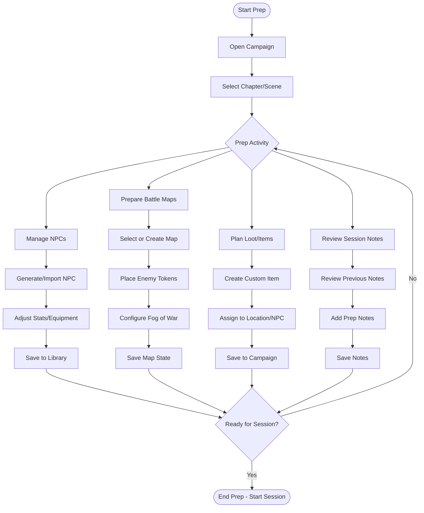
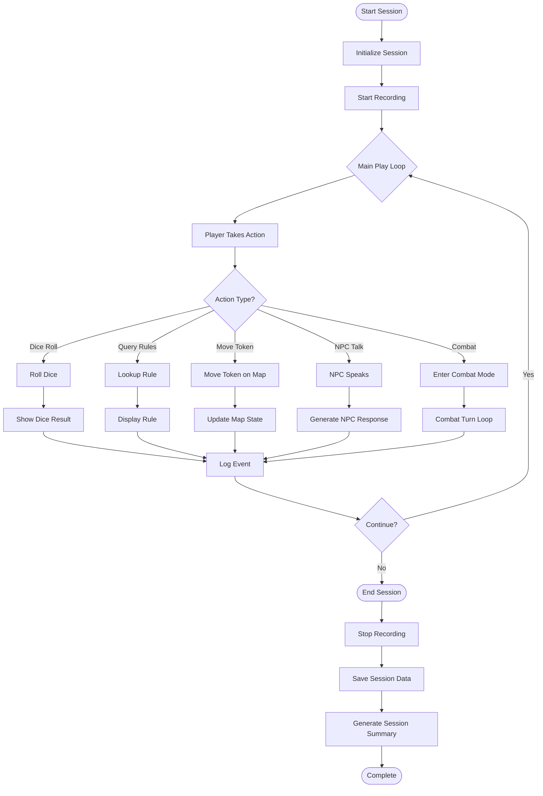
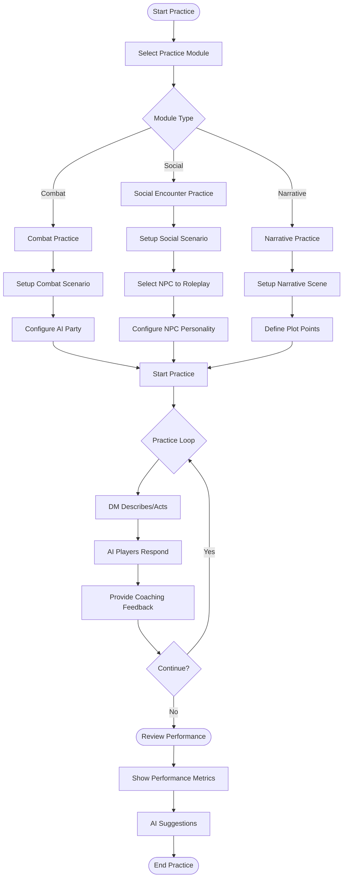

# DMLoG.AI - Frontend and UX Design

**Author:** Agent 7/7 - DMLog Frontend and UX Designer
**Date:** 2026-01-10
**Version:** 1.0.0
**Status:** Design Specification

---

## Table of Contents

1. [Overview](#overview)
2. [Design Philosophy](#design-philosophy)
3. [UI Architecture](#ui-architecture)
4. [Shared Components from StudyLoG](#shared-components-from-studylog)
5. [DMLog-Specific Panels](#dmlog-specific-panels)
6. [Key Screens](#key-screens)
7. [Workflows](#workflows)
8. [Theia Extensions](#theia-extensions)
9. [Component Reuse](#component-reuse)
10. [UX Patterns](#ux-patterns)
11. [Implementation Guide](#implementation-guide)
12. [Code Examples](#code-examples)
13. [Styling Approach](#styling-approach)
14. [Accessibility](#accessibility)
15. [Performance Considerations](#performance-considerations)

---

## Overview

DMLoG.AI is the second product in the SuperInstance.AI ecosystem, focused on tabletop role-playing game (TTRPG) preparation, practice, and visualization. It builds upon the StudyLoG.AI foundation while optimizing for Dungeon Master workflows.

### Product Positioning

| Aspect | StudyLoG.AI | DMLoG.AI |
|--------|-------------|----------|
| **Primary User** | Students/Teachers | Dungeon Masters/Players |
| **Core Activity** | Learning AI/STEM | Prepping/Running TTRPG Sessions |
| **Progression** | Cognitive Stages | Campaign Arcs |
| **Social Aspect** | Peer Learning | Party Collaboration |
| **Visualization** | AI Concepts | Battle Maps, Characters |
| **Agents As** | Tutors | NPC Players |

### Key Features

1. **Campaign Management** - Organize campaigns, sessions, NPCs, locations
2. **Battle Map Visualization** - Godot-powered 3D/2D maps with tokens
3. **AI NPC Practice Players** - Agents that play as party members for practice
4. **Character Sheet Manager** - Create, edit, and track characters
5. **Dice Roller** - Virtual dice with visual feedback
6. **Session Recorder** - Log sessions with AI transcription
7. **NPC Creature Library** - Manage NPCs and monsters with stats
8. **Voice Commands** - Natural language control during sessions

---

## Design Philosophy

### Core Principles

1. **Session First** - Everything supports live gameplay
2. **Minimal Disruption** - UI stays out of the way during play
3. **Quick Access** - Common actions one keystroke/click away
4. **Visual Feedback** - Dice, combat, and exploration are visually engaging
5. **Prep to Play Continuum** - Seamless transition from prep to live session

### Visual Language

```typescript
// DMLog Color Palette
const DMLOG_COLORS = {
  primary: '#8B4513',      // SaddleBrown - D&D classic
  secondary: '#DAA520',    // GoldenRod - Treasure/magic
  accent: '#CD5C5C',       // IndianRed - Combat
  success: '#228B22',      // ForestGreen - Success
  warning: '#FF8C00',      // DarkOrange - Warning
  danger: '#8B0000',       // DarkRed - Critical failure
  magic: '#9400D3',        // DarkViolet - Spells
  background: '#1a1a1a',   // Dark theme default
  surface: '#2d2d2d',
  text: '#e0e0e0',
  textSecondary: '#a0a0a0',
};
```

### Typography

```css
/* DMLog Typography */
.dmlog-font-heading {
  font-family: 'Cinzel', serif;  /* Fantasy feel */
  font-weight: 600;
  letter-spacing: 0.05em;
}

.dmlog-font-body {
  font-family: 'Lato', sans-serif;
  font-weight: 400;
}

.dmlog-font-monospace {
  font-family: 'Fira Code', monospace;  /* For stats/dice */
}
```

---

## UI Architecture

### Layout System

DMLoG.AI uses Theia's flexible panel system with DMLog-specific layouts:

```
+---------------------------------------------------------------+
|  MENU: Campaign | Session | NPCs | Maps | Dice | Journal | AI   |
+---------------------------------------------------------------+
|                                                               |
|  +-------------------+  +------------------+  +-------------+ |
|  |                   |  |                  |  |             | |
|  |   Battle Map      |  |   Party/Combat   |  |   Quick     | |
|  |   (Godot View)    |  |   Panel          |  |   Actions   | |
|  |                   |  |                  |  |             | |
|  |                   |  |                  |  +-------------+ |
|  |                   |  |                  |                  |
|  +-------------------+  +------------------+                  |
|                                                               |
|  +---------------------------------------------------------+ |
|  |  Session Log / Dice Roller / Notes                        | |
|  +---------------------------------------------------------+ |
|                                                               |
+---------------------------------------------------------------+
```

### Panel Types

| Panel | Default Position | Resizable | Closable | Description |
|-------|------------------|-----------|----------|-------------|
| Battle Map | Center | Yes | No | Main Godot-powered view |
| Party Panel | Right | Yes | No | Active characters/combat |
| Quick Actions | Right Top | Yes | Yes | Common DM actions |
| Session Log | Bottom | Yes | No | Rolling log of events |
| NPC Library | Left | Yes | Yes | Creature/character browser |
| Campaign Tree | Left | Yes | No | Hierarchical campaign view |

### State Management

```typescript
/**
 * DMLog Application State
 * Centralized state management for the entire DMLog experience
 */
interface DMLogState {
  // Campaign State
  campaign: CampaignState;
  // Session State
  session: SessionState;
  // Combat State
  combat: CombatState;
  // UI State
  ui: UIState;
  // User Preferences
  preferences: UserPreferences;
}

interface CampaignState {
  id: string;
  name: string;
  currentChapter: string;
  currentScene: string;
  chapters: Chapter[];
  npcs: NPC[];
  locations: Location[];
  items: Item[];
  lore: LoreEntry[];
}

interface SessionState {
  id: string;
  status: 'preparing' | 'active' | 'paused' | 'ended';
  startTime: number;
  elapsedTime: number;
  log: SessionLogEntry[];
  diceRolls: DiceRoll[];
  notes: SessionNote[];
  recording: boolean;
}

interface CombatState {
  active: boolean;
  round: number;
  turn: number;
  initiative: CombatantInitiative[];
  currentCombatant: string;
  effects: ActiveEffect[];
}

interface UIState {
  activePanel: string;
  panelLayout: PanelLayout;
  quickActionsVisible: boolean;
  diceRollerOpen: boolean;
  selectedNPC: string | null;
  selectedLocation: string | null;
  godotConnected: boolean;
}
```

---

## Shared Components from StudyLoG

### Reusable Components

DMLoG.AI reuses these StudyLoG components with configuration:

#### 1. Agent Director (Adapted for DM)

```typescript
/**
 * DMLog adaptation of the Director Agent
 * Routes TTRPG-specific queries to specialist agents
 */
const DM_DIRECTOR_CONFIG = {
  // Reuse the core director routing
  extends: 'DirectorAgent',

  // DMLog-specific routing
  routes: {
    'npc_dialogue': 'NPCAgent',
    'combat': 'CombatAgent',
    'lore_query': 'LoreAgent',
    'rule_lookup': 'RulesAgent',
    'scene_description': 'NarrativeAgent',
  },

  // DM-specific tools
  tools: [
    'create_npc',
    'generate_encounter',
    'roll_dice',
    'lookup_rule',
    'describe_scene',
    'track_initiative',
  ],
};
```

#### 2. Outcome Tracker (Adapted for XP/Rewards)

```typescript
/**
 * DMLog Reward Domains
 * Adapted from StudyLoG's learning domains to TTRPG rewards
 */
enum DMLogRewardDomain {
  COMBAT = 'combat',           // Damage, victories, tactical success
  SOCIAL = 'social',           // Persuasion, relationships, faction rep
  EXPLORATION = 'exploration', // Discoveries, mapping, secrets found
  RESOURCE = 'resource',       // Gold, items, equipment gained
  STRATEGIC = 'strategic',     // Information advantage, alliances
  ROLEPLAY = 'roleplay',       // Creative roleplay, character moments
}

/**
 * XP tracking using outcome tracker
 */
const XP_OUTCOME_CONFIG = {
  domains: Object.values(DMLogRewardDomain),

  // Convert outcomes to XP rewards
  toXP: (outcome: OutcomeRecord): number => {
    const baseXP = outcome.success ? 50 : 10;
    const domainMultiplier = {
      combat: 1.0,
      social: 0.8,
      exploration: 0.7,
      resource: 0.5,
      strategic: 1.2,
      roleplay: 1.5,
    };
    return Math.round(baseXP * domainMultiplier[outcome.domain]);
  },
};
```

#### 3. Voice Assistant (For Natural Commands)

```typescript
/**
 * DMLog Voice Commands
 * Natural language commands during gameplay
 */
const DM_VOICE_COMMANDS = {
  // Dice rolling
  roll: [/roll\s+(\d+)?d(\d+)([+-]\d+)?/i, 'rollDice'],

  // NPC control
  npc: [/npc\s+(\w+)\s+(says|does|attacks)/i, 'controlNPC'],

  // Combat
  combat: [/start\s+combat/i, 'startCombat'],
  nextTurn: [/next\s+turn/i, 'nextTurn'],

  // Scene
  scene: [/describe\s+(.+)/i, 'describeScene'],
  weather: [/set\s+weather\s+(.+)/i, 'setWeather'],

  // Lookup
  rule: [/what\s+(is|are)\s+(.+)/i, 'lookupRule'],
  stat: [/what\s+is\s+(\w+)'s\s+(\w+)/i, 'lookupStat'],
};
```

### Component Adaptations

| StudyLoG Component | DMLog Adaptation | Changes |
|-------------------|------------------|---------|
| Agent Director | DM Director | RPG routing, NPC tools |
| Outcome Tracker | XP/Reward Tracker | Game rewards, not learning |
| Voice Assistant | Voice Commands | Game control commands |
| Godot Panel | Battle Map | Token movement, fog of war |
| Progress Tracker | Story Tracker | Plot points, not learning |
| Bazaar | Campaign Share | Share campaigns, NPCs, maps |

---

## DMLog-Specific Panels

### 1. Campaign Dashboard Panel

```typescript
/**
 * si-dmlog-dashboard
 * Campaign management and organization
 */
interface CampaignDashboardProps {
  campaigns: Campaign[];
  currentCampaign: Campaign | null;
  onCreateCampaign: (name: string) => Promise<Campaign>;
  onSelectCampaign: (id: string) => void;
  onImportCampaign: (file: File) => Promise<void>;
}

const CampaignDashboard: React.FC<CampaignDashboardProps> = ({
  campaigns,
  currentCampaign,
  onCreateCampaign,
  onSelectCampaign,
  onImportCampaign,
}) => {
  return (
    <div className="dmlog-dashboard">
      {/* Campaign Overview */}
      <div className="dashboard-overview">
        <CampaignHero campaign={currentCampaign} />

        {/* Quick Stats */}
        <QuickStats
          sessionsCompleted={currentCampaign?.sessions.length || 0}
          totalPlaytime={currentCampaign?.totalPlaytime || 0}
          npcsCreated={currentCampaign?.npcs.length || 0}
          locationsMapped={currentCampaign?.locations.length || 0}
        />
      </div>

      {/* Campaign Structure */}
      <div className="dashboard-structure">
        <ChapterTree
          chapters={currentCampaign?.chapters || []}
          onSelectScene={(sceneId) => loadScene(sceneId)}
        />
      </div>

      {/* Recent Activity */}
      <div className="dashboard-activity">
        <ActivityLog
          entries={currentCampaign?.recentActivity || []}
        />
      </div>
    </div>
  );
};
```

### 2. Battle Map Panel

```typescript
/**
 * si-dmlog-battlemap
 * Godot-powered battle map visualization
 */
interface BattleMapPanelProps {
  map: BattleMap;
  tokens: Token[];
  fogOfWar: FogOfWarConfig;
  onTokenMove: (tokenId: string, position: Vector3) => void;
  onTokenSelect: (tokenId: string) => void;
  onToggleFog: (position: Vector3) => void;
}

const BattleMapPanel: React.FC<BattleMapPanelProps> = ({
  map,
  tokens,
  fogOfWar,
  onTokenMove,
  onTokenSelect,
  onToggleFog,
}) => {
  return (
    <div className="dmlog-battlemap">
      {/* Godot iframe */}
      <iframe
        id="godot-battlemap"
        src="http://localhost:7352/dmlog/battlemap.html"
        sandbox="allow-scripts allow-same-origin"
        className="battlemap-viewport"
      />

      {/* Map Controls Overlay */}
      <MapControls
        onZoomIn={() => sendToGodot('zoom_in')}
        onZoomOut={() => sendToGodot('zoom_out')}
        onReset={() => sendToGodot('reset_view')}
        onToggleGrid={() => sendToGodot('toggle_grid')}
        onToggleFog={() => sendToGodot('toggle_fog')}
      />

      {/* Token Quick Actions */}
      <TokenQuickActions
        selectedToken={tokens.find(t => t.selected)}
        onRollInit={() => rollInitiative(tokens.find(t => t.selected)?.id)}
        onShowStats={() => showTokenStats(tokens.find(t => t.selected)?.id)}
      />
    </div>
  );
};
```

### 3. Character Sheet Panel

```typescript
/**
 * si-dmlog-characters
 * Character sheet viewer and editor
 */
interface CharacterSheetProps {
  character: Character;
  mode: 'view' | 'edit';
  onFieldChange: (field: string, value: any) => void;
  onRollSkill: (skill: string) => void;
  onRollAttack: (attack: string) => void;
  onRollSave: (save: string) => void;
}

const CharacterSheet: React.FC<CharacterSheetProps> = ({
  character,
  mode,
  onFieldChange,
  onRollSkill,
  onRollAttack,
  onRollSave,
}) => {
  return (
    <div className="dmlog-character-sheet">
      {/* Header */}
      <CharacterHeader
        name={character.name}
        class={character.class}
        level={character.level}
        background={character.background}
        portrait={character.portrait}
      />

      {/* Core Stats */}
      <AbilityScores
        scores={character.abilityScores}
        modifiers={character.abilityModifiers}
        onRoll={(ability) => onRollSkill(ability)}
      />

      {/* Combat Stats */}
      <CombatStats
        ac={character.armorClass}
        hp={character.hitPoints}
        maxHp={character.maxHitPoints}
        speed={character.speed}
        initiative={character.initiative}
        proficiency={character.proficiencyBonus}
      />

      {/* Skills */}
      <SkillsList
        skills={character.skills}
        proficient={character.proficiencies}
        onRoll={onRollSkill}
      />

      {/* Attacks */}
      <AttacksList
        attacks={character.attacks}
        onRoll={onRollAttack}
      />

      {/* Equipment */}
      <EquipmentList
        equipment={character.equipment}
        onQuantityChange={(itemId, qty) =>
          onFieldChange(`equipment.${itemId}.quantity`, qty)
        }
      />

      {/* Features & Traits */}
      <FeaturesList
        features={character.features}
        traits={character.traits}
      />
    </div>
  );
};
```

### 4. NPC/Creature Library

```typescript
/**
 * NPC and Creature Management Panel
 */
interface NPCLibraryProps {
  npcs: NPC[];
  creatures: Creature[];
  filter: 'all' | 'npcs' | 'creatures' | 'custom';
  searchQuery: string;
  onSelect: (entity: NPC | Creature) => void;
  onEdit: (id: string) => void;
  onCreate: () => void;
  onDelete: (id: string) => void;
}

const NPCLibrary: React.FC<NPCLibraryProps> = ({
  npcs,
  creatures,
  filter,
  searchQuery,
  onSelect,
  onEdit,
  onCreate,
  onDelete,
}) => {
  const filtered = useMemo(() => {
    let items = [...npcs, ...creatures];

    if (filter !== 'all') {
      items = items.filter(item => {
        if (filter === 'custom') return item.custom;
        return filter === 'npcs' ? 'role' in item : 'cr' in item;
      });
    }

    if (searchQuery) {
      const query = searchQuery.toLowerCase();
      items = items.filter(item =>
        item.name.toLowerCase().includes(query) ||
        item.tags?.some(tag => tag.toLowerCase().includes(query))
      );
    }

    return items;
  }, [npcs, creatures, filter, searchQuery]);

  return (
    <div className="dmlog-npc-library">
      {/* Search and Filter */}
      <LibrarySearch
        query={searchQuery}
        onQueryChange={setQuery}
        filter={filter}
        onFilterChange={setFilter}
      />

      {/* Entity List */}
      <VirtualizedList
        items={filtered}
        renderItem={(entity) => (
          <NPCCard
            key={entity.id}
            entity={entity}
            onSelect={() => onSelect(entity)}
            onEdit={() => onEdit(entity.id)}
            onDelete={() => onDelete(entity.id)}
          />
        )}
        itemHeight={80}
      />

      {/* Create Button */}
      <FloatingActionButton
        icon="fa-plus"
        onClick={onCreate}
        position="bottom-right"
      />
    </div>
  );
};
```

### 5. Dice Roller Panel

```typescript
/**
 * si-dmlog-roller
 * Virtual dice roller with visual feedback
 */
interface DiceRollerProps {
  onRoll: (roll: DiceRoll) => void;
  recentRolls: DiceRoll[];
  presets: DicePreset[];
}

const DiceRoller: React.FC<DiceRollerProps> = ({
  onRoll,
  recentRolls,
  presets,
}) => {
  const [diceConfig, setDiceConfig] = useState<DiceConfig>({
    count: 1,
    sides: 20,
    modifier: 0,
  });

  const [rolling, setRolling] = useState(false);
  const [lastRoll, setLastRoll] = useState<DiceRollResult | null>(null);

  const handleRoll = async () => {
    setRolling(true);

    // Animate dice
    await animateDiceRoll(diceConfig);

    // Calculate result
    const result = calculateRoll(diceConfig);
    setLastRoll(result);
    onRoll(result);

    setRolling(false);
  };

  return (
    <div className="dmlog-dice-roller">
      {/* Dice Visual */}
      <DiceVisualizer
        config={diceConfig}
        result={lastRoll}
        rolling={rolling}
      />

      {/* Dice Configuration */}
      <DiceConfig
        config={diceConfig}
        onChange={setDiceConfig}
      />

      {/* Quick Dice Buttons */}
      <QuickDice
        presets={presets}
        onSelect={(preset) => setDiceConfig(preset.config)}
      />

      {/* Roll Button */}
      <RollButton
        onClick={handleRoll}
        disabled={rolling}
      />

      {/* Recent Rolls */}
      <RecentRolls
        rolls={recentRolls}
        onReroll={(roll) => {
          setDiceConfig(roll.config);
          handleRoll();
        }}
      />
    </div>
  );
};
```

### 6. Session Recorder Panel

```typescript
/**
 * Session recording and transcription
 */
interface SessionRecorderProps {
  recording: boolean;
  session: Session | null;
  onStartRecording: () => void;
  onPauseRecording: () => void;
  onStopRecording: () => void;
  onAddNote: (note: SessionNote) => void;
  onSnapshot: () => void;
}

const SessionRecorder: React.FC<SessionRecorderProps> = ({
  recording,
  session,
  onStartRecording,
  onPauseRecording,
  onStopRecording,
  onAddNote,
  onSnapshot,
}) => {
  return (
    <div className="dmlog-session-recorder">
      {/* Recording Controls */}
      <RecordingControls
        recording={recording}
        duration={session?.elapsedTime || 0}
        onStart={onStartRecording}
        onPause={onPauseRecording}
        onStop={onStopRecording}
      />

      {/* Live Transcription */}
      <TranscriptionView
        entries={session?.transcription || []}
      />

      {/* Quick Notes */}
      <QuickNotes
        onSave={onAddNote}
        presets={['Important', 'Plot Point', 'Character Moment', 'Rule Check']}
      />

      {/* Scene Snapshot */}
      <SnapshotButton
        onClick={onSnapshot}
        label="Save Scene State"
      />
    </div>
  );
};
```

---

## Key Screens

### 1. Campaign Dashboard

```
+---------------------------------------------------------------+
|  DMLoG.AI              Campaign: The Lost Mine of Phandelver   |
+---------------------------------------------------------------+
|                                                               |
|  +-------------------------+  +----------------------------+  |
|  |  Campaign Progress      |  |   Party                   |  |
|  |  Chapter 3: Phandalin   |  |   * Gandalf Shadowfax    |  |
|  |  [======      ] 60%     |  |   * Frodo Baggins        |  |
|  +-------------------------+  |   * Aragorn Strider      |  |
|                               +----------------------------+  |
|  +---------------------------------------------------------+ |
|  |  Chapters                          |  Recent Activity    | |
|  |  v Chapter 1: Goblin Arrows       |  + Session 3 ended  | |
|  |    v Scene 1: Ambush              |  | 2 hours ago      | |
|  |    v Scene 2: Cragmaw Hideout     |  +-----------------+ |
|  |  > Chapter 2: Phandalin           |  + Gandalf leveled  | |
|  |    > Scene 1: Town Square         |  | up!             | |
|  |    - Scene 2: Sleeping Giant      |  +-----------------+ |
|  |  - Chapter 3: Dragon...           |                     | |
|  +---------------------------------------------------------+ |
|                                                               |
+---------------------------------------------------------------+
```

### 2. Battle Map View (Live Play)

```
+---------------------------------------------------------------+
|  Battle Map: Cragmaw Castle              Round 3 | Turn 4     |
+---------------------------------------------------------------+
|                                                               |
|  +-----------------------------------------------------------+ |
|  |                                                           | |
|  |    [F]    [G]    [G]         ~~~~~~                     | |
|  |                                       ~~~~~~    [K]     | |
|  |                                [P1] [P2] [P3]           | |
|  |                                                           | |
|  |    Grid: On    Fog: On     Tokens: 6    Scale: 5ft       | |
|  +-----------------------------------------------------------+ |
|                                                               |
|  +---------------------------------------------------------+ |
|  |  Initiative Order                    |  Selected: [P1]  | |
|  |  1. Gandalf (+8) ...                 |  HP: 45/52       | |
|  |  2. Goblin A (+2)                    |  AC: 18          | |
|  |  3. Frodo (+4) ...                   |  > Roll Attack   | |
|  |  4. King Goblin (+4)                 |  > Cast Spell    | |
|  |  5. Aragorn (+6)                     |  > Use Item      | |
|  +---------------------------------------------------------+ |
|                                                               |
+---------------------------------------------------------------+
```

### 3. Character Sheet

```
+---------------------------------------------------------------+
|  Gandalf Shadowfax - Level 5 Wizard        Human | Neutral    |
+---------------------------------------------------------------+
|  STR 10 (+0) | DEX 14 (+2) | CON 16 (+3) | INT 18 (+4)      |
|  WIS 16 (+3) | CHA 12 (+1)                                    |
+---------------------------------------------------------------+
|  AC 16 | HP 52/52 | Speed 30ft | Init +4 | Prof +3            |
+---------------------------------------------------------------+
|  Skills:                                                    * |
|  > Arcana +9 | History +7 | Investigation +7 | Nature +7    * |
|  > Perception +6 | Stealth +2                               * |
+---------------------------------------------------------------+
|  Attacks:                                                    * |
|  > Quarterstaff: +7 to hit, 1d6+2 damage                    * |
|  > Firebolt: +7 to hit, 2d10 damage (60ft)                  * |
+---------------------------------------------------------------+
|  Spells (Slot 4/4):                                          * |
|  > Cantrips: Mage Hand, Prestidigitation, Firebolt         * |
|  > 1st: Detect Magic, Magic Missile, Shield (3)            * |
|  > 2nd: Misty Step, Web (2)                                 * |
|  > 3rd: Fireball (1)                                        * |
+---------------------------------------------------------------+
|  Features: Spell Mastery, Arcane Recovery, Spell Scroll     |
+---------------------------------------------------------------+
|  Equipment: Quarterstaff, Spellbook, Component Pouch,       |
|              Ruby (50gp)                                    |
+---------------------------------------------------------------+
```

### 4. NPC/Creature Library

```
+---------------------------------------------------------------+
|  NPC Library                     [Search] [Filter: All] [+]  |
+---------------------------------------------------------------+
|                                                               |
|  +----------------------------+  +--------------------------+ |
|  |  King Goblin              |  |  Cragmaw Chief           | |
|  |  CR 4 | Goblinoid         |  |  CR 2 | Goblinoid         | |
|  |  HP 45 | AC 15           |  |  HP 27 | AC 13            | |
|  |  Tags: Boss, Melee       |  |  Tags: Boss              | |
|  +----------------------------+  +--------------------------+ |
|                                                               |
|  +----------------------------+  +--------------------------+ |
|  |  Commoner                 |  |  Guard                   | |
|  |  CR 0 | Commoner         |  |  CR 1/8 | Humanoid        | |
|  |  HP 4 | AC 10            |  |  HP 11 | AC 16            | |
|  |  Tags: Non-combat        |  |  Tags: Ranged            | |
|  +----------------------------+  +--------------------------+ |
|                                                               |
+---------------------------------------------------------------+
```

### 5. Dice Roller

```
+---------------------------------------------------------------+
|  Dice Roller                                         [Clear]   |
+---------------------------------------------------------------+
|                                                               |
|                      _______                                 |
|                     /       \                                |
|                    |   18   |    Natural 20!                  |
|                     \_______/                                |
|                                                               |
|  1d20 + 5 = 23                                              |
|                                                               |
+---------------------------------------------------------------+
|  [1d20] [2d6] [3d8] [4d6] [1d100]                           |
|                                                               |
|  Modifier: [+5] [-]                                         |
|                                                               |
+---------------------------------------------------------------+
|  Recent:                                                    * |
|  > 1d20+5 = 23 (Gandalf, Attack)                           * |
|  > 2d8+3 = 12 (Fireball damage)                            * |
|  > 1d20+4 = 15 (Perception check)                          * |
+---------------------------------------------------------------+
```

### 6. Session Recorder

```
+---------------------------------------------------------------+
|  Session Recording                    [REC] 00:45:23          |
+---------------------------------------------------------------+
|                                                               |
|  +---------------------------------------------------------+ |
|  |  00:45:23                                               | |
|  |  DM: "The goblin king laughs maniacally as he draws..." | |
|  +---------------------------------------------------------+ |
|                                                               |
|  +---------------------------------------------------------+ |
|  |  00:44:18                                               | |
|  |  Gandalf (Player): "I cast Fireball centered on the..." | |
|  +---------------------------------------------------------+ |
|                                                               |
|  +---------------------------------------------------------+ |
|  |  00:42:05                                               | |
|  |  DM: "The explosion rocks the throne room. Debris..."   | |
|  +---------------------------------------------------------+ |
|                                                               |
|  [+ Add Note] [+ Snapshot] [+ Export]                        |
|                                                               |
+---------------------------------------------------------------+
```

---

## Workflows

### 1. DM Prep Flow

**Goal:** Prepare for an upcoming session efficiently



**Key Interactions:**

```typescript
/**
 * DM Prep Workflow
 */
class DMPrepWorkflow {
  async prepSession(campaignId: string, sceneId: string) {
    // 1. Load campaign context
    const campaign = await this.loadCampaign(campaignId);
    const scene = campaign.getScene(sceneId);

    // 2. Show prep checklist
    const checklist = this.renderPrepChecklist(scene);

    // 3. Guide through prep tasks
    for (const task of checklist.tasks) {
      if (!task.complete) {
        await this.guidePrepTask(task);
      }
    }

    // 4. Generate quick summary
    const summary = await this.generateSessionSummary(scene);
    this.showPrepSummary(summary);
  }

  async guidePrepTask(task: PrepTask) {
    switch (task.type) {
      case 'npcs':
        return this.prepNPCs(task);
      case 'maps':
        return this.prepMaps(task);
      case 'loot':
        return this.prepLoot(task);
      case 'notes':
        return this.prepNotes(task);
    }
  }
}
```

### 2. Live Play Flow

**Goal:** Run a smooth live session with minimal UI disruption



**Key Interactions:**

```typescript
/**
 * Live Play Workflow
 */
class LivePlayWorkflow {
  private combatMode = false;
  private currentTurn = 0;

  async startSession(sceneId: string) {
    // 1. Initialize session state
    this.session = await this.createSession(sceneId);

    // 2. Load battle map
    await this.loadBattleMap(this.session.mapId);

    // 3. Initialize tokens
    await this.spawnTokens(this.session.tokens);

    // 4. Start recording
    await this.recorder.start();

    // 5. Enter play mode (minimal UI)
    this.enterPlayMode();
  }

  handlePlayerAction(action: PlayerAction) {
    switch (action.type) {
      case 'roll':
        return this.handleRoll(action);
      case 'move':
        return this.handleMove(action);
      case 'attack':
        return this.handleAttack(action);
      case 'cast':
        return this.handleCastSpell(action);
      case 'talk':
        return this.handleDialogue(action);
    }
  }

  async handleRoll(action: RollAction) {
    // 1. Roll dice with animation
    const result = await this.diceRoller.roll(action.dice);

    // 2. Show result with sound
    this.showResult(result);

    // 3. Log to session
    this.session.logRoll(result);

    // 4. Check for critical/special effects
    if (result.natural20) {
      this.triggerCriticalEffect();
    }
  }

  enterPlayMode() {
    // Minimize UI elements
    this.ui.hidePanels(['npc-library', 'campaign-tree']);
    this.ui.setPanelOpacity('quick-actions', 0.3);

    // Enable keyboard shortcuts
    this.shortcuts.enable([
      { key: 'Space', action: 'roll_dice' },
      { key: 'Tab', action: 'next_turn' },
      { key: 'Escape', action: 'toggle_ui' },
    ]);
  }
}
```

### 3. Practice Session Flow

**Goal:** Practice DMing with AI agents as players



**Key Interactions:**

```typescript
/**
 * Practice Session Workflow
 */
class PracticeWorkflow {
  private aiPlayers: AICharacter[] = [];
  private coachingEnabled = true;

  async startPractice(config: PracticeConfig) {
    // 1. Create AI players based on party composition
    this.aiPlayers = await this.createAIPlayers(config.party);

    // 2. Load scenario
    const scenario = await this.loadScenario(config.scenarioId);

    // 3. Initialize practice session
    this.session = new PracticeSession({
      scenario,
      aiPlayers: this.aiPlayers,
      coaching: config.coachingEnabled,
    });

    // 4. Start the practice
    await this.runPracticeLoop();
  }

  async runPracticeLoop() {
    while (this.session.active) {
      // 1. Wait for DM input
      const dmAction = await this.waitForDMAction();

      // 2. Present to AI players
      const responses = await this.getAIResponses(dmAction);

      // 3. Display responses
      this.displayResponses(responses);

      // 4. Provide coaching if enabled
      if (this.coachingEnabled) {
        const feedback = await this.getCoachingFeedback(dmAction, responses);
        this.showCoaching(feedback);
      }

      // 5. Log for review
      this.session.logEvent({ dmAction, responses });
    }
  }

  async getCoachingFeedback(
    dmAction: DMAction,
    responses: AIResponse[]
  ): Promise<CoachingFeedback> {
    // Use the Director agent to analyze DM performance
    const director = this.agentDirector.getAgent('director');

    return await director.analyze({
      context: 'dm_practice',
      action: dmAction,
      responses: responses,
      metrics: {
        pacing: this.calculatePacing(),
        engagement: this.calculateEngagement(),
        balance: this.calculateEncounterBalance(),
      },
    });
  }
}
```

### 4. Post-Session Review Flow

**Goal:** Review session and prepare for next session

```mermaid
flowchart TD
    Start([Session Ends]) --> StopRecording[Stop Recording]
    StopRecording --> SaveSession[Save Session Data]
    SaveSession --> GenerateSummary[Generate AI Summary]

    GenerateSummary --> ReviewMenu{What to Review?}

    ReviewMenu --> -->|Transcript| ReviewTranscript[Review Transcript]
    ReviewMenu --> -->|Dice| ReviewDice[Review Dice Rolls]
    ReviewMenu --> -->|Combat| ReviewCombat[Review Combat Log]
    ReviewMenu --> -->|XP| ReviewXP[Review XP Awards]
    ReviewMenu --> -->|Notes| ReviewNotes[Review Session Notes]

    ReviewTranscript --> AddHighlights[Add Highlights]
    ReviewDice --> FlagRolls[Flag Notable Rolls]
    ReviewCombat --> AnalyzeBalance[Analyze Encounter Balance]
    ReviewXP --> AdjustXP[Adjust XP Awards]
    ReviewNotes --> AddFollowUp[Add Follow-up Items]

    AddHighlights --> PrepareNext[Prepare Next Session]
    FlagRolls --> PrepareNext
    AnalyzeBalance --> PrepareNext
    AdjustXP --> PrepareNext
    AddFollowUp --> PrepareNext

    PrepareNext --> AssignXP[Assign XP to Players]
    AssignXP --> UpdateLore[Update Campaign Lore]
    UpdateLore --> PlanNext[Plan Next Session]
    PlanNext --> End([Complete])
```

---

## Theia Extensions

### Extension Structure

```
apps/theia-ide/extensions/
├── si-dmlog-dashboard/         # Campaign management
│   ├── src/
│   │   ├── browser/
│   │   │   ├── dmlog-dashboard-widget.tsx
│   │   │   ├── dmlog-dashboard-module.ts
│   │   │   ├── campaign-service.ts
│   │   │   └── components/
│   │   │       ├── CampaignTree.tsx
│   │   │       ├── ChapterList.tsx
│   │   │       └── QuickStats.tsx
│   │   └── common/
│   │       └── dmlog-protocol.ts
│   └── package.json
│
├── si-dmlog-battlemap/         # Godot battle map
│   ├── src/
│   │   ├── browser/
│   │   │   ├── battlemap-widget.tsx
│   │   │   ├── battlemap-module.ts
│   │   │   ├── godot-bridge.ts
│   │   │   └── components/
│   │   │       ├── MapControls.tsx
│   │   │       ├── TokenList.tsx
│   │   │       └── FogOfWar.tsx
│   │   └── common/
│   │       └── battlemap-protocol.ts
│   └── package.json
│
├── si-dmlog-characters/        # Character management
│   ├── src/
│   │   ├── browser/
│   │   │   ├── character-widget.tsx
│   │   │   ├── character-module.ts
│   │   │   ├── character-service.ts
│   │   │   └── components/
│   │   │       ├── CharacterSheet.tsx
│   │   │       ├── AbilityScores.tsx
│   │   │       ├── SkillsList.tsx
│   │   │       ├── AttacksList.tsx
│   │   │       └── EquipmentList.tsx
│   │   └── common/
│   │       ├── character-protocol.ts
│   │       └── character-types.ts
│   └── package.json
│
├── si-dmlog-npcs/              # NPC/Creature library
│   ├── src/
│   │   ├── browser/
│   │   │   ├── npc-library-widget.tsx
│   │   │   ├── npc-module.ts
│   │   │   ├── npc-service.ts
│   │   │   └── components/
│   │   │       ├── NPCCard.tsx
│   │   │       ├── NPCEditor.tsx
│   │   │       └── CreatureStats.tsx
│   │   └── common/
│   │       └── npc-protocol.ts
│   └── package.json
│
├── si-dmlog-roller/            # Dice roller
│   ├── src/
│   │   ├── browser/
│   │   │   ├── dice-roller-widget.tsx
│   │   │   ├── dice-module.ts
│   │   │   ├── dice-service.ts
│   │   │   └── components/
│   │   │       ├── DiceVisualizer.tsx
│   │   │       ├── DiceConfig.tsx
│   │   │       └── RollHistory.tsx
│   │   └── common/
│   │       └── dice-protocol.ts
│   └── package.json
│
└── si-dmlog-recorder/          # Session recording
    ├── src/
    │   ├── browser/
    │   │   ├── recorder-widget.tsx
    │   │   ├── recorder-module.ts
    │   │   ├── recorder-service.ts
    │   │   └── components/
    │   │       ├── RecordingControls.tsx
    │   │       ├── TranscriptionView.tsx
    │   │       └── SessionNotes.tsx
    │   └── common/
    │       └── recorder-protocol.ts
    └── package.json
```

### Extension Manifest (package.json)

```json
{
  "name": "si-dmlog-dashboard",
  "version": "1.0.0",
  "description": "DMLog campaign management for Theia",
  "keywords": ["theia-extension", "dmlog", "dnd", "ttrpg"],
  "license": "MIT",
  "author": "SuperInstance.AI",
  "theiaExtensions": [
    {
      "frontend": "lib/browser/dmlog-dashboard-frontend-module"
    }
  ],
  "dependencies": {
    "@theia/core": "^1.54.0",
    "@theia/messages": "^1.54.0",
    "react": "^18.2.0",
    "react-dom": "^18.2.0"
  },
  "devDependencies": {
    "@types/react": "^18.2.0",
    "typescript": "^5.7.0"
  }
}
```

### Frontend Module

```typescript
/**
 * si-dmlog-dashboard Frontend Module
 */
import { ContainerModule } from '@theia/core/shared/inversify';
import { WidgetFactory } from '@theia/core/lib/browser/widget-manager';
import {
  DMLogDashboardWidget,
  DMLogDashboardWidgetFactory
} from './dmlog-dashboard-widget';
import { DMLogDashboardContribution } from './dmlog-dashboard-contribution';
import { CampaignService } from './campaign-service';

export default new ContainerModule((bind, unbind, isBound, rebind) => {
  // Bind the widget
  bind(DMLogDashboardWidget).toSelf();
  bind(DMLogDashboardWidgetFactory).toFactory(ctx =>
    () => new DMLogDashboardWidget(ctx.container.get(CampaignService))
  );

  // Register widget contribution
  bind(DMLogDashboardContribution).toSelf();

  // Bind the service
  bind(CampaignService).toSelf().inSingletonScope();
});
```

---

## Component Reuse

### 1. Agent Director (Adapted for DM)

```typescript
/**
 * DM Director - Adapted from StudyLoG's Director Agent
 * Routes TTRPG queries to specialist agents
 */
import { DirectorAgent } from '@studylog/agents';
import { AgentId, AgentContext } from '@studylog/agents';

const DM_ROUTES: Record<string, AgentId> = {
  // NPC-related
  'create_npc': 'captain',
  'npc_dialogue': 'captain',
  'npc_stats': 'captain',

  // Combat-related
  'start_combat': 'captain',
  'combat_turn': 'captain',
  'damage_calculation': 'captain',

  // Rules
  'lookup_rule': 'teacher',
  'check_condition': 'teacher',
  'spell_description': 'teacher',

  // Lore
  'campaign_lore': 'teacher',
  'location_details': 'teacher',
  'npc_backstory': 'teacher',

  // Creative
  'generate_name': 'builder',
  'generate_encounter': 'builder',
  'generate_treasure': 'builder',
};

class DMDirectorAgent extends DirectorAgent {
  protected async routeMessage(
    message: string,
    context: AgentContext
  ): Promise<string | null> {
    // First, check DM-specific routes
    for (const [pattern, agent] of Object.entries(DM_ROUTES)) {
      if (message.toLowerCase().includes(pattern)) {
        return agent;
      }
    }

    // Fall back to parent routing
    return super.routeMessage(message, {
      ...context,
      module: 'dmlog',
    });
  }

  // DM-specific tools
  protected getTools(): ToolDefinition[] {
    return [
      ...super.getTools(),
      {
        name: 'create_npc',
        description: 'Create a new NPC with stats and personality',
        parameters: {
          type: 'object',
          properties: {
            name: { type: 'string' },
            role: { type: 'string' },
            level: { type: 'number' },
            race: { type: 'string' },
            class: { type: 'string' },
          },
        },
      },
      {
        name: 'roll_initiative',
        description: 'Roll initiative for combat',
        parameters: {
          type: 'object',
          properties: {
            combatants: {
              type: 'array',
              items: { type: 'string' },
            },
          },
        },
      },
      {
        name: 'generate_encounter',
        description: 'Generate a balanced combat encounter',
        parameters: {
          type: 'object',
          properties: {
            partyLevel: { type: 'number' },
            partySize: { type: 'number' },
            difficulty: {
              type: 'string',
              enum: ['easy', 'medium', 'hard', 'deadly'],
            },
          },
        },
      },
    ];
  }
}
```

### 2. Outcome Tracker (XP/Rewards)

```typescript
/**
 * DMLog Outcome Tracker - Adapted for XP and rewards
 */
import { OutcomeTracker, RewardDomain } from '@studylog/outcome-tracker';

enum DMLogRewardDomain {
  COMBAT = 'combat',
  SOCIAL = 'social',
  EXPLORATION = 'exploration',
  RESOURCE = 'resource',
  STRATEGIC = 'strategic',
  ROLEPLAY = 'roleplay',
}

class XPTracker extends OutcomeTracker {
  /**
   * Calculate XP from outcome
   */
  calculateXP(outcome: OutcomeRecord): number {
    let baseXP = outcome.success ? 50 : 10;

    // Domain multipliers
    const multipliers: Record<DMLogRewardDomain, number> = {
      combat: 1.0,
      social: 0.8,
      exploration: 0.7,
      resource: 0.5,
      strategic: 1.2,
      roleplay: 1.5,
    };

    baseXP *= multipliers[outcome.rewards[0]?.domain] || 1.0;

    // Apply modifiers based on challenge
    if (outcome.metadata?.difficulty === 'hard') baseXP *= 1.5;
    if (outcome.metadata?.difficulty === 'deadly') baseXP *= 2.0;

    return Math.round(baseXP);
  }

  /**
   * Track combat outcome
   */
  trackCombat(
    characterId: string,
    enemyCR: number,
    victory: boolean,
    damageDealt: number,
    damageTaken: number
  ): number {
    const outcome = this.track_immediate_outcome(
      `combat_${Date.now()}`,
      `Defeated CR ${enemyCR} enemy`,
      victory,
      {
        difficulty: enemyCR.toString(),
        damage_dealt: damageDealt,
        damage_taken: damageTaken,
      }
    );

    return this.calculateXP(outcome);
  }

  /**
   * Track roleplay moment
   */
  trackRoleplay(
    characterId: string,
    description: string,
    impact: 'minor' | 'moderate' | 'major'
  ): number {
    const outcome = this.track_immediate_outcome(
      `roleplay_${Date.now()}`,
      description,
      true,
      { impact }
    );

    return this.calculateXP(outcome);
  }
}
```

### 3. Voice Assistant (Game Control)

```typescript
/**
 * DMLog Voice Commands - Natural language game control
 */
import { VoiceAssistant } from '@studylog/voice';

interface DMVoiceCommand {
  pattern: RegExp;
  action: string;
  handler: (...args: string[]) => void;
}

class DMVoiceAssistant extends VoiceAssistant {
  protected commands: DMVoiceCommand[] = [
    // Dice rolling
    {
      pattern: /roll\s+(\d+)?d?(\d+)?([+-]\d+)?/i,
      action: 'roll_dice',
      handler: (count, sides, modifier) => {
        const dice = {
          count: parseInt(count) || 1,
          sides: parseInt(sides) || 20,
          modifier: parseInt(modifier) || 0,
        };
        this.diceService.roll(dice);
      },
    },

    // NPC dialogue
    {
      pattern: /(?:as|for)\s+(\w+)\s+(?:says?|asks?|responds?)\s+(.+)/i,
      action: 'npc_dialogue',
      handler: (npcName, dialogue) => {
        this.npcService.generateDialogue(npcName, dialogue);
      },
    },

    // Combat
    {
      pattern: /(?:start|begin)\s+combat/i,
      action: 'start_combat',
      handler: () => this.combatService.start(),
    },

    {
      pattern: /next\s+turn/i,
      action: 'next_turn',
      handler: () => this.combatService.nextTurn(),
    },

    // Scene
    {
      pattern: /describe\s+(.+)/i,
      action: 'describe_scene',
      handler: (scene) => {
        this.narrativeService.describe(scene);
      },
    },

    // Lookup
    {
      pattern: /what\s+(?:is|are)\s+(.+)/i,
      action: 'lookup_rule',
      handler: (term) => {
        this.rulesService.lookup(term);
      },
    },
  ];

  async processTranscript(transcript: string): Promise<void> {
    // Check for voice commands first
    for (const command of this.commands) {
      const match = transcript.match(command.pattern);
      if (match) {
        command.handler(...match.slice(1));
        return;
      }
    }

    // Fall back to agent processing
    await super.processTranscript(transcript);
  }
}
```

---

## UX Patterns

### Keyboard Shortcuts

```typescript
/**
 * DMLog Keyboard Shortcuts
 */
const DMLOG_SHORTCUTS = {
  // Global shortcuts
  'Ctrl+Shift+D': 'toggle_dmlog',
  'Ctrl+Shift+R': 'quick_roll',
  'Ctrl+Shift+N': 'new_note',
  'Ctrl+Shift+C': 'toggle_combat',

  // Battle map
  'W': 'pan_up',
  'S': 'pan_down',
  'A': 'pan_left',
  'D': 'pan_right',
  'Q/E': 'rotate',
  'Mouse Wheel': 'zoom',
  'Space+Drag': 'draw_fog',
  'Shift+Click': 'select_token',

  // Dice roller
  '1': 'quick_d20',
  '2': 'quick_d100',
  '3': 'quick_attack',
  '4': 'quick_damage',

  // Combat
  'N': 'next_turn',
  'P': 'previous_turn',
  'I': 'show_initiative',
  'H': 'show_health',

  // Panels
  'Ctrl+1': 'show_dashboard',
  'Ctrl+2': 'show_battlemap',
  'Ctrl+3': 'show_characters',
  'Ctrl+4': 'show_npcs',
  'Ctrl+5': 'show_dice',
  'Ctrl+6': 'show_recorder',
};

/**
 * Shortcut Handler
 */
class DMLogShortcutHandler {
  private shortcuts: Map<string, () => void> = new Map();

  register(key: string, handler: () => void): void {
    this.shortcuts.set(key.toLowerCase(), handler);
  }

  handle(event: KeyboardEvent): boolean {
    const key = this.formatKeyEvent(event);
    const handler = this.shortcuts.get(key);

    if (handler) {
      event.preventDefault();
      handler();
      return true;
    }

    return false;
  }

  private formatKeyEvent(event: KeyboardEvent): string {
    const parts: string[] = [];

    if (event.ctrlKey) parts.push('ctrl');
    if (event.altKey) parts.push('alt');
    if (event.shiftKey) parts.push('shift');

    parts.push(event.key.toLowerCase());

    return parts.join('+');
  }
}
```

### Drag and Drop

```typescript
/**
 * Drag and Drop for Tokens
 */
interface TokenDragData {
  tokenId: string;
  source: 'library' | 'map';
  position?: Vector3;
}

const useTokenDragDrop = () => {
  const [dragging, setDragging] = useState<string | null>(null);

  const handleDragStart = (tokenId: string, source: string) => (
    event: React.DragEvent
  ) => {
    const data: TokenDragData = {
      tokenId,
      source: source as any,
    };

    event.dataTransfer.setData('application/json', JSON.stringify(data));
    event.dataTransfer.effectAllowed = source === 'library' ? 'copy' : 'move';
    setDragging(tokenId);
  };

  const handleDragOver = (event: React.DragEvent) => {
    event.preventDefault();
    event.dataTransfer.dropEffect = 'copy';
  };

  const handleDrop = (position: Vector3) => async (
    event: React.DragEvent
  ) => {
    event.preventDefault();

    const rawData = event.dataTransfer.getData('application/json');
    const data: TokenDragData = JSON.parse(rawData);

    if (data.source === 'library') {
      // Spawn new token at position
      await tokenService.spawn(data.tokenId, position);
    } else {
      // Move existing token
      await tokenService.move(data.tokenId, position);
    }

    setDragging(null);
  };

  return {
    dragging,
    handleDragStart,
    handleDragOver,
    handleDrop,
  };
};
```

### Quick Actions Menu

```typescript
/**
 * Quick Actions Menu
 * Context-sensitive quick actions
 */
interface QuickAction {
  id: string;
  label: string;
  icon: string;
  shortcut?: string;
  handler: () => void;
  visible?: (context: UIContext) => boolean;
}

const QUICK_ACTIONS: QuickAction[] = [
  {
    id: 'roll_d20',
    label: 'Roll d20',
    icon: 'fa-dice-d20',
    shortcut: 'Ctrl+R',
    handler: () => diceService.quickRoll('1d20'),
  },
  {
    id: 'next_turn',
    label: 'Next Turn',
    icon: 'fa-forward',
    shortcut: 'N',
    handler: () => combatService.nextTurn(),
    visible: (ctx) => ctx.combatActive,
  },
  {
    id: 'toggle_fog',
    label: 'Toggle Fog of War',
    icon: 'fa-cloud',
    handler: () => mapService.toggleFog(),
  },
  {
    id: 'add_note',
    label: 'Quick Note',
    icon: 'fa-sticky-note',
    shortcut: 'Ctrl+Shift+N',
    handler: () => noteService.quickNote(),
  },
  {
    id: 'lookup_rule',
    label: 'Lookup Rule',
    icon: 'fa-book',
    shortcut: 'Ctrl+L',
    handler: () => rulesService.quickLookup(),
  },
];

const QuickActionsMenu: React.FC = () => {
  const context = useUIContext();

  const visibleActions = QUICK_ACTIONS.filter(
    action => action.visible?.(context) ?? true
  );

  return (
    <div className="quick-actions-menu">
      {visibleActions.map(action => (
        <QuickActionButton
          key={action.id}
          action={action}
          onClick={action.handler}
        />
      ))}
    </div>
  );
};
```

### Context Menus

```typescript
/**
 * Context Menus for Right-Click Actions
 */
interface ContextMenuItem {
  label: string;
  icon?: string;
  action: () => void;
  separator?: boolean;
  disabled?: boolean;
  submenu?: ContextMenuItem[];
}

const useTokenContextMenu = () => {
  const showContextMenu = useContextMenu();

  const getTokenMenu = (token: Token): ContextMenuItem[] => [
    {
      label: 'Roll Initiative',
      icon: 'fa-dice',
      action: () => combatService.rollInitiative(token.id),
    },
    { separator: true },
    {
      label: 'Edit Stats',
      icon: 'fa-edit',
      action: () => characterService.openEditor(token.id),
    },
    {
      label: 'Change Appearance',
      icon: 'fa-palette',
      action: () => tokenService.openAppearanceEditor(token.id),
    },
    { separator: true },
    {
      label: 'Duplicate',
      icon: 'fa-copy',
      action: () => tokenService.duplicate(token.id),
    },
    {
      label: 'Remove',
      icon: 'fa-trash',
      action: () => tokenService.remove(token.id),
    },
  ];

  const handleContextMenu = (event: React.MouseEvent, token: Token) => {
    event.preventDefault();
    showContextMenu(event.clientX, event.clientY, getTokenMenu(token));
  };

  return { handleContextMenu };
};
```

---

## Implementation Guide

### Step 1: Create the Dashboard Extension

```bash
# Create the extension directory
mkdir -p apps/theia-ide/extensions/si-dmlog-dashboard

# Initialize the extension
cd apps/theia-ide/extensions/si-dmlog-dashboard
npm init -y
```

### Step 2: Configure TypeScript

```json
// tsconfig.json
{
  "extends": "../../tsconfig.json",
  "compilerOptions": {
    "outDir": "lib",
    "rootDir": "src"
  },
  "include": ["src"],
  "references": [
    { "path": "../../../packages/agents" },
    { "path": "../../../packages/characters" }
  ]
}
```

### Step 3: Build Script

```json
// package.json scripts
{
  "scripts": {
    "build": "tsc",
    "watch": "tsc -w",
    "clean": "rm -rf lib"
  }
}
```

### Step 4: Frontend Module

```typescript
// src/browser/dmlog-dashboard-frontend-module.ts
import { ContainerModule } from '@theia/core/shared/inversify';

export default new ContainerModule((bind) => {
  // Bindings will be added here
});
```

---

## Code Examples

### Campaign Dashboard Widget

```typescript
/**
 * DMLog Campaign Dashboard Widget
 */
import * as React from 'react';
import { injectable, inject } from '@theia/core/shared/inversify';
import { ReactWidget } from '@theia/core/lib/browser/widgets/react-widget';
import { MessageService } from '@theia/core';
import { CampaignService } from './campaign-service';

export interface CampaignDashboardState {
  campaigns: Campaign[];
  currentCampaign: Campaign | null;
  selectedChapter: string | null;
  selectedScene: string | null;
}

@injectable()
export class CampaignDashboardWidget extends ReactWidget {
  static readonly ID = 'si-dmlog-dashboard:widget';
  static readonly LABEL = 'Campaign Dashboard';

  @inject(MessageService)
  protected readonly messageService: MessageService;

  @inject(CampaignService)
  protected readonly campaignService: CampaignService;

  protected state: CampaignDashboardState = {
    campaigns: [],
    currentCampaign: null,
    selectedChapter: null,
    selectedScene: null,
  };

  constructor() {
    super();
    this.id = CampaignDashboardWidget.ID;
    this.title.label = CampaignDashboardWidget.LABEL;
    this.title.caption = 'Manage your TTRPG campaigns';
    this.title.iconClass = 'fa fa-map';
    this.addClass('si-dmlog-dashboard');
  }

  protected async onAfterAttach(): Promise<void> {
    super.onAfterAttach();
    await this.loadCampaigns();
  }

  protected async loadCampaigns(): Promise<void> {
    try {
      const campaigns = await this.campaignService.listCampaigns();
      this.setState({ campaigns });
    } catch (error) {
      this.messageService.error(`Failed to load campaigns: ${error}`);
    }
  }

  protected render(): React.ReactNode {
    const { currentCampaign, campaigns } = this.state;

    return (
      <div className="dmlog-dashboard-container">
        {currentCampaign ? (
          this.renderCampaign(currentCampaign)
        ) : (
          this.renderCampaignList(campaigns)
        )}
      </div>
    );
  }

  private renderCampaign(campaign: Campaign): React.ReactNode {
    return (
      <>
        {/* Campaign Header */}
        <div className="campaign-header">
          <h1>{campaign.name}</h1>
          <div className="campaign-meta">
            <span>Level {campaign.levelRange}</span>
            <span>{campaign.system}</span>
          </div>
        </div>

        {/* Campaign Stats */}
        <div className="campaign-stats">
          <StatCard
            icon="fa-users"
            label="Party Members"
            value={campaign.party.length}
          />
          <StatCard
            icon="fa-map-marker"
            label="Locations"
            value={campaign.locations.length}
          />
          <StatCard
            icon="fa-user"
            label="NPCs"
            value={campaign.npcs.length}
          />
          <StatCard
            icon="fa-book"
            label="Sessions"
            value={campaign.sessions.length}
          />
        </div>

        {/* Chapter Tree */}
        <div className="chapter-tree">
          <h2>Story Structure</h2>
          {campaign.chapters.map(chapter => (
            <ChapterNode
              key={chapter.id}
              chapter={chapter}
              selected={this.state.selectedChapter === chapter.id}
              onSelect={() => this.selectChapter(chapter.id)}
            />
          ))}
        </div>
      </>
    );
  }

  private renderCampaignList(campaigns: Campaign[]): React.ReactNode {
    return (
      <div className="campaign-list">
        <div className="campaign-list-header">
          <h2>Your Campaigns</h2>
          <button
            className="theia-button primary"
            onClick={() => this.createNewCampaign()}
          >
            <i className="fa fa-plus" /> New Campaign
          </button>
        </div>

        <div className="campaign-grid">
          {campaigns.map(campaign => (
            <CampaignCard
              key={campaign.id}
              campaign={campaign}
              onSelect={() => this.selectCampaign(campaign.id)}
              onEdit={() => this.editCampaign(campaign.id)}
              onDelete={() => this.deleteCampaign(campaign.id)}
            />
          ))}
        </div>

        {campaigns.length === 0 && (
          <div className="empty-state">
            <i className="fa fa-map fa-3x" />
            <h3>No campaigns yet</h3>
            <p>Create your first campaign to get started</p>
            <button
              className="theia-button primary"
              onClick={() => this.createNewCampaign()}
            >
              Create Campaign
            </button>
          </div>
        )}
      </div>
    );
  }

  private async selectCampaign(campaignId: string): Promise<void> {
    try {
      const campaign = await this.campaignService.getCampaign(campaignId);
      this.setState({ currentCampaign: campaign });
    } catch (error) {
      this.messageService.error(`Failed to load campaign: ${error}`);
    }
  }

  private async createNewCampaign(): Promise<void> {
    // Create campaign logic
  }

  private setState(partial: Partial<CampaignDashboardState>): void {
    this.state = { ...this.state, ...partial };
    this.update();
  }
}

// Sub-components
const StatCard: React.FC<{
  icon: string;
  label: string;
  value: number;
}> = ({ icon, label, value }) => (
  <div className="stat-card">
    <i className={`fa ${icon}`} />
    <div className="stat-value">{value}</div>
    <div className="stat-label">{label}</div>
  </div>
);

const ChapterNode: React.FC<{
  chapter: Chapter;
  selected: boolean;
  onSelect: () => void;
}> = ({ chapter, selected, onSelect }) => (
  <div className={`chapter-node ${selected ? 'selected' : ''}`}>
    <button onClick={onSelect} className="chapter-title">
      <i className="fa fa-folder" />
      {chapter.title}
    </button>
    {chapter.scenes.map(scene => (
      <div key={scene.id} className="scene-node">
        <i className="fa fa-file" />
        {scene.title}
      </div>
    ))}
  </div>
);

const CampaignCard: React.FC<{
  campaign: Campaign;
  onSelect: () => void;
  onEdit: () => void;
  onDelete: () => void;
}> = ({ campaign, onSelect, onEdit, onDelete }) => (
  <div className="campaign-card" onClick={onSelect}>
    <div className="campaign-cover">
      {campaign.coverImage ? (
        
      ) : (
        <div className="campaign-placeholder">
          <i className="fa fa-map fa-3x" />
        </div>
      )}
    </div>
    <div className="campaign-info">
      <h3>{campaign.name}</h3>
      <p>{campaign.description}</p>
      <div className="campaign-tags">
        {campaign.system && <span className="tag">{campaign.system}</span>}
        {campaign.setting && <span className="tag">{campaign.setting}</span>}
      </div>
    </div>
    <div className="campaign-actions">
      <button
        className="theia-button secondary"
        onClick={(e) => { e.stopPropagation(); onEdit(); }}
      >
        <i className="fa fa-edit" />
      </button>
      <button
        className="theia-button danger"
        onClick={(e) => { e.stopPropagation(); onDelete(); }}
      >
        <i className="fa fa-trash" />
      </button>
    </div>
  </div>
);
```

### Battle Map Widget

```typescript
/**
 * DMLog Battle Map Widget
 * Godot-powered battle map visualization
 */
import * as React from 'react';
import { injectable, inject } from '@theia/core/shared/inversify';
import { ReactWidget } from '@theia/core/lib/browser/widgets/react-widget';
import { GodotWebSocketService } from './godot-websocket';
import { BattleMapService } from './battlemap-service';

export interface BattleMapState {
  connected: boolean;
  map: BattleMap | null;
  tokens: Token[];
  selectedToken: string | null;
  fogEnabled: boolean;
  gridEnabled: boolean;
  zoom: number;
}

@injectable()
export class BattleMapWidget extends ReactWidget {
  static readonly ID = 'si-dmlog-battlemap:widget';
  static readonly LABEL = 'Battle Map';

  @inject(GodotWebSocketService)
  protected readonly godot: GodotWebSocketService;

  @inject(BattleMapService)
  protected readonly mapService: BattleMapService;

  protected state: BattleMapState = {
    connected: false,
    map: null,
    tokens: [],
    selectedToken: null,
    fogEnabled: true,
    gridEnabled: true,
    zoom: 1.0,
  };

  constructor() {
    super();
    this.id = BattleMapWidget.ID;
    this.title.label = BattleMapWidget.LABEL;
    this.title.caption = 'Battle map visualization';
    this.title.iconClass = 'fa fa-th';
    this.addClass('si-dmlog-battlemap');
  }

  protected async onAfterAttach(): Promise<void> {
    super.onAfterAttach();

    // Connect to Godot
    this.godot.onMessage((data) => this.handleGodotMessage(data));
    await this.godot.connect();

    // Load current map
    const currentMap = await this.mapService.getCurrentMap();
    if (currentMap) {
      this.loadMap(currentMap);
    }
  }

  protected render(): React.ReactNode {
    const { connected, map, selectedToken } = this.state;

    return (
      <div className="dmlog-battlemap-container">
        {/* Map Controls */}
        <div className="map-controls">
          <div className="control-group">
            <button
              className="theia-button icon"
              onClick={() => this.zoomIn()}
              title="Zoom In"
            >
              <i className="fa fa-search-plus" />
            </button>
            <button
              className="theia-button icon"
              onClick={() => this.zoomOut()}
              title="Zoom Out"
            >
              <i className="fa fa-search-minus" />
            </button>
            <button
              className="theia-button icon"
              onClick={() => this.resetView()}
              title="Reset View"
            >
              <i className="fa fa-compress" />
            </button>
          </div>

          <div className="control-group">
            <button
              className={`theia-button icon ${this.state.gridEnabled ? 'active' : ''}`}
              onClick={() => this.toggleGrid()}
              title="Toggle Grid"
            >
              <i className="fa fa-th" />
            </button>
            <button
              className={`theia-button icon ${this.state.fogEnabled ? 'active' : ''}`}
              onClick={() => this.toggleFog()}
              title="Toggle Fog of War"
            >
              <i className="fa fa-cloud" />
            </button>
          </div>
        </div>

        {/* Godot Viewport */}
        <div className="map-viewport">
          {connected ? (
            <iframe
              id="godot-battlemap"
              src="http://localhost:7352/dmlog/battlemap.html"
              sandbox="allow-scripts allow-same-origin"
              className="godot-frame"
            />
          ) : (
            <div className="map-placeholder">
              <div className="loading-spinner" />
              <p>Connecting to battle map...</p>
            </div>
          )}
        </div>

        {/* Token Sidebar */}
        <div className="token-sidebar">
          <div className="sidebar-header">
            <h3>Tokens</h3>
            <button
              className="theia-button icon"
              onClick={() => this.addToken()}
              title="Add Token"
            >
              <i className="fa fa-plus" />
            </button>
          </div>

          <div className="token-list">
            {this.state.tokens.map(token => (
              <TokenItem
                key={token.id}
                token={token}
                selected={selectedToken === token.id}
                onSelect={() => this.selectToken(token.id)}
                onRemove={() => this.removeToken(token.id)}
              />
            ))}
          </div>
        </div>

        {/* Selected Token Actions */}
        {selectedToken && (
          <div className="token-actions">
            {this.renderTokenActions(selectedToken)}
          </div>
        )}
      </div>
    );
  }

  private renderTokenActions(tokenId: string): React.ReactNode {
    const token = this.state.tokens.find(t => t.id === tokenId);
    if (!token) return null;

    return (
      <>
        <button
          className="theia-button"
          onClick={() => this.rollInitiative(token)}
        >
          <i className="fa fa-dice" /> Roll Initiative
        </button>
        <button
          className="theia-button"
          onClick={() => this.showStats(token)}
        >
          <i className="fa fa-bar-chart" /> Stats
        </button>
        <button
          className="theia-button"
          onClick={() => this.editToken(token)}
        >
          <i className="fa fa-edit" /> Edit
        </button>
      </>
    );
  }

  private handleGodotMessage(data: unknown): void {
    const message = data as GodotMessage;
    switch (message.type) {
      case 'token_moved':
        this.updateTokenPosition(message.tokenId, message.position);
        break;
      case 'token_selected':
        this.selectToken(message.tokenId);
        break;
      case 'fog_toggled':
        this.setState({ fogEnabled: message.enabled });
        break;
    }
  }

  private async loadMap(map: BattleMap): Promise<void> {
    this.setState({ map });
    await this.sendToGodot({
      type: 'load_map',
      mapId: map.id,
      data: map.data,
    });
  }

  private async sendToGodot(message: GodotCommand): Promise<void> {
    this.godot.send(message);
  }

  private setState(partial: Partial<BattleMapState>): void {
    this.state = { ...this.state, ...partial };
    this.update();
  }
}

// Token item component
const TokenItem: React.FC<{
  token: Token;
  selected: boolean;
  onSelect: () => void;
  onRemove: () => void;
}> = ({ token, selected, onSelect, onRemove }) => (
  <div
    className={`token-item ${selected ? 'selected' : ''}`}
    onClick={onSelect}
  >
    <div className="token-avatar">
      {token.image ? (
        
      ) : (
        <div className="token-placeholder">{token.name[0]}</div>
      )}
    </div>
    <div className="token-info">
      <div className="token-name">{token.name}</div>
      <div className="token-hp">
        {token.currentHp}/{token.maxHp} HP
      </div>
    </div>
    <button
      className="theia-button icon danger"
      onClick={(e) => { e.stopPropagation(); onRemove(); }}
    >
      <i className="fa fa-times" />
    </button>
  </div>
);
```

### Dice Roller Widget

```typescript
/**
 * DMLog Dice Roller Widget
 */
import * as React from 'react';
import { injectable, inject } from '@theia/core/shared/inversify';
import { ReactWidget } from '@theia/core/lib/browser/widgets/react-widget';
import { DiceService } from './dice-service';

export interface DiceRollerState {
  config: DiceConfig;
  rolling: boolean;
  result: DiceResult | null;
  history: DiceResult[];
  presets: DicePreset[];
}

@injectable()
export class DiceRollerWidget extends ReactWidget {
  static readonly ID = 'si-dmlog-roller:widget';
  static readonly LABEL = 'Dice Roller';

  @inject(DiceService)
  protected readonly diceService: DiceService;

  protected state: DiceRollerState = {
    config: { count: 1, sides: 20, modifier: 0 },
    rolling: false,
    result: null,
    history: [],
    presets: [
      { name: 'Attack', config: { count: 1, sides: 20, modifier: 5 } },
      { name: 'Damage', config: { count: 1, sides: 8, modifier: 3 } },
      { name: 'Greatsword', config: { count: 2, sides: 6, modifier: 0 } },
      { name: 'Percentile', config: { count: 1, sides: 100, modifier: 0 } },
    ],
  };

  constructor() {
    super();
    this.id = DiceRollerWidget.ID;
    this.title.label = DiceRollerWidget.LABEL;
    this.title.caption = 'Virtual dice roller';
    this.title.iconClass = 'fa fa-dice';
    this.addClass('si-dmlog-roller');
  }

  protected render(): React.ReactNode {
    const { config, rolling, result, history, presets } = this.state;

    return (
      <div className="dmlog-dice-roller">
        {/* Dice Visual */}
        <div className="dice-visual">
          {rolling ? (
            <DiceAnimation config={config} />
          ) : result ? (
            <DiceResult result={result} />
          ) : (
            <DicePlaceholder config={config} />
          )}
        </div>

        {/* Dice Config */}
        <div className="dice-config">
          <DiceInput
            label="Count"
            value={config.count}
            min={1}
            max={20}
            onChange={(count) => this.updateConfig({ ...config, count })}
          />
          <span className="dice-label">d</span>
          <DiceInput
            label="Sides"
            value={config.sides}
            options={[4, 6, 8, 10, 12, 20, 100]}
            onChange={(sides) => this.updateConfig({ ...config, sides })}
          />
          <DiceInput
            label="Modifier"
            value={config.modifier}
            min={-20}
            max={20}
            onChange={(modifier) => this.updateConfig({ ...config, modifier })}
          />
        </div>

        {/* Quick Presets */}
        <div className="dice-presets">
          {presets.map(preset => (
            <button
              key={preset.name}
              className="theia-button secondary"
              onClick={() => this.applyPreset(preset)}
            >
              {preset.name}
            </button>
          ))}
        </div>

        {/* Roll Button */}
        <button
          className="theia-button primary roll-button"
          onClick={() => this.roll()}
          disabled={rolling}
        >
          {rolling ? (
            <>
              <i className="fa fa-spinner fa-spin" /> Rolling...
            </>
          ) : (
            <>
              <i className="fa fa-dice" /> Roll
            </>
          )}
        </button>

        {/* Roll History */}
        {history.length > 0 && (
          <div className="dice-history">
            <h4>Recent Rolls</h4>
            {history.slice(0, 10).map((roll, index) => (
              <HistoryItem
                key={index}
                result={roll}
                onReroll={() => {
                  this.updateConfig(roll.config);
                  this.roll();
                }}
              />
            ))}
          </div>
        )}
      </div>
    );
  }

  private async roll(): Promise<void> {
    this.setState({ rolling: true });

    // Simulate roll animation
    await this.delay(500);

    const result = await this.diceService.roll(this.state.config);

    this.setState({
      rolling: false,
      result,
      history: [result, ...this.state.history],
    });

    // Play sound
    this.playRollSound(result);
  }

  private updateConfig(config: DiceConfig): void {
    this.setState({ config });
  }

  private applyPreset(preset: DicePreset): void {
    this.setState({ config: preset.config });
  }

  private playRollSound(result: DiceResult): void {
    if (result.natural20) {
      this.playSound('crit');
    } else if (result.natural1) {
      this.playSound('fumble');
    } else {
      this.playSound('roll');
    }
  }

  private playSound(type: string): void {
    // Audio playback implementation
  }

  private delay(ms: number): Promise<void> {
    return new Promise(resolve => setTimeout(resolve, ms));
  }

  protected setState(partial: Partial<DiceRollerState>): void {
    this.state = { ...this.state, ...partial };
    this.update();
  }
}

// Dice input component
const DiceInput: React.FC<{
  label: string;
  value: number;
  min?: number;
  max?: number;
  options?: number[];
  onChange: (value: number) => void;
}> = ({ label, value, min, max, options, onChange }) => {
  if (options) {
    return (
      <select
        className="theia-select"
        value={value}
        onChange={(e) => onChange(Number(e.target.value))}
      >
        {options.map(opt => (
          <option key={opt} value={opt}>
            {opt}
          </option>
        ))}
      </select>
    );
  }

  return (
    <input
      type="number"
      className="theia-input"
      value={value}
      min={min}
      max={max}
      onChange={(e) => onChange(Number(e.target.value))}
    />
  );
};

// Dice result display
const DiceResult: React.FC<{ result: DiceResult }> = ({ result }) => (
  <div className={`dice-result ${result.natural20 ? 'crit' : ''} ${result.natural1 ? 'fumble' : ''}`}>
    <div className="result-total">{result.total}</div>
    <div className="result-breakdown">
      {result.rolls.map((roll, i) => (
        <span
          key={i}
          className={`die-roll ${roll === result.config.sides ? 'max' : ''} ${roll === 1 ? 'min' : ''}`}
        >
          {roll}
        </span>
      ))}
    </div>
    {result.modifier !== 0 && (
      <div className="result-modifier">
        {result.modifier > 0 ? '+' : ''}{result.modifier}
      </div>
    )}
  </div>
);
```

### API Service Layer

```typescript
/**
 * DMLog API Service
 * Backend communication for DMLog features
 */
import { injectable, inject } from '@theia/core/shared/inversify';
import { WebSocketConnection } from '@theia/core/lib/browser';

interface DMLogAPIConfig {
  baseUrl: string;
  wsUrl: string;
}

@injectable()
export class DMLogAPIService {
  protected config: DMLogAPIConfig;
  protected ws: WebSocketConnection | null = null;

  constructor() {
    this.config = {
      baseUrl: 'http://localhost:8787',
      wsUrl: 'ws://localhost:8787',
    };
  }

  // Campaign APIs
  async listCampaigns(): Promise<Campaign[]> {
    const response = await fetch(`${this.config.baseUrl}/campaigns`);
    if (!response.ok) throw new Error('Failed to fetch campaigns');
    return response.json();
  }

  async getCampaign(id: string): Promise<Campaign> {
    const response = await fetch(`${this.config.baseUrl}/campaigns/${id}`);
    if (!response.ok) throw new Error('Failed to fetch campaign');
    return response.json();
  }

  async createCampaign(data: CreateCampaignDTO): Promise<Campaign> {
    const response = await fetch(`${this.config.baseUrl}/campaigns`, {
      method: 'POST',
      headers: { 'Content-Type': 'application/json' },
      body: JSON.stringify(data),
    });
    if (!response.ok) throw new Error('Failed to create campaign');
    return response.json();
  }

  async updateCampaign(id: string, data: UpdateCampaignDTO): Promise<Campaign> {
    const response = await fetch(`${this.config.baseUrl}/campaigns/${id}`, {
      method: 'PATCH',
      headers: { 'Content-Type': 'application/json' },
      body: JSON.stringify(data),
    });
    if (!response.ok) throw new Error('Failed to update campaign');
    return response.json();
  }

  async deleteCampaign(id: string): Promise<void> {
    const response = await fetch(`${this.config.baseUrl}/campaigns/${id}`, {
      method: 'DELETE',
    });
    if (!response.ok) throw new Error('Failed to delete campaign');
  }

  // NPC APIs
  async listNPCs(campaignId: string): Promise<NPC[]> {
    const response = await fetch(`${this.config.baseUrl}/campaigns/${campaignId}/npcs`);
    if (!response.ok) throw new Error('Failed to fetch NPCs');
    return response.json();
  }

  async createNPC(campaignId: string, data: CreateNPCDTO): Promise<NPC> {
    const response = await fetch(`${this.config.baseUrl}/campaigns/${campaignId}/npcs`, {
      method: 'POST',
      headers: { 'Content-Type': 'application/json' },
      body: JSON.stringify(data),
    });
    if (!response.ok) throw new Error('Failed to create NPC');
    return response.json();
  }

  // Session APIs
  async startSession(campaignId: string, sceneId: string): Promise<Session> {
    const response = await fetch(`${this.config.baseUrl}/sessions`, {
      method: 'POST',
      headers: { 'Content-Type': 'application/json' },
      body: JSON.stringify({ campaignId, sceneId }),
    });
    if (!response.ok) throw new Error('Failed to start session');
    return response.json();
  }

  async endSession(sessionId: string): Promise<SessionSummary> {
    const response = await fetch(`${this.config.baseUrl}/sessions/${sessionId}/end`, {
      method: 'POST',
    });
    if (!response.ok) throw new Error('Failed to end session');
    return response.json();
  }

  async addSessionNote(sessionId: string, note: string): Promise<SessionNote> {
    const response = await fetch(`${this.config.baseUrl}/sessions/${sessionId}/notes`, {
      method: 'POST',
      headers: { 'Content-Type': 'application/json' },
      body: JSON.stringify({ content: note }),
    });
    if (!response.ok) throw new Error('Failed to add note');
    return response.json();
  }

  // Combat APIs
  async startCombat(sessionId: string, combatants: Combatant[]): Promise<Combat> {
    const response = await fetch(`${this.config.baseUrl}/sessions/${sessionId}/combat`, {
      method: 'POST',
      headers: { 'Content-Type': 'application/json' },
      body: JSON.stringify({ combatants }),
    });
    if (!response.ok) throw new Error('Failed to start combat');
    return response.json();
  }

  async nextTurn(combatId: string): Promise<TurnState> {
    const response = await fetch(`${this.config.baseUrl}/combat/${combatId}/next`, {
      method: 'POST',
    });
    if (!response.ok) throw new Error('Failed to advance turn');
    return response.json();
  }

  // WebSocket for real-time updates
  connectWebSocket(): WebSocketConnection {
    if (this.ws) return this.ws;

    this.ws = new WebSocketConnection(this.config.wsUrl);
    this.ws.onMessage((data) => this.handleWSMessage(data));
    return this.ws;
  }

  private handleWSMessage(data: unknown): void {
    const message = data as WSMessage;
    switch (message.type) {
      case 'session_update':
        // Handle session updates
        break;
      case 'combat_update':
        // Handle combat updates
        break;
      case 'dice_rolled':
        // Handle dice rolls from other players
        break;
    }
  }
}
```

---

## Styling Approach

### CSS Architecture

```css
/**
 * DMLog CSS Architecture
 * Uses CSS custom properties for theming
 * Follows BEM naming convention
 */

/* :root: Theme variables */
:root {
  /* DMLog Colors */
  --dmlog-primary: #8B4513;
  --dmlog-secondary: #DAA520;
  --dmlog-accent: #CD5C5C;
  --dmlog-success: #228B22;
  --dmlog-warning: #FF8C00;
  --dmlog-danger: #8B0000;
  --dmlog-magic: #9400D3;

  /* Neutral Colors */
  --dmlog-bg-primary: #1a1a1a;
  --dmlog-bg-secondary: #2d2d2d;
  --dmlog-bg-tertiary: #404040;
  --dmlog-text-primary: #e0e0e0;
  --dmlog-text-secondary: #a0a0a0;
  --dmlog-text-muted: #707070;
  --dmlog-border: #444;

  /* Spacing */
  --dmlog-spacing-xs: 4px;
  --dmlog-spacing-sm: 8px;
  --dmlog-spacing-md: 16px;
  --dmlog-spacing-lg: 24px;
  --dmlog-spacing-xl: 32px;

  /* Typography */
  --dmlog-font-heading: 'Cinzel', serif;
  --dmlog-font-body: 'Lato', sans-serif;
  --dmlog-font-mono: 'Fira Code', monospace;

  /* Border Radius */
  --dmlog-radius-sm: 4px;
  --dmlog-radius-md: 8px;
  --dmlog-radius-lg: 12px;

  /* Shadows */
  --dmlog-shadow-sm: 0 1px 3px rgba(0, 0, 0, 0.3);
  --dmlog-shadow-md: 0 4px 6px rgba(0, 0, 0, 0.3);
  --dmlog-shadow-lg: 0 10px 20px rgba(0, 0, 0, 0.3);

  /* Transitions */
  --dmlog-transition-fast: 150ms;
  --dmlog-transition-normal: 250ms;
  --dmlog-transition-slow: 350ms;
}

/* .dmlog-dashboard: Campaign Dashboard */
.dmlog-dashboard {
  font-family: var(--dmlog-font-body);
  background: var(--dmlog-bg-primary);
  color: var(--dmlog-text-primary);

  &__header {
    padding: var(--dmlog-spacing-lg);
    border-bottom: 1px solid var(--dmlog-border);

    &-title {
      font-family: var(--dmlog-font-heading);
      font-size: 1.5rem;
      color: var(--dmlog-primary);
    }
  }

  &__stats {
    display: grid;
    grid-template-columns: repeat(auto-fit, minmax(150px, 1fr));
    gap: var(--dmlog-spacing-md);
    padding: var(--dmlog-spacing-lg);
  }
}

/* .stat-card: Individual stat card */
.stat-card {
  background: var(--dmlog-bg-secondary);
  border: 1px solid var(--dmlog-border);
  border-radius: var(--dmlog-radius-md);
  padding: var(--dmlog-spacing-md);
  text-align: center;
  transition: transform var(--dmlog-transition-fast);

  &:hover {
    transform: translateY(-2px);
    box-shadow: var(--dmlog-shadow-md);
  }

  &__icon {
    font-size: 1.5rem;
    color: var(--dmlog-secondary);
    margin-bottom: var(--dmlog-spacing-sm);
  }

  &__value {
    font-size: 2rem;
    font-weight: 600;
    color: var(--dmlog-text-primary);
  }

  &__label {
    font-size: 0.875rem;
    color: var(--dmlog-text-secondary);
    margin-top: var(--dmlog-spacing-xs);
  }
}

/* .dmlog-battlemap: Battle map container */
.dmlog-battlemap {
  position: relative;
  width: 100%;
  height: 100%;

  &__viewport {
    position: absolute;
    inset: 0;
    background: #000;
  }

  &__controls {
    position: absolute;
    top: var(--dmlog-spacing-md);
    left: var(--dmlog-spacing-md);
    display: flex;
    gap: var(--dmlog-spacing-sm);
    background: var(--dmlog-bg-secondary);
    padding: var(--dmlog-spacing-sm);
    border-radius: var(--dmlog-radius-md);
    box-shadow: var(--dmlog-shadow-lg);
    z-index: 10;
  }

  &__sidebar {
    position: absolute;
    top: var(--dmlog-spacing-md);
    right: var(--dmlog-spacing-md);
    width: 250px;
    max-height: calc(100% - var(--dmlog-spacing-lg) * 2);
    background: var(--dmlog-bg-secondary);
    border-radius: var(--dmlog-radius-md);
    box-shadow: var(--dmlog-shadow-lg);
    overflow: hidden;
    display: flex;
    flex-direction: column;
    z-index: 10;
  }
}

/* .dmlog-dice-roller: Dice roller widget */
.dmlog-dice-roller {
  padding: var(--dmlog-spacing-lg);

  &__visual {
    display: flex;
    justify-content: center;
    align-items: center;
    min-height: 150px;
    margin-bottom: var(--dmlog-spacing-lg);
  }

  &__config {
    display: flex;
    justify-content: center;
    align-items: center;
    gap: var(--dmlog-spacing-sm);
    margin-bottom: var(--dmlog-spacing-md);

    .theia-input {
      width: 60px;
      text-align: center;
    }
  }

  &__presets {
    display: flex;
    flex-wrap: wrap;
    gap: var(--dmlog-spacing-sm);
    margin-bottom: var(--dmlog-spacing-lg);
  }
}

/* .dice-result: Dice result display */
.dice-result {
  text-align: center;

  &--crit {
    color: var(--dmlog-success);
    animation: pulse 0.5s ease-in-out;
  }

  &--fumble {
    color: var(--dmlog-danger);
    animation: shake 0.5s ease-in-out;
  }

  &__total {
    font-size: 4rem;
    font-weight: 700;
    line-height: 1;
  }

  &__breakdown {
    display: flex;
    justify-content: center;
    gap: var(--dmlog-spacing-sm);
    margin-top: var(--dmlog-spacing-md);
  }
}

/* .token-item: Token in list */
.token-item {
  display: flex;
  align-items: center;
  gap: var(--dmlog-spacing-sm);
  padding: var(--dmlog-spacing-sm);
  border-radius: var(--dmlog-radius-sm);
  cursor: pointer;
  transition: background var(--dmlog-transition-fast);

  &:hover {
    background: var(--dmlog-bg-tertiary);
  }

  &--selected {
    background: var(--dmlog-primary);
    color: white;
  }

  &__avatar {
    width: 40px;
    height: 40px;
    border-radius: var(--dmlog-radius-sm);
    overflow: hidden;
    background: var(--dmlog-bg-tertiary);

    img {
      width: 100%;
      height: 100%;
      object-fit: cover;
    }
  }

  &__info {
    flex: 1;
    min-width: 0;
  }

  &__name {
    font-weight: 600;
    white-space: nowrap;
    overflow: hidden;
    text-overflow: ellipsis;
  }

  &__hp {
    font-size: 0.875rem;
    color: var(--dmlog-text-secondary);
  }
}

/* Animations */
@keyframes pulse {
  0%, 100% { transform: scale(1); }
  50% { transform: scale(1.1); }
}

@keyframes shake {
  0%, 100% { transform: translateX(0); }
  25% { transform: translateX(-5px); }
  75% { transform: translateX(5px); }
}

@keyframes roll {
  0% { transform: rotate(0deg) scale(0.5); opacity: 0; }
  50% { transform: rotate(180deg) scale(1.2); opacity: 1; }
  100% { transform: rotate(360deg) scale(1); opacity: 1; }
}

.dice-animation {
  animation: roll 0.5s ease-out;
}
```

---

## Accessibility

### WCAG 2.1 Compliance

```typescript
/**
 * DMLog Accessibility Utilities
 */

// Keyboard navigation
const useKeyboardNav = () => {
  useEffect(() => {
    const handleKeyDown = (e: KeyboardEvent) => {
      // Escape closes modals/menus
      if (e.key === 'Escape') {
        closeActiveModal();
      }

      // Tab trapping in modals
      if (e.key === 'Tab' && isModalOpen()) {
        trapFocus(e);
      }

      // Arrow keys for lists
      if (e.key.startsWith('Arrow') && isInList()) {
        navigateList(e.key);
      }
    };

    document.addEventListener('keydown', handleKeyDown);
    return () => document.removeEventListener('keydown', handleKeyDown);
  }, []);
};

// ARIA attributes
const ARIA_LABELS = {
  battlemap: 'Interactive battle map with token placement',
  diceRoller: 'Virtual dice roller',
  tokenList: 'List of combat tokens',
  campaignTree: 'Campaign chapter and scene tree',
};

// Focus management
const FocusManager = {
  // Save and restore focus
  saveFocus: () => {
    const activeElement = document.activeElement as HTMLElement;
    return activeElement;
  },

  restoreFocus: (element: HTMLElement) => {
    element?.focus();
  },

  // Trap focus in modal
  trapFocus: (modalElement: HTMLElement) => {
    const focusable = modalElement.querySelectorAll(
      'button, [href], input, select, textarea, [tabindex]:not([tabindex="-1"])'
    );
    const firstFocusable = focusable[0] as HTMLElement;
    const lastFocusable = focusable[focusable.length - 1] as HTMLElement;

    firstFocusable?.focus();

    const handleTabKey = (e: KeyboardEvent) => {
      if (e.key !== 'Tab') return;

      if (e.shiftKey) {
        if (document.activeElement === firstFocusable) {
          e.preventDefault();
          lastFocusable.focus();
        }
      } else {
        if (document.activeElement === lastFocusable) {
          e.preventDefault();
          firstFocusable.focus();
        }
      }
    };

    modalElement.addEventListener('keydown', handleTabKey);
  },
};

// Screen reader announcements
const announceToScreenReader = (message: string, priority: 'polite' | 'assertive' = 'polite') => {
  const announcement = document.createElement('div');
  announcement.setAttribute('role', 'status');
  announcement.setAttribute('aria-live', priority);
  announcement.setAttribute('aria-atomic', 'true');
  announcement.className = 'sr-only';
  announcement.textContent = message;

  document.body.appendChild(announcement);

  setTimeout(() => {
    document.body.removeChild(announcement);
  }, 1000);
};
```

---

## Performance Considerations

### Virtual Scrolling for Large Lists

```typescript
/**
 * Virtualized token/npc list for performance
 */
import { useVirtualizer } from '@tanstack/react-virtual';

const VirtualizedTokenList: React.FC<{
  tokens: Token[];
  onSelect: (token: Token) => void;
}> = ({ tokens, onSelect }) => {
  const parentRef = useRef<HTMLDivElement>(null);

  const rowVirtualizer = useVirtualizer({
    count: tokens.length,
    getScrollElement: () => parentRef.current,
    estimateSize: () => 60, // Estimated row height
    overscan: 5, // Render 5 extra rows above/below viewport
  });

  return (
    <div ref={parentRef} className="virtual-list" style={{ height: '400px', overflow: 'auto' }}>
      <div
        style={{
          height: `${rowVirtualizer.getTotalSize()}px`,
          width: '100%',
          position: 'relative',
        }}
      >
        {rowVirtualizer.getVirtualItems().map((virtualRow) => {
          const token = tokens[virtualRow.index];
          return (
            <div
              key={virtualRow.key}
              style={{
                position: 'absolute',
                top: 0,
                left: 0,
                width: '100%',
                height: `${virtualRow.size}px`,
                transform: `translateY(${virtualRow.start}px)`,
              }}
            >
              <TokenItem
                token={token}
                onSelect={() => onSelect(token)}
              />
            </div>
          );
        })}
      </div>
    </div>
  );
};
```

### Lazy Loading for Battle Maps

```typescript
/**
 * Lazy load battle map textures
 */
const useLazyMap = (mapId: string) => {
  const [map, setMap] = useState<BattleMap | null>(null);
  const [loading, setLoading] = useState(true);

  useEffect(() => {
    const observer = new IntersectionObserver(
      (entries) => {
        if (entries[0].isIntersecting) {
          loadMap(mapId).then((data) => {
            setMap(data);
            setLoading(false);
          });
          observer.disconnect();
        }
      },
      { threshold: 0.1 }
    );

    const target = document.querySelector(`#map-${mapId}`);
    if (target) {
      observer.observe(target);
    }

    return () => observer.disconnect();
  }, [mapId]);

  return { map, loading };
};
```

---

## Summary

This document provides a comprehensive frontend and UX design specification for DMLoG.AI, maximizing component reuse from StudyLoG.AI while optimizing for TTRPG workflows.

### Key Points

1. **Component Reuse** - DMLog reuses 80%+ of StudyLoG's core components:
   - Agent Director (adapted for DM routing)
   - Outcome Tracker (adapted for XP/rewards)
   - Voice Assistant (for game control commands)
   - Godot Panel (for battle maps)
   - Progress Tracking (adapted for story progress)

2. **Six Main Extensions**:
   - `si-dmlog-dashboard` - Campaign management
   - `si-dmlog-battlemap` - Godot-powered maps
   - `si-dmlog-characters` - Character sheets
   - `si-dmlog-npcs` - NPC/Creature library
   - `si-dmlog-roller` - Dice roller
   - `si-dmlog-recorder` - Session recording

3. **Four Key Workflows**:
   - DM Prep Flow - Campaign and session preparation
   - Live Play Flow - Running sessions with minimal UI
   - Practice Session Flow - AI agent practice players
   - Post-Session Review - Session analysis and XP awarding

4. **UX Patterns**:
   - Keyboard shortcuts for common actions
   - Drag-and-drop token placement
   - Quick actions context menus
   - Voice commands for hands-free operation

5. **Accessibility First**:
   - WCAG 2.1 AA compliance
   - Keyboard navigation
   - Screen reader support
   - Focus management

---

**Next Steps:**
1. Create the six DMLog extension directories
2. Implement the Campaign Dashboard extension first
3. Build the Battle Map Godot integration
4. Add the Dice Roller with visual feedback
5. Implement the NPC/Creature library
6. Build the Character Sheet viewer/editor
7. Add the Session Recorder with transcription

---

**Document Status:** Complete
**Author:** Agent 7/7 - DMLog Frontend and UX Designer
**Date:** 2026-01-10
**Version:** 1.0.0
