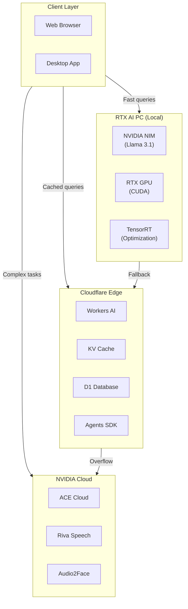

# Edge AI Deployment Guide: RTX AI PC & Cloudflare

## Overview

This guide covers deployment strategies for running AI workloads at the edge, utilizing both NVIDIA RTX AI PCs for local inference and Cloudflare's global network for distributed edge computing.

## Table of Contents

1. [Deployment Architecture](#deployment-architecture)
2. [RTX AI PC Setup](#rtx-ai-pc-setup)
3. [Local NIM Deployment](#local-nim-deployment)
4. [Cloudflare Workers AI](#cloudflare-workers-ai)
5. [Cloudflare Agents SDK](#cloudflare-agents-sdk)
6. [Hybrid Local/Cloud Strategy](#hybrid-localcloud-strategy)
7. [Monitoring & Analytics](#monitoring--analytics)
8. [Cost Optimization](#cost-optimization)
9. [Troubleshooting](#troubleshooting)

---

## Deployment Architecture

### High-Level Architecture



### Deployment Decision Matrix

| Scenario | Primary | Fallback | Latency | Cost |
|----------|---------|----------|---------|------|
| Quick explanations (<100 tokens) | RTX Local | CF Workers | <50ms | $0 |
| Study guide generation | CF Workers | NVIDIA Cloud | <2s | Low |
| Real-time avatar animation | RTX Local | ACE Cloud | <100ms | Low |
| Voice conversation | RTX Local | Riva Cloud | <300ms | Medium |
| Multi-modal queries | NVIDIA Cloud | - | <1s | High |

---

## RTX AI PC Setup

### Hardware Requirements

| Component | Minimum | Recommended |
|-----------|---------|-------------|
| GPU | RTX 3060 (12GB) | RTX 4090 (24GB) |
| RAM | 16GB | 32GB+ |
| Storage | 50GB SSD | 100GB NVMe |
| OS | Windows 11 / Ubuntu 22.04 | Windows 11 / Ubuntu 22.04 |
| CUDA | 11.8 | 12.4 |

### Software Installation

#### 1. NVIDIA Drivers & CUDA

```bash
# Ubuntu: Install NVIDIA drivers
sudo apt update
sudo apt install nvidia-driver-535

# Install CUDA toolkit
wget https://developer.download.nvidia.com/compute/cuda/repos/ubuntu2204/x86_64/cuda-keyring_1.1-1_all.deb
sudo dpkg -i cuda-keyring_1.1-1_all.deb
sudo apt update
sudo apt install cuda-toolkit-12-4

# Windows: Download from NVIDIA
# https://www.nvidia.com/Download/index.aspx
```

#### 2. Docker with NVIDIA Support

```bash
# Install Docker
curl -fsSL https://get.docker.com -o get-docker.sh
sudo sh get-docker.sh

# Install NVIDIA Container Toolkit
distribution=$(. /etc/os-release;echo $ID$VERSION_ID)
curl -s -L https://nvidia.github.io/nvidia-docker/gpgkey | sudo apt-key add -
curl -s -L https://nvidia.github.io/nvidia-docker/$distribution/nvidia-docker.list | \
  sudo tee /etc/apt/sources.list.d/nvidia-docker.list

sudo apt update
sudo apt install -y nvidia-container-toolkit
sudo nvidia-ctk runtime configure --runtime=docker
sudo systemctl restart docker

# Verify
docker run --rm --gpus all nvidia/cuda:12.4.0-base-ubuntu22.04 nvidia-smi
```

#### 3. Verify RTX Capabilities

```bash
# Check GPU info
nvidia-smi

# Check CUDA capabilities
nvidia-smi --query-gpu=compute_cap --format=csv

# Check TensorRT support (needed for optimization)
cat > check_tensorrt.py << 'EOF'
import torch
print(f"CUDA Available: {torch.cuda.is_available()}")
print(f"CUDA Version: {torch.version.cuda}")
print(f"GPU Name: {torch.cuda.get_device_name(0)}")
print(f"TensorRT Available: {torch.cuda.is_available()}")
EOF

python3 check_tensorrt.py
```

### TypeScript: RTX Detection

```typescript
// src/modules/rtx-detector.ts
export interface RTXCapabilities {
  available: boolean;
  gpuName?: string;
  vram?: number;
  cudaVersion?: string;
  tensorRT?: boolean;
  supportedModels: string[];
}

export class RTXDetector {
  async detect(): Promise<RTXCapabilities> {
    // Try WebGPU first (browser-based detection)
    const webgpu = await this.detectWebGPU();

    if (webgpu.available) {
      return webgpu;
    }

    // Fallback: check via local service
    return await this.detectLocalService();
  }

  private async detectWebGPU(): Promise<RTXCapabilities> {
    if (!navigator.gpu) {
      return { available: false, supportedModels: [] };
    }

    const adapter = await navigator.gpu.requestAdapter();
    if (!adapter) {
      return { available: false, supportedModels: [] };
    }

    const info = await adapter.requestAdapterInfo();

    // Check for NVIDIA RTX GPU
    const isNVIDIA = info.vendor.toLowerCase().includes('nvidia');
    const isRTX = info.description.includes('RTX') || info.description.includes('GeForce');

    if (!isNVIDIA || !isRTX) {
      return { available: false, supportedModels: [] };
    }

    // Estimate VRAM from description
    const vramMatch = info.description.match(/(\d+)GB/);
    const vram = vramMatch ? parseInt(vramMatch[1]) : 8;

    // Determine supported models based on VRAM
    const supportedModels = this.getModelsForVRAM(vram);

    return {
      available: true,
      gpuName: info.description,
      vram,
      supportedModels,
    };
  }

  private async detectLocalService(): Promise<RTXCapabilities> {
    try {
      // Check if local NIM service is running
      const response = await fetch('http://localhost:8000/health', {
        signal: AbortSignal.timeout(1000),
      });

      if (response.ok) {
        const data = await response.json();
        return {
          available: true,
          gpuName: data.gpu_name,
          vram: data.vram_total,
          cudaVersion: data.cuda_version,
          tensorRT: data.tensorrt_available,
          supportedModels: data.models || [],
        };
      }
    } catch {
      // Local service not available
    }

    return { available: false, supportedModels: [] };
  }

  private getModelsForVRAM(vram: number): string[] {
    const models: string[] = [];

    // Models that fit in available VRAM (with overhead)
    if (vram >= 8) {
      models.push('llama-3.1-8b-instruct', 'mistral-7b-instruct');
    }
    if (vram >= 12) {
      models.push('llama-3.1-70b-instruct-awq', 'mixtral-8x7b-instruct-awq');
    }
    if (vram >= 24) {
      models.push('llama-3.1-70b-instruct', 'mixtral-8x7b-instruct');
    }

    return models;
  }
}
```

---

## Local NIM Deployment

### Docker Compose Setup

```yaml
# docker-compose.nim.yml
version: '3.8'

services:
  # Llama 3.1 8B - General reasoning
  llama-8b:
    image: nvcr.io/nim/meta/llama-3.1-8b-instruct:latest
    container_name: nim-llama-8b
    ports:
      - "8000:8000"
    environment:
      - NGC_API_KEY=${NGC_API_KEY}
      - NIM_MODEL_SERVICE=meta/llama-3.1-8b-instruct
      - NIM_CACHE_PATH=/models/.cache
    volumes:
      - ./models:/models/.cache
    deploy:
      resources:
        reservations:
          devices:
            - driver: nvidia
              count: 1
              capabilities: [gpu]
    restart: unless-stopped
    healthcheck:
      test: ["CMD", "curl", "-f", "http://localhost:8000/health"]
      interval: 30s
      timeout: 10s
      retries: 3

  # Llama 3.1 70B (AWQ) - Advanced reasoning (12GB+ VRAM)
  llama-70b-awq:
    image: nvcr.io/nim/meta/llama-3.1-70b-instruct-awq:latest
    container_name: nim-llama-70b-awq
    ports:
      - "8001:8000"
    environment:
      - NGC_API_KEY=${NGC_API_KEY}
      - NIM_MODEL_SERVICE=meta/llama-3.1-70b-instruct-awq
      - NIM_CACHE_PATH=/models/.cache
    volumes:
      - ./models:/models/.cache
    deploy:
      resources:
        reservations:
          devices:
            - driver: nvidia
              count: 1
              capabilities: [gpu]
    restart: unless-stopped
    profiles:
      - advanced

  # NIM Router - Load balancing and model selection
  nim-router:
    image: nvcr.io/nim/nim-router:latest
    container_name: nim-router
    ports:
      - "8080:8080"
    environment:
      - NIM_BACKENDS=llama-8b:8000,llama-70b-awq:8001
      - LOG_LEVEL=info
    depends_on:
      - llama-8b
    restart: unless-stopped
```

### Starting Local NIM

```bash
# Set NGC API key
export NGC_API_KEY="your-ngc-api-key"

# Start base model (8B)
docker-compose -f docker-compose.nim.yml up -d llama-8b

# Start with larger model (if VRAM available)
docker-compose -f docker-compose.nim.yml --profile advanced up -d

# Check status
docker-compose -f docker-compose.nim.yml ps

# View logs
docker-compose -f docker-compose.nim.yml logs -f

# Stop
docker-compose -f docker-compose.nim.yml down
```

### NIM Health Check

```typescript
// src/modules/nim-health.ts
export class NIMHealthChecker {
  private endpoints: string[];

  constructor(endpoints: string[]) {
    this.endpoints = endpoints;
  }

  async checkAll(): Promise<HealthStatus[]> {
    const checks = await Promise.allSettled(
      this.endpoints.map(endpoint => this.checkEndpoint(endpoint))
    );

    return checks.map((result, index) => ({
      endpoint: this.endpoints[index],
      status: result.status === 'fulfilled' ? 'healthy' : 'unhealthy',
      ...(result.status === 'fulfilled' ? result.value : { error: 'Connection failed' }),
    }));
  }

  private async checkEndpoint(endpoint: string): Promise<NIMStatus> {
    const response = await fetch(`${endpoint}/health`, {
      signal: AbortSignal.timeout(2000),
    });

    if (!response.ok) {
      throw new Error(`HTTP ${response.status}`);
    }

    const data = await response.json();

    return {
      model: data.model,
      gpu: data.gpu,
      vramUsed: data.vram_used,
      vramTotal: data.vram_total,
      requestsPending: data.requests_pending,
    };
  }

  async getBestEndpoint(): Promise<string | null> {
    const statuses = await this.checkAll();
    const healthy = statuses.filter(s => s.status === 'healthy');

    if (healthy.length === 0) {
      return null;
    }

    // Select endpoint with least pending requests
    return healthy.reduce((best, current) =>
      (current.requestsPending || 0) < (best.requestsPending || 0)
        ? current
        : best
    ).endpoint;
  }
}

interface HealthStatus {
  endpoint: string;
  status: 'healthy' | 'unhealthy';
  error?: string;
  model?: string;
  gpu?: string;
  vramUsed?: number;
  vramTotal?: number;
  requestsPending?: number;
}

interface NIMStatus {
  model: string;
  gpu: string;
  vramUsed: number;
  vramTotal: number;
  requestsPending: number;
}
```

---

## Cloudflare Workers AI

### Setup

```bash
# Install Wrangler CLI
npm install -g wrangler

# Login to Cloudflare
wrangler login

# Create a new worker
wrangler init studylog-ai-worker

# Add AI binding (in wrangler.toml)
# [ai]
# binding = "AI"
```

### wrangler.toml Configuration

```toml
name = "studylog-ai-worker"
main = "src/index.ts"
compatibility_date = "2024-01-01"

# AI binding
[ai]
binding = "AI"

# KV bindings
[[kv_namespaces]]
binding = "CACHE"
id = "your-kv-namespace-id"

# D1 database
[[d1_databases]]
binding = "DB"
database_name = "studylog-db"
database_id = "your-database-id"

# Environment variables
[vars]
ENVIRONMENT = "production"
LOG_LEVEL = "info"

# Staging environment
[env.staging]
name = "studylog-ai-worker-staging"
vars = { ENVIRONMENT = "staging" }

# Production environment
[env.production]
name = "studylog-ai-worker-production"
routes = [
  { pattern = "ai.studylog.ai/*", zone_name = "studylog.ai" }
]
```

### Basic Workers AI Implementation

```typescript
// src/index.ts
export interface Env {
  AI: Ai;
  CACHE: KVNamespace;
  DB: D1Database;
}

export default {
  async fetch(request: Request, env: Env): Promise<Response> {
    const url = new URL(request.url);
    const path = url.pathname;

    // Handle CORS
    if (request.method === 'OPTIONS') {
      return handleCORS();
    }

    // Route requests
    if (path === '/chat') {
      return handleChat(request, env);
    }

    if (path === '/embeddings') {
      return handleEmbeddings(request, env);
    }

    if (path === '/health') {
      return Response.json({ status: 'ok', timestamp: Date.now() });
    }

    return new Response('Not found', { status: 404 });
  },
};

async function handleChat(request: Request, env: Env): Promise<Response> {
  try {
    const { messages, model = '@cf/meta/llama-3.1-8b-instruct' } = await request.json();

    // Check cache
    const cacheKey = `chat:${model}:${JSON.stringify(messages)}`;
    const cached = await env.CACHE.get(cacheKey, 'json');
    if (cached) {
      return Response.json(cached);
    }

    // Generate response
    const response = await env.AI.run(model, { messages });

    // Cache for 1 hour
    await env.CACHE.put(cacheKey, JSON.stringify(response), {
      expirationTtl: 3600,
    });

    return Response.json(response);
  } catch (error) {
    return Response.json(
      { error: (error as Error).message },
      { status: 500 }
    );
  }
}

async function handleEmbeddings(request: Request, env: Env): Promise<Response> {
  try {
    const { text } = await request.json();

    const response = await env.AI.run('@cf/baai/bge-base-en-v1.5', {
      text: [text],
    });

    return Response.json(response);
  } catch (error) {
    return Response.json(
      { error: (error as Error).message },
      { status: 500 }
    );
  }
}

function handleCORS(): Response {
  return new Response(null, {
    headers: {
      'Access-Control-Allow-Origin': '*',
      'Access-Control-Allow-Methods': 'GET, POST, OPTIONS',
      'Access-Control-Allow-Headers': 'Content-Type, Authorization',
    },
  });
}
```

---

## Cloudflare Agents SDK

### Shielding Setup

```typescript
// src/modules/cloudflare-agent.ts
import { Agent, Shield, Tool } from '@cloudflare/agents-sdk';

export interface Env {
  AI: Ai;
  AGENT_STATE: KVNamespace;
}

export class StudyLogAgent {
  private agent: Agent;
  private shield: Shield;

  constructor(env: Env, config: AgentConfig) {
    // Create shield for educational content
    this.shield = new Shield({
      rules: [
        {
          name: 'no-harmful-content',
          pattern: 'violence|harm|illegal',
          action: 'block',
        },
        {
          name: 'age-appropriate',
          context: 'educational',
          action: 'filter',
        },
      ],
    });

    // Create tools
    const tools: Tool[] = [
      {
        name: 'get_user_progress',
        description: 'Get student learning progress',
        parameters: {
          studentId: 'string',
        },
        handler: async (params) => {
          return await env.AGENT_STATE.get(`progress:${params.studentId}`, 'json');
        },
      },
      {
        name: 'save_progress',
        description: 'Save student learning progress',
        parameters: {
          studentId: 'string',
          progress: 'object',
        },
        handler: async (params) => {
          await env.AGENT_STATE.put(
            `progress:${params.studentId}`,
            JSON.stringify(params.progress),
            { expirationTtl: 604800 } // 7 days
          );
          return { success: true };
        },
      },
    ];

    // Create agent
    this.agent = new Agent({
      model: '@cf/meta/llama-3.1-8b-instruct',
      systemPrompt: this.buildPrompt(config),
      tools,
      shield: this.shield,
      stateStorage: env.AGENT_STATE,
    });
  }

  async chat(message: string, context: ChatContext): Promise<string> {
    const response = await this.agent.chat(message, context);

    // Shield the response
    const shielded = await this.shield.check(response);

    if (!shielded.passed) {
      return 'I cannot provide that information. Let me help you with something else.';
    }

    return shielded.content;
  }

  private buildPrompt(config: AgentConfig): string {
    return `You are a ${config.subject} tutor for ${config.grade} grade students.

Your role is to:
- Explain concepts clearly and incrementally
- Ask questions to check understanding
- Provide examples and analogies
- Encourage curiosity and critical thinking
- Adapt your explanations based on student responses

Always be patient, encouraging, and supportive of learning.`;
  }
}

interface AgentConfig {
  subject: string;
  grade: string;
}

interface ChatContext {
  studentId: string;
  currentTopic?: string;
  learningGoals?: string[];
}
```

---

## Hybrid Local/Cloud Strategy

### Smart Routing

```typescript
// src/modules/hybrid-router.ts
export class HybridAIRouter {
  private localNIM: NIMClient | null = null;
  private cloudflare: CloudflareClient;
  private nvidia: NVIDIAClient | null = null;

  constructor(config: HybridConfig) {
    this.cloudflare = new CloudflareClient(config.cloudflare);

    // Initialize local NIM if available
    if (config.localNIM) {
      this.localNIM = new NIMClient(config.localNIM);
    }

    // Initialize NVIDIA cloud if API key provided
    if (config.nvidia) {
      this.nvidia = new NVIDIAClient(config.nvidia);
    }
  }

  async route(request: AIRequest): Promise<AIResponse> {
    // Determine routing based on request characteristics
    const strategy = this.selectStrategy(request);

    switch (strategy) {
      case 'local':
        return await this.routeLocal(request);
      case 'cloudflare':
        return await this.routeCloudflare(request);
      case 'nvidia':
        return await this.routeNVIDIA(request);
      default:
        return await this.routeWithFallback(request);
    }
  }

  private selectStrategy(request: AIRequest): RoutingStrategy {
    // Use local for small, quick requests
    if (
      this.localNIM &&
      request.estimatedTokens < 100 &&
      request.priority === 'speed'
    ) {
      return 'local';
    }

    // Use Cloudflare for cacheable content
    if (request.cacheable) {
      return 'cloudflare';
    }

    // Use NVIDIA for complex reasoning
    if (request.complexity === 'high' || request.estimatedTokens > 4000) {
      return 'nvidia';
    }

    // Default to Cloudflare
    return 'cloudflare';
  }

  private async routeLocal(request: AIRequest): Promise<AIResponse> {
    try {
      return await this.localNIM!.chat(request.messages, {
        temperature: request.temperature,
        maxTokens: request.maxTokens,
      });
    } catch (error) {
      console.warn('Local NIM failed, falling back to cloudflare:', error);
      return await this.routeCloudflare(request);
    }
  }

  private async routeCloudflare(request: AIRequest): Promise<AIResponse> {
    return await this.cloudflare.chat(request.messages, {
      model: request.model || '@cf/meta/llama-3.1-8b-instruct',
      temperature: request.temperature,
      maxTokens: request.maxTokens,
    });
  }

  private async routeNVIDIA(request: AIRequest): Promise<AIResponse> {
    if (!this.nvidia) {
      return await this.routeCloudflare(request);
    }

    try {
      return await this.nvidia.chat(request.messages, {
        model: request.model || 'meta/llama-3.1-70b-instruct',
        temperature: request.temperature,
        maxTokens: request.maxTokens,
      });
    } catch (error) {
      console.warn('NVIDIA cloud failed, falling back to cloudflare:', error);
      return await this.routeCloudflare(request);
    }
  }

  private async routeWithFallback(request: AIRequest): Promise<AIResponse> {
    const strategies: RoutingStrategy[] = ['local', 'cloudflare', 'nvidia'];

    for (const strategy of strategies) {
      try {
        switch (strategy) {
          case 'local':
            if (this.localNIM) return await this.routeLocal(request);
            break;
          case 'cloudflare':
            return await this.routeCloudflare(request);
          case 'nvidia':
            if (this.nvidia) return await this.routeNVIDIA(request);
            break;
        }
      } catch (error) {
        console.warn(`${strategy} failed, trying next`);
      }
    }

    throw new Error('All routing strategies failed');
  }
}

interface HybridConfig {
  localNIM?: { endpoint: string; model: string };
  cloudflare: { accountId: string; apiToken: string };
  nvidia?: { apiKey: string; endpoint: string };
}

interface AIRequest {
  messages: Array<{ role: string; content: string }>;
  estimatedTokens: number;
  priority: 'speed' | 'quality' | 'cost';
  cacheable: boolean;
  complexity: 'low' | 'medium' | 'high';
  model?: string;
  temperature?: number;
  maxTokens?: number;
}

interface AIResponse {
  content: string;
  model: string;
  tokensUsed: number;
  source: 'local' | 'cloudflare' | 'nvidia';
}

type RoutingStrategy = 'local' | 'cloudflare' | 'nvidia';
```

---

## Monitoring & Analytics

### Metrics Collection

```typescript
// src/modules/metrics.ts
export class AIMetrics {
  private metrics: Map<string, MetricData> = new Map();

  record(
    source: 'local' | 'cloudflare' | 'nvidia',
    operation: string,
    duration: number,
    tokens: number,
    success: boolean
  ): void {
    const key = `${source}:${operation}`;
    const existing = this.metrics.get(key) || {
      count: 0,
      totalDuration: 0,
      totalTokens: 0,
      errors: 0,
    };

    this.metrics.set(key, {
      count: existing.count + 1,
      totalDuration: existing.totalDuration + duration,
      totalTokens: existing.totalTokens + tokens,
      errors: existing.errors + (success ? 0 : 1),
      avgDuration: (existing.totalDuration + duration) / (existing.count + 1),
    });
  }

  getStats(): MetricsReport {
    const report: MetricsReport = {
      totalRequests: 0,
      totalTokens: 0,
      avgDuration: 0,
      bySource: {},
      errors: 0,
    };

    for (const [key, data] of this.metrics) {
      const [source] = key.split(':');

      report.totalRequests += data.count;
      report.totalTokens += data.totalTokens;
      report.errors += data.errors;

      if (!report.bySource[source]) {
        report.bySource[source] = {
          count: 0,
          tokens: 0,
          avgDuration: 0,
          errors: 0,
        };
      }

      report.bySource[source].count += data.count;
      report.bySource[source].tokens += data.totalTokens;
      report.bySource[source].errors += data.errors;
      report.bySource[source].avgDuration = data.avgDuration;
    }

    return report;
  }
}

interface MetricData {
  count: number;
  totalDuration: number;
  totalTokens: number;
  errors: number;
  avgDuration: number;
}

interface MetricsReport {
  totalRequests: number;
  totalTokens: number;
  avgDuration: number;
  bySource: Record<string, {
    count: number;
    tokens: number;
    avgDuration: number;
    errors: number;
  }>;
  errors: number;
}
```

---

## Cost Optimization

### Cost Comparison (Per 1M Tokens)

| Provider | Model | Input | Output | Notes |
|----------|-------|-------|--------|-------|
| RTX Local | Llama 3.1 8B | $0 | $0 | Hardware cost only |
| Cloudflare | Llama 3.1 8B | $0.07 | $0.15 | With Workers paid plan |
| NVIDIA NIM | Llama 3.1 8B | $0.10 | $0.20 | Self-hosted |
| NVIDIA NIM | Llama 3.1 70B | $0.50 | $1.00 | Cloud |

### Optimization Strategies

```typescript
// src/modules/cost-optimizer.ts
export class CostOptimizer {
  private budget: BudgetConfig;
  private spending: SpendingTracker;

  constructor(budget: BudgetConfig) {
    this.budget = budget;
    this.spending = new SpendingTracker();
  }

  async selectProvider(request: AIRequest): Promise<ProviderSelection> {
    const estimatedCost = this.estimateCost(request);

    // Check budget
    if (this.spending.current + estimatedCost > this.budget.maxDaily) {
      return {
        provider: 'local',
        reason: 'budget-limit',
      };
    }

    // Select based on cost-effectiveness
    if (request.priority === 'cost' && this.spending.current > this.budget.warningThreshold) {
      return {
        provider: 'cloudflare',
        reason: 'cost-optimization',
      };
    }

    // Use best available
    return {
      provider: 'nvidia',
      reason: 'quality-preference',
    };
  }

  private estimateCost(request: AIRequest): number {
    const baseRates: Record<string, { input: number; output: number }> = {
      local: { input: 0, output: 0 },
      cloudflare: { input: 0.07, output: 0.15 },
      nvidia: { input: 0.10, output: 0.20 },
    };

    const inputTokens = this.estimateInputTokens(request);
    const outputTokens = request.maxTokens || 1000;

    // Estimate for cheapest provider (cloudflare)
    return (
      (inputTokens / 1_000_000) * baseRates.cloudflare.input +
      (outputTokens / 1_000_000) * baseRates.cloudflare.output
    );
  }

  private estimateInputTokens(request: AIRequest): number {
    // Rough estimation: ~4 characters per token
    const totalChars = request.messages.reduce(
      (sum, m) => sum + m.content.length,
      0
    );
    return Math.ceil(totalChars / 4);
  }
}

interface BudgetConfig {
  maxDaily: number; // in dollars
  warningThreshold: number; // in dollars
}

interface SpendingTracker {
  current: number;
  resetTime: number;
}

interface ProviderSelection {
  provider: 'local' | 'cloudflare' | 'nvidia';
  reason: string;
}
```

---

## Troubleshooting

### Common Issues

#### Issue: Local NIM Not Responding

```bash
# Check if container is running
docker ps | grep nim

# Check logs
docker logs nim-llama-8b

# Restart container
docker restart nim-llama-8b

# Check GPU availability
nvidia-smi

# Verify CUDA
docker run --rm --gpus all nvidia/cuda:12.4.0-base-ubuntu22.04 nvidia-smi
```

#### Issue: Cloudflare Workers AI Errors

```typescript
// Add error handling and retry logic
async function safeCloudflareCall(
  env: Env,
  model: string,
  input: any,
  retries = 3
): Promise<any> {
  for (let i = 0; i < retries; i++) {
    try {
      return await env.AI.run(model, input);
    } catch (error) {
      if (i === retries - 1) throw error;

      // Exponential backoff
      await new Promise(resolve =>
        setTimeout(resolve, Math.pow(2, i) * 1000)
      );
    }
  }
}
```

#### Issue: High Memory Usage on RTX

```bash
# Check VRAM usage
nvidia-smi --query-gpu=memory.used,memory.total --format=csv

# Clear Docker cache
docker system prune -a

# Limit VRAM usage in Docker
docker run --gpus device=0 --shm-size=1g \
  -e NVIDIA_VISIBLE_DEVICES=0 \
  nvcr.io/nim/meta/llama-3.1-8b-instruct:latest
```

---

## Deployment Checklist

### RTX AI PC
- [ ] NVIDIA drivers installed (535+)
- [ ] CUDA toolkit installed (12.4+)
- [ ] Docker with NVIDIA runtime
- [ ] NGC API key configured
- [ ] NIM containers tested
- [ ] Health check endpoint accessible

### Cloudflare
- [ ] Wrangler CLI installed
- [ ] Account authenticated
- [ ] Worker created
- [ ] AI binding configured
- [ ] KV namespace created
- [ ] D1 database provisioned
- [ ] Custom domain configured (optional)

### Monitoring
- [ ] Metrics collection enabled
- [ ] Error tracking configured
- [ ] Budget alerts set
- [ ] Health check endpoints accessible
- [ ] Logging configured

---

## Related Documentation

- [Educational Stack Architecture](./EDUCATIONAL_STACK_ARCHITECTURE.md) - Overall system design
- [NVIDIA Integration Guide](./NVIDIA_INTEGRATION_GUIDE.md) - NVIDIA technologies
- [Manus Agents Guide](./MANUS_AGENTS_GUIDE.md) - Manus AI integration
- [Deployment Guide](./DEPLOYMENT.md) - Base deployment documentation

---

## External Resources

- [NVIDIA NGC Catalog](https://catalog.ngc.nvidia.com/) - Container registry
- [Cloudflare Workers AI](https://developers.cloudflare.com/workers-ai/) - Official docs
- [Cloudflare Agents SDK](https://developers.cloudflare.com/agents/) - Agent framework
- [Docker GPU Support](https://docs.nvidia.com/datacenter/cloud-native/) - NVIDIA containers

---

**Document Version:** 1.0
**Last Updated:** January 2026
**Maintained By:** SuperInstance.AI
