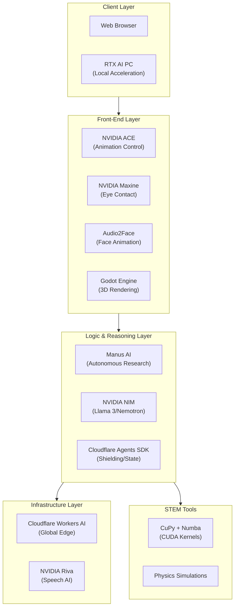
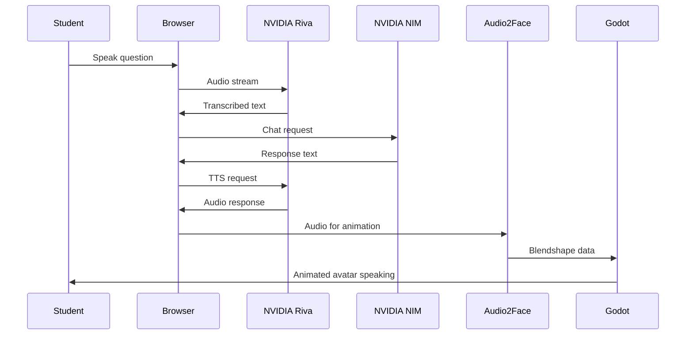
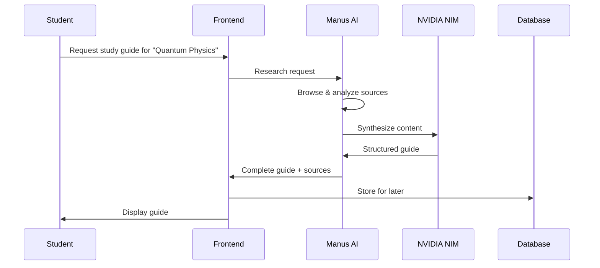
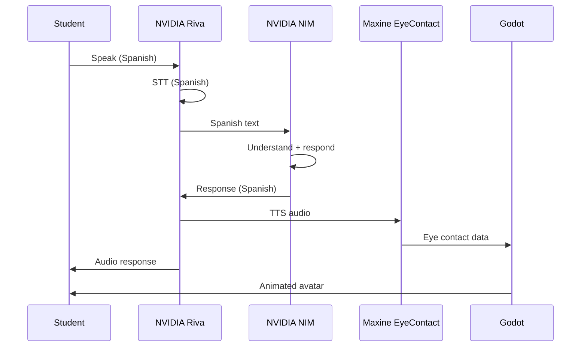

# Educational Software Stack Architecture

## Overview

This document outlines the comprehensive architecture for integrating NVIDIA Digital Human technologies, autonomous agent frameworks, and edge AI capabilities into the StudyLoG.AI educational platform. This stack enables creation of intelligent, conversational digital tutors that can see, hear, and interact with students in real-time.

## Table of Contents

1. [System Architecture](#system-architecture)
2. [Front-End Layer: Digital Human Interface](#front-end-layer-digital-human-interface)
3. [Logic & Reasoning Layer: Agent Orchestration](#logic--reasoning-layer-agent-orchestration)
4. [Infrastructure Layer: Edge AI](#infrastructure-layer-edge-ai)
5. [STEM Tools Layer](#stem-tools-layer)
6. [Data Flow Diagrams](#data-flow-diagrams)
7. [Security & Privacy](#security--privacy)
8. [Cost Optimization](#cost-optimization)

---

## System Architecture

### High-Level Overview



### Component Matrix

| Layer | Technology | Purpose | Latency Target |
|-------|-----------|---------|----------------|
| Front-End | NVIDIA ACE | Avatar animation control | <50ms |
| Front-End | NVIDIA Maxine | Eye contact, portrait mode | <100ms |
| Front-End | Audio2Face | Voice-driven facial animation | <30ms |
| Front-End | Godot Engine | 3D scene rendering | 60fps |
| Logic | Manus AI | Autonomous research tasks | Async |
| Logic | NVIDIA NIM | LLM reasoning microservices | <500ms |
| Logic | Cloudflare Agents SDK | Shielding, state management | <100ms |
| Infrastructure | Cloudflare Workers AI | Global edge inference | <200ms |
| Infrastructure | NVIDIA Riva | Speech recognition/translation | <300ms |
| STEM | CuPy/Numba | CUDA physics simulations | Real-time |

---

## Front-End Layer: Digital Human Interface

### NVIDIA ACE (Avatar Cloud Engine)

**Purpose:** Agent SDK for creating interactive, intelligent game characters and digital tutors.

**Key Features:**
- **Riva Speech** for natural conversation
- **Nemotron-3 LLM** for reasoning and response
- **Animation Graph** for blending expressions and gestures
- **Audio2Face** integration for lip-sync

**StudyLoG.AI Integration:**

```typescript
// Frontend ACE Integration
interface ACEAvatarConfig {
  characterId: string;
  voiceProfile: string;
  emotionModel: 'basic' | 'full';
  gesturesEnabled: boolean;
}

class StudyLogAvatar {
  private aceClient: ACEClient;
  private audio2Face: Audio2FaceStream;

  constructor(config: ACEAvatarConfig) {
    this.aceClient = new ACEClient({
      endpoint: config.characterId,
      animationGraph: 'tutor_graph.json',
    });
  }

  async setEmotion(emotion: 'excited' | 'thoughtful' | 'confused'): Promise<void> {
    await this.aceClient.sendAnimationTrigger({
      type: 'emotion',
      value: emotion,
      blendDuration: 0.3,
    });
  }

  async speak(text: string): Promise<void> {
    const audioStream = await this.synthesizeSpeech(text);
    await this.audio2Face.animateFromAudio(audioStream);
  }
}
```

### NVIDIA Maxine

**Purpose:** AI-enhanced video features for eye contact, portrait segmentation, and studio-quality voice.

**Key Features:**
- **Eye Contact** - Gaze correction for natural eye alignment
- **Live Portrait** - Background blur/replacement
- **Studio Voice** - Audio enhancement and noise removal

**StudyLoG.AI Integration:**

```typescript
// Maxine Integration for Digital Tutor
class MaxineTutorEnhancer {
  private maxineSDK: MaxineWebRTC;

  async enableEyeContact(videoElement: HTMLVideoElement): Promise<void> {
    await this.maxineSDK.initialize({
      features: ['eyeContact', 'portraitSegmentation'],
      gazeTarget: 'camera',
      smoothingFactor: 0.7,
    });

    this.maxineSDK.attachMediaElement(videoElement);
  }

  async setBackground(scene: 'classroom' | 'lab' | 'space'): Promise<void> {
    const backgroundImage = await this.loadBackground(scene);
    await this.maxineSDK.setBackground(backgroundImage);
  }

  async enhanceAudio(audioStream: MediaStream): Promise<MediaStream> {
    return await this.maxineSDK.applyStudioVoice(audioStream, {
      noiseSuppression: true,
      echoCancellation: true,
      autoGain: true,
    });
  }
}
```

### Audio2Face

**Purpose:** Real-time facial animation driven purely by audio input.

**Key Features:**
- **Lip-sync** - Phoneme-level accuracy
- **Expression blending** - Emotional tone from voice
- **WebSocket streaming** - Low-latency animation

**StudyLoG.AI Integration:**

```typescript
// Audio2Face WebSocket Integration
class Audio2FaceStreamer {
  private ws: WebSocket;
  private godotInterface: GodotBridge;

  async connect(serverUrl: string = 'wss://api.nvcf.nvidia.com/v2/a2f'): Promise<void> {
    this.ws = new WebSocket(serverUrl);

    this.ws.onopen = () => {
      this.ws.send(JSON.stringify({
        type: 'init',
        avatar: 'studylog_tutor',
        blendshapes: ['ARKit', 'Eyes'],
      }));
    };

    this.ws.onmessage = (event) => {
      const frame = JSON.parse(event.data);
      this.godotInterface.updateFacialBlendshapes(frame.blendshapes);
    };
  }

  async streamAudio(audioBuffer: ArrayBuffer): Promise<void> {
    this.ws.send(JSON.stringify({
      type: 'audio',
      data: Array.from(new Uint8Array(audioBuffer)),
      sampleRate: 16000,
    }));
  }

  async setMood(mood: 'neutral' | 'happy' | 'concerned'): Promise<void> {
    this.ws.send(JSON.stringify({
      type: 'mood',
      value: mood,
    }));
  }
}
```

### Godot Engine Integration

**Purpose:** 3D rendering and scene composition for digital tutor visualization.

**Godot Scene Structure:**

```
StudyLog_Tutor_Scene/
├── Tutor_Armature (Skeleton3D)
│   ├── Head (MeshInstance3D)
│   │   ├── Eyes (MeshInstance3D)
│   │   └── Mouth (MeshInstance3D)
│   ├── Body (MeshInstance3D)
│   └── Hands (MeshInstance3D)
├── AnimationTree (AnimationTree node)
│   ├── AnimationNodeBlendTree
│   │   ├── Audio2Face_Input (AnimationNodeBlendSpace1D)
│   │   ├── Gesture_Layer (AnimationNodeBlendTree)
│   │   └── Idle_State (AnimationNodeAnimation)
└── TheiaBridge (Node)
    └── WebSocket client for IDE communication
```

**GDScript Example:**

```gdscript
# TheiaBridge.gd - Communication between Godot and Theia
extends Node

signal tutor_response(text: String)
signal emotion_update(emotion: String)

var _ws: WebSocketPeer = WebSocketPeer.new()
var _blendshape_map: Dictionary = {}

func _ready() -> void:
    _connect_to_ide()

func _process(delta: float) -> void:
    _ws.poll()
    var state: WebSocketPeer.State = _ws.get_ready_state()
    if state == WebSocketPeer.STATE_OPEN:
        _process_messages()

func update_facial_blendshapes(blendshapes: Dictionary) -> void:
    """Apply Audio2Face blendshapes to avatar"""
    var skeleton: Skeleton3D = get_node("../Tutor_Armature")
    for shape_name: String in blendshapes:
        var bone_idx: int = skeleton.find_bone(shape_name)
        if bone_idx != -1:
            skeleton.set_bone_pose_rotation(
                bone_idx,
                Quaternion.from_euler(Vector3(
                    blendshapes[shape_name].x,
                    blendshapes[shape_name].y,
                    blendshapes[shape_name].z
                ))
            )

func set_tutor_emotion(emotion: String) -> void:
    """Trigger emotional animation"""
    var anim_tree: AnimationTree = get_node("../AnimationTree")
    var playback: AnimationNodeStateMachinePlayback = anim_tree.get("parameters/playback")
    playback.travel(emotion)
```

---

## Logic & Reasoning Layer: Agent Orchestration

### Manus AI

**Purpose:** Autonomous research agent for generating study guides, finding resources, and synthesizing educational content.

**Key Features:**
- **Autonomous browsing** - Research and content gathering
- **Study guide generation** - Multi-format output support
- **Source verification** - Citation and fact-checking
- **Multi-modal reasoning** - Text, image, and video analysis

**StudyLoG.AI Integration:**

```typescript
// Manus AI Agent Configuration
interface ManusAgentConfig {
  topic: string;
  depth: 'overview' | 'intermediate' | 'comprehensive';
  formats: ('markdown' | 'quiz' | 'flashcards' | 'video')[];
  maxSources: number;
  difficulty?: 'beginner' | 'intermediate' | 'advanced';
}

class ManusStudyGuideAgent {
  private apiEndpoint: string = 'https://api.manus.ai/v1';
  private apiKey: string;

  async generateStudyGuide(config: ManusAgentConfig): Promise<StudyGuide> {
    const response = await fetch(`${this.apiEndpoint}/research`, {
      method: 'POST',
      headers: {
        'Authorization': `Bearer ${this.apiKey}`,
        'Content-Type': 'application/json',
      },
      body: JSON.stringify({
        query: config.topic,
        depth: config.depth,
        output_formats: config.formats,
        max_sources: config.maxSources,
        difficulty: config.difficulty,
      }),
    });

    const result = await response.json();

    return {
      title: result.title,
      content: result.content,
      summary: result.summary,
      sources: result.sources.map(s => ({
        title: s.title,
        url: s.url,
        credibility: s.credibility_score,
      })),
      quizzes: result.quizzes || [],
      flashcards: result.flashcards || [],
      generatedAt: new Date(),
    };
  }

  async generateQuiz(topic: string, questionCount: number): Promise<Quiz> {
    const response = await fetch(`${this.apiEndpoint}/quiz/generate`, {
      method: 'POST',
      headers: {
        'Authorization': `Bearer ${this.apiKey}`,
        'Content-Type': 'application/json',
      },
      body: JSON.stringify({
        topic,
        question_count: questionCount,
        question_types: ['multiple-choice', 'true-false', 'short-answer'],
      }),
    });

    return await response.json();
  }

  async verifyAnswer(question: string, answer: string, context?: string): Promise<Feedback> {
    const response = await fetch(`${this.apiEndpoint}/quiz/verify`, {
      method: 'POST',
      headers: {
        'Authorization': `Bearer ${this.apiKey}`,
        'Content-Type': 'application/json',
      },
      body: JSON.stringify({ question, answer, context }),
    });

    return await response.json();
  }
}
```

### NVIDIA NIM (NVIDIA Inference Microservices)

**Purpose:** Containerized LLM inference for running Llama 3 and Nemotron models efficiently.

**Key Features:**
- **Llama 3.1/3.2** - Meta's open models (8B, 70B, 405B)
- **Nemotron-3** - NVIDIA's instruction-tuned models
- **Local deployment** - Privacy-preserving inference
- **Standard API** - OpenAI-compatible endpoints

**StudyLoG.AI Integration:**

```typescript
// NIM Integration for Local LLM Inference
class NIMClient {
  private baseUrl: string;
  private model: string;

  constructor(config: { endpoint: string; model: string }) {
    this.baseUrl = config.endpoint;
    this.model = config.model; // 'meta/llama-3.1-8b-instruct'
  }

  async chat(messages: ChatMessage[], options?: ChatOptions): Promise<ChatResponse> {
    const response = await fetch(`${this.baseUrl}/v1/chat/completions`, {
      method: 'POST',
      headers: { 'Content-Type': 'application/json' },
      body: JSON.stringify({
        model: this.model,
        messages: messages,
        temperature: options?.temperature ?? 0.7,
        max_tokens: options?.maxTokens ?? 2048,
        stream: options?.stream ?? false,
      }),
    });

    if (options?.stream) {
      return this.streamResponse(response.body);
    }

    return await response.json();
  }

  async *streamResponse(body: ReadableStream): AsyncGenerator<ChatChunk> {
    const reader = body.getReader();
    const decoder = new TextDecoder();

    while (true) {
      const { done, value } = await reader.read();
      if (done) break;

      const lines = decoder.decode(value).split('\n');
      for (const line of lines) {
        if (line.startsWith('data: ')) {
          const data = line.slice(6);
          if (data === '[DONE]') return;
          yield JSON.parse(data);
        }
      }
    }
  }

  async generateStudyNotes(
    topic: string,
    context: string
  ): Promise<StudyNotes> {
    const response = await this.chat([
      {
        role: 'system',
        content: 'You are an expert educator who creates clear, structured study notes.',
      },
      {
        role: 'user',
        content: `Create study notes for: ${topic}\n\nContext: ${context}`,
      },
    ]);

    return this.parseStudyNotes(response.choices[0].message.content);
  }

  private parseStudyNotes(content: string): StudyNotes {
    // Parse markdown-formatted notes into structured data
    const sections: StudySection[] = [];
    const lines = content.split('\n');
    let currentSection: StudySection | null = null;

    for (const line of lines) {
      if (line.startsWith('## ')) {
        if (currentSection) sections.push(currentSection);
        currentSection = { title: line.slice(3), keyPoints: [] };
      } else if (line.startsWith('- ') && currentSection) {
        currentSection.keyPoints.push(line.slice(2));
      }
    }

    if (currentSection) sections.push(currentSection);

    return { sections, summary: '', fullContent: content };
  }
}
```

### Cloudflare Agents SDK

**Purpose:** Shielding, state management, and safety for agent operations.

**Key Features:**
- **Shielding** - Guardrails for agent outputs
- **State management** - Persistent conversation context
- **Tool calling** - Safe function execution
- **Rate limiting** - Built-in protection

**StudyLoG.AI Integration:**

```typescript
// Cloudflare Agents SDK Integration
import { Agent, Shield, Tools } from '@cloudflare/agents-sdk';

interface TutorConfig {
  subject: string;
  difficulty: string;
  shieldLevel: 'strict' | 'moderate' | 'permissive';
}

class StudyLogTutorAgent {
  private agent: Agent;
  private shield: Shield;
  private tools: Tools;

  constructor(config: TutorConfig, env: Env) {
    // Initialize shield for educational content
    this.shield = new Shield({
      level: config.shieldLevel,
      rules: [
        'no-harmful-content',
        'age-appropriate',
        'educational-purpose',
        'cite-sources',
      ],
    });

    // Define available tools
    this.tools = new Tools(env, [
      {
        name: 'search_educational_resources',
        description: 'Search for educational materials',
        parameters: {
          topic: 'string',
          difficulty: 'string',
        },
        handler: async (params) => {
          return await this.searchResources(params.topic, params.difficulty);
        },
      },
      {
        name: 'generate_quiz',
        description: 'Create a quiz on the topic',
        parameters: {
          topic: 'string',
          questionCount: 'number',
        },
        handler: async (params) => {
          return await this.generateQuiz(params.topic, params.questionCount);
        },
      },
      {
        name: 'check_progress',
        description: 'Check student learning progress',
        parameters: {
          studentId: 'string',
        },
        handler: async (params) => {
          return await env.DB.prepare(
            'SELECT * FROM progress WHERE student_id = ?'
          ).bind(params.studentId).all();
        },
      },
    ]);

    // Initialize agent
    this.agent = new Agent({
      model: '@cf/meta/llama-3.1-8b-instruct',
      systemPrompt: this.buildSystemPrompt(config),
      shield: this.shield,
      tools: this.tools,
      stateStorage: env.AGENT_STATE,
    });
  }

  async chat(message: string, context: ChatContext): Promise<string> {
    const response = await this.agent.chat(message, {
      studentId: context.studentId,
      currentTopic: context.topic,
      learningGoals: context.goals,
    });

    // Shield the response
    const shielded = await this.shield.check(response);
    if (!shielded.passed) {
      return shielded.filteredContent || 'I cannot provide that information.';
    }

    return response;
  }

  private buildSystemPrompt(config: TutorConfig): string {
    return `You are a ${config.subject} tutor for ${config.difficulty} level students.

Your role is to:
1. Explain concepts clearly and incrementally
2. Ask questions to check understanding
3. Provide examples and analogies
4. Encourage curiosity and critical thinking
5. Adapt explanations based on student responses

Always be patient, encouraging, and supportive of learning.`;
  }
}
```

---

## Infrastructure Layer: Edge AI

### Cloudflare Workers AI

**Purpose:** Global edge deployment of AI models for low-latency inference.

**Key Models:**
- `@cf/meta/llama-3.1-8b-instruct` - General reasoning
- `@hf/nousresearch/hermes-2-pro-mistral` - Advanced reasoning
- `@cf/openai/whisper` - Speech-to-text

**StudyLoG.AI Integration:**

```typescript
// Workers AI Integration
export interface Env {
  AI: Ai;
  KV: KVNamespace;
  DB: D1Database;
}

export default {
  async fetch(request: Request, env: Env): Promise<Response> {
    const url = new URL(request.url);
    const path = url.pathname;

    if (path === '/chat') {
      return await handleChat(request, env);
    }

    if (path === '/tts') {
      return await handleTTS(request, env);
    }

    return new Response('Not found', { status: 404 });
  },
};

async function handleChat(request: Request, env: Env): Promise<Response> {
  const { messages } = await request.json();

  // Check KV cache first
  const cacheKey = `chat:${JSON.stringify(messages)}`;
  const cached = await env.KV.get(cacheKey);
  if (cached) {
    return Response.json(JSON.parse(cached));
  }

  const response = await env.AI.run('@cf/meta/llama-3.1-8b-instruct', {
    messages,
  });

  // Cache for 1 hour
  await env.KV.put(cacheKey, JSON.stringify(response), {
    expirationTtl: 3600,
  });

  return Response.json(response);
}

async function handleTTS(request: Request, env: Env): Promise<Response> {
  const { text, voice = 'emma' } = await request.json();

  const audio = await env.AI.run('@cf/coqui/xtts-v1', {
    text,
    voice,
  });

  return new Response(audio, {
    headers: {
      'Content-Type': 'audio/wav',
      'Cache-Control': 'public, max-age=86400',
    },
  });
}
```

### NVIDIA Riva

**Purpose:** Enterprise-grade speech AI for real-time transcription and translation.

**Key Features:**
- **Speech Recognition** - 26+ languages supported
- **Text-to-Speech** - Natural voice synthesis
- **Translation** - Real-time language translation
- **Punctuation & Capitalization** - Intelligent formatting

**StudyLoG.AI Integration:**

```typescript
// Riva Integration for Multilingual Support
interface RivaConfig {
  endpoint: string;
  apiKey: string;
  languageCode: string;
}

class RivaSpeechService {
  private config: RivaConfig;

  constructor(config: RivaConfig) {
    this.config = config;
  }

  async transcribe(audioBuffer: ArrayBuffer): Promise<TranscriptionResult> {
    const response = await fetch(`${this.config.endpoint}/v1/transcriptions`, {
      method: 'POST',
      headers: {
        'Authorization': `Bearer ${this.config.apiKey}`,
        'Content-Type': 'audio/wav',
      },
      body: audioBuffer,
    });

    const result = await response.json();

    return {
      text: result.text,
      confidence: result.confidence,
      words: result.words.map((w: any) => ({
        word: w.word,
        start: w.start_time,
        end: w.end_time,
        confidence: w.confidence,
      })),
      language: this.config.languageCode,
    };
  }

  async translate(
    text: string,
    targetLanguage: string
  ): Promise<TranslationResult> {
    const response = await fetch(`${this.config.endpoint}/v1/translate`, {
      method: 'POST',
      headers: {
        'Authorization': `Bearer ${this.config.apiKey}`,
        'Content-Type': 'application/json',
      },
      body: JSON.stringify({
        text,
        source_language: this.config.languageCode,
        target_language: targetLanguage,
      }),
    });

    return await response.json();
  }

  async synthesize(text: string, voice: string = 'english-us-female-1'): Promise<ArrayBuffer> {
    const response = await fetch(`${this.config.endpoint}/v1/synthesize`, {
      method: 'POST',
      headers: {
        'Authorization': `Bearer ${this.config.apiKey}`,
        'Content-Type': 'application/json',
      },
      body: JSON.stringify({
        text,
        voice,
        sample_rate: 22050,
      }),
    });

    return await response.arrayBuffer();
  }

  // Real-time streaming transcription
  async *streamTranscribe(audioStream: ReadableStream): AsyncGenerator<TranscriptionChunk> {
    // For WebSocket-based streaming
    const ws = new WebSocket(`${this.config.endpoint.replace('http', 'ws')}/v1/transcribe`);

    ws.onopen = () => {
      // Send audio chunks as they arrive
    };

    ws.onmessage = (event) => {
      const chunk = JSON.parse(event.data);
      // Yield partial results
    };
  }
}
```

---

## STEM Tools Layer

### CuPy & Numba

**Purpose:** CUDA-accelerated Python for physics simulations and scientific computing.

**CuPy Integration:**

```python
# GPU-accelerated physics simulation for StudyLoG.AI
import cupy as cp
from cupyx.scipy import signal
import numpy as np

class GPUPhysicsSimulation:
    """Run physics simulations on NVIDIA GPU for real-time visualization"""

    def __init__(self, particle_count: int = 10000):
        self.particle_count = particle_count
        # Initialize positions on GPU
        self.positions = cp.random.randn(particle_count, 3).astype(cp.float32)
        self.velocities = cp.zeros((particle_count, 3), dtype=cp.float32)
        self.masses = cp.ones(particle_count, dtype=cp.float32)

    def update_gravity(self, dt: float = 0.016):
        """Apply gravitational forces"""
        # Compute pairwise distances on GPU
        diff = self.positions[:, cp.newaxis, :] - self.positions[cp.newaxis, :, :]
        dist = cp.linalg.norm(diff, axis=2)

        # Avoid division by zero
        dist = cp.maximum(dist, 0.01)

        # Gravitational force (simplified)
        force_magnitude = 1.0 / (dist ** 2)
        forces = cp.sum(diff * force_magnitude[:, :, cp.newaxis], axis=1)

        # Update velocities
        self.velocities += forces * dt

    def update_positions(self, dt: float = 0.016):
        """Update particle positions"""
        self.positions += self.velocities * dt

    def get_positions_for_godot(self) -> bytes:
        """Export positions for Godot visualization"""
        # Convert to numpy then bytes for WebSocket transmission
        return cp.asnumpy(self.positions).tobytes()
```

**Numba JIT Compilation:**

```python
from numba import cuda, jit
import numpy as np

@cuda.jit
def nbody_kernel(positions, velocities, masses, dt):
    """GPU kernel for N-body simulation"""
    i = cuda.grid(1)
    if i >= positions.shape[0]:
        return

    fx, fy, fz = 0.0, 0.0, 0.0

    for j in range(positions.shape[0]):
        if i == j:
            continue

        dx = positions[j, 0] - positions[i, 0]
        dy = positions[j, 1] - positions[i, 1]
        dz = positions[j, 2] - positions[i, 2]

        dist_sq = dx*dx + dy*dy + dz*dz
        dist = cp.sqrt(dist_sq)

        if dist > 0.01:  # Softening
            f = masses[j] / (dist_sq * dist)
            fx += f * dx
            fy += f * dy
            fz += f * dz

    velocities[i, 0] += fx * dt
    velocities[i, 1] += fy * dt
    velocities[i, 2] += fz * dt

def run_simulation(positions, velocities, masses, dt=0.016, iterations=100):
    """Run N-body simulation on GPU"""
    # Copy to GPU
    d_pos = cuda.to_device(positions)
    d_vel = cuda.to_device(velocities)
    d_mass = cuda.to_device(masses)

    threads_per_block = 128
    blocks_per_grid = (positions.shape[0] + threads_per_block - 1) // threads_per_block

    for _ in range(iterations):
        nbody_kernel[blocks_per_grid, threads_per_block](
            d_pos, d_vel, d_mass, dt
        )

    # Copy back
    d_pos.copy_to_host(positions)
    d_vel.copy_to_host(velocities)
```

---

## Data Flow Diagrams

### Digital Tutor Conversation Flow



### Study Guide Generation Flow



### Real-Time Translation Flow



---

## Security & Privacy

### RTX AI PC: Privacy-Preserving Local AI

**Benefits:**
- All data stays on-device
- No internet connection required
- GPU-accelerated inference
- Lower latency than cloud

**Deployment:**

```typescript
// Local RTX PC detection and fallback
class LocalAIDetector {
  async detectRTXCapabilities(): Promise<RTXCapabilities> {
    const gpu = await navigator.gpu.requestAdapter();

    if (!gpu) {
      return { available: false };
    }

    const info = await gpu.requestAdapterInfo();

    // Check for NVIDIA RTX GPU
    const isNVIDIA = info.vendor.toLowerCase().includes('nvidia');
    const isRTX = info.description.includes('RTX');

    if (isNVIDIA && isRTX) {
      return {
        available: true,
        localModels: true,
        maxVRAM: await this.getVRAM(),
        supportsFP16: true,
      };
    }

    return { available: false };
  }

  async initializeLocalNIM(config: NIMConfig): Promise<NIMClient | null> {
    const caps = await this.detectRTXCapabilities();

    if (caps.available && caps.localModels) {
      // Connect to local NIM instance
      return new NIMClient({
        endpoint: 'http://localhost:8000',
        model: config.model,
      });
    }

    // Fallback to cloud
    return null;
  }
}
```

### Data Protection Measures

1. **Privacy by Design**
   - Default to local processing when available
   - Clear indicators when data leaves device
   - Consent dialogs for cloud processing

2. **Encryption**
   - TLS 1.3 for all cloud communications
   - End-to-end encryption for voice data

3. **Data Minimization**
   - Only send necessary data
   - Automatic deletion of temporary audio
   - No persistent voice recording

---

## Cost Optimization

### Hybrid Processing Strategy

```typescript
// Smart routing between local and cloud
class HybridAIRouter {
  async processRequest(request: AIRequest): Promise<AIResponse> {
    const local = await this.detectLocalCapabilities();

    // Use local RTX for:
    // - Quick responses (<100 tokens)
    // - Private conversations
    // - Offline mode
    if (local.available && request.tokens < 100) {
      return await this.processLocal(request);
    }

    // Use Cloudflare Workers for:
    // - Cacheable queries
    // - Geographic distribution
    if (await this.isCacheable(request)) {
      return await this.processCF(request);
    }

    // Use NVIDIA NIM cloud for:
    // - Complex reasoning
    // - Large context
    return await this.processNIM(request);
  }

  private async isCacheable(request: AIRequest): Promise<boolean> {
    // Educational content is often cacheable
    return request.type === 'explain-concept';
  }
}
```

### Cost Comparison (Per 1M Tokens)

| Provider | Model | Input Cost | Output Cost | Notes |
|----------|-------|------------|-------------|-------|
| Local RTX | Llama 3.1 8B | $0 | $0 | Hardware cost only |
| Cloudflare | Llama 3.1 8B | $0.07 | $0.15 | With Enterprise |
| NVIDIA NIM | Llama 3.1 8B | $0.10 | $0.20 | Self-hosted |
| OpenAI | GPT-4o-mini | $0.15 | $0.60 | Cloud only |

---

## Implementation Checklist

### Phase 1: Foundation
- [ ] Set up NVIDIA NGC account
- [ ] Configure Cloudflare Workers AI bindings
- [ ] Deploy local NIM instance on RTX PC
- [ ] Create Godot avatar scene with blendshapes

### Phase 2: Core Features
- [ ] Implement Audio2Face WebSocket client
- [ ] Integrate Maxine eye contact
- [ ] Set up Riva speech services
- [ ] Create Manus AI study guide generator

### Phase 3: Advanced Features
- [ ] Multi-language support with Riva translation
- [ ] Physics simulations with CuPy
- [ ] Agent orchestration with Cloudflare Agents SDK
- [ ] Hybrid local/cloud routing

### Phase 4: Production
- [ ] Load testing for concurrent users
- [ ] Cost monitoring and optimization
- [ ] Privacy compliance review
- [ ] User testing and feedback

---

## Related Documentation

- [NVIDIA Integration Guide](./NVIDIA_INTEGRATION_GUIDE.md) - Detailed NVIDIA setup
- [Manus Agents Guide](./MANUS_AGENTS_GUIDE.md) - Manus AI patterns
- [Edge AI Deployment](./EDGE_AI_DEPLOYMENT.md) - RTX PC + Cloudflare deployment
- [Architecture Overview](./ARCHITECTURE.md) - Base system architecture
- [Godot Integration](./GODOT_INTEGRATION.md) - Godot engine setup

---

**Document Version:** 1.0
**Last Updated:** January 2026
**Maintained By:** SuperInstance.AI
