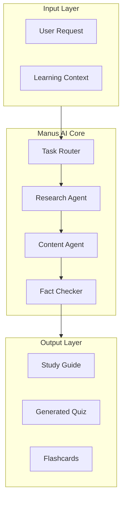

# Manus AI Agents Integration Guide

## Overview

This guide covers the integration of Manus AI autonomous agents into the StudyLoG.AI educational platform. Manus AI enables autonomous research, study guide generation, and intelligent content synthesis for personalized learning experiences.

## Table of Contents

1. [What is Manus AI?](#what-is-manus-ai)
2. [Agent Architecture](#agent-architecture)
3. [Core Agent Types](#core-agent-types)
4. [Setup & Configuration](#setup--configuration)
5. [Implementation Patterns](#implementation-patterns)
6. [Study Guide Generation](#study-guide-generation)
7. [Autonomous Research](#autonomous-research)
8. [Quiz & Assessment](#quiz--assessment)
9. [Best Practices](#best-practices)

---

## What is Manus AI?

Manus AI is an autonomous AI agent platform that can:
- **Browse the web** to gather information
- **Synthesize content** from multiple sources
- **Generate structured outputs** in various formats
- **Verify facts** and cite sources
- **Execute multi-step tasks** autonomously

### Key Benefits for StudyLoG.AI

| Feature | Educational Application |
|---------|------------------------|
| Web Research | Find latest resources on any topic |
| Source Citation | Teach proper research practices |
| Content Synthesis | Create comprehensive study guides |
| Multi-Format Output | Notes, quizzes, flashcards |
| Autonomous Operation | Free up teacher time |

---

## Agent Architecture

### Manus Agent Structure



### Agent Roles

| Agent | Responsibility | Tools Used |
|-------|---------------|------------|
| **Router** | Parse request, determine task type | Intent classification |
| **Researcher** | Browse web, find sources | Web search, scraping |
| **Synthesizer** | Create structured content | LLM, templates |
| **Validator** | Verify facts, check quality | Knowledge base, rules |

---

## Core Agent Types

### 1. Study Guide Agent

Creates comprehensive learning materials from topic descriptions.

**Capabilities:**
- Multi-format output (Markdown, PDF, HTML)
- Section organization with hierarchy
- Example generation
- Difficulty level adaptation
- Source citation

### 2. Research Agent

Autonomously researches topics and compiles findings.

**Capabilities:**
- Web search across multiple sources
- Academic paper search
- Video tutorial finding
- Source credibility assessment
- Citation formatting

### 3. Quiz Agent

Generates assessment questions for any topic.

**Capabilities:**
- Multiple choice questions
- True/false questions
- Short answer questions
- Difficulty calibration
- Explanation generation

### 4. Tutor Agent

Provides interactive tutoring sessions.

**Capabilities:**
- Conversational explanation
- Follow-up question generation
- Misconception detection
- Socratic method
- Progress tracking

---

## Setup & Configuration

### Prerequisites

```bash
# Install Manus SDK
npm install @manus-ai/sdk

# Or with Python
pip install manus-ai
```

### Environment Variables

```bash
# Manus AI Configuration
export MANUS_API_KEY="your-manus-api-key"
export MANUS_ENDPOINT="https://api.manus.ai/v1"

# Optional: Custom search engines
export MANUS_SEARCH_ENGINE="google" # or "bing", "duckduckgo"

# Rate limiting
export MANUS_MAX_CONCURRENT_REQUESTS="5"
export MANUS_REQUEST_TIMEOUT="30000"
```

### Client Initialization

```typescript
// src/modules/manus-client.ts
export interface ManusConfig {
  apiKey: string;
  endpoint?: string;
  maxConcurrent?: number;
  timeout?: number;
}

export class ManusClient {
  private config: ManusConfig;
  private queue: Map<string, Promise<any>>;

  constructor(config: ManusConfig) {
    this.config = {
      ...config,
      endpoint: config.endpoint || 'https://api.manus.ai/v1',
      timeout: config.timeout || 30000,
    };
    this.queue = new Map();
  }

  async research(query: string, options?: ResearchOptions): Promise<ResearchResult> {
    return this.enqueue('research', async () => {
      const response = await fetch(`${this.config.endpoint}/research`, {
        method: 'POST',
        headers: {
          'Authorization': `Bearer ${this.config.apiKey}`,
          'Content-Type': 'application/json',
        },
        body: JSON.stringify({
          query,
          max_sources: options?.maxSources || 10,
          source_types: options?.sourceTypes || ['web', 'academic'],
          depth: options?.depth || 'comprehensive',
        }),
        signal: AbortSignal.timeout(this.config.timeout!),
      });

      if (!response.ok) {
        throw new ManusError(`Research failed: ${response.statusText}`);
      }

      return await response.json();
    });
  }

  async generateStudyGuide(config: StudyGuideConfig): Promise<StudyGuide> {
    return this.enqueue('study-guide', async () => {
      const response = await fetch(`${this.config.endpoint}/study-guide`, {
        method: 'POST',
        headers: {
          'Authorization': `Bearer ${this.config.apiKey}`,
          'Content-Type': 'application/json',
        },
        body: JSON.stringify(config),
        signal: AbortSignal.timeout(this.config.timeout!),
      });

      if (!response.ok) {
        throw new ManusError(`Study guide generation failed: ${response.statusText}`);
      }

      return await response.json();
    });
  }

  async generateQuiz(config: QuizConfig): Promise<Quiz> {
    return this.enqueue('quiz', async () => {
      const response = await fetch(`${this.config.endpoint}/quiz`, {
        method: 'POST',
        headers: {
          'Authorization': `Bearer ${this.config.apiKey}`,
          'Content-Type': 'application/json',
        },
        body: JSON.stringify(config),
        signal: AbortSignal.timeout(this.config.timeout!),
      });

      if (!response.ok) {
        throw new ManusError(`Quiz generation failed: ${response.statusText}`);
      }

      return await response.json();
    });
  }

  private async enqueue<T>(key: string, fn: () => Promise<T>): Promise<T> {
    // Simple queue management for concurrent requests
    const queueKey = `${key}:${Date.now()}`;
    const promise = fn();
    this.queue.set(queueKey, promise);

    try {
      return await promise;
    } finally {
      this.queue.delete(queueKey);
    }
  }
}

// Error handling
class ManusError extends Error {
  constructor(message: string, public code?: string) {
    super(message);
    this.name = 'ManusError';
  }
}

// Type definitions
interface ResearchOptions {
  maxSources?: number;
  sourceTypes?: ('web' | 'academic' | 'video')[];
  depth?: 'quick' | 'standard' | 'comprehensive';
}

interface ResearchResult {
  query: string;
  sources: Array<{
    title: string;
    url: string;
    snippet: string;
    credibility: number;
    type: 'web' | 'academic' | 'video';
  }>;
  summary: string;
  keyPoints: string[];
}

interface StudyGuideConfig {
  topic: string;
  difficulty: 'beginner' | 'intermediate' | 'advanced';
  formats: ('markdown' | 'pdf' | 'html')[];
  includeQuiz?: boolean;
  includeFlashcards?: boolean;
  sections?: string[];
  language?: string;
}

interface QuizConfig {
  topic: string;
  questionCount: number;
  questionTypes: ('multiple-choice' | 'true-false' | 'short-answer')[];
  difficulty: 'easy' | 'medium' | 'hard';
}

interface StudyGuide {
  id: string;
  title: string;
  topic: string;
  content: {
    markdown?: string;
    html?: string;
    pdf?: string; // base64 or URL
  };
  sections: Array<{
    title: string;
    content: string;
    keyPoints: string[];
  }>;
  quiz?: Quiz;
  flashcards?: Array<{
    front: string;
    back: string;
  }>;
  sources: string[];
  metadata: {
    difficulty: string;
    language: string;
    generatedAt: string;
  };
}

interface Quiz {
  id: string;
  title: string;
  questions: Array<{
    id: string;
    type: string;
    question: string;
    options?: string[];
    correctAnswer: string | number;
    explanation: string;
    difficulty: string;
  }>;
}
```

---

## Implementation Patterns

### Pattern 1: Study Guide Service

```typescript
// src/modules/study-guide-service.ts
import { ManusClient, StudyGuideConfig } from './manus-client';

export class StudyGuideService {
  private manus: ManusClient;
  private cache: Map<string, StudyGuide>;

  constructor(apiKey: string) {
    this.manus = new ManusClient({ apiKey });
    this.cache = new Map();
  }

  async generateGuide(config: StudyGuideConfig): Promise<StudyGuide> {
    // Check cache first
    const cacheKey = this.getCacheKey(config);
    const cached = this.cache.get(cacheKey);
    if (cached) {
      return cached;
    }

    // Generate new guide
    const guide = await this.manus.generateStudyGuide({
      ...config,
      includeQuiz: true,
      includeFlashcards: true,
    });

    // Cache the result
    this.cache.set(cacheKey, guide);

    return guide;
  }

  async generateForCurriculum(curriculum: Curriculum): Promise<StudyGuide[]> {
    const guides: StudyGuide[] = [];

    for (const module of curriculum.modules) {
      const guide = await this.generateGuide({
        topic: module.topic,
        difficulty: curriculum.difficulty,
        formats: ['markdown', 'html'],
        sections: module.learningObjectives,
      });

      guides.push(guide);
    }

    return guides;
  }

  async personalizeGuide(
    guideId: string,
    studentProfile: StudentProfile
  ): Promise<StudyGuide> {
    // Fetch original guide
    const guide = await this.fetchGuide(guideId);

    // Personalize based on learning style
    const personalized = await this.manus.generateStudyGuide({
      topic: guide.topic,
      difficulty: this.mapDifficulty(studentProfile.level),
      formats: [studentProfile.preferredFormat],
      learningStyle: studentProfile.learningStyle,
      interests: studentProfile.interests,
    } as any);

    return personalized;
  }

  private getCacheKey(config: StudyGuideConfig): string {
    return `${config.topic}:${config.difficulty}:${config.language || 'en'}`;
  }

  private mapDifficulty(level: number): 'beginner' | 'intermediate' | 'advanced' {
    if (level <= 3) return 'beginner';
    if (level <= 7) return 'intermediate';
    return 'advanced';
  }

  private async fetchGuide(id: string): Promise<StudyGuide> {
    // Implementation for fetching stored guide
    throw new Error('Not implemented');
  }
}

interface Curriculum {
  title: string;
  difficulty: 'beginner' | 'intermediate' | 'advanced';
  modules: Array<{
    topic: string;
    learningObjectives: string[];
  }>;
}

interface StudentProfile {
  level: number; // 1-10
  preferredFormat: 'markdown' | 'pdf' | 'html';
  learningStyle: 'visual' | 'auditory' | 'kinesthetic' | 'reading';
  interests: string[];
}
```

### Pattern 2: Autonomous Research Agent

```typescript
// src/modules/research-agent.ts
import { ManusClient, ResearchOptions } from './manus-client';

export class ResearchAgent {
  private manus: ManusClient;

  constructor(apiKey: string) {
    this.manus = new ManusClient({ apiKey });
  }

  async deepResearch(topic: string, depth: number = 3): Promise<ResearchReport> {
    const layers: ResearchLayer[] = [];

    // Layer 1: Broad overview
    layers.push(await this.researchLayer(topic, 'overview'));

    // Layer 2-N: Dive deeper into subtopics
    for (let i = 1; i < depth; i++) {
      const subtopics = this.extractSubtopics(layers[i - 1]);
      const layerPromises = subtopics.map(st =>
        this.researchLayer(st, 'detailed')
      );
      layers.push(...await Promise.all(layerPromises));
    }

    // Synthesize final report
    return this.synthesizeReport(topic, layers);
  }

  async findLearningResources(topic: string, options: ResourceOptions): Promise<LearningResource[]> {
    const research = await this.manus.research(topic, {
      maxSources: options.maxResults || 20,
      sourceTypes: ['web', 'video', 'academic'],
      depth: 'standard',
    });

    // Categorize and filter results
    return research.sources
      .filter(s => s.credibility >= options.minCredibility)
      .map(s => this.toLearningResource(s))
      .filter(r => r !== null) as LearningResource[];
  }

  async verifyExplanation(
    topic: string,
    explanation: string
  ): Promise<VerificationResult> {
    // Research the topic
    const research = await this.manus.research(topic, {
      maxSources: 5,
      sourceTypes: ['web', 'academic'],
      depth: 'quick',
    });

    // Check for key concepts in the explanation
    const keyConcepts = this.extractKeyConcepts(research);
    const mentionedConcepts = keyConcepts.filter(c =>
      explanation.toLowerCase().includes(c.toLowerCase())
    );

    const accuracy = mentionedConcepts.length / keyConcepts.length;

    return {
      accurate: accuracy >= 0.7,
      confidence: accuracy,
      missingConcepts: keyConcepts.filter(c =>
        !explanation.toLowerCase().includes(c.toLowerCase())
      ),
      suggestions: accuracy < 1 ? this.generateSuggestions(keyConcepts, explanation) : [],
    };
  }

  private async researchLayer(topic: string, detail: string): Promise<ResearchLayer> {
    const result = await this.manus.research(
      `${topic} ${detail} explanation`,
      { maxSources: 10, sourceTypes: ['web', 'academic'], depth: 'standard' }
    );

    return {
      topic,
      detail,
      sources: result.sources,
      summary: result.summary,
      keyPoints: result.keyPoints,
    };
  }

  private extractSubtopics(layer: ResearchLayer): string[] {
    // Extract subtopics from research results
    const subtopics: Set<string> = new Set();

    for (const source of layer.sources) {
      // Simple heuristic: extract phrases that look like topics
      const matches = source.title.match(/\b([A-Z][a-z]+(?:\s+[A-Z][a-z]+)*)\b/g);
      if (matches) {
        matches.forEach(m => subtopics.add(m));
      }
    }

    return Array.from(subtopics).slice(0, 5);
  }

  private synthesizeReport(topic: string, layers: ResearchLayer[]): ResearchReport {
    return {
      topic,
      generatedAt: new Date().toISOString(),
      layers,
      summary: layers.map(l => l.summary).join('\n\n'),
      sources: layers.flatMap(l => l.sources),
    };
  }

  private extractKeyConcepts(research: any): string[] {
    return research.keyPoints || [];
  }

  private generateSuggestions(concepts: string[], explanation: string): string[] {
    return concepts.filter(c =>
      !explanation.toLowerCase().includes(c.toLowerCase())
    ).map(c => `Consider mentioning: ${c}`);
  }

  private toLearningResource(source: any): LearningResource | null {
    // Determine resource type
    const type = this.detectResourceType(source);

    return {
      id: this.generateId(),
      title: source.title,
      url: source.url,
      type,
      credibility: source.credibility,
      description: source.snippet,
    };
  }

  private detectResourceType(source: any): 'video' | 'article' | 'academic' | 'interactive' {
    if (source.url.includes('youtube.com') || source.url.includes('youtu.be')) {
      return 'video';
    }
    if (source.url.includes('.edu') || source.url.includes('arxiv.org')) {
      return 'academic';
    }
    if (source.url.includes('khanacademy.org') || source.url.includes('phet.colorado.edu')) {
      return 'interactive';
    }
    return 'article';
  }

  private generateId(): string {
    return Math.random().toString(36).substring(2, 15);
  }
}

interface ResearchOptions {
  maxResults?: number;
  minCredibility?: number;
}

interface ResourceOptions extends ResearchOptions {
  types?: ('video' | 'article' | 'academic' | 'interactive')[];
}

interface ResearchLayer {
  topic: string;
  detail: string;
  sources: any[];
  summary: string;
  keyPoints: string[];
}

interface ResearchReport {
  topic: string;
  generatedAt: string;
  layers: ResearchLayer[];
  summary: string;
  sources: any[];
}

interface VerificationResult {
  accurate: boolean;
  confidence: number;
  missingConcepts: string[];
  suggestions: string[];
}

interface LearningResource {
  id: string;
  title: string;
  url: string;
  type: 'video' | 'article' | 'academic' | 'interactive';
  credibility: number;
  description: string;
}
```

### Pattern 3: Cloudflare Worker Integration

```typescript
// workers/manus-agent/src/index.ts
import { ManusClient } from '@manus-ai/sdk';

export interface Env {
  MANUS_API_KEY: string;
  KV: KVNamespace;
  DB: D1Database;
}

export default {
  async fetch(request: Request, env: Env): Promise<Response> {
    const url = new URL(request.url);
    const path = url.pathname;

    // CORS headers
    const corsHeaders = {
      'Access-Control-Allow-Origin': '*',
      'Access-Control-Allow-Methods': 'GET, POST, OPTIONS',
      'Access-Control-Allow-Headers': 'Content-Type, Authorization',
    };

    if (request.method === 'OPTIONS') {
      return new Response(null, { headers: corsHeaders });
    }

    if (path === '/study-guide' && request.method === 'POST') {
      return handleStudyGuide(request, env, corsHeaders);
    }

    if (path === '/research' && request.method === 'POST') {
      return handleResearch(request, env, corsHeaders);
    }

    if (path === '/quiz' && request.method === 'POST') {
      return handleQuiz(request, env, corsHeaders);
    }

    return new Response('Not found', { status: 404, headers: corsHeaders });
  },
};

async function handleStudyGuide(
  request: Request,
  env: Env,
  headers: HeadersInit
): Promise<Response> {
  try {
    const config = await request.json();
    const manus = new ManusClient({ apiKey: env.MANUS_API_KEY });

    // Check cache first
    const cacheKey = `study-guide:${JSON.stringify(config)}`;
    const cached = await env.KV.get(cacheKey, 'json');
    if (cached) {
      return Response.json(cached, { headers });
    }

    // Generate new guide
    const guide = await manus.generateStudyGuide(config);

    // Cache for 24 hours
    await env.KV.put(cacheKey, JSON.stringify(guide), {
      expirationTtl: 86400,
    });

    // Store in D1 for persistence
    await env.DB.prepare(
      'INSERT INTO study_guides (id, topic, content, created_at) VALUES (?, ?, ?, ?)'
    ).bind(
      guide.id,
      guide.title,
      JSON.stringify(guide),
      new Date().toISOString()
    ).run();

    return Response.json(guide, { headers });
  } catch (error) {
    return Response.json(
      { error: (error as Error).message },
      { status: 500, headers }
    );
  }
}

async function handleResearch(
  request: Request,
  env: Env,
  headers: HeadersInit
): Promise<Response> {
  try {
    const { query, options } = await request.json();
    const manus = new ManusClient({ apiKey: env.MANUS_API_KEY });

    const result = await manus.research(query, options);

    return Response.json(result, { headers });
  } catch (error) {
    return Response.json(
      { error: (error as Error).message },
      { status: 500, headers }
    );
  }
}

async function handleQuiz(
  request: Request,
  env: Env,
  headers: HeadersInit
): Promise<Response> {
  try {
    const config = await request.json();
    const manus = new ManusClient({ apiKey: env.MANUS_API_KEY });

    const quiz = await manus.generateQuiz(config);

    return Response.json(quiz, { headers });
  } catch (error) {
    return Response.json(
      { error: (error as Error).message },
      { status: 500, headers }
    );
  }
}
```

---

## Study Guide Generation

### Complete Study Guide Workflow

```typescript
// src/modules/study-guide-generator.ts
export class StudyGuideGenerator {
  private manus: ManusClient;
  private templates: Map<string, GuideTemplate>;

  constructor(apiKey: string) {
    this.manus = new ManusClient({ apiKey });
    this.templates = new Map();
    this.loadTemplates();
  }

  async generateCompleteGuide(
    topic: string,
    options: GuideOptions = {}
  ): Promise<CompleteStudyGuide> {
    const {
      difficulty = 'intermediate',
      includeQuiz = true,
      includeFlashcards = true,
      includeExamples = true,
      language = 'en',
    } = options;

    // Step 1: Research the topic
    const research = await this.manus.research(topic, {
      maxSources: 15,
      sourceTypes: ['web', 'academic'],
      depth: 'comprehensive',
    });

    // Step 2: Generate outline
    const outline = await this.generateOutline(topic, research, difficulty);

    // Step 3: Generate content for each section
    const sections = await Promise.all(
      outline.sections.map(section =>
        this.generateSection(section, research, difficulty)
      )
    );

    // Step 4: Generate examples if requested
    const examples = includeExamples
      ? await this.generateExamples(topic, sections)
      : [];

    // Step 5: Generate quiz if requested
    const quiz = includeQuiz
      ? await this.generateQuiz(topic, difficulty)
      : null;

    // Step 6: Generate flashcards if requested
    const flashcards = includeFlashcards
      ? await this.generateFlashcards(sections)
      : [];

    // Step 7: Compile final guide
    return {
      id: this.generateId(),
      title: topic,
      difficulty,
      language,
      sections,
      examples,
      quiz,
      flashcards,
      sources: research.sources.map(s => s.url),
      metadata: {
        generatedAt: new Date().toISOString(),
        version: '1.0',
      },
    };
  }

  private async generateOutline(
    topic: string,
    research: any,
    difficulty: string
  ): Promise<GuideOutline> {
    const response = await fetch(`${this.manus.config.endpoint}/outline`, {
      method: 'POST',
      headers: {
        'Authorization': `Bearer ${this.manus.config.apiKey}`,
        'Content-Type': 'application/json',
      },
      body: JSON.stringify({
        topic,
        research_summary: research.summary,
        difficulty,
        template: this.getTemplate(difficulty),
      }),
    });

    return await response.json();
  }

  private async generateSection(
    section: SectionOutline,
    research: any,
    difficulty: string
  ): Promise<GuideSection> {
    const response = await fetch(`${this.manus.config.endpoint}/section`, {
      method: 'POST',
      headers: {
        'Authorization': `Bearer ${this.manus.config.apiKey}`,
        'Content-Type': 'application/json',
      },
      body: JSON.stringify({
        title: section.title,
        objectives: section.objectives,
        difficulty,
      }),
    });

    return await response.json();
  }

  private async generateQuiz(
    topic: string,
    difficulty: string
  ): Promise<Quiz> {
    return await this.manus.generateQuiz({
      topic,
      questionCount: 10,
      questionTypes: ['multiple-choice', 'true-false'],
      difficulty: difficulty === 'beginner' ? 'easy' : difficulty === 'advanced' ? 'hard' : 'medium',
    });
  }

  private async generateFlashcards(sections: GuideSection[]): Promise<Flashcard[]> {
    const flashcards: Flashcard[] = [];

    for (const section of sections) {
      for (const concept of section.keyConcepts) {
        flashcards.push({
          id: this.generateId(),
          front: `Define: ${concept}`,
          back: section.content,
          sectionId: section.id,
        });
      }
    }

    return flashcards;
  }

  private async generateExamples(
    topic: string,
    sections: GuideSection[]
  ): Promise<Example[]> {
    const examples: Example[] = [];

    for (const section of sections) {
      const response = await fetch(`${this.manus.config.endpoint}/examples`, {
        method: 'POST',
        headers: {
          'Authorization': `Bearer ${this.manus.config.apiKey}`,
          'Content-Type': 'application/json',
        },
        body: JSON.stringify({
          topic: section.title,
          context: section.content,
          count: 2,
        }),
      });

      const sectionExamples = await response.json();
      examples.push(...sectionExamples);
    }

    return examples;
  }

  private getTemplate(difficulty: string): GuideTemplate {
    return this.templates.get(difficulty) || this.templates.get('intermediate')!;
  }

  private loadTemplates(): void {
    this.templates.set('beginner', {
      sections: [
        { title: 'Introduction', objectives: ['What is it?', 'Why is it important?'] },
        { title: 'Key Concepts', objectives: ['Main ideas', 'Definitions'] },
        { title: 'Examples', objectives: ['Real-world applications'] },
        { title: 'Practice', objectives: ['Simple exercises'] },
      ],
    });

    this.templates.set('intermediate', {
      sections: [
        { title: 'Overview', objectives: ['High-level understanding'] },
        { title: 'Core Concepts', objectives: ['Detailed explanations'] },
        { title: 'How It Works', objectives: ['Mechanics and processes'] },
        { title: 'Applications', objectives: ['Practical uses'] },
        { title: 'Common Pitfalls', objectives: ['Mistakes to avoid'] },
        { title: 'Practice Problems', objectives: ['Exercises'] },
      ],
    });

    this.templates.set('advanced', {
      sections: [
        { title: 'Executive Summary', objectives: ['Quick overview'] },
        { title: 'Theoretical Foundation', objectives: ['Underlying theory'] },
        { title: 'Advanced Concepts', objectives: ['Complex ideas'] },
        { title: 'Edge Cases', objectives: ['Special situations'] },
        { title: 'Best Practices', objectives: ['Professional techniques'] },
        { title: 'Further Reading', objectives: ['Advanced resources'] },
      ],
    });
  }

  private generateId(): string {
    return Math.random().toString(36).substring(2, 15);
  }
}

// Type definitions
interface GuideOptions {
  difficulty?: 'beginner' | 'intermediate' | 'advanced';
  includeQuiz?: boolean;
  includeFlashcards?: boolean;
  includeExamples?: boolean;
  language?: string;
}

interface CompleteStudyGuide {
  id: string;
  title: string;
  difficulty: string;
  language: string;
  sections: GuideSection[];
  examples: Example[];
  quiz: Quiz | null;
  flashcards: Flashcard[];
  sources: string[];
  metadata: {
    generatedAt: string;
    version: string;
  };
}

interface GuideOutline {
  title: string;
  sections: SectionOutline[];
}

interface SectionOutline {
  title: string;
  objectives: string[];
}

interface GuideSection {
  id: string;
  title: string;
  content: string;
  keyConcepts: string[];
  objectives: string[];
}

interface Example {
  id: string;
  title: string;
  description: string;
  code?: string;
}

interface Flashcard {
  id: string;
  front: string;
  back: string;
  sectionId: string;
}

interface GuideTemplate {
  sections: Array<{
    title: string;
    objectives: string[];
  }>;
}

interface Quiz {
  id: string;
  title: string;
  questions: any[];
}
```

---

## Autonomous Research

### Multi-Step Research Agent

```typescript
// src/modules/autonomous-researcher.ts
export class AutonomousResearcher {
  private manus: ManusClient;

  constructor(apiKey: string) {
    this.manus = new ManusClient({ apiKey });
  }

  async executeResearchPlan(plan: ResearchPlan): Promise<ResearchReport> {
    const results: ResearchStepResult[] = [];

    for (const step of plan.steps) {
      const result = await this.executeStep(step);
      results.push(result);

      // Adjust subsequent steps based on results
      if (result.adjustPlan) {
        plan = this.adjustPlan(plan, result);
      }
    }

    return this.compileReport(plan.topic, results);
  }

  private async executeStep(step: ResearchStep): Promise<ResearchStepResult> {
    switch (step.type) {
      case 'search':
        return await this.executeSearch(step);
      case 'analyze':
        return await this.executeAnalysis(step);
      case 'synthesize':
        return await this.executeSynthesis(step);
      case 'verify':
        return await this.executeVerification(step);
      default:
        throw new Error(`Unknown step type: ${step.type}`);
    }
  }

  private async executeSearch(step: ResearchStep): Promise<ResearchStepResult> {
    const result = await this.manus.research(step.query, step.options);

    return {
      stepId: step.id,
      type: 'search',
      data: result,
      sources: result.sources.map(s => s.url),
    };
  }

  private async executeAnalysis(step: ResearchStep): Promise<ResearchStepResult> {
    // Analyze gathered information
    const analysis = await this.analyzeContent(step.data);

    return {
      stepId: step.id,
      type: 'analyze',
      data: analysis,
      insights: analysis.insights,
    };
  }

  private async executeSynthesis(step: ResearchStep): Promise<ResearchStepResult> {
    // Synthesize findings into coherent output
    const synthesis = await this.synthesizeFindings(step.data);

    return {
      stepId: step.id,
      type: 'synthesize',
      data: synthesis,
      output: synthesis.content,
    };
  }

  private async executeVerification(step: ResearchStep): Promise<ResearchStepResult> {
    // Verify claims against sources
    const verification = await this.verifyClaims(step.data);

    return {
      stepId: step.id,
      type: 'verify',
      data: verification,
      verified: verification.allValid,
    };
  }

  private adjustPlan(plan: ResearchPlan, result: ResearchStepResult): ResearchPlan {
    // Dynamically adjust research plan based on results
    return plan;
  }

  private compileReport(topic: string, results: ResearchStepResult[]): ResearchReport {
    return {
      topic,
      steps: results,
      summary: results.map(r => r.data?.summary).join('\n\n'),
      sources: [...new Set(results.flatMap(r => r.sources || []))],
      completedAt: new Date().toISOString(),
    };
  }

  private async analyzeContent(data: any): Promise<any> {
    // Implementation for content analysis
    return {};
  }

  private async synthesizeFindings(data: any): Promise<any> {
    // Implementation for synthesis
    return {};
  }

  private async verifyClaims(data: any): Promise<any> {
    // Implementation for verification
    return { allValid: true };
  }
}

interface ResearchPlan {
  id: string;
  topic: string;
  steps: ResearchStep[];
}

interface ResearchStep {
  id: string;
  type: 'search' | 'analyze' | 'synthesize' | 'verify';
  query?: string;
  options?: any;
  data?: any;
}

interface ResearchStepResult {
  stepId: string;
  type: string;
  data?: any;
  sources?: string[];
  insights?: string[];
  output?: string;
  verified?: boolean;
  adjustPlan?: boolean;
}

interface ResearchReport {
  topic: string;
  steps: ResearchStepResult[];
  summary: string;
  sources: string[];
  completedAt: string;
}
```

---

## Quiz & Assessment

### Quiz Generation with Adaptive Difficulty

```typescript
// src/modules/quiz-generator.ts
export class AdaptiveQuizGenerator {
  private manus: ManusClient;

  constructor(apiKey: string) {
    this.manus = new ManusClient({ apiKey });
  }

  async generateAdaptiveQuiz(
    topic: string,
    studentProfile: StudentProfile
  ): Promise<AdaptiveQuiz> {
    // Start with questions based on student level
    const initialQuestions = await this.generateQuestions(
      topic,
      studentProfile.estimatedLevel,
      5
    );

    return {
      id: this.generateId(),
      topic,
      studentId: studentProfile.id,
      questions: initialQuestions,
      currentLevel: studentProfile.estimatedLevel,
      adaptive: true,
    };
  }

  async getNextQuestion(
    quiz: AdaptiveQuiz,
    previousAnswers: QuizAnswer[]
  ): Promise<QuizQuestion | null> {
    // Analyze performance
    const correctCount = previousAnswers.filter(a => a.correct).length;
    const accuracy = correctCount / previousAnswers.length;

    // Adjust difficulty
    let newLevel = quiz.currentLevel;
    if (accuracy > 0.8) {
      newLevel = Math.min(10, quiz.currentLevel + 1);
    } else if (accuracy < 0.5) {
      newLevel = Math.max(1, quiz.currentLevel - 1);
    }

    quiz.currentLevel = newLevel;

    // Generate new question at adjusted level
    const questions = await this.generateQuestions(
      quiz.topic,
      newLevel,
      1
    );

    return questions[0] || null;
  }

  async explainWrongAnswer(
    question: QuizQuestion,
    userAnswer: string
  ): Promise<AnswerExplanation> {
    const response = await fetch(`${this.manus.config.endpoint}/explain`, {
      method: 'POST',
      headers: {
        'Authorization': `Bearer ${this.manus.config.apiKey}`,
        'Content-Type': 'application/json',
      },
      body: JSON.stringify({
        question: question.question,
        userAnswer,
        correctAnswer: question.correctAnswer,
        context: question.explanation,
      }),
    });

    return await response.json();
  }

  private async generateQuestions(
    topic: string,
    level: number,
    count: number
  ): Promise<QuizQuestion[]> {
    const difficulty = this.levelToDifficulty(level);
    const quiz = await this.manus.generateQuiz({
      topic,
      questionCount: count,
      questionTypes: ['multiple-choice'],
      difficulty,
    });

    return quiz.questions.map((q, i) => ({
      id: this.generateId(),
      question: q.question,
      options: q.options,
      correctAnswer: q.correctAnswer,
      explanation: q.explanation,
      difficulty,
      level,
      order: i,
    }));
  }

  private levelToDifficulty(level: number): 'easy' | 'medium' | 'hard' {
    if (level <= 3) return 'easy';
    if (level <= 7) return 'medium';
    return 'hard';
  }

  private generateId(): string {
    return Math.random().toString(36).substring(2, 15);
  }
}

interface AdaptiveQuiz {
  id: string;
  topic: string;
  studentId: string;
  questions: QuizQuestion[];
  currentLevel: number;
  adaptive: boolean;
}

interface QuizQuestion {
  id: string;
  question: string;
  options: string[];
  correctAnswer: string | number;
  explanation: string;
  difficulty: 'easy' | 'medium' | 'hard';
  level: number;
  order: number;
}

interface QuizAnswer {
  questionId: string;
  answer: string;
  correct: boolean;
  timeSpent: number;
}

interface AnswerExplanation {
  correct: boolean;
  explanation: string;
  hints: string[];
  suggestedReview: string[];
}

interface StudentProfile {
  id: string;
  estimatedLevel: number;
  learningStyle: string;
  interests: string[];
}
```

---

## Best Practices

### 1. Caching Strategy

```typescript
// Implement intelligent caching for frequently accessed content
class CacheManager {
  private cache: Map<string, CacheEntry>;
  private maxAge: number;

  constructor(maxAgeMinutes: number = 60) {
    this.cache = new Map();
    this.maxAge = maxAgeMinutes * 60 * 1000;
  }

  get(key: string): any | null {
    const entry = this.cache.get(key);
    if (!entry) return null;

    if (Date.now() - entry.timestamp > this.maxAge) {
      this.cache.delete(key);
      return null;
    }

    return entry.data;
  }

  set(key: string, data: any): void {
    this.cache.set(key, {
      data,
      timestamp: Date.now(),
    });
  }

  invalidate(pattern: string): void {
    for (const key of this.cache.keys()) {
      if (key.includes(pattern)) {
        this.cache.delete(key);
      }
    }
  }
}

interface CacheEntry {
  data: any;
  timestamp: number;
}
```

### 2. Rate Limiting

```typescript
// Respect API rate limits
class RateLimiter {
  private requests: number[] = [];
  private maxRequests: number;
  private window: number;

  constructor(maxRequests: number, windowMs: number) {
    this.maxRequests = maxRequests;
    this.window = windowMs;
  }

  async waitForSlot(): Promise<void> {
    const now = Date.now();

    // Remove old requests outside the window
    this.requests = this.requests.filter(t => now - t < this.window);

    if (this.requests.length >= this.maxRequests) {
      const oldestRequest = this.requests[0];
      const waitTime = this.window - (now - oldestRequest);

      if (waitTime > 0) {
        await new Promise(resolve => setTimeout(resolve, waitTime));
      }
    }

    this.requests.push(now);
  }
}
```

### 3. Error Handling

```typescript
// Robust error handling for API calls
async function safeManusCall<T>(
  fn: () => Promise<T>,
  fallback: T,
  retries: number = 3
): Promise<T> {
  for (let i = 0; i < retries; i++) {
    try {
      return await fn();
    } catch (error) {
      if (i === retries - 1) {
        console.error('Manus API call failed after retries:', error);
        return fallback;
      }

      // Exponential backoff
      await new Promise(resolve =>
        setTimeout(resolve, Math.pow(2, i) * 1000)
      );
    }
  }

  return fallback;
}
```

### 4. Progress Tracking

```typescript
// Track generation progress for user feedback
class GenerationTracker {
  private listeners: Map<string, ProgressListener[]>;

  on(id: string, callback: ProgressListener): void {
    if (!this.listeners.has(id)) {
      this.listeners.set(id, []);
    }
    this.listeners.get(id)!.push(callback);
  }

  update(id: string, progress: number, message: string): void {
    const callbacks = this.listeners.get(id) || [];
    callbacks.forEach(cb => cb(progress, message));
  }

  complete(id: string): void {
    this.update(id, 100, 'Complete');
    this.listeners.delete(id);
  }
}

type ProgressListener = (progress: number, message: string) => void;
```

---

## Related Documentation

- [Educational Stack Architecture](./EDUCATIONAL_STACK_ARCHITECTURE.md) - Overall system design
- [NVIDIA Integration Guide](./NVIDIA_INTEGRATION_GUIDE.md) - NVIDIA technologies
- [Edge AI Deployment](./EDGE_AI_DEPLOYMENT.md) - Deployment strategies
- [Manus AI Official Docs](https://docs.manus.ai/) - Official documentation

---

**Document Version:** 1.0
**Last Updated:** January 2026
**Maintained By:** SuperInstance.AI
