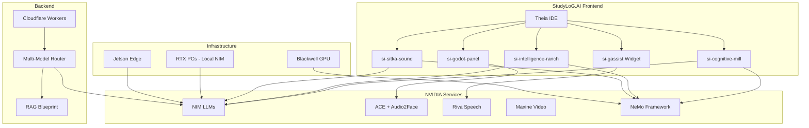
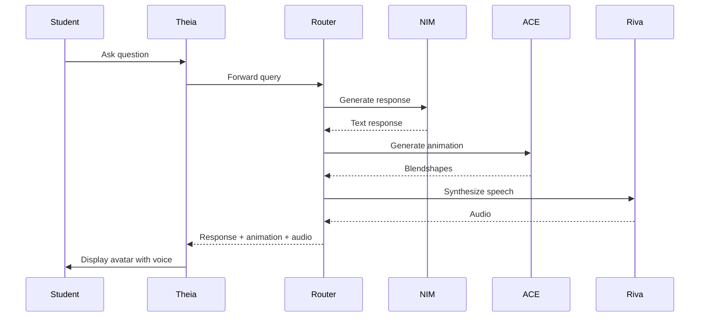
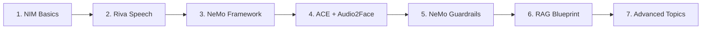
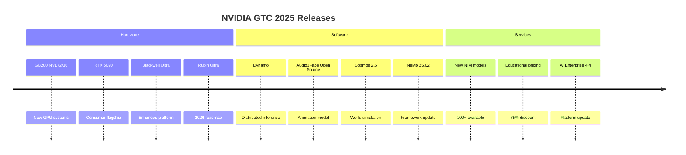

# NVIDIA Libraries Deep Dive for StudyLoG.AI

**Comprehensive Research on All 19 NVIDIA AI/ML Libraries and Their Applications**

---

## Table of Contents

1. [Executive Summary](#executive-summary)
2. [Library Overview Matrix](#library-overview-matrix)
3. [Core AI/ML Libraries](#core-aiml-libraries)
4. [Vision & Graphics Libraries](#vision--graphics-libraries)
5. [Enterprise & Deployment Libraries](#enterprise--deployment-libraries)
6. [Accelerated Computing Libraries](#accelerated-computing-libraries)
7. [Data Science Libraries](#data-science-libraries)
8. [Integration Architecture](#integration-architecture)
9. [Use Case Mappings](#use-case-mappings)
10. [API Quick Reference](#api-quick-reference)
11. [Deployment Patterns](#deployment-patterns)
12. [Cost Optimization](#cost-optimization)
13. [Learning Roadmap](#learning-roadmap)
14. [GTC 2025 Announcements](#gtc-2025-announcements)
15. [Educational Resources](#educational-resources)
16. [Sources](#sources)

---

## Executive Summary

NVIDIA's AI software ecosystem spans **19 major libraries and platforms** that cover every aspect of AI development from training to deployment. For **StudyLoG.AI**, these tools offer:

- **Digital Humans**: ACE (Avatar Cloud Engine) with Audio2Face for AI tutors
- **Speech AI**: Riva for voice interactions in 26+ languages
- **Model Development**: NeMo Framework for LLM training and customization
- **Safety**: NeMo Guardrails for AI safety and content moderation
- **Data Processing**: NeMo Curator for educational dataset curation
- **Inference**: NIM microservices for scalable model deployment
- **Video AI**: Maxine for video-enhanced learning experiences
- **World Simulation**: Cosmos for physics-based educational simulations
- **Computer Vision**: Metropolis for smart campus applications
- **Cybersecurity**: Morpheus for teaching security concepts
- **Recommendations**: Merlin for personalized learning paths
- **Edge AI**: Jetson for hardware learning labs
- **High-Performance Computing**: Blackwell, Dynamo for advanced AI research

---

## Library Overview Matrix

| Library | Category | Open Source | Pricing | Deployment Options | StudyLoG Use Case |
|---------|----------|-------------|---------|-------------------|------------------|
| **NIM** | Core AI/ML | Partial (Core) | $4,500/GPU/yr + Free Tier | Cloud, Local, On-Prem | Model deployment |
| **NeMo Framework** | Core AI/ML | Yes (Apache 2.0) | Free | Local, Cloud, Kubernetes | LLM training |
| **NeMo Guardrails** | Core AI/ML | Yes (Apache 2.0) | Free | Local, Cloud | AI safety |
| **NeMo Curator** | Core AI/ML | Yes (Apache 2.0) | Free | Local, Cloud, GPU Cluster | Dataset curation |
| **ACE** | Vision & Graphics | No (Commercial) | Per-use | Cloud, On-Prem | Digital tutors |
| **Audio2Face** | Vision & Graphics | Yes (Model) | Per-use + Self-hosted | Cloud, Local | Avatar animation |
| **Riva** | Core AI/ML | No (Enterprise) | Contact Sales | Docker, Kubernetes, On-Prem | Voice AI |
| **Maxine** | Vision & Graphics | No (Commercial) | Per-minute | Cloud, On-Prem | Video learning |
| **DLSS** | Vision & Graphics | No (Proprietary) | Hardware included | Local (RTX GPUs) | Graphics performance |
| **Cosmos** | Vision & Graphics | Partial (Apache 2.0) | Free for Research | Cloud, Local | World simulation |
| **AI Enterprise** | Enterprise | No (Commercial) | $4,500/GPU/yr ($1,125 EDU) | VMware, Bare Metal, Cloud | Platform foundation |
| **LaunchPad** | Enterprise | No (Program) | Free Trial | Cloud | Prototyping |
| **Blueprint** | Enterprise | Yes (Reference) | Free | Kubernetes | RAG patterns |
| **Blackwell** | Accelerated Computing | No (Hardware) | Hardware cost | On-Prem, Cloud | AI research |
| **Jetson** | Accelerated Computing | No (Hardware) | $499-$599 | Edge devices | Hardware labs |
| **Dynamo** | Accelerated Computing | Yes (Apache 2.0) | Free | Kubernetes | Distributed inference |
| **Merlin** | Data Science | Yes (Apache 2.0) | Free | Local, Cloud | Recommendations |
| **Metropolis** | Data Science | Partial | Contact Sales | Edge, Cloud | Smart campus |
| **Morpheus** | Data Science | Yes (Apache 2.0) | Free | Edge, Cloud | Cybersecurity |

---

## Core AI/ML Libraries

### 1. NIM (NVIDIA Inference Microservices)

**Purpose & Use Case:**
NIM provides containerized inference microservices for deploying AI models with standard APIs. It solves the complexity of model deployment by offering pre-built, optimized containers that run anywhere.

**API Surface:**
- OpenAI-compatible `/v1/chat/completions`
- `/v1/completions` for text completion
- `/v1/embeddings` for vector embeddings
- `/v1/models` for listing available models
- Health check endpoints
- Metrics endpoints for monitoring

**Pricing:**
- **NVIDIA AI Enterprise**: Starts at $4,500 per GPU per year
- **Educational Pricing**: $1,125 per GPU per year (75% discount)
- **Free Tier**: 5,000 API credits for development/testing
- **Initial Credits**: 1,000 free credits upon sign-up
- **Local Deployment**: Free (requires NVIDIA GPU hardware)

**Deployment Options:**
- **Docker**: `docker pull nvcr.io/nim/meta/llama-3.1-8b-instruct:latest`
- **Kubernetes**: Via NVIDIA AI Enterprise
- **Cloud Marketplace**: Google Cloud, AWS, Azure, Oracle Cloud
- **Local RTX PCs**: NVIDIA AI Workbench integration
- **Cloudflare Workers**: Via API integration

**Integration Points:**
- Compatible with OpenAI API format
- Integrates with LangChain, LlamaIndex
- Connects to NeMo-trained models
- Works with CUDA-accelerated hardware
- Supports tool calling for agents

**Relevance to StudyLoG.AI:**
- **Cognitive Mill**: Deploy specialized AI visualization models
- **Intelligence Ranch**: Host custom-trained agent models
- **Digital Tutor**: Low-latency inference for tutoring AI
- **Multi-Model Router**: Cascade fallback option

**Code Examples:**

```typescript
// NIM API Client for StudyLoG.AI
export interface NIMConfig {
  endpoint: string;
  model: string;
  apiKey?: string;
}

export class NIMClient {
  private config: NIMConfig;

  constructor(config: NIMConfig) {
    this.config = config;
  }

  async chat(messages: ChatMessage[], options?: ChatOptions): Promise<any> {
    const headers: Record<string, string> = {
      'Content-Type': 'application/json',
    };

    if (this.config.apiKey) {
      headers['Authorization'] = `Bearer ${this.config.apiKey}`;
    }

    const response = await fetch(`${this.config.endpoint}/v1/chat/completions`, {
      method: 'POST',
      headers,
      body: JSON.stringify({
        model: this.config.model,
        messages,
        temperature: options?.temperature ?? 0.7,
        max_tokens: options?.maxTokens ?? 2048,
        top_p: options?.topP ?? 0.9,
        stream: options?.stream ?? false,
      }),
    });

    if (!response.ok) {
      throw new Error(`NIM request failed: ${response.statusText}`);
    }

    return await response.json();
  }

  // StudyLoG.AI specific methods
  async generateStudyNotes(topic: string, difficulty: string): Promise<string> {
    const response = await this.chat([
      {
        role: 'system',
        content: `You are an expert educator who creates clear, structured study notes for ${difficulty} level students.`,
      },
      {
        role: 'user',
        content: `Create study notes for: ${topic}`,
      },
    ]);
    return response.choices[0].message.content;
  }
}
```

**Available NIM Models (2025):**
- `meta/llama-3.1-8b-instruct` - 8B parameter model
- `meta/llama-3.1-70b-instruct` - 70B parameter model
- `meta/llama-3.3-70b-instruct` - Latest 70B model
- `mistralai/mistral-7b-instruct` - Mistral 7B
- `mistralai/mixtral-8x7b-instruct` - MoE model
- `nvidia/nemotron-3-8b-instruct` - NVIDIA's model
- `google/gemma-2-27b-it` - Google Gemma 2
- `google/gemma-2-9b-it` - Smaller Gemma variant

**Docker Deployment:**
```bash
# Pull NIM container
docker pull nvcr.io/nim/meta/llama-3.1-8b-instruct:latest

# Run NIM locally
docker run -d --name llama-nim \
  --gpus all \
  -p 8000:8000 \
  -e NGC_API_KEY=$NGC_API_KEY \
  nvcr.io/nim/meta/llama-3.1-8b-instruct:latest

# Verify deployment
curl http://localhost:8000/v1/models
```

---

### 2. NeMo Framework

**Purpose & Use Case:**
NeMo Framework is an end-to-end platform for building, customizing, and deploying generative AI models. It supports LLMs, multimodal models, and includes tools for training, fine-tuning, RAG, and guardrails.

**API Surface:**
```python
# Core NeMo APIs
import nemo
import nemo.collections.asr as nemo_asr
import nemo.collections.nlp as nemo_nlp
import nemo.collections.multimodal as nemo_multimodal

# ASR (Automatic Speech Recognition)
asr_model = nemo_asr.models.EncDecCTCModel.restore_from(path)
transcription = asr_model.transcribe([audio_file])

# NLP (Language Models)
llm = nemo_nlp.models MegatronGPTModel.from_pretrained(model_name)
output = llm.generate(inputs)

# Training
trainer = nemo.core.Trainer()
trainer.fit(model, train_dataloader)
```

**Pricing:**
- **Open Source**: Free (Apache 2.0 license)
- **Enterprise Support**: Included with NVIDIA AI Enterprise
- **Cloud Training**: Pay for GPU compute only

**Deployment Options:**
- **Local**: pip install on NVIDIA GPUs
- **Docker**: NGC containers available
- **Kubernetes**: Via NVIDIA AI Enterprise
- **Cloud**: Run on AWS, GCP, Azure

**Integration Points:**
- NVIDIA GPUs (CUDA, TensorRT)
- NeMo Guardrails for safety
- NeMo Retriever for RAG
- NVIDIA Base Command for training
- Triton Inference Server for deployment

**Relevance to StudyLoG.AI:**
- **Cognitive Mill**: Train models that explain AI internals
- **Intelligence Ranch**: Fine-tune agent models
- **Sitka Sound**: Multi-agent simulation models
- **Custom LLMs**: Domain-specific educational models

**Code Examples:**

```python
# Fine-tuning Llama for educational content
from nemo.collections.nlp.models.language_modeling import MegatronGPTModel
from nemo.aligner import Aligner

# Load pre-trained model
model = MegatronGPTModel.from_pretrained(
    model_name="meta/llama-3.1-8b"
)

# Fine-tune on educational dataset
aligner = Aligner(
    model=model,
    train_dataset="educational_qa.jsonl",
    val_dataset="validation.jsonl",
    learning_rate=1e-5,
    batch_size=4,
)

aligner.fit()

# Export for NIM deployment
model.export_nim("studylog-tutor-v1")
```

**NeMo Components:**

| Component | Purpose | StudyLoG Use |
|-----------|---------|--------------|
| **NeMo Customizer** | Fine-tune LLMs | Subject-specific tutors |
| **NeMo Curator** | Data curation | Educational datasets |
| **NeMo Evaluator** | Model evaluation | Quality assessment |
| **NeMo Retriever** | RAG embeddings | Knowledge base |
| **NeMo Guardrails** | Safety rails | Content moderation |
| **NeMo Agent Toolkit** | Agent building | Agent orchestration |

---

### 3. NeMo Guardrails

**Purpose & Use Case:**
NeMo Guardrails provides programmable guardrails for AI applications to ensure safe, reliable, and aligned outputs. It includes content moderation, PII detection, toxic language filtering, jailbreak detection, and topic restriction.

**API Surface:**
```python
from nemoguardrails import LLMRails, RailsConfig

# Configuration
config = RailsConfig.from_content("./config")

# Initialize with guardrails
rails = LLMRails(config)

# Register actions
rails.register_action("check_pii", check_pii_action)
rails.register_action("filter_toxic", filter_toxic_action)

# Generate with guardrails
response = rails.generate("user message")
```

**Configuration Format (Colang):**
```colang
# Define bot behavior
define bot inform user about computer science
  "Computer science is the study of computation..."

define flow user asks about programming
  user said "how do I"
  bot inform user about programming
  bot offer tutorial

# Define rail guard
define rail check educational content
  if user input contains "hack" or "exploit"
    bot refuse and explain policy
```

**Pricing:**
- **Open Source**: Free (Apache 2.0 license)
- **Enterprise Support**: Included with NVIDIA AI Enterprise

**Deployment Options:**
- **Python Package**: pip install nemoguardrails
- **Docker**: Official containers available
- **Embedded**: Within NeMo applications

**Integration Points:**
- LlamaIndex, LangChain integration
- NeMo Framework native support
- OpenAI, Anthropic, HuggingFace models
- RAG applications
- Custom validator plugins

**Relevance to StudyLoG.AI:**
- **Content Safety**: Filter inappropriate educational content
- **PII Protection**: Protect student information
- **Topic Restriction**: Keep discussions on-topic
- **Jailbreak Prevention**: Protect against prompt injection
- **Hallucination Detection**: Verify factual accuracy

**StudyLoG.AI Guardrails Configuration:**

```yaml
# studylog-guardrails-config.yml
models:
  - type: main
    engine: cuda
    model: meta/llama-3.1-8b-instruct

rails:
  input:
    flows:
      - check educational relevance
      - check content safety
      - detect jailbreak attempts

  output:
    flows:
      - verify factual accuracy
      - check for hallucinations
      - format for educational level

  retrieval:
    flows:
      - verify source credibility
      - check for citations

config:
  educational_topics:
    - computer_science
    - mathematics
    - physics
    - biology
    - chemistry

  blocked_topics:
    - illegal_activities
    - harmful_instructions
    - adult_content

  pii_detection:
    enabled: true
    entities:
      - email
      - phone
      - ssn
      - address
      - student_id
```

**Integration with StudyLoG.AI Router:**

```typescript
// Add NeMo Guardrails check to router
import { GuardrailsClient } from './guardrails-client';

export async function withGuardrails(
  input: string,
  context: EducationalContext
): Promise<{ allowed: boolean; reason?: string }> {
  const guardrails = new GuardrailsClient({
    endpoint: process.env.GUARDRAILS_ENDPOINT,
  });

  // Check input safety
  const inputCheck = await guardrails.checkInput({
    text: input,
    topic: context.subject,
    level: context.gradeLevel,
  });

  if (!inputCheck.allowed) {
    return inputCheck;
  }

  // Check PII
  const piiCheck = await guardrails.detectPII(input);
  if (piiCheck.detected) {
    return {
      allowed: false,
      reason: 'Personal information detected. Please remove personal details.',
    };
  }

  return { allowed: true };
}
```

---

### 4. NeMo Curator

**Purpose & Use Case:**
NeMo Curator is a GPU-accelerated data curation platform for preparing high-quality datasets for AI model training. It handles text, images, video, and audio at scale.

**API Surface:**
```python
from nemo_curator import Curator, TextCurator, ImageCurator

# Text curation
text_curator = TextCurator()
text_curator.add_filter(min_length=100, max_length=10000)
text_curator.add_filter(language="en")
text_curator.add_deduplication(method="semantic")
curated_text = text_curator.curate(raw_dataset)

# Image curation
image_curator = ImageCurator()
image_curator.add_filter(min_resolution=(512, 512))
image_curator.add_quality_filter(threshold=0.7)
curated_images = image_curator.curate(image_folder)

# Video curation
video_curator = VideoCurator()
video_curator.add_filter(min_duration=10, max_duration=300)
curated_videos = video_curator.curate(video_folder)
```

**Pricing:**
- **Open Source**: Free (Apache 2.0 license)
- **Compute**: GPU usage costs only

**Deployment Options:**
- **Local**: Single GPU to multi-GPU
- **Cluster**: Ray for distributed processing
- **Cloud**: AWS, GCP, Azure with GPU support

**Integration Points:**
- NeMo Framework training pipelines
- HuggingFace datasets
- Ray for distributed processing
- CUDA for GPU acceleration
- Weights & Biases for tracking

**Relevance to StudyLoG.AI:**
- **Educational Datasets**: Curate textbooks, papers, tutorials
- **Code Datasets**: Prepare programming examples
- **Video Content**: Process educational videos
- **Multimodal Data**: Text + image datasets

**StudyLoG.AI Data Curation Pipeline:**

```python
# curate_educational_content.py
from nemo_curator import TextCurator, ImageCurator
from nemo_curator.filters import (
    LanguageFilter,
    QualityFilter,
    EducationalFilter,
    DifficultyFilter
)

def curate_studylog_dataset():
    """Curate datasets for StudyLoG.AI educational content"""

    # Initialize curator
    curator = TextCurator(device="cuda")

    # Add filters
    curator.add_filter(LanguageFilter(language="en"))
    curator.add_filter(QualityFilter(min_score=0.8))

    # Educational content filters
    curator.add_filter(EducationalFilter(
        allowed_subjects=[
            "computer_science",
            "mathematics",
            "physics",
            "chemistry",
            "biology"
        ]
    ))

    # Difficulty level filters
    curator.add_filter(DifficultyFilter(
        levels=["beginner", "intermediate", "advanced"]
    ))

    # Deduplication
    curator.add_deduplication(
        method="semantic",
        threshold=0.95
    ))

    # PII removal
    curator.add_pii_removal()

    # Curate datasets
    textbooks = curator.curate("data/textbooks/")
    tutorials = curator.curate("data/tutorials/")
    papers = curator.curate("data/papers/")

    return {
        "textbooks": textbooks,
        "tutorials": tutorials,
        "papers": papers
    }
```

---

### 5. ACE (Avatar Cloud Engine)

**Purpose & Use Case:**
ACE provides technologies for creating intelligent, interactive digital humans and game characters. It combines speech AI, LLMs, and facial animation to create conversational avatars.

**Key Components:**

| Component | Purpose | StudyLoG Use |
|-----------|---------|--------------|
| **Riva Speech** | Speech recognition/synthesis | Voice conversations |
| **Nemotron-3** | Instruction-tuned LLM | Tutor reasoning |
| **Animation Graph** | Character animation | Expressive gestures |
| **Audio2Face** | Audio-driven facial animation | Lip-sync and expressions |
| **Riva TTS** | Text-to-speech | Natural voice output |

**API Surface:**
```python
# ACE Python SDK
from ace import ACEAgent, ACEConfig

# Configuration
config = ACEConfig(
    avatar_model="studylog_tutor_v1",
    llm_model="nemotron-3-8b",
    tts_model="riva:tts:emma",
    stt_model="riva:stt:en-US",
)

# Initialize agent
agent = ACEAgent(config)

# Conversation loop
async def conversation():
    audio_input = await agent.listen()
    text = await agent.transcribe(audio_input)
    response = await agent.generate_response(text)
    audio_output = await agent.synthesize(response)
    animation = await agent.generate_animation(response)

    return audio_output, animation
```

**Pricing:**
- **ACE Agent**: Contact NVIDIA for pricing
- **Per-use pricing**: Available for cloud deployment
- **Enterprise**: Requires NVIDIA AI Enterprise

**Deployment Options:**
- **Unreal Engine**: Official plugin v2.5+
- **Autodesk Maya**: Open-source toolchain
- **Docker**: Containerized deployment
- **Cloud**: NVIDIA-hosted services

**Integration Points:**
- Unreal Engine, Unity
- Maya, Blender
- Omniverse for 3D rendering
- Riva for speech
- Audio2Face for animation

**Relevance to StudyLoG.AI:**
- **Digital Tutor**: AI-powered teaching avatar
- **Virtual Lab**: Interactive demonstrations
- **Language Learning**: Pronunciation practice
- **Accessibility**: Sign language avatar

**StudyLoG.AI Avatar Configuration:**

```json
{
  "avatar": {
    "name": "studylog_tutor_v1",
    "model_path": "models/avatars/studylog_tutor.usd",
    "blendshapes": ["ARKit", "Eyes"],
    "languages": ["en-US", "es-ES", "fr-FR", "zh-CN"],
    "styles": {
      "formal": "professional_tutor",
      "casual": "friendly_guide",
      "enthusiastic": "excited_mentor"
    }
  },
  "speech": {
    "stt_model": "riva:stt:en-US",
    "tts_model": "riva:tts:emma",
    "sample_rate": 16000
  },
  "llm": {
    "model": "nemotron-3-8b",
    "temperature": 0.7,
    "max_tokens": 2048,
    "system_prompt": "You are a helpful STEM tutor for StudyLoG.AI. Explain concepts clearly, encourage student curiosity, and adapt explanations to the student's level."
  },
  "animation": {
    "gesture_style": "educational",
    "idle_animations": ["idle_01", "idle_02"],
    "talking_animations": ["talk_01", "talk_02"],
    "explanation_animations": ["explain_01", "explain_02"]
  }
}
```

---

### 6. Audio2Face

**Purpose & Use Case:**
Audio2Face generates realistic facial animations from audio input using AI. It creates lip-sync, expressions, and head movements automatically.

**API Surface:**
```python
# Audio2Face Python SDK
from audio2face import Audio2Face

# Initialize
a2f = Audio2Face(
    blendshape_set="ARKit",
    features=["lip_sync", "expression", "head_movement"]
)

# Process audio
def process_audio(audio_path: str):
    # Load audio
    audio = a2f.load_audio(audio_path, sample_rate=16000)

    # Generate animation
    animation = a2f.generate(audio)

    # Export
    animation.export("animation.json")
    animation.export_blendshapes("blendshapes.csv")

    return animation
```

**Blendshape Support:**
- **ARKit**: 52 standard blendshapes (Apple standard)
- **Eyes**: Additional eye movement blendshapes
- **Custom**: Support for custom blendshape sets

**ARKit Blendshapes:**
```python
ARKIT_BLENDSHAPES = [
    # Eyes (12)
    "eyeBlinkLeft", "eyeLookDownLeft", "eyeLookInLeft",
    "eyeLookOutLeft", "eyeLookUpLeft", "eyeSquintLeft",
    "eyeWideLeft", "eyeBlinkRight", "eyeLookDownRight",
    "eyeLookInRight", "eyeLookOutRight", "eyeLookUpRight",
    "eyeSquintRight", "eyeWideRight",

    # Jaw (4)
    "jawForward", "jawLeft", "jawOpen", "jawRight",

    # Mouth (20)
    "mouthClose", "mouthDimpleLeft", "mouthDimpleRight",
    "mouthFrownLeft", "mouthFrownRight", "mouthFunnel",
    "mouthLeft", "mouthLowerDownLeft", "mouthLowerDownRight",
    "mouthPressLeft", "mouthPressRight", "mouthPucker",
    "mouthRight", "mouthRollLower", "mouthRollUpper",
    "mouthShrugLower", "mouthShrugUpper", "mouthSmileLeft",
    "mouthSmileRight", "mouthStretchLeft", "mouthStretchRight",
    "mouthUpperUpLeft", "mouthUpperUpRight",

    # Nose (2)
    "noseSneerLeft", "noseSneerRight",

    # Cheeks (2)
    "cheekPuff", "cheekSquintLeft", "cheekSquintRight",

    # Tongue (1)
    "tongueOut",

    # Brows (4)
    "browDownLeft", "browDownRight", "browInnerUp",
    "browOuterUpLeft", "browOuterUpRight"
]
```

**Pricing:**
- **Open Source Model**: Free (released September 2025)
- **Cloud API**: Per-use pricing available
- **Self-hosted**: Free with NVIDIA GPU

**Deployment Options:**
- **Unreal Engine Plugin**: Official support
- **Standalone Server**: Docker container
- **Local**: RTX GPU support
- **Cloud**: NVIDIA-hosted API

**Integration Points:**
- Unreal Engine (official plugin v2.3+)
- Maya (reference implementation)
- Godot (via WebSocket bridge)
- WebSocket API for custom engines

**Relevance to StudyLoG.AI:**
- **Digital Tutor**: Real-time avatar animation
- **Language Learning**: Pronunciation visualization
- **Presentations**: AI-generated video lectures
- **Accessibility**: Sign language generation

**Godot Integration (via WebSocket):**

```gdscript
# Audio2FaceReceiver.gd - Godot node that receives blendshape data
extends MeshInstance3D

signal blendshapes_updated(blendshapes: Dictionary)

var _ws: WebSocketPeer = WebSocketPeer.new()
var _blendshape_dict: Dictionary = {}

func _ready() -> void:
    var error = _ws.connect_to_url("ws://localhost:8080/a2f")
    if error != OK:
        push_error("Failed to connect to Audio2Face: %s" % error)

func _process(delta: float) -> void:
    _ws.poll()
    var state: WebSocketPeer.State = _ws.get_ready_state()

    if state == WebSocketPeer.STATE_OPEN:
        _process_messages()

func _process_messages() -> void:
    while _ws.get_available_packet_count() > 0:
        var packet: PackedByteArray = _ws.get_packet()
        var json_string: String = packet.get_string_from_utf8()
        var json: JSON = JSON.new()

        var parse_error = json.parse(json_string)
        if parse_error == OK:
            _apply_blendshapes(json.data)

func _apply_blendshapes(data: Dictionary) -> void:
    if data.has("blendshapes"):
        _blendshape_dict = data.blendshapes
        blendshapes_updated.emit(_blendshape_dict)

        # Apply to blendshape driver
        if has_method("set_blend_shape_value"):
            for shape_name: String in _blendshape_dict:
                var shape_idx: int = find_blend_shape_by_name(shape_name)
                if shape_idx >= 0:
                    set_blend_shape_value(shape_idx, _blendshape_dict[shape_name])

func get_current_blendshapes() -> Dictionary:
    return _blendshape_dict.duplicate()
```

**Audio2Face Cloud API:**

```typescript
// TypeScript client for Audio2Face cloud API
export interface BlendShape {
  name: string;
  value: number;
}

export interface Audio2FaceFrame {
  timestamp: number;
  blendshapes: BlendShape[];
}

export class Audio2FaceClient {
  private ws: WebSocket | null = null;
  private endpoint: string;
  private apiKey: string;
  private avatar: string;

  constructor(config: {
    endpoint?: string;
    apiKey: string;
    avatar: string;
  }) {
    this.endpoint = config.endpoint || 'wss://api.nvcf.nvidia.com/v2/a2f';
    this.apiKey = config.apiKey;
    this.avatar = config.avatar;
  }

  async connect(): Promise<void> {
    return new Promise((resolve, reject) => {
      this.ws = new WebSocket(`${this.endpoint}/${this.avatar}`, {
        headers: {
          'Authorization': `Bearer ${this.apiKey}`,
        },
      });

      this.ws.onopen = () => {
        // Initialize session
        this.ws?.send(JSON.stringify({
          type: 'init',
          blendshape_set: 'ARKit',
          features: ['lip_sync', 'expression'],
        }));
        resolve();
      };

      this.ws.onerror = (error) => {
        reject(error);
      };
    });
  }

  async streamAudio(
    audioData: Float32Array,
    onFrame: (frame: Audio2FaceFrame) => void
  ): Promise<void> {
    if (!this.ws || this.ws.readyState !== WebSocket.OPEN) {
      throw new Error('Audio2Face not connected');
    }

    this.ws.onmessage = (event) => {
      const frame: Audio2FaceFrame = JSON.parse(event.data);
      onFrame(frame);
    };

    // Send audio data
    this.ws.send(JSON.stringify({
      type: 'audio',
      data: Array.from(audioData),
      sample_rate: 16000,
      format: 'f32_le',
    }));
  }

  async setMood(mood: 'neutral' | 'happy' | 'sad' | 'excited'): Promise<void> {
    if (!this.ws || this.ws.readyState !== WebSocket.OPEN) {
      throw new Error('Audio2Face not connected');
    }

    this.ws.send(JSON.stringify({
      type: 'mood',
      value: mood,
    }));
  }

  disconnect(): void {
    this.ws?.close();
    this.ws = null;
  }
}
```

---

### 7. Riva (Speech AI)

**Purpose & Use Case:**
Riva is a GPU-accelerated SDK for building speech AI applications with automatic speech recognition (ASR), text-to-speech (TTS), and neural machine translation (NMT) in 26+ languages.

**API Surface:**
```python
# Riva Python SDK
import riva.client

# Create client
auth = riva.client.Auth(uri='localhost:50051')
riva_client = riva.client.Client(auth)

# ASR (Speech Recognition)
asr_service = riva_client.asr
config = riva.client.StreamingRecognitionConfig(
    config=riva.client.RecognitionConfig(
        encoding=riva.client.AudioEncoding.LINEAR_PCM,
        sample_rate_hertz=16000,
        language_code='en-US',
        max_alternatives=1,
    )
)

# TTS (Text-to-Speech)
tts_service = riva_client.tts
response = tts_service.synthesize(
    text="Hello, welcome to StudyLoG.AI!",
    voice_name='English-US.Female-1',
    sample_rate_hz=22050
)

# NMT (Translation)
nmt_service = riva.client.nmt
translation = nmt_service.translate(
    text="Hello world",
    source_lang='en-US',
    target_lang='es-ES'
)
```

**Supported Languages (26+):**
- English (US, UK, AU, IN)
- Spanish (ES, MX, AR)
- French (FR, CA)
- German
- Italian
- Portuguese (BR, PT)
- Russian
- Chinese (Mandarin)
- Japanese
- Korean
- Arabic
- Hindi
- Dutch
- Turkish
- Polish
- And more...

**Voice Options:**
- **English-US**: Emma, Alex, Sarah, Chris
- **Spanish-MX**: Luna
- **French-FR**: Chloe
- **German-DE**: Anna
- **Italian-IT**: Isabella
- Custom voice cloning available

**Pricing:**
- **Riva Speech AI**: Contact NVIDIA for pricing
- **Cloud API**: Per-use pricing available
- **Self-hosted**: Requires NVIDIA AI Enterprise ($4,500/GPU/yr)
- **Educational**: $1,125/GPU/yr (75% discount)

**Deployment Options:**
- **Docker**: Official containers via NGC
- **Kubernetes**: Helm charts available
- **Bare Metal**: On-premises deployment
- **Cloud**: AWS, GCP, Azure, Oracle Cloud

**Integration Points:**
- ACE (Avatar Cloud Engine)
- NeMo Framework
- DeepStream for video analytics
- Triton Inference Server
- VMC (Voice Mesh Connector)

**Relevance to StudyLoG.AI:**
- **Voice Learning**: Pronunciation practice
- **Accessibility**: Text-to-speech for visual learners
- **Multilingual**: Language learning support
- **Live Captioning**: Real-time lecture transcription
- **Voice Commands**: Hands-free IDE control

**StudyLoG.AI Riva Integration:**

```typescript
// Riva client for StudyLoG.AI
export interface RivaConfig {
  endpoint: string;
  apiKey: string;
  languageCode: string;
}

export interface TranscriptionResult {
  text: string;
  confidence: number;
  words: Array<{
    word: string;
    start: number;
    end: number;
    confidence: number;
  }>;
}

export class RivaClient {
  private config: RivaConfig;

  constructor(config: RivaConfig) {
    this.config = config;
  }

  async transcribe(audioBuffer: ArrayBuffer): Promise<TranscriptionResult> {
    const response = await fetch(`${this.config.endpoint}/v1/transcriptions`, {
      method: 'POST',
      headers: {
        'Authorization': `Bearer ${this.config.apiKey}`,
        'Content-Type': 'audio/wav',
      },
      body: audioBuffer,
    });

    if (!response.ok) {
      throw new Error(`Riva transcription failed: ${response.statusText}`);
    }

    const result = await response.json();
    return {
      text: result.text,
      confidence: result.confidence,
      words: result.words || [],
    };
  }

  async synthesize(
    text: string,
    voice?: string
  ): Promise<ArrayBuffer> {
    const response = await fetch(`${this.config.endpoint}/v1/synthesize`, {
      method: 'POST',
      headers: {
        'Authorization': `Bearer ${this.config.apiKey}`,
        'Content-Type': 'application/json',
      },
      body: JSON.stringify({
        text,
        voice: voice || 'english-us-female-1',
        language_code: this.config.languageCode,
        sample_rate: 22050,
      }),
    });

    if (!response.ok) {
      throw new Error(`Riva synthesis failed: ${response.statusText}`);
    }

    return await response.arrayBuffer();
  }

  async translate(
    text: string,
    targetLanguage: string
  ): Promise<{ text: string; detectedLanguage?: string }> {
    const response = await fetch(`${this.config.endpoint}/v1/translate`, {
      method: 'POST',
      headers: {
        'Authorization': `Bearer ${this.config.apiKey}`,
        'Content-Type': 'application/json',
      },
      body: JSON.stringify({
        text,
        source_language_code: this.config.languageCode,
        target_language_code: targetLanguage,
      }),
    });

    if (!response.ok) {
      throw new Error(`Riva translation failed: ${response.statusText}`);
    }

    return await response.json();
  }

  // Streaming transcription for real-time input
  async *streamTranscribe(audioStream: ReadableStream): AsyncGenerator<TranscriptionResult> {
    const reader = audioStream.getReader();

    while (true) {
      const { done, value } = await reader.read();
      if (done) break;

      const result = await this.transcribe(value);
      yield result;
    }
  }

  // StudyLoG.AI specific: Language learning pronunciation
  async evaluatePronunciation(
    audioBuffer: ArrayBuffer,
    targetText: string
  ): Promise<{
    score: number;
    feedback: string;
    mispronouncedWords: string[];
  }> {
    const transcription = await this.transcribe(audioBuffer);

    // Compare transcription with target text
    const targetWords = targetText.toLowerCase().split(/\s+/);
    const spokenWords = transcription.text.toLowerCase().split(/\s+/);

    const mispronounced = targetWords.filter((word, i) => spokenWords[i] !== word);
    const accuracy = 1 - (mispronounced.length / targetWords.length);

    return {
      score: Math.round(accuracy * 100),
      feedback: this._generatePronunciationFeedback(accuracy),
      mispronouncedWords: mispronounced,
    };
  }

  private _generatePronunciationFeedback(accuracy: number): string {
    if (accuracy >= 0.9) return "Excellent pronunciation!";
    if (accuracy >= 0.75) return "Good pronunciation! Keep practicing.";
    if (accuracy >= 0.5) return "Try again, focus on the highlighted words.";
    return "Let's break this down into smaller parts.";
  }
}
```

**Riva for Language Learning:**

```typescript
// Language learning module using Riva
export class LanguageLearningModule {
  private riva: RivaClient;

  constructor(riva: RivaClient) {
    this.riva = riva;
  }

  async pronunciationPractice(
    lesson: Lesson
  ): Promise<PronunciationResult> {
    // Play native pronunciation
    const nativeAudio = await this.riva.synthesize(
      lesson.targetPhrase,
      lesson.voice
    );

    // Record user attempt
    const userAudio = await this._recordAudio();

    // Evaluate pronunciation
    const evaluation = await this.riva.evaluatePronunciation(
      userAudio,
      lesson.targetPhrase
    );

    return {
      ...evaluation,
      nativeAudio,
      userAudio,
      lesson: lesson.id,
    };
  }

  async conversationPractice(
    scenario: ConversationScenario
  ): Promise<ConversationSession> {
    const session = new ConversationSession();

    // AI speaks first
    let aiPrompt = scenario.openingLine;
    let aiAudio = await this.riva.synthesize(aiPrompt);

    session.addTurn('ai', aiPrompt, aiAudio);

    while (!session.isComplete()) {
      // User speaks
      const userAudio = await this._recordAudio();
      const userText = await this.riva.transcribe(userAudio);

      session.addTurn('user', userText.text, userAudio);

      // Check conversation goals
      const goals = scenario.checkGoals(session);
      session.updateGoals(goals);

      if (goals.allMet) {
        const closing = await this.riva.synthesize(scenario.closingLine);
        session.addTurn('ai', scenario.closingLine, closing);
        session.complete();
        break;
      }

      // AI responds
      const aiResponse = await this._generateAIResponse(userText.text, scenario);
      const aiResponseAudio = await this.riva.synthesize(aiResponse);

      session.addTurn('ai', aiResponse, aiResponseAudio);
    }

    return session;
  }

  private async _recordAudio(): Promise<ArrayBuffer> {
    // Browser recording implementation
    // Use MediaRecorder API
    throw new Error('Not implemented');
  }

  private async _generateAIResponse(
    userText: string,
    scenario: ConversationScenario
  ): Promise<string> {
    // Use NIM or other LLM for response
    throw new Error('Not implemented');
  }
}
```

---

## Vision & Graphics Libraries

### 8. Maxine

**Purpose & Use Case:**
Maxine is a suite of GPU-accelerated AI SDKs for video conferencing and streaming enhancement. It includes eye contact correction, background segmentation, audio enhancement, and face tracking.

**Key Features:**

| Feature | Description | StudyLoG Use |
|---------|-------------|--------------|
| **Eye Contact** | Gaze correction toward camera | Video lessons |
| **Live Portrait** | Background segmentation/replacement | Virtual backgrounds |
| **Studio Voice** | Audio enhancement & noise cancellation | Clear audio |
| **Face Detection** | Real-time face tracking | Attendance tracking |
| **Super Resolution** | Video upscaling | Quality enhancement |

**API Surface:**
```python
# Maxine Python SDK
import maxine

# Eye Contact
eye_contact = maxine.EyeContact()
eye_contact.initialize(gaze_target='camera', smoothing_factor=0.7)
corrected_frame = eye_contact.process(frame)

# Live Portrait (Background Segmentation)
portrait = maxine.LivePortrait()
portrait.initialize(model='segformer')
mask = portrait.segment(frame)

# Studio Voice (Audio Enhancement)
studio_voice = maxine.StudioVoice()
studio_voice.initialize(noise_suppression=True, echo_cancellation=True)
enhanced_audio = studio_voice.process(audio_data)
```

**Pricing:**
- **Cloud API**: ~$0.005 per minute of video
- **Enterprise**: Contact NVIDIA
- **Local**: Requires RTX GPU

**Deployment Options:**
- **WebRTC**: Browser-based processing
- **Docker**: Containerized deployment
- **Local RTX**: Client-side processing
- **Cloud**: NVIDIA-hosted API

**Integration Points:**
- WebRTC for real-time video
- OBS Studio for streaming
- Custom video pipelines
- Browser via WebAssembly

**Relevance to StudyLoG.AI:**
- **Video Lessons**: Enhanced lecture recording
- **Virtual Classroom**: Professional video quality
- **Presentation Practice**: Eye contact training
- **Remote Learning**: Improved video quality

---

### 9. DLSS (Deep Learning Super Sampling)

**Purpose & Use Case:**
DLSS uses AI to upscale lower-resolution images to higher resolution in real-time, dramatically improving performance for Godot and other game engines.

**Versions:**
- **DLSS 2**: Super resolution
- **DLSS 3**: Frame generation
- **DLSS 3.5**: Ray reconstruction
- **DLSS 4**: Latest improvements (2025)

**Godot Integration Challenge:**

DLSS cannot be officially integrated into Godot because:
1. **Proprietary License**: DLSS is closed-source
2. **MIT License Conflict**: Godot is MIT-licensed
3. **NVIDIA EULA**: Restricts redistribution

**Workarounds:**

1. **NVIDIA Streamline SDK** (MIT-licensed wrapper)
2. **Third-party plugins** (community maintained)
3. **FSR 2.2** (AMD alternative, built into Godot 4.2+)

**Alternative for Godot:**
```gdscript
# Godot 4.2+ includes FSR 2.2 as an alternative
# FSR is open-source and license-compatible

# Enable FSR in project settings:
# Project Settings -> Rendering -> Scaling -> Mode -> FSR2
```

**Pricing:**
- **Hardware Included**: Free with RTX GPUs
- **Developer Access**: Via NVIDIA Developer Program

**Relevance to StudyLoG.AI:**
- **Performance**: Higher FPS for complex simulations
- **Quality**: Better visual quality for educational content
- **Accessibility**: Runs on lower-end hardware

---

### 10. Cosmos

**Purpose & Use Case:**
Cosmos is a world foundation model platform for physical AI, enabling generation of realistic videos, 3D simulations, and synthetic data for robotics and autonomous systems.

**Key Components:**

| Component | Purpose | StudyLoG Use |
|-----------|---------|--------------|
| **Cosmos-Predict** | World simulation | Physics simulations |
| **Cosmos-Transfer** | 3D to video | Scenario generation |
| **Video Tokenizer** | Video compression | Content storage |
| **Curator** | Data curation | Training data prep |

**API Surface:**
```python
# Cosmos Python SDK
from cosmos import CosmosPredict, CosmosTransfer

# World simulation
predictor = CosmosPredict(model="cosmos-predict-2.5")
video = predictor.generate(
    prompt="A physics demonstration of pendulum motion",
    duration=10,
    resolution=(1920, 1080)
)

# 3D to video transfer
transfer = CosmosTransfer(model="cosmos-transfer-2.5")
video = transfer.generate_from_3d(
    scene_path="pendulum_simulation.usd",
    camera_path="camera_animation.json"
)
```

**Models (2025):**
- `cosmos-predict-2.5`: Latest world simulation
- `cosmos-transfer-2.5`: 3D to photorealistic video
- `cosmos-1.0-diffusion`: Diffusion-based generation
- Tokenizers for video compression

**Pricing:**
- **Open Source**: Apache 2.0 (code), NVIDIA Open Model License (models)
- **API**: Free tier for research
- **Enterprise**: Contact NVIDIA

**Deployment Options:**
- **GitHub**: Open source code
- **NGC**: Pre-trained models
- **Docker**: Containerized deployment
- **Omniverse**: Integration platform

**Integration Points:**
- Omniverse for 3D workflows
- NeMo for customization
- NIM for inference deployment
- Godot via asset pipeline

**Relevance to StudyLoG.AI:**
- **Physics Simulations**: Realistic world modeling
- **Synthetic Data**: Training data generation
- **Educational Videos**: Auto-generate demonstrations
- **Sitka Sound**: Multi-agent environment simulation

---

## Enterprise & Deployment Libraries

### 11. NVIDIA AI Enterprise

**Purpose & Use Case:**
AI Enterprise is a cloud-native software platform for developing and deploying production-grade AI solutions including generative AI, with enterprise-grade support and security.

**Features:**
- **NIM Containers**: Pre-built inference microservices
- **NeMo Framework**: Model training and customization
- **Base Command**: Managed training platform
- **AI Workbench**: Hybrid development environment
- **Enterprise Support**: 24/7 technical support

**Pricing:**

| Edition | Annual Cost per GPU | Features |
|---------|---------------------|----------|
| **Enterprise** | $4,500 | Full support, all NIMs |
| **Educational** | $1,125 | 75% discount |
| **Production** | Custom | Custom SLA |

**Deployment Options:**
- **VMware vSphere**: Certified integration
- **Bare Metal**: Direct GPU access
- **Cloud Marketplace**: AWS, GCP, Azure, Oracle
- **Kubernetes**: Helm charts

**Relevance to StudyLoG.AI:**
- **Platform Foundation**: Base for all NVIDIA tools
- **Production Deployment**: Enterprise-grade reliability
- **Educational Pricing**: Affordable for institutions

---

### 12. LaunchPad (now AI Workbench)

**Purpose & Use Case:**
NVIDIA AI Workbench (successor to LaunchPad) provides a frictionless development environment for AI projects across workstations, data center, and cloud.

**Features:**
- **Hybrid Development**: Work locally, deploy to cloud
- **Container Management**: Easy environment setup
- **Collaboration**: Share projects with team
- **Resource Management**: GPU allocation

**Pricing:**
- **Free**: Available to NVIDIA Developer Program members
- **Trial**: Free cloud credits included

**Relevance to StudyLoG.AI:**
- **Development**: Consistent environment across team
- **Prototyping**: Quick experimentation
- **Student Projects**: Easy setup for learners

---

### 13. Blueprint (RAG Blueprint)

**Purpose & Use Case:**
NVIDIA RAG Blueprint is a reference solution for building production-ready Retrieval-Augmented Generation pipelines with NVIDIA NIM and NeMo.

**Components:**
- **Extraction**: Document/text processing
- **Vectorization**: Embedding generation
- **Retrieval**: Vector database search
- **Generation**: LLM response with context
- **Metadata Filtering**: Advanced querying

**Architecture:**
```
Documents -> Extraction -> Vectorization -> Vector DB
                                                     |
User Query -> Embedding ----------> Retrieval ------>+-> Generation -> Response
```

**API Surface:**
```yaml
# RAG Blueprint Configuration
chain_type: "basic"
retrieve_documents: 5
llm:
  model: "meta/llama-3.1-70b-instruct"
  temperature: 0.5
retriever:
  vector_db: "milvus"
  embedding_model: "nvidia/embedding-001"
  score_threshold: 0.7
```

**Pricing:**
- **Open Source**: Free (GitHub)
- **PyPI Package**: `pip install nvidia-rag`
- **Enterprise**: Included with AI Enterprise

**Deployment:**
```bash
# Via Helm Chart
helm install nvidia-rag nvidia/blueprint-rag \
  --namespace nvidia \
  --set llm.model=meta/llama-3.1-70b-instruct

# Via Docker Compose
docker compose -f rag-blueprint.yml up
```

**Relevance to StudyLoG.AI:**
- **Knowledge Base**: Course content retrieval
- **Q&A System**: Student questions with context
- **Documentation**: Technical reference lookup
- **Research**: Paper and resource discovery

**StudyLoG.AI RAG Implementation:**

```typescript
// RAG system for educational content
export class EducationalRAG {
  private retriever: VectorRetriever;
  private llm: NIMClient;
  private embedder: EmbeddingModel;

  async queryStudentQuestion(
    question: string,
    context: {
      subject: string;
      level: string;
      courseId?: string;
    }
  ): Promise<EducationalResponse> {
    // 1. Embed the question
    const queryEmbedding = await this.embedder.embed(question);

    // 2. Retrieve relevant content
    const documents = await this.retriever.retrieve({
      embedding: queryEmbedding,
      filters: {
        subject: context.subject,
        level: context.level,
        courseId: context.courseId,
      },
      topK: 5,
    });

    // 3. Generate response with context
    const response = await this.llm.chat([
      {
        role: 'system',
        content: `You are a helpful educational assistant for ${context.subject} at ${context.level} level. Use the provided context to answer accurately.`,
      },
      {
        role: 'user',
        content: `Question: ${question}\n\nContext:\n${documents.map(d => d.content).join('\n\n')}`,
      },
    ]);

    return {
      answer: response.choices[0].message.content,
      sources: documents.map(d => ({
        id: d.id,
        title: d.title,
        url: d.url,
        relevance: d.score,
      })),
      confidence: this._calculateConfidence(documents),
    };
  }
}
```

---

## Accelerated Computing Libraries

### 14. Blackwell GPU Architecture

**Purpose & Use Case:**
Blackwell is NVIDIA's next-generation GPU architecture (2025) designed for AI training and inference at unprecedented scale.

**Key Specifications:**

| Feature | Specification | Impact |
|---------|---------------|--------|
| **Transistors** | 208 billion | 2.5x Hopper |
| **Memory** | Up to 192GB HBM3e | 8TB/s bandwidth |
| **Interconnect** | 10TB/s NV-HBI | Dual-die unified |
| **AI Performance** | 20 PFLOPS FP4 | Training acceleration |
| **Form Factor** | GB200 NVL72/36 | Data center scale |

**Products:**
- **GB200 NVL72**: 72-GPU system
- **GB200 NVL36**: 36-GPU system
- **RTX 5090**: Consumer flagship
- **RTX Pro 6000**: Professional

**Relevance to StudyLoG.AI:**
- **Research Lab**: High-performance computing
- **Model Training**: Faster fine-tuning
- **Multi-Agent**: Large-scale simulations

---

### 15. Jetson (Edge AI)

**Purpose & Use Case:**
Jetson is a platform for edge AI computing, enabling AI applications on embedded devices with low power consumption.

**Product Line (2025):**

| Model | AI Performance | Price | Use Case |
|-------|----------------|-------|----------|
| **Orin Nano Super** | 30 TOPS | $499 | Basic AI projects |
| **Orin NX** | 100 TOPS | $599 | Advanced robotics |
| **AGX Orin** | 275 TOPS | $1,999 | Production systems |
| **AGX Thor** | 1000+ TOPS | TBD | Next-gen AI |

**Relevance to StudyLoG.AI:**
- **Hardware Labs**: Physical AI learning kits
- **Robotics**: Autonomous agent platforms
- **Edge Computing**: Local AI processing
- **Student Projects**: Affordable AI hardware

**StudyLoG.AI Jetson Integration:**

```python
# Jetson-based learning lab setup
import jetson.inference
import jetson.utils

# Object detection for smart campus
net = jetson.inference.detectNet("ssd-mobilenet-v2", threshold=0.5)
camera = jetson.utils.videoSource("/dev/video0")
display = jetson.utils.videoOutput("display://0")

while True:
    img = camera.Capture()
    detections = net.Detect(img)

    for d in detections:
        # Track attendance, equipment usage
        print(f"Detected: {d.ClassID} ({d.Confidence})")

    display.Render(img)
```

---

### 16. Dynamo

**Purpose & Use Case:**
Dynamo is an open-source inference framework (released March 2025) for scaling AI reasoning models with low latency and distributed processing.

**Key Features:**
- **Distributed Inference**: Scale across multiple GPUs
- **KV Cache Offloading**: Free GPU memory to storage
- **Apache 2.0**: Fully open source
- **Tool Calling**: Agent workflow support

**GitHub**: `ai-dynamo/dynamo`

**API Surface:**
```python
from dynamo import DynamoInference

# Initialize distributed inference
inference = DynamoInference(
    model="meta/llama-3.1-70b-instruct",
    workers=["gpu-0", "gpu-1", "gpu-2"],
    kv_offload="ssd://nvme/kv-cache"
)

# Run inference
result = inference.generate(
    prompt="Explain quantum computing...",
    max_tokens=2048
)
```

**Relevance to StudyLoG.AI:**
- **Large Models**: Run 70B+ parameter models
- **Multi-Agent**: Parallel agent processing
- **Cost Optimization**: Efficient GPU usage

---

## Data Science Libraries

### 17. Merlin

**Purpose & Use Case:**
Merlin is an open-source framework for building high-performance recommender systems with GPU acceleration.

**Components:**
- **Transformers4Rec**: Sequential recommendations
- **HugeCTR**: CTR estimation
- **NVTabular**: Feature engineering
- **Merlin Models**: Deep learning recommenders

**Relevance to StudyLoG.AI:**
- **Personalized Learning**: Course recommendations
- **Adaptive Difficulty**: Content difficulty matching
- **Study Paths**: Optimal learning sequence

**StudyLoG.AI Recommendation Pipeline:**

```python
from merlin.models.tf import Transformers4Rec
from merlin.schema import Schema

# Build sequential recommendation model
model = Transformers4Rec(
    schema=Schema([
        "user_id",
        "course_id",
        "difficulty",
        "subject",
        "completion_rate",
        "time_spent"
    ]),
    transformer_config=dict(
        num_attention_heads=4,
        num_layers=2,
        hidden_dim=128
    )
)

# Train on student interaction data
model.fit(train_data)

# Recommend next lesson
def recommend_next(user_id, history):
    predictions = model.predict(
        user_id=user_id,
        history=history
    )
    return predictions.top_k(5)
```

---

### 18. Metropolis

**Purpose & Use Case:**
Metropolis is a vision AI platform for smart cities and spaces, providing tools for traffic management, retail analytics, and security.

**Key Features:**
- **Object Detection**: People, vehicles, objects
- **Tracking**: Multi-object tracking
- **Analytics**: Counting, flow analysis
- **Edge Deployment**: Jetson optimization

**Relevance to StudyLoG.AI:**
- **Smart Campus**: Traffic and space usage
- **Attendance**: Automated check-in
- **Safety**: Emergency response
- **Analytics**: Space utilization

---

### 19. Morpheus

**Purpose & Use Case:**
Morpheus is an open-source cybersecurity AI framework for processing and analyzing high-velocity data streams in real-time.

**Key Features:**
- **Real-time Processing**: GPU-accelerated
- **Anomaly Detection**: ML-based security
- **Log Analysis**: Pattern recognition
- **BlueField-3 DPU**: Hardware acceleration

**Relevance to StudyLoG.AI:**
- **Security Education**: Teaching cybersecurity
- **Threat Detection**: Lab simulations
- **Log Analysis**: System monitoring
- **Network Security**: Traffic analysis

**StudyLoG.AI Security Lab:**

```python
from morpheus.pipeline import Pipeline
from morpheus.stages.input import FileSourceStage
from morpheus.stages.preprocess import DeserializeStage
from morpheus.stages.classify import AddClassificationsStage
from morpheus.stages.output import WriteToFileStage

# Build security monitoring pipeline
pipeline = Pipeline()

# Read log files
pipeline.add_stage(FileSourceStage("logs/access.log"))

# Parse logs
pipeline.add_stage(DeserializeStage())

# Detect anomalies
pipeline.add_stage(AddClassificationsStage(
    model="security_anomaly_detector",
    threshold=0.8
))

# Alert on threats
pipeline.add_stage(WriteToFileStage("alerts/threats.json"))

# Run pipeline
pipeline.run()
```

---

## Integration Architecture

### High-Level Architecture



### Data Flow Diagram



---

## Use Case Mappings

### StudyLoG.AI Stage Mapping

| StudyLoG Stage | Primary NVIDIA Tools | Secondary Tools |
|----------------|---------------------|-----------------|
| **Cognitive Mill** | NeMo Framework, NIM | Cosmos, Morpheus |
| **Intelligence Ranch** | NeMo Customizer, ACE | Audio2Face, Riva |
| **Sitka Sound** | NeMo Agent Toolkit | Cosmos, Metropolis |
| **Digital Tutor** | ACE, Audio2Face, Riva | Maxine, NIM |
| **STEM Simulations** | Cosmos, Jetson | Blackwell, Merlin |
| **Content Generation** | NIM, NeMo Curator | Riva, Audio2Face |

### Feature to Library Mapping

| Feature | Library | Implementation |
|---------|---------|----------------|
| AI Tutor Avatar | ACE + Audio2Face | Real-time facial animation |
| Voice Input/Output | Riva | ASR + TTS in 26+ languages |
| Model Training | NeMo Framework | LLM fine-tuning |
| Content Safety | NeMo Guardrails | PII, toxicity filtering |
| Data Curation | NeMo Curator | Dataset preparation |
| Video Lectures | Maxine | Eye contact, enhancement |
| Physics Sims | Cosmos | World simulation |
| Knowledge RAG | RAG Blueprint | Document retrieval |
| Recommendations | Merlin | Personalized learning |
| Hardware Labs | Jetson | Edge AI projects |
| Advanced Research | Blackwell | Large-scale training |
| Distributed AI | Dynamo | Multi-GPU inference |
| Smart Campus | Metropolis | Vision AI |
| Security Labs | Morpheus | Cybersecurity |

---

## API Quick Reference

### Unified NVIDIA Client for StudyLoG.AI

```typescript
// Unified client for all NVIDIA services
export interface NVIDIAConfig {
  apiKey: string;
  region?: string;
  endpoints: {
    nim?: string;
    ace?: string;
    riva?: string;
    maxine?: string;
    cosmos?: string;
  };
}

export class NIClient {
  private config: NVIDIAConfig;
  private nim: NIMClient;
  private ace: ACEClient;
  private riva: RivaClient;
  private audio2face: Audio2FaceClient;

  constructor(config: NVIDIAConfig) {
    this.config = config;
    this.nim = new NIMClient({
      endpoint: config.endpoints.nim || 'https://integrate.api.nvidia.com/v1',
      apiKey: config.apiKey,
    });
    this.ace = new ACEClient({
      endpoint: config.endpoints.ace || 'wss://api.nvcf.nvidia.com/v2/ace',
      apiKey: config.apiKey,
      avatar: 'studylog_tutor_v1',
    });
    this.riva = new RivaClient({
      endpoint: config.endpoints.riva || 'https://riva.api.nvidia.com/v1',
      apiKey: config.apiKey,
      languageCode: 'en-US',
    });
    this.audio2face = new Audio2FaceClient({
      endpoint: config.endpoints.ace || 'wss://api.nvcf.nvidia.com/v2/a2f',
      apiKey: config.apiKey,
      avatar: 'studylog_tutor_v1',
    });
  }

  // Complete tutoring session
  async tutoringSession(
    question: string,
    audioInput?: ArrayBuffer
  ): Promise<TutoringResponse> {
    // 1. Transcribe audio if provided
    let textQuestion = question;
    if (audioInput) {
      const transcription = await this.riva.transcribe(audioInput);
      textQuestion = transcription.text;
    }

    // 2. Generate response using NIM
    const response = await this.nim.chat([
      {
        role: 'system',
        content: 'You are a helpful STEM tutor. Explain concepts clearly and encourage curiosity.',
      },
      {
        role: 'user',
        content: textQuestion,
      },
    ]);

    const answer = response.choices[0].message.content;

    // 3. Synthesize speech
    const audioOutput = await this.riva.synthesize(answer);

    // 4. Generate facial animation
    // In real implementation, would stream audio to Audio2Face
    const animation = await this.audio2face.streamAudio(
      new Float32Array(audioOutput),
      (frame) => {
        // Handle animation frame
      }
    );

    return {
      text: answer,
      audio: audioOutput,
      animation,
      sources: [], // Would include RAG sources
    };
  }
}

interface TutoringResponse {
  text: string;
  audio: ArrayBuffer;
  animation: AsyncGenerator<any>;
  sources: Source[];
}

interface Source {
  id: string;
  title: string;
  url: string;
  relevance: number;
}
```

---

## Deployment Patterns

### Docker Compose for Local Development

```yaml
# docker-compose.nvidia.yml
version: '3.8'

services:
  # NIM LLM Service
  nim-llm:
    image: nvcr.io/nim/meta/llama-3.1-8b-instruct:latest
    ports:
      - "8000:8000"
    environment:
      - NGC_API_KEY=${NGC_API_KEY}
    deploy:
      resources:
        reservations:
          devices:
            - driver: nvidia
              count: 1
              capabilities: [gpu]

  # NIM Embeddings
  nim-embeddings:
    image: nvcr.io/nim/nvidia/embedding-001:latest
    ports:
      - "8001:8000"
    environment:
      - NGC_API_KEY=${NGC_API_KEY}
    deploy:
      resources:
        reservations:
          devices:
            - driver: nvidia
              count: 1
              capabilities: [gpu]

  # RAG Blueprint
  rag-blueprint:
    image: nvcr.io/nvidia/rag-blueprint:latest
    ports:
      - "8080:8080"
    environment:
      - LLM_ENDPOINT=http://nim-llm:8000
      - EMBEDDING_ENDPOINT=http://nim-embeddings:8000
      - VECTOR_DB=milvus
    depends_on:
      - nim-llm
      - nim-embeddings

  # Vector Database (Milvus)
  milvus:
    image: milvusdb/milvus:latest
    ports:
      - "19530:19530"
    volumes:
      - milvus-data:/var/lib/milvus

  # ACE Agent
  ace-agent:
    image: nvcr.io/nvidia/ace-agent:latest
    ports:
      - "8081:8080"
    environment:
      - NVIDIA_API_KEY=${NVIDIA_API_KEY}
    deploy:
      resources:
        reservations:
          devices:
            - driver: nvidia
              count: 1
              capabilities: [gpu]

volumes:
  milvus-data:
```

### Kubernetes Deployment

```yaml
# k8s/nim-deployment.yaml
apiVersion: apps/v1
kind: Deployment
metadata:
  name: nim-llm
spec:
  replicas: 2
  selector:
    matchLabels:
      app: nim-llm
  template:
    metadata:
      labels:
        app: nim-llm
    spec:
      containers:
      - name: nim-llm
        image: nvcr.io/nim/meta/llama-3.1-8b-instruct:latest
        ports:
        - containerPort: 8000
        env:
        - name: NGC_API_KEY
          valueFrom:
            secretKeyRef:
              name: nvidia-secrets
              key: ngc-api-key
        resources:
          limits:
            nvidia.com/gpu: 1
---
apiVersion: v1
kind: Service
metadata:
  name: nim-llm-service
spec:
  selector:
    app: nim-llm
  ports:
  - port: 8000
    targetPort: 8000
```

### Cloudflare Workers Integration

```typescript
// workers/nvidia-nim/src/index.ts
export interface Env {
  NVIDIA_API_KEY: string;
  NIM_ENDPOINT?: string;
  AI: Ai; // Cloudflare Workers AI (fallback)
}

export default {
  async fetch(request: Request, env: Env): Promise<Response> {
    const url = new URL(request.url);
    const path = url.pathname;

    if (path === '/v1/chat/completions' && request.method === 'POST') {
      return await handleChat(request, env);
    }

    if (path === '/v1/embeddings' && request.method === 'POST') {
      return await handleEmbeddings(request, env);
    }

    return new Response('Not found', { status: 404 });
  },
};

async function handleChat(request: Request, env: Env): Promise<Response> {
  const { messages, model, options } = await request.json();

  // Try NVIDIA NIM first
  if (env.NIM_ENDPOINT) {
    try {
      const nimResponse = await fetch(`${env.NIM_ENDPOINT}/v1/chat/completions`, {
        method: 'POST',
        headers: {
          'Content-Type': 'application/json',
          'Authorization': `Bearer ${env.NVIDIA_API_KEY}`,
        },
        body: JSON.stringify({
          model: model || 'meta/llama-3.1-8b-instruct',
          messages,
          ...options,
        }),
      });

      if (nimResponse.ok) {
        return new Response(nimResponse.body, {
          headers: { 'Content-Type': 'application/json' },
        });
      }
    } catch (error) {
      console.warn('NIM unavailable, falling back to Workers AI');
    }
  }

  // Fallback to Cloudflare Workers AI
  const response = await env.AI.run(
    model || '@cf/meta/llama-3.1-8b-instruct',
    { messages }
  );

  return Response.json(response);
}

async function handleEmbeddings(request: Request, env: Env): Promise<Response> {
  const { input } = await request.json();

  // Use NVIDIA embedding model or fallback
  const response = await env.AI.run('@cf/baai/bge-base-en-v1.5', {
    text: input,
  });

  return Response.json(response);
}
```

---

## Cost Optimization

### Pricing Calculator

```typescript
// Cost calculator for NVIDIA services
export interface ServiceUsage {
  nim: {
    tokens: number;
    local: boolean;
  };
  riva: {
    transcriptionMinutes: number;
    synthesisCharacters: number;
  };
  ace: {
    minutes: number;
  };
  maxine: {
    minutes: number;
  };
}

export function calculateNVIDIACosts(usage: ServiceUsage): CostBreakdown {
  const costs: CostBreakdown = {
    services: {},
    total: 0,
    optimization: [],
  };

  // NIM costs
  if (!usage.nim.local) {
    const nimCost = (usage.nim.tokens / 1000) * 0.0001;
    costs.services.nim = nimCost;
    costs.total += nimCost;
  } else {
    costs.optimization.push({
      service: 'NIM',
      suggestion: 'Using local NIM (RTX PC) - saving $' +
        ((usage.nim.tokens / 1000) * 0.0001).toFixed(4),
    });
  }

  // Riva costs
  const rivaAsrCost = usage.riva.transcriptionMinutes * 0.05;
  const rivaTtsCost = (usage.riva.synthesisCharacters / 1000) * 0.0001;
  costs.services.riva = rivaAsrCost + rivaTtsCost;
  costs.total += costs.services.riva;

  // ACE costs
  const aceCost = usage.ace.minutes * 0.005;
  costs.services.ace = aceCost;
  costs.total += aceCost;

  // Maxine costs
  const maxineCost = usage.maxine.minutes * 0.005;
  costs.services.maxine = maxineCost;
  costs.total += maxineCost;

  return costs;
}

interface CostBreakdown {
  services: Record<string, number>;
  total: number;
  optimization: Array<{
    service: string;
    suggestion: string;
  }>;
}

// Cost optimization recommendations
export function getOptimizationRecommendations(
  usage: ServiceUsage
): Recommendation[] {
  const recommendations: Recommendation[] = [];

  // Recommend local NIM for high usage
  if (usage.nim.tokens > 1000000 && !usage.nim.local) {
    recommendations.push({
      priority: 'high',
      title: 'Deploy Local NIM',
      description: 'With ' + usage.nim.tokens + ' tokens/month, deploying NIM locally on RTX hardware could save $' +
        ((usage.nim.tokens / 1000) * 0.0001).toFixed(2) + '/month',
      action: 'deploy_local_nim',
    });
  }

  // Recommend caching for TTS
  if (usage.riva.synthesisCharacters > 500000) {
    recommendations.push({
      priority: 'medium',
      title: 'Enable TTS Caching',
      description: 'Cache common phrases to reduce TTS API calls by ~30%',
      action: 'enable_tts_cache',
    });
  }

  // Recommend batch processing for ASR
  if (usage.riva.transcriptionMinutes > 100) {
    recommendations.push({
      priority: 'medium',
      title: 'Use Batch Transcription',
      description: 'Batch processing can reduce ASR costs by ~20%',
      action: 'use_batch_asr',
    });
  }

  return recommendations;
}

interface Recommendation {
  priority: 'high' | 'medium' | 'low';
  title: string;
  description: string;
  action: string;
}
```

### Cost Comparison Table

| Deployment | Monthly Cost | Annual Cost | Pros | Cons |
|------------|--------------|-------------|------|------|
| **NIM Cloud (Pay-per-use)** | Variable | $0-500+ | No upfront cost | Higher per-token cost |
| **NIM Local (RTX PC)** | Hardware only | Hardware | Free after hardware | Requires RTX GPU |
| **AI Enterprise (1 GPU)** | $375 | $4,500 | Full support, all NIMs | High minimum cost |
| **AI Enterprise EDU (1 GPU)** | $94 | $1,125 | Educational discount | Institution only |
| **Jetson Orin Nano** | Hardware only | $499 | Edge AI, low power | Limited performance |
| **Hybrid (Local + Cloud)** | Variable | $100-300 | Optimal cost/performance | Complex setup |

---

## Learning Roadmap

### Recommended Learning Path



### Phase 1: Foundation (Weeks 1-4)

**Week 1: NIM and LLM Deployment**
- Set up NVIDIA account and API keys
- Deploy local NIM with Docker
- Build a simple chat application
- Understand OpenAI-compatible API

**Resources:**
- [NVIDIA Build Portal](https://build.nvidia.com/)
- [API Quickstart Guide](https://docs.api.nvidia.com/nim/docs/api-quickstart)

**Week 2: Riva Speech AI**
- ASR implementation
- TTS with different voices
- Streaming transcription
- Multi-language support

**Resources:**
- [Riva Documentation](https://docs.nvidia.com/riva/)
- [Riva GitHub Examples](https://github.com/nvidia-riva)

**Week 3: NeMo Framework Basics**
- NeMo toolkit installation
- Pre-trained model usage
- Simple fine-tuning
- Model evaluation

**Resources:**
- [NeMo Framework Documentation](https://docs.nvidia.com/nemo-framework/)
- [NeMo GitHub](https://github.com/NVIDIA-NeMo/NeMo)

**Week 4: Audio2Face Integration**
- Blendshape understanding
- WebSocket connection
- Godot integration
- Real-time animation

**Resources:**
- [Audio2Face Documentation](https://docs.nvidia.com/ace/audio2face-3d-microservice/)
- [Audio2Face GitHub](https://github.com/NVIDIA/ACE)

### Phase 2: Intermediate (Weeks 5-8)

**Week 5: ACE and Digital Humans**
- ACE Agent setup
- Avatar configuration
- Speech integration
- Animation control

**Week 6: NeMo Guardrails**
- Colang configuration
- Input/output filtering
- PII detection
- Topic restriction

**Week 7: RAG with NVIDIA Blueprint**
- Vector database setup
- Embedding generation
- Retrieval pipeline
- Generation with context

**Week 8: Integration Project**
- Build a complete tutoring system
- Combine NIM, Riva, ACE
- Add guardrails
- Implement RAG

### Phase 3: Advanced (Weeks 9-12)

**Week 9: NeMo Customizer**
- Advanced fine-tuning
- LoRA adapters
- Domain adaptation
- Model merging

**Week 10: Cosmos for Simulation**
- World simulation models
- 3D to video
- Physics generation
- Educational scenarios

**Week 11: Edge AI with Jetson**
- Jetson setup
- Edge deployment
- Optimizations
- Real-time processing

**Week 12: Production Deployment**
- Kubernetes deployment
- Monitoring
- Scaling
- Cost optimization

---

## GTC 2025 Announcements

### Key Releases (March 2025)



### New NIM Models (2025)

| Model | Type | Parameters | Use Case |
|-------|------|------------|----------|
| `meta/llama-3.3-70b-instruct` | LLM | 70B | General AI |
| `google/gemma-2-27b-it` | LLM | 27B | Efficient AI |
| `mistralai/mistral-large` | LLM | Large | Advanced tasks |
| `nvidia/nemotron-4-340b` | LLM | 340B | Enterprise |
| `nvidia/embedding-002` | Embedding | - | RAG |
| `nvidia/retriever-qa-001` | RAG | - | Q&A |

---

## Educational Resources

### NVIDIA Developer Programs

**Deep Learning Institute (DLI)**
- Self-paced courses: Free
- Instructor-led workshops: Paid
- Certification: 50% off (December 2025)

**Academic Grant Program**
- GPU grants for research
- Focus: Generative AI, LLMs, simulation
- Application: Ongoing

**Educational Pricing**
- AI Enterprise: $1,125/GPU/yr (75% discount)
- Hardware: Academic discounts available
- Software: Free for research

### Free Credits and Trials

| Program | Credits | Validity |
|---------|---------|----------|
| NIM API Trial | 5,000 | One-time |
| NGC Free Tier | 1,000 | Monthly |
| LaunchPad | Variable | Trial period |
| AI Workbench | Free tier | Ongoing |

---

## Sources

### Official NVIDIA Documentation

- [NVIDIA NIM Documentation](https://docs.nvidia.com/nim/)
- [NeMo Framework Documentation](https://docs.nvidia.com/nemo-framework/)
- [NeMo Guardrails Documentation](https://docs.nvidia.com/nemo/guardrails/)
- [NeMo Curator Documentation](https://docs.nvidia.com/nemo/curator/)
- [ACE Documentation](https://docs.nvidia.com/ace/)
- [Audio2Face Documentation](https://docs.nvidia.com/ace/audio2face-3d-microservice/)
- [Riva Documentation](https://docs.nvidia.com/riva/)
- [Maxine Documentation](https://docs.nvidia.com/maxine/)
- [Cosmos Documentation](https://developer.nvidia.com/cosmos)
- [Blackwell Architecture](https://www.nvidia.com/en-us/data-center/technologies/blackwell-architecture/)
- [Jetson Documentation](https://developer.nvidia.com/embedded-systems)
- [AI Enterprise Documentation](https://docs.nvidia.com/ai-enterprise/)

### GitHub Repositories

- [NVIDIA-NeMo/NeMo](https://github.com/NVIDIA-NeMo/NeMo)
- [NVIDIA-NeMo/Guardrails](https://github.com/NVIDIA-NeMo/Guardrails)
- [NVIDIA-NeMo/Curator](https://github.com/NVIDIA-NeMo/Curator)
- [ai-dynamo/dynamo](https://github.com/ai-dynamo/dynamo)
- [nvidia-cosmos/cosmos-predict2.5](https://github.com/nvidia-cosmos/cosmos-predict2.5)
- [NVIDIA/ACE](https://github.com/NVIDIA/ACE)
- [NVIDIA-AI-Blueprints/rag](https://github.com/NVIDIA-AI-Blueprints/rag)

### Developer Resources

- [NVIDIA Build Portal](https://build.nvidia.com/)
- [NVIDIA API Catalog](https://docs.api.nvidia.com/)
- [NGC Catalog](https://catalog.ngc.nvidia.com/)
- [Deep Learning Institute](https://www.nvidia.com/en-us/training/)
- [NVIDIA Developer Program](https://developer.nvidia.com/)

### Additional Reading

- [GTC 2025 Sessions](https://www.nvidia.com/gtc/session-catalog/)
- [NVIDIA Blog](https://developer.nvidia.com/blog/)
- [NVIDIA Research](https://research.nvidia.com/)

---

**Document Version:** 1.0
**Last Updated:** January 10, 2026
**Maintained By:** SuperInstance.AI
**Research Completed By:** Claude (NVIDIA Libraries Researcher)
