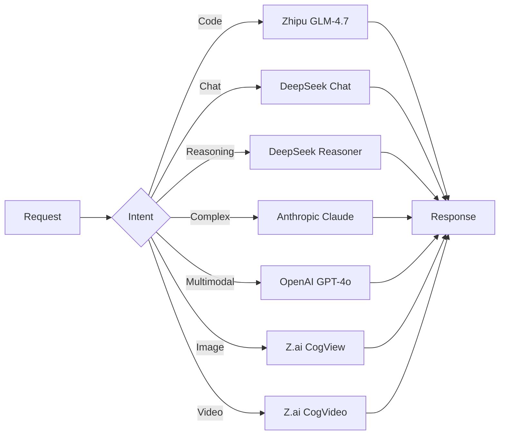
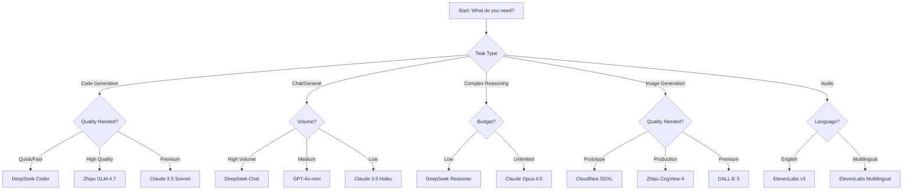

# Multi-Provider Guide

Complete guide to configuring and using AI providers with StudyLoG.AI's multi-model router.

## Table of Contents

1. [Provider Overview](#provider-overview)
2. [Getting API Keys](#getting-api-keys)
3. [Pricing Comparison](#pricing-comparison)
4. [When to Use Each Provider](#when-to-use-each-provider)
5. [Model Selection Guide](#model-selection-guide)
6. [Cost Optimization Strategies](#cost-optimization-strategies)
7. [Troubleshooting](#troubleshooting)

---

## Provider Overview

StudyLoG.AI supports multiple AI providers with automatic fallback routing and cost optimization.

### Supported Providers

| Provider | Type | Models | API Format | Region |
|----------|------|--------|------------|--------|
| **Zhipu AI (Z.ai)** | LLM, Image, Video | GLM-4.x, CogView, CogVideo | OpenAI-compatible | CN |
| **DeepSeek** | LLM | DeepSeek V3, Coder, Reasoner | OpenAI-compatible | Global |
| **Anthropic** | LLM | Claude 3.5/3 Opus | Anthropic | US |
| **OpenAI** | LLM, Image, Audio | GPT-4o, DALL-E, TTS | OpenAI | Global |
| **Google** | LLM | Gemini 1.5 | Google | Global |
| **NVIDIA** | LLM | Llama, Nemotron | OpenAI-compatible | US |
| **Ollama** | LLM | Local models | Ollama | Local |
| **Replicate** | Image, Video | SDXL, FLUX, Video | Custom | US |
| **ElevenLabs** | Audio | Multilingual v2, v3 | Custom | Global |

### Provider Selection Flow



---

## Getting API Keys

### Zhipu AI (Z.ai)

**Website:** https://open.bigmodel.cn/

**Steps:**
1. Visit https://open.bigmodel.cn/
2. Sign up for an account (email or phone)
3. Navigate to API Keys in your dashboard
4. Create a new API key
5. Copy the key (format: `id.secret`)

**Free Tier:**
- New users get free tokens for testing
- No credit card required for initial trial

**Environment Variable:**
```bash
ZHIPU_API_KEY=your_api_key_here
```

**Cost Estimate:**
- GLM-4.7: $0.08 (input) / $0.30 (output) per 1M tokens
- CogView-4: ~$0.015 per image
- CogVideoX: ~$0.10 per second

---

### DeepSeek

**Website:** https://platform.deepseek.com/

**Steps:**
1. Visit https://platform.deepseek.com/
2. Sign up for an account
3. Go to API Keys section
4. Create a new API key
5. Copy the key (format: `sk-...`)

**Free Tier:**
- No free tier, but lowest pricing among commercial providers
- Prepaid credits available

**Environment Variable:**
```bash
DEEPSEEK_API_KEY=your_api_key_here
```

**Cost Estimate:**
- deepseek-chat: $0.14 / $0.28 per 1M tokens
- deepseek-coder: $0.14 / $0.28 per 1M tokens
- deepseek-reasoner: $0.55 / $2.19 per 1M tokens

---

### Anthropic

**Website:** https://console.anthropic.com/

**Steps:**
1. Visit https://console.anthropic.com/
2. Create an account or sign in
3. Navigate to API Keys
4. Generate a new API key
5. Copy the key (format: `sk-ant-...`)

**Free Tier:**
- Limited free credits for new users
- Credit card required for continued use

**Environment Variable:**
```bash
ANTHROPIC_API_KEY=your_api_key_here
```

**Cost Estimate:**
- Claude 3.5 Sonnet: $3.00 / $15.00 per 1M tokens
- Claude 3.5 Haiku: $0.80 / $4.00 per 1M tokens
- Claude Opus 4.5: $15.00 / $75.00 per 1M tokens

---

### OpenAI

**Website:** https://platform.openai.com/

**Steps:**
1. Visit https://platform.openai.com/
2. Sign up for an account
3. Go to API Keys section
4. Create a new secret key
5. Copy the key (format: `sk-...`)

**Free Tier:**
- $5 in free credits for new accounts
- Credit card required

**Environment Variable:**
```bash
OPENAI_API_KEY=your_api_key_here
```

**Cost Estimate:**
- GPT-4o: $2.50 / $10.00 per 1M tokens
- GPT-4o-mini: $0.15 / $0.60 per 1M tokens
- DALL-E 3: $0.04 - $0.12 per image

---

### Google AI

**Website:** https://aistudio.google.com/app/apikey

**Steps:**
1. Visit Google AI Studio
2. Create a Google Cloud project or use existing
3. Enable Generative Language API
4. Create an API key
5. Copy the key

**Free Tier:**
- Generous free tier with rate limits
- Up to 60 requests per minute for free tier

**Environment Variable:**
```bash
GOOGLE_API_KEY=your_api_key_here
```

**Cost Estimate:**
- Gemini 1.5 Pro: $1.25 / $5.00 per 1M tokens
- Gemini 1.5 Flash: $0.075 / $0.30 per 1M tokens
- Gemini 1.5 Pro (2M context): $2.50 / $10.00 per 1M tokens

---

### NVIDIA

**Website:** https://build.nvidia.com/

**Steps:**
1. Visit https://build.nvidia.com/
2. Create an NVIDIA account
3. Navigate to API Keys
4. Generate a new key
5. Copy the key

**Free Tier:**
- No free tier, but competitive pricing
- Prepaid credits available

**Environment Variable:**
```bash
NVIDIA_API_KEY=your_api_key_here
```

**Cost Estimate:**
- Llama 3.1 405B: $0.40 / $0.40 per 1M tokens
- Nemotron 4 340B: $0.40 / $0.40 per 1M tokens

---

### Replicate

**Website:** https://replicate.com/

**Steps:**
1. Visit https://replicate.com/
2. Sign up for an account
3. Go to account settings > API tokens
4. Create a new API token
5. Copy the token

**Free Tier:**
- No monthly fees
- Pay-per-second compute only
- Free credits for new users

**Environment Variable:**
```bash
REPLICATE_API_KEY=your_api_key_here
```

**Cost Estimate:**
- SDXL: ~$0.001 - $0.01 per image
- FLUX: ~$0.02 - $0.05 per image
- Video models: ~$0.10 - $0.50 per second

---

### ElevenLabs

**Website:** https://elevenlabs.io/

**Steps:**
1. Visit https://elevenlabs.io/
2. Sign up for an account
3. Go to Settings > API Key
4. Copy your API key

**Free Tier:**
- 10,000 characters per month free
- Limited to 3 voices

**Environment Variable:**
```bash
ELEVENLABS_API_KEY=your_api_key_here
```

**Cost Estimate:**
- Multilingual v2: $5.00 - $30.00 per 1M characters
- Eleven v3: $15.00 - $30.00 per 1M characters

---

### Ollama (Local)

**Website:** https://ollama.ai/

**Steps:**
1. Download and install Ollama from https://ollama.ai/
2. Start the Ollama service
3. Pull models you want to use:
   ```bash
   ollama pull llama3.1:8b
   ollama pull codellama
   ```
4. Ollama runs on `http://localhost:11434` by default

**Cost:**
- Completely free (local only)
- No API key needed
- Only hardware/electricity costs

**Environment Variable (optional):**
```bash
OLLAMA_URL=http://localhost:11434
```

---

## Pricing Comparison

### LLM Pricing (per 1M tokens)

| Provider | Model | Input | Output | Context | Cost Index |
|----------|-------|-------|--------|---------|------------|
| **Ollama** | llama3.1:8b | $0 | $0 | 8K | 0 (Free) |
| **DeepSeek** | deepseek-chat | $0.14 | $0.28 | 64K | 1 (Best) |
| **DeepSeek** | deepseek-coder | $0.14 | $0.28 | 16K | 1 (Best) |
| **Zhipu** | glm-4-flash | $0.08 | $0.30 | 128K | 2 |
| **Zhipu** | glm-4.7 | $0.08 | $0.30 | 128K | 2 |
| **Google** | gemini-1.5-flash | $0.075 | $0.30 | 1M | 2 |
| **NVIDIA** | llama-3.1-405b | $0.40 | $0.40 | 128K | 3 |
| **OpenAI** | gpt-4o-mini | $0.15 | $0.60 | 128K | 3 |
| **Google** | gemini-1.5-pro | $1.25 | $5.00 | 2M | 4 |
| **Anthropic** | claude-3-5-haiku | $0.80 | $4.00 | 200K | 4 |
| **OpenAI** | gpt-4o | $2.50 | $10.00 | 128K | 5 |
| **Anthropic** | claude-3-5-sonnet | $3.00 | $15.00 | 200K | 5 |
| **DeepSeek** | deepseek-reasoner | $0.55 | $2.19 | 64K | 3 |

### Image Generation Pricing

| Provider | Model | Resolution | Cost per Image |
|----------|-------|------------|----------------|
| **Cloudflare** | SDXL | 1024x1024 | ~$0.001 |
| **Zhipu** | CogView-3+ | 1024x1024 | ~$0.008 |
| **Zhipu** | CogView-4 | 1024x1024 | ~$0.015 |
| **Replicate** | SDXL | 1024x1024 | ~$0.002 |
| **Replicate** | FLUX | 1024x1024 | ~$0.02 |
| **OpenAI** | DALL-E 3 | 1024x1024 | $0.04 |

### Audio Generation Pricing

| Provider | Model | Cost per 1M Characters |
|----------|-------|------------------------|
| **ElevenLabs** | Multilingual v2 | $5 - $30 |
| **ElevenLabs** | Eleven v3 | $15 - $30 |
| **OpenAI** | TTS-1 | $15 |
| **OpenAI** | TTS-1-hd | $30 |

---

## When to Use Each Provider

### Decision Tree



### Use Case Recommendations

| Use Case | Primary Provider | Fallback | Reason |
|----------|------------------|----------|--------|
| **Code Generation** | Zhipu GLM-4.7 | DeepSeek Coder | Optimized for coding |
| **Debugging** | DeepSeek Coder | Claude 3.5 Sonnet | Specialized for code |
| **Explanations** | GPT-4o-mini | DeepSeek Chat | Good at teaching |
| **Tutorials** | GPT-4o | Claude 3.5 Sonnet | Clear explanations |
| **Data Analysis** | Gemini 1.5 Pro | Claude 3.5 Sonnet | Long context |
| **Document Summary** | Gemini 1.5 Pro | GPT-4o | 2M context |
| **Creative Writing** | GPT-4o | Claude 3.5 Sonnet | Creative capabilities |
| **Math/Logic** | DeepSeek Reasoner | Claude Opus | Reasoning focus |
| **Rapid Prototyping** | DeepSeek Chat | GPT-4o-mini | Fast + cheap |
| **Production Code** | Claude 3.5 Sonnet | Zhipu GLM-4.7 | Quality |
| **Image Drafts** | Cloudflare SDXL | Zhipu CogView | Speed |
| **Final Images** | DALL-E 3 | Zhipu CogView-4 | Quality |
| **Voice TTS** | ElevenLabs | OpenAI TTS | Best quality |
| **Local/Privacy** | Ollama | N/A | No data leaves |

---

## Model Selection Guide

### For Coding Tasks

```typescript
// Quick debugging or simple code
{
  provider: "deepseek",
  model: "deepseek-coder",
  temperature: 0.2
}

// Full feature implementation
{
  provider: "zhipu",
  model: "glm-4.7",
  temperature: 0.3
}

// Complex architecture decisions
{
  provider: "anthropic",
  model: "claude-3-5-sonnet",
  temperature: 0.5
}
```

### For Chat/Conversational

```typescript
// High volume, cost-sensitive
{
  provider: "deepseek",
  model: "deepseek-chat",
  temperature: 0.7
}

// Balanced quality and cost
{
  provider: "openai",
  model: "gpt-4o-mini",
  temperature: 0.7
}

// Premium conversation quality
{
  provider: "openai",
  model: "gpt-4o",
  temperature: 0.8
}
```

### For Reasoning Tasks

```typescript
// Step-by-step reasoning
{
  provider: "deepseek",
  model: "deepseek-reasoner",
  temperature: 0.5
}

// Complex multi-step problems
{
  provider: "anthropic",
  model: "claude-opus-4-5",
  temperature: 0.6
}
```

### For Image Generation

```typescript
// Quick prototypes (Tier 1)
{
  provider: "cloudflare",
  model: "sdxl",
  size: "512x512",
  quality: "standard"
}

// Production images (Tier 2)
{
  provider: "zhipu",
  model: "cogview-4",
  size: "1024x1024",
  quality: "hd"
}

// Final renders (Tier 3)
{
  provider: "openai",
  model: "dall-e-3",
  size: "1024x1024",
  quality: "hd"
}
```

### For Long Context Tasks

```typescript
// Up to 200K tokens
{
  provider: "anthropic",
  model: "claude-3-5-sonnet",
  max_tokens: 4096
}

// Up to 2M tokens
{
  provider: "google",
  model: "gemini-1.5-pro",
  max_tokens: 8192
}
```

---

## Cost Optimization Strategies

### 1. Use Cascade Routing

Enable cascade routing to automatically select the cheapest provider for each intent:

```typescript
// In wrangler.toml or environment
CASCADING_ENABLED = "true"
FIRST_MILE_ROUTER_URL = "https://first-mile-router.workers.dev"
```

### 2. Provider Fallback Chain

Order providers by cost (cheapest first):

```typescript
const FALLBACK_CHAIN = [
  'ollama',      // Free (local)
  'zhipu',       // $0.08/$0.30
  'deepseek',    // $0.14/$0.28
  'nvidia',      // $0.40/$0.40
  'google',      // $1.00/$1.00
  'anthropic',   // $3.00/$15.00
  'openai'       // $5.00/$15.00
];
```

### 3. Quality Tier Selection

Use lower quality tiers for prototyping:

```typescript
// Tier mapping
const TIER_MAPPING = {
  prototype: 'cloudflare',  // ~$0.001 per image
  production: 'zhipu',      // ~$0.015 per image
  final: 'openai'           // ~$0.04 per image
};
```

### 4. Response Caching

Enable KV cache to avoid duplicate API calls:

```typescript
// Cache configuration
const CACHE_TTL = {
  code_help: 3600,      // 1 hour
  explanation: 7200,    // 2 hours
  general: 1800         // 30 minutes
};
```

### 5. Token Budgeting

Set per-user token limits:

```typescript
const USER_TIER_LIMITS = {
  free: { dailyTokens: 100000, maxCostPerRequest: 0.01 },
  forge: { dailyTokens: 500000, maxCostPerRequest: 0.05 },
  studio: { dailyTokens: 2000000, maxCostPerRequest: 0.10 },
  lab: { dailyTokens: Infinity, maxCostPerRequest: 1.00 }
};
```

### 6. Cost Tracking

Monitor costs in real-time:

```bash
# Get user costs
curl https://multi-model-router.workers.dev/costs/user_123

# Get cascade savings
curl https://multi-model-router.workers.dev/costs/cascade?userId=user_123
```

### 7. Estimation Before Generation

Always estimate costs before expensive operations:

```typescript
// Get cost estimate
const estimate = await fetch('/v1/costs/estimate', {
  method: 'POST',
  body: JSON.stringify({
    provider: 'zhipu',
    model: 'glm-4.7',
    inputTokens: 1000,
    outputTokens: 500,
    requestType: 'chat'
  })
});

// Confirm with user before proceeding if cost > threshold
if (estimate.estimatedCost > 0.01) {
  const confirmed = await confirmUser(`Cost: $${estimate.estimatedCost}`);
  if (!confirmed) return;
}
```

---

## Troubleshooting

### Common Issues

#### Issue: "Provider not available"

**Cause:** API key not configured or invalid

**Solution:**
```bash
# Check if API key is set
wrangler secret list

# Set the secret
wrangler secret put ZHIPU_API_KEY
```

#### Issue: "Rate limit exceeded"

**Cause:** Too many requests to provider

**Solution:**
1. Enable fallback chain for automatic failover
2. Implement exponential backoff
3. Use cheaper providers for high-volume tasks

#### Issue: High latency

**Cause:** Provider region far from user

**Solution:**
- Use regional providers when possible
- Enable caching for repeated requests
- Consider local Ollama for privacy-critical tasks

#### Issue: Poor quality responses

**Cause:** Wrong model selected for task

**Solution:**
- Use DeepSeek Coder for code tasks
- Use DeepSeek Reasoner for complex reasoning
- Use Claude Opus for premium quality
- Enable cascade routing for automatic selection

#### Issue: Cost overruns

**Cause:** Expensive providers used for simple tasks

**Solution:**
- Enable cascade routing
- Set per-user cost limits
- Use quality tier selector for images
- Monitor costs with `/costs/cascade` endpoint

### Provider-Specific Issues

#### Zhipu AI

| Error | Cause | Solution |
|-------|-------|----------|
| `401 Unauthorized` | Invalid API key | Verify key format: `id.secret` |
| `429 Too Many Requests` | Rate limit | Reduce request frequency |
| `Timeout` | Network issues | Retry with exponential backoff |

#### DeepSeek

| Error | Cause | Solution |
|-------|-------|----------|
| `401 Invalid Token` | Wrong API key | Key format: `sk-...` |
| `Quota Exceeded` | No credits | Prepaid credits required |
| `Model Not Found` | Invalid model name | Use: `deepseek-chat`, `deepseek-coder`, `deepseek-reasoner` |

#### Anthropic

| Error | Cause | Solution |
|-------|-------|----------|
| `401 Unauthorized` | Invalid API key | Key format: `sk-ant-...` |
| `429 Rate Limit` | Too many requests | Implement backoff |
| `400 Invalid Request` | Wrong API format | Use Anthropic format, not OpenAI |

#### OpenAI

| Error | Cause | Solution |
|-------|-------|----------|
| `401 Invalid API Key` | Wrong key | Key format: `sk-...` |
| `429 Rate Limit` | Quota exceeded | Check usage limits |
| `Insufficient Quota` | No credits | Add payment method |

---

## Provider Support Matrix

| Feature | Zhipu | DeepSeek | Anthropic | OpenAI | Google | NVIDIA | Ollama |
|---------|-------|----------|-----------|--------|--------|--------|--------|
| Chat | Yes | Yes | Yes | Yes | Yes | Yes | Yes |
| Streaming | Yes | Yes | Yes | Yes | Yes | Yes | Yes |
| Function Calling | Yes | Yes | Yes | Yes | Yes | Yes | Yes |
| Vision | Yes | No | Yes | Yes | Yes | No | Yes |
| Image Gen | Yes | No | No | Yes | No | No | No |
| Video Gen | Yes | No | No | No | No | No | No |
| Audio Gen | No | No | No | Yes | No | No | No |
| JSON Mode | Yes | Yes | Yes | Yes | Yes | Yes | Yes |
| System Prompt | Yes | Yes | Yes | Yes | Yes | Yes | Yes |

---

## Quick Reference

### Environment Variables

```bash
# LLM Providers
ZHIPU_API_KEY=your_zhipu_key
DEEPSEEK_API_KEY=your_deepseek_key
ANTHROPIC_API_KEY=your_anthropic_key
OPENAI_API_KEY=your_openai_key
GOOGLE_API_KEY=your_google_key
NVIDIA_API_KEY=your_nvidia_key

# Multimodal Providers
REPLICATE_API_KEY=your_replicate_key
ELEVENLABS_API_KEY=your_elevenlabs_key

# Local
OLLAMA_URL=http://localhost:11434

# Cascade Configuration
CASCADING_ENABLED=true
FIRST_MILE_ROUTER_URL=https://first-mile-router.workers.dev
```

### Setting Secrets (Wrangler)

```bash
# Set secret for a worker
cd backend/workers/multi-model-router
wrangler secret put ZHIPU_API_KEY
wrangler secret put DEEPSEEK_API_KEY

# List all secrets
wrangler secret list

# Delete a secret
wrangler secret delete ZHIPU_API_KEY
```

### Testing Configuration

```bash
# Test provider availability
curl https://multi-model-router.workers.dev/providers/health

# Test chat with specific provider
curl -X POST https://multi-model-router.workers.dev/v1/chat/completions \
  -H "Content-Type: application/json" \
  -d '{
    "provider": "zhipu",
    "model": "glm-4.7",
    "messages": [{"role": "user", "content": "Hello!"}]
  }'

# Get cost estimate
curl -X POST https://multi-model-router.workers.dev/v1/costs/estimate \
  -H "Content-Type: application/json" \
  -d '{
    "provider": "deepseek",
    "model": "deepseek-chat",
    "inputTokens": 1000,
    "outputTokens": 500,
    "requestType": "chat"
  }'
```

---

**Next Steps:**
- See [API_REFERENCE.md](./API_REFERENCE.md) for complete API documentation
- See [DEPLOYMENT.md](./DEPLOYMENT.md) for deployment instructions
- See [PROVIDER_EXPANSION_PLAN.md](./PROVIDER_EXPANSION_PLAN.md) for roadmap
