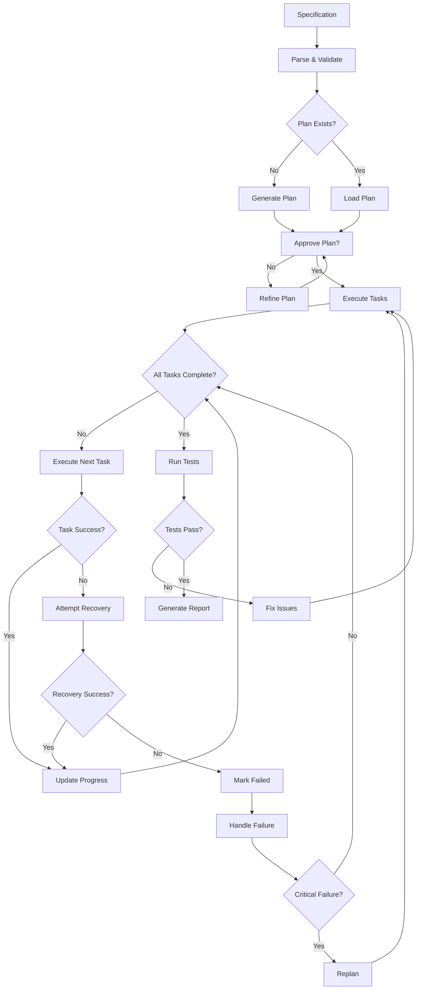
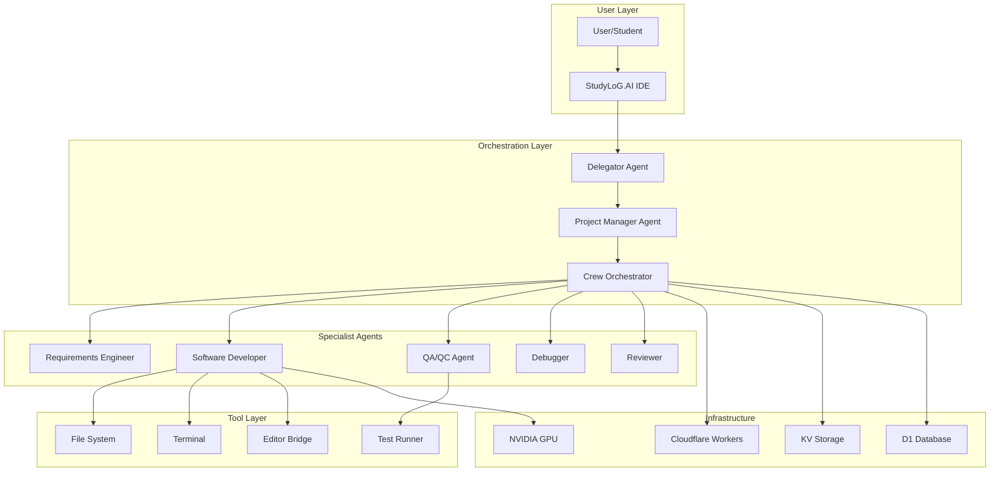
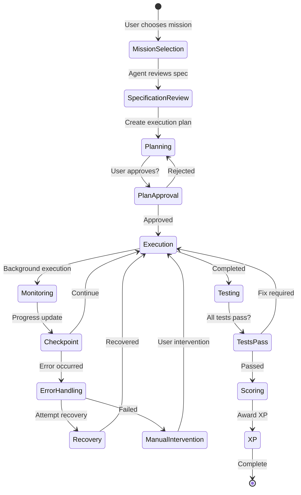

# Spec-Driven Development Research: Autonomous Coding Agents & Testing Systems

**Version:** 1.0.0
**Date:** January 10, 2026
**Authors:** StudyLoG.AI Research Team
**Status:** Active Research Document

---

## Table of Contents

1. [Executive Summary](#executive-summary)
2. [Agent Architecture](#agent-architecture)
3. [Task Decomposition](#task-decomposition)
4. [Planning Patterns](#planning-patterns)
5. [Tool Abstraction](#tool-abstraction)
6. [Testing Integration](#testing-integration)
7. [Error Recovery](#error-recovery)
8. [Background Execution](#background-execution)
9. [Orchestration](#orchestration)
10. [Implementation Guidance](#implementation-guidance)
11. [Integration with Cloudflare/NVIDIA Stack](#integration-with-cloudflarenvidia-stack)
12. [Gamification Patterns](#gamification-patterns)
13. [References](#references)

---

## Executive Summary

This document consolidates research on leading autonomous coding agent systems and testing platforms as of early 2026. It provides a comprehensive analysis of:

- **OpenHands** (formerly OpenDevin) - Open-source AI software engineer
- **Replit Agent** - IDE-integrated autonomous development
- **Devin AI** (Cognition) - Commercial autonomous coding agent
- **Qodo** (formerly CodiumAI) - Automated testing and code quality
- **Orchestrator Frameworks** - CrewAI, AutoGen, Factory AI, RooCode

The research aims to inform the development of **Spec-Driven Development** capabilities for StudyLoG.AI, enabling students to:
- Define specifications that autonomous agents can execute
- Watch agents plan, code, test, and iterate in real-time
- Learn from AI agent decision-making patterns
- Earn XP through successful autonomous coding missions

---

## 1. Agent Architecture

### 1.1 Core Agent Components

Based on research across OpenHands, Replit Agent, and Devin AI, autonomous coding agents share a common architectural pattern:

```typescript
/**
 * Core Agent Architecture Interface
 * Derived from OpenHands, Replit Agent, and Devin AI research
 */
interface AutonomousAgent {
  // Identity and Purpose
  id: string;
  role: AgentRole;
  goal: string;
  backstory?: string;

  // Cognitive Capabilities
  llm: LanguageModel;
  memory: AgentMemory;

  // Tools and Capabilities
  tools: Tool[];
  allowDelegation: boolean;

  // Execution Parameters
  maxIterations: number;
  maxExecutionTime: number;
  verbose: boolean;

  // Lifecycle
  initialize(): Promise<void>;
  execute(task: Task): Promise<TaskResult>;
  reflect(result: TaskResult): Promise<Reflection>;
}

/**
 * Agent Roles observed across major platforms
 */
enum AgentRole {
  // OpenHands-style specialized agents
  REQUIREMENTS_ENGINE = 'RequirementsEngineer',
  PROJECT_MANAGER = 'ProjectManager',
  SOFTWARE_DEVELOPER = 'SoftwareDeveloper',
  RELEASE_ENGINEER = 'ReleaseEngine',
  QA_QC_AGENT = 'QAAgent',

  // Replit Agent roles
  PLANNER = 'Planner',
  EXECUTOR = 'Executor',
  REVIEWER = 'Reviewer',

  // Devin AI composite roles
  ARCHITECT = 'Architect',
  DEVELOPER = 'Developer',
  DEBUGGER = 'Debugger',

  // StudyLoG.AI specific
  COGNITIVE_MILL_GUIDE = 'CognitiveMillGuide',
  INTELLIGENCE_RANCHER = 'IntelligenceRancher',
  SITKA_SOUND_ECologist = 'SitkaSoundEcologist'
}
```

### 1.2 Memory Systems

All studied agents implement sophisticated memory systems:

```typescript
/**
 * Agent Memory Architecture
 * Combines patterns from OpenHands, AutoGen, and CrewAI
 */
interface AgentMemory {
  // Short-term working memory
  shortTerm: ShortTermMemory;

  // Long-term persistent memory
  longTerm: LongTermMemory;

  // Entity tracking (people, places, things)
  entityMemory: EntityMemory;

  // Contextual memory for current task
  contextual: ContextualMemory;
}

interface ShortTermMemory {
  bufferSize: number;
  addToMemory(event: MemoryEvent): void;
  getRecentMemories(count: number): MemoryEvent[];
  summarize(): string;
}

interface LongTermMemory {
  storage: VectorStore;  // RAG-based retrieval
  add(memory: PersistentMemory): Promise<void>;
  search(query: string, k: number): Promise<PersistentMemory[]>;
}

interface EntityMemory {
  track(entity: Entity): void;
  update(entityId: string, attributes: Record<string, any>): void;
  recall(entityId: string): Entity | null;
  recallByType(entityType: string): Entity[];
}
```

### 1.3 The Delegator Pattern (OpenHands)

OpenHands uses a **Delegator Agent** at its core, which manages user interactions and routes tasks:

```typescript
/**
 * Delegator Agent Pattern from OpenHands
 * Central coordinator for task routing and agent swarm management
 */
class DelegatorAgent implements AutonomousAgent {
  private agentSwarm: Map<AgentRole, AutonomousAgent>;
  private projectContext: Map<string, ProjectState>;

  async initialize(): Promise<void> {
    // Initialize specialized agents
    this.agentSwarm.set(AgentRole.REQUIREMENTS_ENGINE, new RequirementsEngine());
    this.agentSwarm.set(AgentRole.PROJECT_MANAGER, new ProjectManager());
    this.agentSwarm.set(AgentRole.SOFTWARE_DEVELOPER, new SoftwareDeveloper());
    this.agentSwarm.set(AgentRole.QA_QC_AGENT, new QAAgent());
  }

  async execute(task: Task): Promise<TaskResult> {
    // 1. Interpret user intent
    const intent = await this.interpretIntent(task);

    // 2. Determine required capabilities
    const requiredAgents = this.determineAgentRequirements(intent);

    // 3. Delegate to specialist swarm
    const swarmResults = await this.delegateToSwarm(task, requiredAgents);

    // 4. Synthesize results
    return this.synthesizeResults(swarmResults);
  }

  private async delegateToSwarm(
    task: Task,
    agents: AgentRole[]
  ): Promise<Map<AgentRole, TaskResult>> {
    const results = new Map();

    for (const role of agents) {
      const agent = this.agentSwarm.get(role);
      if (agent) {
        const subtask = this.createSubtask(task, role);
        results.set(role, await agent.execute(subtask));
      }
    }

    return results;
  }
}
```

---

## 2. Task Decomposition

### 2.1 Hierarchical Task Decomposition

All studied systems use hierarchical decomposition to break complex goals into executable steps:

```typescript
/**
 * Task Decomposition Framework
 * Derived from Devin AI and OpenHands task breakdown strategies
 */
interface TaskDecomposition {
  rootGoal: Goal;
  taskTree: TaskNode;
  executionOrder: string[];
  dependencies: Map<string, string[]>;
}

interface TaskNode {
  id: string;
  goal: string;
  status: TaskStatus;
  subtasks: TaskNode[];
  estimatedDuration?: number;
  requiredCapabilities: string[];
}

enum TaskStatus {
  PENDING = 'pending',
  IN_PROGRESS = 'in_progress',
  BLOCKED = 'blocked',
  COMPLETED = 'completed',
  FAILED = 'failed',
  SKIPPED = 'skipped'
}

/**
 * Hierarchical Task Network (HTN) Decomposition
 * Pattern observed in Devin AI and Microsoft AutoGen
 */
class HierarchicalDecomposer {
  decompose(goal: Goal): TaskDecomposition {
    // 1. Identify main phases
    const phases = this.identifyPhases(goal);

    // 2. Break each phase into subtasks
    const taskTree = this.buildTaskTree(phases);

    // 3. Establish dependencies
    const dependencies = this.establishDependencies(taskTree);

    // 4. Determine execution order
    const executionOrder = this.topologicalSort(taskTree, dependencies);

    return {
      rootGoal: goal,
      taskTree,
      executionOrder,
      dependencies
    };
  }

  private identifyPhases(goal: Goal): Phase[] {
    // Common phases across coding tasks
    const commonPhases = [
      Phase.REQUIREMENTS_ANALYSIS,
      Phase.ARCHITECTURE_DESIGN,
      Phase.IMPLEMENTATION,
      Phase.TESTING,
      Phase.DOCUMENTATION,
      Phase.DEPLOYMENT
    ];

    // Filter and customize based on goal type
    return this.filterRelevantPhases(goal, commonPhases);
  }

  private buildTaskTree(phases: Phase[]): TaskNode {
    return {
      id: 'root',
      goal: 'Complete the project',
      status: TaskStatus.PENDING,
      subtasks: phases.map(phase => this.phaseToTask(phase)),
      requiredCapabilities: []
    };
  }
}
```

### 2.2 Progressive Task Refinement

```typescript
/**
 * Progressive Task Refinement
 * Pattern from Replit Agent's planning system
 */
class ProgressiveRefiner {
  async refinePlan(
    initialGoal: string,
    context: ProjectContext
  ): Promise<RefinedPlan> {
    let currentPlan = await this.createInitialPlan(initialGoal);
    let refinementCount = 0;
    const maxRefinements = 5;

    while (await this.needsRefinement(currentPlan) && refinementCount < maxRefinements) {
      // Identify weaknesses
      const weaknesses = await this.analyzePlan(currentPlan, context);

      // Refine based on feedback
      currentPlan = await this.applyRefinements(currentPlan, weaknesses);

      refinementCount++;
    }

    return currentPlan;
  }

  private async analyzePlan(
    plan: RefinedPlan,
    context: ProjectContext
  ): Promise<PlanWeakness[]> {
    const weaknesses: PlanWeakness[] = [];

    // Check for ambiguity
    const ambiguousTasks = await this.findAmbiguousTasks(plan);
    weaknesses.push(...ambiguousTasks);

    // Check for missing dependencies
    const missingDeps = await this.findMissingDependencies(plan, context);
    weaknesses.push(...missingDeps);

    // Check for test coverage gaps
    const testGaps = await this.findTestGaps(plan);
    weaknesses.push(...testGaps);

    return weaknesses;
  }
}
```

---

## 3. Planning Patterns

### 3.1 The Planner-Executor Pattern

All studied systems separate planning from execution:

```typescript
/**
 * Planner-Executor Pattern
 * Observed across Replit Agent, Devin AI, and OpenHands
 */
interface PlannerExecutorSystem {
  planner: Planner;
  executor: Executor;
  monitor: ExecutionMonitor;
}

class Planner {
  async createPlan(specification: Specification): Promise<ExecutionPlan> {
    // 1. Understand the specification
    const understanding = await this.understandSpec(specification);

    // 2. Identify constraints and requirements
    const constraints = await this.identifyConstraints(understanding);

    // 3. Generate task sequence
    const tasks = await this.generateTasks(understanding, constraints);

    // 4. Validate plan feasibility
    const validation = await this.validatePlan({ understanding, tasks });

    if (!validation.feasible) {
      // Iteratively refine
      return await this.refinePlan({ understanding, tasks }, validation.issues);
    }

    return { understanding, tasks, validation };
  }

  private async generateTasks(
    understanding: SpecUnderstanding,
    constraints: Constraint[]
  ): Promise<Task[]> {
    const tasks: Task[] = [];

    // Generate setup tasks
    tasks.push(...await this.generateSetupTasks(understanding, constraints));

    // Generate core implementation tasks
    tasks.push(...await this.generateImplementationTasks(understanding, constraints));

    // Generate verification tasks
    tasks.push(...await this.generateVerificationTasks(understanding, constraints));

    // Establish dependencies
    return this.establishDependencies(tasks);
  }
}

class Executor {
  async executePlan(plan: ExecutionPlan): Promise<ExecutionResult> {
    const results: TaskResult[] = [];

    for (const task of plan.tasks) {
      // Check if task dependencies are satisfied
      if (!this.areDependenciesSatisfied(task, results)) {
        continue; // Skip for now, will retry later
      }

      // Execute the task
      const result = await this.executeTask(task);
      results.push(result);

      // If task failed, determine recovery strategy
      if (result.status === TaskStatus.FAILED) {
        const recovery = await this.planRecovery(task, result);
        if (recovery.strategy !== RecoveryStrategy.ABORT) {
          await this.executeRecovery(recovery);
        }
      }
    }

    return {
      completedTasks: results.filter(r => r.status === TaskStatus.COMPLETED),
      failedTasks: results.filter(r => r.status === TaskStatus.FAILED),
      overallStatus: this.determineOverallStatus(results)
    };
  }
}
```

### 3.2 Dynamic Replanning

```typescript
/**
 * Dynamic Replanning Strategy
 * Pattern from Devin AI and OpenHands for handling execution changes
 */
class DynamicPlanner {
  async adaptPlan(
    currentPlan: ExecutionPlan,
    executionState: ExecutionState
  ): Promise<ExecutionPlan> {
    // Determine if replanning is needed
    if (!await this.shouldReplan(currentPlan, executionState)) {
      return currentPlan;
    }

    // Analyze what changed
    const changes = await this.analyzeChanges(currentPlan, executionState);

    // Modify plan accordingly
    return await this.modifyPlan(currentPlan, changes);
  }

  private async shouldReplan(
    plan: ExecutionPlan,
    state: ExecutionState
  ): Promise<boolean> {
    // Replan if:
    // 1. Tasks are failing repeatedly
    if (this.hasRepeatedFailures(state)) return true;

    // 2. New information invalidates assumptions
    if (await this.hasInvalidatedAssumptions(plan, state)) return true;

    // 3. User requirements changed
    if (await this.haveRequirementsChanged(plan, state)) return true;

    // 4. Better approach discovered
    if (await this.hasBetterApproach(plan, state)) return true;

    return false;
  }
}
```

### 3.3 Workflow DAG / State Machine Orchestration



```typescript
/**
 * State Machine Orchestration
 * Based on Azure Architecture Center patterns and CrewAI workflows
 */
enum OrchestrationState {
  IDLE = 'idle',
  PLANNING = 'planning',
  PLAN_APPROVAL = 'plan_approval',
  EXECUTING = 'executing',
  RECOVERING = 'recovering',
  TESTING = 'testing',
  COMPLETED = 'completed',
  FAILED = 'failed'
}

class WorkflowOrchestrator {
  private currentState: OrchestrationState = OrchestrationState.IDLE;
  private stateTransitions: Map<OrchestrationState, OrchestrationState[]> = new Map([
    [OrchestrationState.IDLE, [OrchestrationState.PLANNING]],
    [OrchestrationState.PLANNING, [OrchestrationState.PLAN_APPROVAL]],
    [OrchestrationState.PLAN_APPROVAL, [OrchestrationState.PLANNING, OrchestrationState.EXECUTING]],
    [OrchestrationState.EXECUTING, [OrchestrationState.RECOVERING, OrchestrationState.TESTING, OrchestrationState.FAILED]],
    [OrchestrationState.RECOVERING, [OrchestrationState.EXECUTING, OrchestrationState.FAILED]],
    [OrchestrationState.TESTING, [OrchestrationState.EXECUTING, OrchestrationState.COMPLETED]],
    [OrchestrationState.FAILED, [OrchestrationState.PLANNING, OrchestrationState.IDLE]],
    [OrchestrationState.COMPLETED, [OrchestrationState.IDLE]]
  ]);

  async transition(targetState: OrchestrationState): Promise<boolean> {
    const allowedTransitions = this.stateTransitions.get(this.currentState) || [];

    if (allowedTransitions.includes(targetState)) {
      await this.onExit(this.currentState);
      this.currentState = targetState;
      await this.onEnter(targetState);
      return true;
    }

    return false;
  }

  async execute(specification: Specification): Promise<ExecutionResult> {
    await this.transition(OrchestrationState.PLANNING);

    const plan = await this.planner.createPlan(specification);

    await this.transition(OrchestrationState.PLAN_APPROVAL);

    if (await this.requiresApproval(plan)) {
      const approved = await this.requestApproval(plan);
      if (!approved) {
        await this.transition(OrchestrationState.PLANNING);
        return await this.execute(specification); // Retry planning
      }
    }

    await this.transition(OrchestrationState.EXECUTING);

    const result = await this.executor.executePlan(plan);

    if (result.overallStatus === ExecutionStatus.SUCCESS) {
      await this.transition(OrchestrationState.TESTING);

      const testResult = await this.runTests(result);

      if (testResult.passed) {
        await this.transition(OrchestrationState.COMPLETED);
        return { ...result, testResult };
      } else {
        await this.transition(OrchestrationState.EXECUTING);
        return await this.fixTestFailures(testResult, plan);
      }
    } else {
      await this.transition(OrchestrationState.FAILED);

      const shouldRetry = await this.shouldReplan(result);
      if (shouldRetry) {
        await this.transition(OrchestrationState.PLANNING);
        return await this.execute(specification); // Retry with new plan
      }

      return result;
    }
  }
}
```

---

## 4. Tool Abstraction

### 4.1 File System Abstraction

Research indicates that specialized file system abstractions are critical for agent reliability:

```typescript
/**
 * Agent File System (AgentFS)
 * Pattern derived from Turso.tech AgentFS research and TypeScript SDK studies
 */
interface AgentFileSystem {
  // Core operations
  read(path: string): Promise<FileContent>;
  write(path: string, content: string): Promise<void>;
  exists(path: string): Promise<boolean>;
  list(path: string): Promise<FileInfo[]>;

  // Safe operations
  readSafe(path: string): Promise<SafeFileContent>;
  writeSafe(path: string, content: string): Promise<WriteResult>;

  // Working directory management
  setWorkingDirectory(path: string): void;
  getWorkingDirectory(): string;

  // Sandboxing
  createSandbox(allowedPaths: string[]): Sandbox;
}

class SafeFileSystem implements AgentFileSystem {
  private allowedPaths: Set<string>;
  private operationLog: FileOperation[];

  constructor(allowedPaths: string[]) {
    this.allowedPaths = new Set(allowedPaths);
    this.operationLog = [];
  }

  async read(path: string): Promise<FileContent> {
    this.validatePath(path);
    this.logOperation({ type: 'read', path, timestamp: Date.now() });

    // Implement actual file reading
    return {
      path,
      content: await this.readFromFilesystem(path),
      metadata: await this.getMetadata(path)
    };
  }

  async writeSafe(path: string, content: string): Promise<WriteResult> {
    this.validatePath(path);

    // Create backup before writing
    const backup = await this.createBackup(path);

    try {
      // Perform write
      await this.writeToFilesystem(path, content);

      // Verify write was successful
      const verification = await this.verifyWrite(path, content);

      this.logOperation({ type: 'write', path, timestamp: Date.now(), backup });

      return {
        success: true,
        backup,
        verification
      };
    } catch (error) {
      // Rollback on failure
      if (backup) {
        await this.restoreBackup(path, backup);
      }

      return {
        success: false,
        error: error.message,
        backup
      };
    }
  }

  private validatePath(path: string): void {
    const resolvedPath = this.resolvePath(path);

    // Check if path is allowed
    const isAllowed = Array.from(this.allowedPaths).some(allowed =>
      resolvedPath.startsWith(allowed)
    );

    if (!isAllowed) {
      throw new Error(`Path ${path} is not allowed`);
    }

    // Prevent path traversal attacks
    if (resolvedPath.includes('..')) {
      throw new Error(`Path traversal detected: ${path}`);
    }
  }
}
```

### 4.2 Terminal/Shell Abstraction

```typescript
/**
 * Terminal Abstraction for Agent Use
 * Pattern from OpenHands and Replit Agent shell integration
 */
interface AgentTerminal {
  // Command execution
  execute(command: string, options?: CommandOptions): Promise<CommandResult>;
  executeInteractive(command: string): Promise<InteractiveSession>;

  // Session management
  createSession(): TerminalSession;
  attachSession(sessionId: string): TerminalSession;

  // Safety
  validateCommand(command: string): ValidationResult;
  sanitize(command: string): string;
}

class SandboxedTerminal implements AgentTerminal {
  private allowedCommands: Set<string>;
  private sessionHistory: Map<string, CommandResult[]>;

  constructor(allowedCommands: string[]) {
    this.allowedCommands = new Set(allowedCommands);
    this.sessionHistory = new Map();
  }

  async execute(command: string, options?: CommandOptions): Promise<CommandResult> {
    // Validate command
    const validation = this.validateCommand(command);
    if (!validation.safe) {
      return {
        exitCode: -1,
        stdout: '',
        stderr: `Command rejected: ${validation.reason}`,
        blocked: true
      };
    }

    // Set resource limits
    const limits = {
      timeout: options?.timeout || 30000,
      memory: options?.maxMemory || 512 * 1024 * 1024, // 512MB
    };

    // Execute with timeout
    try {
      const result = await this.executeWithLimits(command, limits);

      // Log for audit
      this.logCommand(command, result);

      return result;
    } catch (error) {
      return {
        exitCode: -1,
        stdout: '',
        stderr: error.message,
        timedOut: error.name === 'TimeoutError'
      };
    }
  }

  validateCommand(command: string): ValidationResult {
    const baseCommand = command.split(' ')[0];

    // Check against whitelist
    if (!this.allowedCommands.has(baseCommand)) {
      return {
        safe: false,
        reason: `Command '${baseCommand}' is not allowed`
      };
    }

    // Check for dangerous patterns
    const dangerousPatterns = [
      /rm\s+-rf?\s+\//,  // Don't allow deleting root
      />.*\/etc\//,       // Don't allow writing to system files
      /curl.*\|.*sh/,     // Don't allow piping to shell
      /eval\s*\(/,        // Don't allow eval
    ];

    for (const pattern of dangerousPatterns) {
      if (pattern.test(command)) {
        return {
          safe: false,
          reason: `Command matches dangerous pattern: ${pattern}`
        };
      }
    }

    return { safe: true };
  }
}
```

### 4.3 Editor/IDE Abstraction

```typescript
/**
 * Editor Abstraction for Agent Operations
 * Pattern from Replit Agent and VS Code agent integrations
 */
interface AgentEditor {
  // File operations
  openFile(path: string): Promise<EditorDocument>;
  saveFile(path: string, content: string): Promise<void>;

  // Edit operations
  applyEdit(edit: TextEdit): Promise<void>;
  applyEdits(edits: TextEdit[]): Promise<void>;

  // Navigation
  goToLine(document: string, line: number): Promise<void>;
  goToDefinition(symbol: string): Promise<Location>;
  findReferences(symbol: string): Promise<Location[]>;

  // Code understanding
  getSemanticTokens(document: string): Promise<Token[]>;
  getDiagnostics(document: string): Promise<Diagnostic[]>;
  getSymbols(document: string): Promise<SymbolInformation[]>;
}

class TheiaEditorBridge implements AgentEditor {
  private theiaBridge: WebSocket;
  private documentCache: Map<string, EditorDocument>;

  async applyEdit(edit: TextEdit): Promise<void> {
    const document = await this.openFile(edit.document);

    // Apply edit with proper undo support
    await this.sendToTheia({
      type: 'applyEdit',
      document: edit.document,
      edits: [edit],
      recordUndo: true
    });

    // Verify edit was applied correctly
    const updated = await this.openFile(edit.document);
    if (!this.verifyEdit(document, updated, edit)) {
      throw new Error('Edit verification failed');
    }
  }

  async getDiagnostics(document: string): Promise<Diagnostic[]> {
    const response = await this.sendToTheia({
      type: 'getDiagnostics',
      document
    });

    return response.diagnostics.map((d: any) => ({
      range: d.range,
      severity: d.severity,
      message: d.message,
      source: d.source
    }));
  }
}
```

---

## 5. Testing Integration

### 5.1 Qodo-Style Automated Test Generation

```typescript
/**
 * Qodo-Inspired Test Generation System
 * Based on Qodo Cover and Meta's TestGen-LLM
 */
class AutomatedTestGenerator {
  private llm: LanguageModel;
  private codeAnalyzer: CodeAnalyzer;

  async generateTests(
    sourceCode: SourceFile,
    existingTests?: TestFile[]
  ): Promise<GeneratedTestSuite> {
    // 1. Analyze source code
    const analysis = await this.analyzeSource(sourceCode);

    // 2. Identify uncovered branches
    const uncoveredBranches = await this.identifyUncoveredBranches(
      analysis,
      existingTests || []
    );

    // 3. Generate test cases for uncovered paths
    const testCases = await this.generateTestCasesForBranches(
      sourceCode,
      uncoveredBranches
    );

    // 4. Generate assertions based on code behavior
    const assertions = await this.generateAssertions(
      sourceCode,
      testCases
    );

    // 5. Assemble test file
    return this.assembleTestFile({
      source: sourceCode,
      testCases,
      assertions,
      imports: this.determineImports(sourceCode, testCases)
    });
  }

  private async generateTestCasesForBranches(
    source: SourceFile,
    branches: CodeBranch[]
  ): Promise<TestCase[]> {
    const testCases: TestCase[] = [];

    for (const branch of branches) {
      const prompt = this.buildTestCasePrompt(source, branch);

      const generated = await this.llm.generate({
        prompt,
        maxTokens: 500,
        temperature: 0.2 // Low temperature for consistent test generation
      });

      const parsed = this.parseTestCase(generated, branch);
      testCases.push(...parsed);
    }

    return testCases;
  }

  private async generateAssertions(
    source: SourceFile,
    testCases: TestCase[]
  ): Promise<Assertion[]> {
    const assertions: Assertion[] = [];

    for (const testCase of testCases) {
      // Analyze expected behavior from code
      const expectedBehavior = await this.inferExpectedBehavior(source, testCase);

      // Generate assertions based on behavior
      const assertion = await this.llm.generate({
        prompt: this.buildAssertionPrompt(source, testCase, expectedBehavior),
        maxTokens: 200,
        temperature: 0.1
      });

      assertions.push(this.parseAssertion(assertion));
    }

    return assertions;
  }
}
```

### 5.2 Coverage Calculation

```typescript
/**
 * Code Coverage Calculator
 * Qodo-style coverage analysis
 */
class CoverageCalculator {
  async calculateCoverage(
    sourceFiles: SourceFile[],
    testFiles: TestFile[]
  ): Promise<CoverageReport> {
    const reports: FileCoverage[] = [];

    for (const source of sourceFiles) {
      const coverage = await this.analyzeFileCoverage(source, testFiles);
      reports.push(coverage);
    }

    return {
      files: reports,
      summary: this.calculateSummary(reports),
      uncoveredLines: this.aggregateUncoveredLines(reports),
      branchCoverage: this.calculateBranchCoverage(reports)
    };
  }

  private async analyzeFileCoverage(
    source: SourceFile,
    tests: TestFile[]
  ): Promise<FileCoverage> {
    // Parse source code
    const ast = this.parseSource(source);

    // Extract all executable lines
    const executableLines = this.extractExecutableLines(ast);

    // Find which lines are covered by tests
    const coveredLines = await this.findCoveredLines(
      source,
      tests,
      executableLines
    );

    // Calculate branch coverage
    const branches = this.extractBranches(ast);
    const coveredBranches = await this.findCoveredBranches(
      source,
      tests,
      branches
    );

    return {
      filePath: source.path,
      lineCoverage: coveredLines.length / executableLines.length,
      branchCoverage: coveredBranches.length / branches.length,
      uncoveredLines: executableLines.filter(l => !coveredLines.includes(l)),
      partiallyCoveredBranches: branches.filter(b =>
        this.isPartiallyCovered(b, coveredBranches)
      )
    };
  }
}
```

### 5.3 Test Execution and Validation

```typescript
/**
 * Test Runner with AI-Assisted Validation
 * Pattern from Qodo and CI/CD integration best practices
 */
class TestRunner {
  async runTests(
    testSuite: TestSuite,
    options?: TestRunOptions
  ): Promise<TestRunResult> {
    const startTime = Date.now();

    // 1. Compile/test setup
    await this.setupTestEnvironment(testSuite);

    // 2. Execute tests
    const results = await this.executeTests(testSuite, options);

    // 3. Analyze failures with AI
    const analyzedFailures = await this.analyzeFailures(results.failures);

    // 4. Generate fixes if possible
    const fixes = await this.generateFixes(analyzedFailures);

    return {
      duration: Date.now() - startTime,
      passed: results.passed,
      failures: results.failures,
      analyzedFailures,
      fixes,
      coverage: await this.calculateCoverage(testSuite)
    };
  }

  private async analyzeFailures(
    failures: TestFailure[]
  ): Promise<AnalyzedFailure[]> {
    const analyzed: AnalyzedFailure[] = [];

    for (const failure of failures) {
      const analysis = await this.llm.generate({
        prompt: this.buildFailureAnalysisPrompt(failure),
        maxTokens: 500,
        temperature: 0.3
      });

      analyzed.push({
        ...failure,
        rootCause: this.extractRootCause(analysis),
        suggestedFix: this.extractSuggestedFix(analysis),
        fixComplexity: this.estimateFixComplexity(analysis)
      });
    }

    return analyzed;
  }

  private async generateFixes(
    analyzedFailures: AnalyzedFailure[]
  ): Promise<GeneratedFix[]> {
    const fixes: GeneratedFix[] = [];

    for (const failure of analyzedFailures) {
      // Only attempt fixes for low complexity issues
      if (failure.fixComplexity === FixComplexity.LOW) {
        const fix = await this.llm.generate({
          prompt: this.buildFixPrompt(failure),
          maxTokens: 1000,
          temperature: 0.2
        });

        fixes.push({
          failureId: failure.id,
          code: fix,
          confidence: this.calculateConfidence(fix),
          verificationPlan: this.generateVerificationPlan(failure, fix)
        });
      }
    }

    return fixes;
  }
}
```

---

## 6. Error Recovery

### 6.1 Self-Correction Mechanisms

```typescript
/**
 * Error Recovery Framework
 * Derived from research on PALADIN, Reflexion, and autonomous agents
 */
interface ErrorRecoverySystem {
  detect(error: ExecutionError): ErrorType;
  planRecovery(error: ExecutionError): RecoveryPlan;
  executeRecovery(plan: RecoveryPlan): Promise<RecoveryResult>;
  learnFromRecovery(result: RecoveryResult): void;
}

enum ErrorType {
  SYNTAX = 'syntax',
  RUNTIME = 'runtime',
  LOGIC = 'logic',
  DEPENDENCY = 'dependency',
  NETWORK = 'network',
  PERMISSION = 'permission',
  TIMEOUT = 'timeout'
}

enum RecoveryStrategy {
  RETRY = 'retry',
  FALLBACK = 'fallback',
  ALTERNATIVE_APPROACH = 'alternative',
  HUMAN_INTERVENTION = 'human_intervention',
  ABORT = 'abort'
}

class ReflexionRecoverySystem implements ErrorRecoverySystem {
  private reflectionHistory: Map<string, Reflection[]>;

  async detect(error: ExecutionError): Promise<ErrorType> {
    // Use LLM to classify error type
    const classification = await this.llm.generate({
      prompt: this.buildErrorClassificationPrompt(error),
      maxTokens: 50,
      temperature: 0.1
    });

    return this.parseErrorType(classification);
  }

  async planRecovery(error: ExecutionError): Promise<RecoveryPlan> {
    const errorType = await this.detect(error);
    const context = await this.gatherContext(error);

    // Generate recovery plan based on error type and context
    const plan = await this.generateRecoveryPlan(errorType, error, context);

    // Validate plan is safe
    const validation = await this.validateRecoveryPlan(plan);

    if (!validation.safe) {
      return this.createSafeRecoveryPlan(error);
    }

    return plan;
  }

  async executeRecovery(plan: RecoveryPlan): Promise<RecoveryResult> {
    let attempt = 0;
    const maxAttempts = plan.maxAttempts || 3;

    while (attempt < maxAttempts) {
      try {
        const result = await this.executePlanStep(plan, attempt);

        if (result.success) {
          // Record successful recovery for learning
          await this.learnFromRecovery({
            plan,
            attempt,
            result,
            successful: true
          });

          return result;
        }
      } catch (error) {
        // Update plan based on failure
        plan = await this.updatePlanAfterFailure(plan, error, attempt);
      }

      attempt++;
    }

    // All attempts failed
    return {
      success: false,
      reason: 'Max attempts exceeded',
      requiresHumanIntervention: true
    };
  }

  private async generateRecoveryPlan(
    errorType: ErrorType,
    error: ExecutionError,
    context: ExecutionContext
  ): Promise<RecoveryPlan> {
    // Build prompt for recovery planning
    const prompt = this.buildRecoveryPrompt(errorType, error, context);

    // Include past successful recoveries
    const pastRecoveries = this.getPastRecoveries(errorType);

    const generation = await this.llm.generate({
      prompt,
      context: {
        pastRecoveries,
        context,
        reflection: await self.generateReflection(error, context)
      },
      maxTokens: 1000,
      temperature: 0.5
    });

    return this.parseRecoveryPlan(generation);
  }

  private async selfReflect(
    error: ExecutionError,
    context: ExecutionContext
  ): Promise<Reflection> {
    const prompt = this.buildReflectionPrompt(error, context);

    const reflection = await this.llm.generate({
      prompt,
      maxTokens: 500,
      temperature: 0.7 // Higher temperature for creative reflection
    });

    return {
      timestamp: Date.now(),
      error,
      reflection,
      context,
      lessonsLearned: this.extractLessons(reflection)
    };
  }
}
```

### 6.2 Rollback Mechanisms

```typescript
/**
 * Rollback System for Autonomous Code Changes
 * Pattern from research on autonomous deployment systems
 */
class RollbackManager {
  private snapshots: Map<string, ProjectSnapshot>;
  private rollbackHistory: RollbackHistory[];

  async createSnapshot(projectPath: string): Promise<string> {
    const snapshotId = this.generateSnapshotId();

    const snapshot: ProjectSnapshot = {
      id: snapshotId,
      timestamp: Date.now(),
      projectPath,
      files: await this.captureFileState(projectPath),
      dependencies: await this.captureDependencyState(projectPath),
      tests: await this.captureTestResults(projectPath)
    };

    this.snapshots.set(snapshotId, snapshot);

    return snapshotId;
  }

  async rollback(snapshotId: string): Promise<RollbackResult> {
    const snapshot = this.snapshots.get(snapshotId);

    if (!snapshot) {
      return {
        success: false,
        reason: 'Snapshot not found'
      };
    }

    try {
      // Restore file state
      await this.restoreFiles(snapshot);

      // Restore dependencies
      await this.restoreDependencies(snapshot);

      // Verify restore
      const verification = await this.verifyRollback(snapshot);

      this.recordRollback({
        snapshotId,
        timestamp: Date.now(),
        success: verification.success
      });

      return verification;
    } catch (error) {
      return {
        success: false,
        reason: error.message,
        partialRollback: true
      };
    }
  }

  private async restoreFiles(snapshot: ProjectSnapshot): Promise<void> {
    for (const [path, content] of snapshot.files) {
      await this.writeFile(path, content.original);
    }

    // Remove files that didn't exist in snapshot
    const currentFiles = await this.listFiles(snapshot.projectPath);
    for (const file of currentFiles) {
      if (!snapshot.files.has(file.path)) {
        await this.deleteFile(file.path);
      }
    }
  }
}
```

### 6.3 Iteration Limits and Guardrails

```typescript
/**
 * Agent Guardrails System
 * Prevents infinite loops and excessive resource usage
 */
class AgentGuardrails {
  private limits: AgentLimits;
  private metrics: AgentMetrics;

  constructor(limits: AgentLimits) {
    this.limits = limits;
    this.metrics = {
      iterations: 0,
      toolCalls: 0,
      tokensUsed: 0,
      startTime: Date.now()
    };
  }

  async beforeToolCall(tool: Tool, inputs: any[]): Promise<GuardrailResult> {
    // Check iteration limit
    if (this.metrics.iterations >= this.limits.maxIterations) {
      return {
        allowed: false,
        reason: 'Maximum iterations exceeded',
        suggestion: 'Task may require further decomposition or human intervention'
      };
    }

    // Check tool call limit
    if (this.metrics.toolCalls >= this.limits.maxToolCalls) {
      return {
        allowed: false,
        reason: 'Maximum tool calls exceeded',
        suggestion: 'Consider consolidating operations or reducing scope'
      };
    }

    // Check token limit
    if (this.metrics.tokensUsed >= this.limits.maxTokens) {
      return {
        allowed: false,
        reason: 'Token budget exceeded',
        suggestion: 'Task requires more context than available'
      };
    }

    // Check execution time
    const elapsed = Date.now() - this.metrics.startTime;
    if (elapsed >= this.limits.maxExecutionTime) {
      return {
        allowed: false,
        reason: 'Execution time limit exceeded',
        suggestion: 'Task requires more time than allocated'
      };
    }

    // Validate tool inputs
    const inputValidation = await this.validateToolInputs(tool, inputs);
    if (!inputValidation.safe) {
      return {
        allowed: false,
        reason: 'Invalid tool inputs',
        suggestion: inputValidation.suggestion
      };
    }

    return { allowed: true };
  }

  async afterToolCall(result: ToolResult): Promise<void> {
    this.metrics.iterations++;
    this.metrics.toolCalls++;

    // Estimate tokens used
    this.metrics.tokensUsed += this.estimateTokens(result);

    // Check for loops
    await this.detectAndPreventLoops();
  }

  private async detectAndPreventLoops(): Promise<void> {
    // Check for repeated similar actions
    const recentActions = this.getRecentActions(10);

    if (this.hasLoopingPattern(recentActions)) {
      throw new AgentLoopError('Detected looping pattern, breaking loop');
    }

    // Check for no progress
    if (!this.hasMadeProgress(recentActions)) {
      throw new NoProgressError('Agent is not making progress');
    }
  }
}
```

---

## 7. Background Execution

### 7.1 Long-Running Agent Architecture

```typescript
/**
 * Background Execution System
 * Pattern for agents that run while user is gaming/working on other tasks
 */
interface BackgroundAgentSystem {
  schedule(agent: AutonomousAgent, task: Task): ScheduleResult;
  monitor(scheduleId: string): Promise<AgentStatus>;
  pause(scheduleId: string): Promise<void>;
  resume(scheduleId: string): Promise<void>;
  cancel(scheduleId: string): Promise<void>;
}

class BackgroundAgentScheduler implements BackgroundAgentSystem {
  private scheduledTasks: Map<string, ScheduledTask>;
  private executionQueue: PriorityQueue<ScheduledTask>;
  private workers: Map<string, AgentWorker>;

  constructor(config: SchedulerConfig) {
    this.scheduledTasks = new Map();
    this.executionQueue = new PriorityQueue();
    this.workers = new Map();

    // Initialize workers based on config
    for (let i = 0; i < config.maxWorkers; i++) {
      const worker = new AgentWorker({ id: `worker-${i}` });
      this.workers.set(worker.id, worker);
    }
  }

  async schedule(
    agent: AutonomousAgent,
    task: Task
  ): Promise<ScheduleResult> {
    const scheduleId = this.generateScheduleId();

    const scheduledTask: ScheduledTask = {
      id: scheduleId,
      agent,
      task,
      status: TaskStatus.PENDING,
      priority: task.priority || TaskPriority.NORMAL,
      createdAt: Date.now(),
      checkpoints: [],
      progress: 0
    };

    this.scheduledTasks.set(scheduleId, scheduledTask);
    this.executionQueue.enqueue(scheduledTask);

    // Trigger execution if worker available
    await this.tryStartNextTask();

    return {
      scheduleId,
      estimatedCompletion: this.estimateCompletion(scheduledTask),
      queuePosition: this.executionQueue.position(scheduledTask)
    };
  }

  async monitor(scheduleId: string): Promise<AgentStatus> {
    const task = this.scheduledTasks.get(scheduleId);

    if (!task) {
      throw new Error(`Task ${scheduleId} not found`);
    }

    return {
      scheduleId,
      status: task.status,
      progress: task.progress,
      currentStep: task.currentStep,
      checkpoints: task.checkpoints,
      logs: await this.getLogs(scheduleId),
      estimatedTimeRemaining: this.estimateTimeRemaining(task)
    };
  }

  private async tryStartNextTask(): Promise<void> {
    // Find available worker
    const availableWorker = this.findAvailableWorker();

    if (!availableWorker) {
      return; // All workers busy
    }

    // Get next task from queue
    const task = this.executionQueue.dequeue();

    if (!task) {
      return; // No tasks to execute
    }

    // Start execution
    await this.executeTask(availableWorker, task);
  }

  private async executeTask(
    worker: AgentWorker,
    scheduledTask: ScheduledTask
  ): Promise<void> {
    scheduledTask.status = TaskStatus.IN_PROGRESS;
    scheduledTask.workerId = worker.id;

    // Create checkpoint before starting
    await this.createCheckpoint(scheduledTask, {
      type: CheckpointType.START,
      timestamp: Date.now()
    });

    try {
      // Execute with progress callbacks
      const result = await worker.executeWithProgress(scheduledTask.task, {
        onProgress: (progress) => this.updateProgress(scheduledTask.id, progress),
        onCheckpoint: async (checkpoint) => {
          await this.createCheckpoint(scheduledTask, checkpoint);

          // Save checkpoint for potential resume
          if (checkpoint.saveState) {
            await this.saveTaskState(scheduledTask, checkpoint.state);
          }
        }
      });

      scheduledTask.status = TaskStatus.COMPLETED;
      scheduledTask.result = result;

      // Create completion checkpoint
      await this.createCheckpoint(scheduledTask, {
        type: CheckpointType.COMPLETE,
        timestamp: Date.now(),
        result
      });

    } catch (error) {
      scheduledTask.status = TaskStatus.FAILED;
      scheduledTask.error = error;

      // Create failure checkpoint
      await this.createCheckpoint(scheduledTask, {
        type: CheckpointType.ERROR,
        timestamp: Date.now(),
        error
      });
    }

    // Mark worker as available and try next task
    worker.setAvailable(true);
    await this.tryStartNextTask();
  }

  private async createCheckpoint(
    scheduledTask: ScheduledTask,
    checkpoint: Checkpoint
  ): Promise<void> {
    scheduledTask.checkpoints.push(checkpoint);
    scheduledTask.progress = checkpoint.progress || scheduledTask.progress;

    // Persist checkpoint
    await this.persistence.saveCheckpoint({
      scheduleId: scheduledTask.id,
      checkpoint,
      timestamp: Date.now()
    });
  }
}
```

### 7.2 Event-Driven Execution

```typescript
/**
 * Event-Driven Agent Execution
 * For agents that respond to events (cron, file changes, etc.)
 */
class EventDrivenAgent {
  private eventTriggers: Map<EventType, TriggerHandler>;
  private agentState: AgentStateMachine;

  constructor() {
    this.eventTriggers = new Map();
    this.agentState = new AgentStateMachine();
  }

  onEvent(eventType: EventType, handler: TriggerHandler): void {
    this.eventTriggers.set(eventType, handler);
  }

  async processEvent(event: AgentEvent): Promise<ProcessingResult> {
    const handler = this.eventTriggers.get(event.type);

    if (!handler) {
      return { processed: false, reason: 'No handler for event type' };
    }

    // Update agent state based on event
    await this.agentState.transition(event.type, event);

    // Execute handler
    try {
      const result = await handler(event);

      return {
        processed: true,
        result,
        stateChange: this.agentState.getCurrentState()
      };
    } catch (error) {
      return {
        processed: false,
        error: error.message,
        stateChange: this.agentState.getCurrentState()
      };
    }
  }

  /**
   * Schedule-based execution (cron-like)
   */
  scheduleCron(cronExpression: string, task: Task): string {
    const scheduleId = this.generateScheduleId();

    // Parse cron expression and set up timer
    const schedule = this.parseCronExpression(cronExpression);

    const timer = setInterval(async () => {
      const now = new Date();
      if (this.matchesSchedule(now, schedule)) {
        await this.executeTask(task);
      }
    }, 60000); // Check every minute

    return scheduleId;
  }
}
```

---

## 8. Orchestration

### 8.1 CrewAI-Style Role-Based Orchestration

```typescript
/**
 * CrewAI-Inspired Orchestration System
 * Role-based agent collaboration with hierarchical management
 */
interface Crew {
  id: string;
  name: string;
  agents: Agent[];
  tasks: Task[];
  process: ProcessType;
  managerAgent?: Agent;
  memory: boolean;
  verbose: boolean;
}

enum ProcessType {
  SEQUENTIAL = 'sequential',
  HIERARCHICAL = 'hierarchical',
  CONCURRENT = 'concurrent'
}

class CrewOrchestrator {
  async executeCrew(crew: Crew, inputs: Record<string, any>): Promise<CrewResult> {
    switch (crew.process) {
      case ProcessType.SEQUENTIAL:
        return await this.executeSequential(crew, inputs);

      case ProcessType.HIERARCHICAL:
        return await this.executeHierarchical(crew, inputs);

      case ProcessType.CONCURRENT:
        return await this.executeConcurrent(crew, inputs);

      default:
        throw new Error(`Unknown process type: ${crew.process}`);
    }
  }

  private async executeSequential(
    crew: Crew,
    inputs: Record<string, any>
  ): Promise<CrewResult> {
    const results: TaskResult[] = [];
    let context = inputs;

    for (const task of crew.tasks) {
      const agent = this.getAgentForTask(crew, task);

      if (crew.memory) {
        // Provide context from previous tasks
        task = this.withMemoryContext(task, context);
      }

      const result = await agent.execute(task);
      results.push(result);

      // Update context for next task
      context = { ...context, [task.id]: result };

      // Allow agent to use output_file
      if (task.outputFile) {
        await this.writeOutputFile(task.outputFile, result);
      }

      if (crew.verbose) {
        this.logTaskResult(task, result);
      }
    }

    return {
      results,
      finalOutput: this.synthesizeResults(results),
      context
    };
  }

  private async executeHierarchical(
    crew: Crew,
    inputs: Record<string, any>
  ): Promise<CrewResult> {
    if (!crew.managerAgent) {
      throw new Error('Hierarchical process requires a manager agent');
    }

    const manager = crew.managerAgent;
    const workerAgents = crew.agents.filter(a => a !== manager);

    // Manager creates dynamic plan
    const plan = await this.createManagerPlan(manager, inputs, crew.tasks);

    // Execute plan through delegation
    const results = await this.delegateAndExecute(manager, workerAgents, plan);

    return {
      results,
      finalOutput: results[results.length - 1]?.output,
      plan
    };
  }

  private async createManagerPlan(
    manager: Agent,
    inputs: Record<string, any>,
    tasks: Task[]
  ): Promise<ManagerPlan> {
    const planningPrompt = this.buildManagerPrompt(inputs, tasks);

    const planResult = await manager.execute({
      description: planningPrompt,
      expectedOutput: 'A structured task list with dependencies and assignments',
      agent: manager
    });

    return this.parseManagerPlan(planResult.output);
  }

  private async delegateAndExecute(
    manager: Agent,
    workers: Agent[],
    plan: ManagerPlan
  ): Promise<TaskResult[]> {
    const results: TaskResult[] = [];
    const completedTasks = new Set<string>();

    // Continue until all tasks are done or blocked
    let progress = true;
    while (progress) {
      progress = false;

      for (const task of plan.tasks) {
        // Skip completed or blocked tasks
        if (completedTasks.has(task.id)) continue;
        if (!this.areDependenciesMet(task, completedTasks)) continue;

        // Find appropriate worker
        const worker = this.findWorkerForTask(workers, task);

        if (worker) {
          const result = await worker.execute(task);
          results.push(result);
          completedTasks.add(task.id);
          progress = true;

          // Manager may update plan based on result
          if (task.replanAfter) {
            plan = await this.updatePlan(manager, plan, task, result);
          }
        }
      }
    }

    return results;
  }
}
```

### 8.2 AutoGen-Style Conversational Orchestration

```typescript
/**
 * AutoGen-Inspired Multi-Agent Conversations
 */
class ConversationalOrchestrator {
  private conversations: Map<string, Conversation>;

  async createConversation(config: ConversationConfig): Promise<string> {
    const conversationId = this.generateConversationId();

    const conversation: Conversation = {
      id: conversationId,
      participants: config.participants,
      messages: [],
      context: config.initialContext || {},
      rules: config.rules || []
    };

    this.conversations.set(conversationId, conversation);

    return conversationId;
  }

  async participate(
    conversationId: string,
    agentId: string,
    message: AgentMessage
  ): Promise<ConversationResponse> {
    const conversation = this.conversations.get(conversationId);

    if (!conversation) {
      throw new Error(`Conversation ${conversationId} not found`);
    }

    // Add message to conversation
    conversation.messages.push({
      agentId,
      timestamp: Date.now(),
      ...message
    });

    // Determine next speaker based on rules
    const nextSpeaker = this.determineNextSpeaker(conversation);

    // Generate response
    const response = await this.generateResponse(
      nextSpeaker,
      conversation
    );

    // Check for conversation end conditions
    const shouldEnd = this.shouldEndConversation(conversation);

    if (shouldEnd) {
      conversation.status = ConversationStatus.ENDED;
      conversation.summary = await this.summarizeConversation(conversation);
    }

    return {
      response,
      nextSpeaker,
      conversationEnded: shouldEnd,
      summary: shouldEnd ? conversation.summary : undefined
    };
  }

  private async generateResponse(
    agent: Agent,
    conversation: Conversation
  ): Promise<string> {
    const context = this.buildConversationContext(conversation);

    const prompt = `
      You are participating in a multi-agent conversation.

      Conversation goal: ${conversation.context.goal}

      Previous messages:
      ${this.formatMessages(conversation.messages)}

      Your role: ${agent.role}

      Provide your response to the conversation.
    `;

    const result = await agent.llm.generate({
      prompt,
      maxTokens: 1000,
      temperature: 0.7
    });

    return result;
  }
}
```

### 8.3 Debate/Deliberation with Arbiter

```typescript
/**
 * Debate/Deliberation Pattern with Arbiter
 * For high-stakes decisions requiring multiple perspectives
 */
class DebateOrchestrator {
  async organizeDebate(
    topic: string,
    participants: DebateParticipant[],
    arbiter: ArbiterAgent,
    rules: DebateRules
  ): Promise<DebateResult> {
    const rounds: DebateRound[] = [];
    let consensus = false;
    let currentRound = 0;
    const maxRounds = rules.maxRounds || 3;

    while (!consensus && currentRound < maxRounds) {
      const round: DebateRound = {
        roundNumber: currentRound + 1,
        arguments: []
      };

      // Each participant presents their argument
      for (const participant of participants) {
        const argument = await this.presentArgument(
          participant,
          topic,
          rounds,
          currentRound
        );

        round.arguments.push({
          participantId: participant.id,
          argument,
          timestamp: Date.now()
        });
      }

      // Arbiter evaluates the round
      const evaluation = await this.arbiterEvaluate(
        arbiter,
        topic,
        rounds,
        round
      );

      round.evaluation = evaluation;
      rounds.push(round);

      // Check for consensus
      if (evaluation.consensus) {
        consensus = true;
      }

      currentRound++;
    }

    // Arbiter makes final decision
    const finalDecision = await this.arbiterDecide(arbiter, topic, rounds);

    return {
      topic,
      rounds,
      consensus,
      finalDecision,
      participantContributions: this.analyzeContributions(participants, rounds)
    };
  }

  private async presentArgument(
    participant: DebateParticipant,
    topic: string,
    previousRounds: DebateRound[],
    currentRound: number
  ): Promise<string> {
    const context = this.buildDebateContext(previousRounds, currentRound);

    const prompt = `
      Topic: ${topic}

      Your role: ${participant.role}
      Your position: ${participant.position}

      Previous rounds of debate:
      ${this.formatRounds(previousRounds)}

      Present your argument for this round. Be persuasive but respectful.
      Consider the arguments made in previous rounds.
    `;

    const result = await participant.agent.execute({
      description: prompt,
      agent: participant.agent,
      expected_output: 'A clear, persuasive argument supporting your position'
    });

    return result.output;
  }

  private async arbiterEvaluate(
    arbiter: ArbiterAgent,
    topic: string,
    allRounds: DebateRound[],
    currentRound: DebateRound
  ): Promise<RoundEvaluation> {
    const prompt = `
      You are the arbiter for a debate on: ${topic}

      Current round arguments:
      ${this.formatArguments(currentRound.arguments)}

      All previous rounds:
      ${this.formatRounds(allRounds)}

      Evaluate:
      1. Is there consensus emerging?
      2. Which arguments are strongest?
      3. What key points remain unresolved?
      4. Should another round be conducted?
    `;

    const result = await arbiter.execute({
      description: prompt,
      agent: arbiter,
      expected_output: JSON.stringify({
        consensus: boolean,
        strongestArguments: string[],
        unresolvedPoints: string[],
        needsAnotherRound: boolean
      })
    });

    return JSON.parse(result.output);
  }
}
```

---

## 9. Implementation Guidance

### 9.1 StudyLoG.AI Agent System Architecture

```typescript
/**
 * StudyLoG.AI Agent System
 * Gamified autonomous coding agent platform
 */
interface StudyLogAgentSystem {
  // Agent management
  registerAgent(agent: Agent): void;
  getAgent(agentId: string): Agent;

  // Mission system
  createMission(specification: MissionSpec): Mission;
  startMission(missionId: string): Promise<MissionExecution>;
  pauseMission(missionId: string): Promise<void>;

  // Progress tracking
  getProgress(missionId: string): MissionProgress;
  awardXP(userId: string, amount: number, reason: string): void;

  // Learning
  recordLearning(missionId: string, lesson: LearnedLesson): void;
}

/**
 * Mission: Gamified coding task for autonomous agents
 */
interface Mission {
  id: string;
  name: string;
  description: string;
  specification: CodeSpecification;

  // Difficulty and rewards
  difficulty: MissionDifficulty;
  xpReward: number;
  unlockRequirements: UnlockRequirement[];

  // Constraints
  maxTime: number;
  maxIterations: number;
  allowedTools: Tool[];

  // Evaluation
  successCriteria: SuccessCriteria[];
  testCases: TestCase[];
}

class MissionOrchestrator {
  async executeMission(
    mission: Mission,
    user: User
  ): Promise<MissionResult> {
    const executionId = this.generateExecutionId();

    // Select appropriate agent for mission
    const agent = await this.selectAgent(mission, user);

    // Create execution environment
    const environment = await this.createEnvironment(mission);

    // Execute with monitoring
    const execution = await this.executeWithMonitoring({
      mission,
      agent,
      environment,
      executionId,
      onProgress: (progress) => this.updateProgress(user.id, executionId, progress),
      onCheckpoint: (checkpoint) => this.handleCheckpoint(user.id, executionId, checkpoint),
      onComplete: (result) => this.handleCompletion(user.id, executionId, result)
    });

    return execution;
  }

  private async selectAgent(
    mission: Mission,
    user: User
  ): Promise<Agent> {
    // Consider user's unlocked agents
    const availableAgents = user.unlockedAgents;

    // Select best agent for mission type
    const agentType = this.determineRequiredAgentType(mission);

    // Check if user has unlocked the required agent
    if (availableAgents.includes(agentType)) {
      return this.createAgent(agentType);
    }

    // Use default agent with limited capabilities
    return this.createDefaultAgent();
  }

  private async executeWithMonitoring(
    config: ExecutionConfig
  ): Promise<MissionExecution> {
    const execution: MissionExecution = {
      id: config.executionId,
      missionId: config.mission.id,
      status: ExecutionStatus.RUNNING,
      startTime: Date.now(),
      steps: [],
      checkpoints: [],
      metrics: {
        iterations: 0,
        toolCalls: 0,
        tokensUsed: 0,
        filesModified: 0
      }
    };

    try {
      // Apply guardrails
      const guardrails = new AgentGuardrails({
        maxIterations: config.mission.maxIterations,
        maxTime: config.mission.maxTime,
        maxTokens: user.getTokenBudget()
      });

      // Execute with guardrails
      const result = await this.executeWithGuardrails(
        config.agent,
        config.mission.specification,
        config.environment,
        guardrails,
        config.onProgress,
        config.onCheckpoint
      );

      execution.status = ExecutionStatus.COMPLETED;
      execution.result = result;

      return execution;

    } catch (error) {
      execution.status = ExecutionStatus.FAILED;
      execution.error = error;

      return execution;
    }
  }
}
```

### 9.2 Specification Language

```typescript
/**
 * Mission Specification Language
 * Natural language to executable task specification
 */
interface CodeSpecification {
  // Overview
  title: string;
  description: string;

  // Requirements
  functionalRequirements: Requirement[];
  nonFunctionalRequirements: Requirement[];

  // Constraints
  constraints: Constraint[];

  // Acceptance criteria
  acceptanceCriteria: AcceptanceCriterion[];

  // Test cases
  testCases?: TestCase[];

  // Examples
  examples?: CodeExample[];
}

class SpecificationParser {
  async parseFromNaturalLanguage(
    input: string
  ): Promise<CodeSpecification> {
    // Use LLM to extract structured specification
    const prompt = `
      Parse the following natural language specification into a structured format:

      ${input}

      Extract:
      - Title and description
      - Functional requirements (what the code should do)
      - Non-functional requirements (performance, security, etc.)
      - Constraints (technologies, patterns to avoid, etc.)
      - Acceptance criteria
      - Test cases (if mentioned)
    `;

    const result = await this.llm.generate({
      prompt,
      maxTokens: 2000,
      temperature: 0.3,
      responseFormat: 'json'
    });

    return JSON.parse(result);
  }

  async validate(spec: CodeSpecification): Promise<ValidationResult> {
    const issues: ValidationIssue[] = [];

    // Check for ambiguity
    const ambiguous = await this.checkAmbiguity(spec);
    issues.push(...ambiguous);

    // Check for completeness
    const incomplete = await this.checkCompleteness(spec);
    issues.push(...incomplete);

    // Check for feasibility
    const infeasible = await this.checkFeasibility(spec);
    issues.push(...infeasible);

    return {
      valid: issues.length === 0,
      issues,
      confidence: this.calculateValidationConfidence(issues)
    };
  }
}
```

---

## 10. Integration with Cloudflare/NVIDIA Stack

### 10.1 Cloudflare Workers Integration

```typescript
/**
 * Cloudflare Workers Agent Executor
 * For serverless autonomous agent execution
 */
interface CloudflareAgentWorker extends Env {
  AI: AiTextGeneration;
  KV: KVNamespace;
  D1: D1Database;
  R2: R2Bucket;
}

class WorkerAgentExecutor {
  constructor(private env: CloudflareAgentWorker) {}

  async executeAgentTask(
    agentConfig: AgentConfig,
    task: Task
  ): Promise<WorkerResult> {
    // Store execution state in KV
    const executionId = this.generateExecutionId();
    await this.env.KV.put(
      `execution:${executionId}`,
      JSON.stringify({ task, status: 'started' })
    );

    // Execute using AI binding
    const result = await this.env.AI.run(agentConfig.model, {
      messages: [
        {
          role: 'system',
          content: agentConfig.systemPrompt
        },
        {
          role: 'user',
          content: this.buildTaskPrompt(task)
        }
      ]
    });

    // Store result in R2 for large outputs
    if (result.size > 10000) {
      await this.env.R2.put(
        `results/${executionId}.json`,
        JSON.stringify(result)
      );
    }

    // Log to D1
    await this.env.D1.prepare(`
      INSERT INTO agent_executions
      (id, agent_id, task_id, status, tokens_used, timestamp)
      VALUES (?, ?, ?, ?, ?, ?)
    `).bind(
      executionId,
      agentConfig.id,
      task.id,
      'completed',
      result.usage.total_tokens,
      Date.now()
    ).run();

    return {
      executionId,
      result: result.response,
      usage: result.usage
    };
  }
}
```

### 10.2 NVIDIA Integration for GPU Operations

```typescript
/**
 * NVIDIA Integration for AI Operations
 * CUDA-accelerated processing for study missions
 */
interface NVIDIAAgentAccelerator {
  // Model inference
  inference(request: InferenceRequest): Promise<InferenceResponse>;

  // Batch processing
  batchInference(requests: InferenceRequest[]): Promise<InferenceResponse[]>;

  // Fine-tuning
  fineTune(config: FineTuningConfig): Promise<FineTuningResult>;
}

class NVIDIAAcceleratorClient implements NVIDIAAgentAccelerator {
  private endpoint: string;
  private apiKey: string;

  constructor(config: NVIDIAConfig) {
    this.endpoint = config.endpoint;
    this.apiKey = config.apiKey;
  }

  async inference(request: InferenceRequest): Promise<InferenceResponse> {
    const response = await fetch(`${this.endpoint}/v2/models/${request.model}/infer`, {
      method: 'POST',
      headers: {
        'Authorization': `Bearer ${this.apiKey}`,
        'Content-Type': 'application/json'
      },
      body: JSON.stringify({
        model: request.model,
        prompts: request.prompts,
        max_tokens: request.maxTokens || 2048,
        temperature: request.temperature || 0.7,
        stream: false
      })
    });

    if (!response.ok) {
      throw new Error(`NVIDIA API error: ${response.statusText}`);
    }

    return await response.json();
  }
}
```

---

## 11. Gamification Patterns

### 11.1 XP and Progression System

```typescript
/**
 * XP System for Autonomous Agent Missions
 */
interface XPSystem {
  calculateMissionXP(mission: Mission, execution: MissionExecution): number;
  awardXP(userId: string, xp: number, reason: string): void;
  getLevel(userId: string): number;
  getProgressToNextLevel(userId: string): number;
}

class StudyLogXPSystem implements XPSystem {
  private xpTable: Map<number, number> = new Map([
    [1, 0],
    [2, 100],
    [3, 250],
    [4, 500],
    [5, 1000],
    [6, 2000],
    [7, 3500],
    [8, 6000],
    [9, 10000],
    [10, 15000]
  ]);

  calculateMissionXP(
    mission: Mission,
    execution: MissionExecution
  ): number {
    let baseXP = mission.xpReward;

    // Time bonus (faster = more XP)
    const timeBonus = this.calculateTimeBonus(
      execution.metrics.duration,
      mission.maxTime
    );

    // Iteration efficiency (fewer iterations = more XP)
    const iterationBonus = this.calculateIterationBonus(
      execution.metrics.iterations,
      mission.maxIterations
    );

    // Code quality bonus
    const qualityBonus = this.calculateQualityBonus(execution.result);

    // First completion bonus
    const firstCompletionBonus = await this.isFirstCompletion(mission.id) ? 1.5 : 1.0;

    return Math.floor(
      baseXP * timeBonus * iterationBonus * qualityBonus * firstCompletionBonus
    );
  }

  private calculateTimeBonus(actualTime: number, maxTime: number): number {
    const ratio = actualTime / maxTime;
    if (ratio < 0.25) return 1.5; // Completed in < 25% of time
    if (ratio < 0.5) return 1.3;
    if (ratio < 0.75) return 1.1;
    if (ratio < 1.0) return 1.0;
    return 0.9; // Over time
  }

  private calculateIterationBonus(actual: number, max: number): number {
    const ratio = actual / max;
    if (ratio < 0.25) return 1.5;
    if (ratio < 0.5) return 1.3;
    if (ratio < 0.75) return 1.1;
    return 1.0;
  }
}
```

### 11.2 Achievement System

```typescript
/**
 * Achievement System for Agent Milestones
 */
interface Achievement {
  id: string;
  name: string;
  description: string;
  icon: string;
  xpReward: number;
  requirements: AchievementRequirement[];
  hidden: boolean;
}

class AchievementTracker {
  private achievements: Map<string, Achievement>;

  async checkAchievements(
    userId: string,
    execution: MissionExecution
  ): Promise<Achievement[]> {
    const unlocked: Achievement[] = [];

    for (const achievement of this.achievements.values()) {
      if (achievement.hidden && !this.isRevealed(achievement, userId)) {
        continue;
      }

      if (await this.meetsRequirements(userId, achievement, execution)) {
        unlocked.push(achievement);
        await this.unlockAchievement(userId, achievement.id);
      }
    }

    return unlocked;
  }

  private async meetsRequirements(
    userId: string,
    achievement: Achievement,
    execution: MissionExecution
  ): Promise<boolean> {
    for (const requirement of achievement.requirements) {
      const met = await this.checkRequirement(userId, requirement, execution);
      if (!met) return false;
    }
    return true;
  }
}
```

---

## References

### Research Sources

This document was compiled from extensive research across leading autonomous coding agent platforms and testing systems:

#### OpenHands (OpenDevin)
- GitHub System Architecture Discussion: [Issue #77](https://github.com/OpenHands/OpenHands/issues/77)
- Official Platform: [OpenHands.dev](https://openhands.dev/)
- Comprehensive Analysis: [MGX.dev Analysis](https://mgx.dev/insights/a-comprehensive-analysis-of-opendevin-openhands-architecture-development-use-cases-and-challenges/62fee7b52567490da851f0ed7cb2bf9f)
- Academic Paper: [arXiv Paper](https://arxiv.org/html/2407.16741v3)

#### Replit Agent
- Agent 3 Introduction (Sept 2025): [InfoQ Coverage](https://www.infoq.com/news/2025/09/replit-agent-3/)
- Best AI Coding Assistants 2025: [Replit Discover](https://replit.com/discover/best-ai-coding-assistants)
- AI Coding Agent Landscape: [Medium Analysis](https://medium.com/@metamood/an-in-depth-analysis-of-the-2025-ai-coding-agent-landscape-a-comparative-report-for-strategic-a371d87245f6)
- Real-Time AI Pair Programming: [SideTool Guide](https://www.sidetool.co/post/replit-agents-demystified-real-time-ai-pair-programming-made-easy/)

#### Devin AI (Cognition)
- Official Platform: [Devin.ai](https://devin.ai/)
- 2025 Performance Review: [Cognition AI Blog](https://cognition.ai/blog/devin-annual-performance-review-2025)
- Release Notes: [Devin Docs](https://docs.devin.ai/release-notes/overview)
- Agent-Native Development: [Medium Deep Dive](https://medium.com/@takafumi.endo/agent-native-development-a-deep-dive-into-devin-2-0s-technical-design-3451587d23c0)

#### Qodo (formerly CodiumAI)
- Official Platform: [Qodo.ai](https://www.qodo.ai/)
- State of AI Code Quality 2025: [Qodo Report](https://www.qodo.ai/reports/state-of-ai-code-quality/)
- Qodo-Cover GitHub: [Test Generation Tool](https://github.com/qodo-ai/qodo-cover)
- Code Quality Best Practices: [Qodo Blog](https://www.qodo.ai/blog/code-quality/)

#### Orchestration Frameworks
- CrewAI: [DigitalOcean Guide](https://www.digitalocean.com/community/tutorials/crewai-crash-course-role-based-agent-orchestration)
- CrewAI Architecture: [MGX.dev Deep Dive](https://mgx.dev/insights/crewai-style-role-based-agents-architecture-applications-and-future-trends/b708b00080c34c9bbeb9f680e26fb2d0)
- Microsoft AutoGen: [Azure Architecture Center](https://learn.microsoft.com/en-us/azure/architecture/ai-ml/guide/ai-agent-design-patterns)
- Agent Framework: [Microsoft Dev Blog](https://devblogs.microsoft.com/foundry/introducing-microsoft-agent-framework-the-open-source-engine-for-agentic-ai-apps/)

#### AI Agent Workflow Patterns
- 20 Agentic AI Patterns: [Skywork.ai](https://skywork.ai/blog/agentic-ai-examples-workflow-patterns-2025/)
- Error Recovery: [GoCodeo Research](https://www.gocodeo.com/post/error-recovery-and-fallback-strategies-in-ai-agent-development)
- Human-in-the-Loop: [IdeaFloats Blog](https://blog.ideafloats.com/human-in-the-loop-ai-in-2025/)
- Agent vs HITL: [Skywork Comparison](https://skywork.ai/blog/agent-vs-human-in-the-loop-2025-comparison/)

#### TypeScript Implementations
- AgentFS: [Turso.tech Blog](https://turso.tech/blog/agentfs)
- TypeScript SDK: [Felix Arntz Blog](https://felix-arntz.me/blog/introducing-ai-code-agents-a-typescript-sdk-to-solve-vendor-lock-in-for-coding-agents/)
- App-Nous Platform: [GitHub Repository](https://github.com/code/app-nous)
- AI Agents in TypeScript: [Dhiwise Guide](https://www.dhiwise.com/blog/design-converter/ai-agents-in-typescript-practical-guide-for-real-world-apps)

#### Testing & Quality
- Top Testing Platforms: [Maxim AI Guide](https://www.getmaxim.ai/articles/top-5-platforms-to-test-ai-agents-2025-a-comprehensive-guide/)
- AI Agent Testing Trends: [QAWerk Blog](https://qawerk.com/blog/ai-agent-testing-trends/)
- Test Automation 2025: [LinkedIn Article](https://www.linkedin.com/pulse/test-automation-2025-comprehensive-guide-ai-powered-testing-kamboj-68tac)

#### Gamification
- Gamification in AI Assessments: [SuperAGI Research](https://superagi.com/gamification-in-ai-skill-assessments-boosting-candidate-engagement-and-accuracy-in-2025/)
- Gamification Market Growth: [Huxiu Article](https://www.huxiu.com/article/3999925.html) (February 2025)

---

## Appendix: Mermaid Diagrams

### Agent System Architecture



### Mission Execution Flow



---

**Document End**

*This research document is part of the StudyLoG.AI Spec-Driven Development initiative. Last updated: January 10, 2026*
