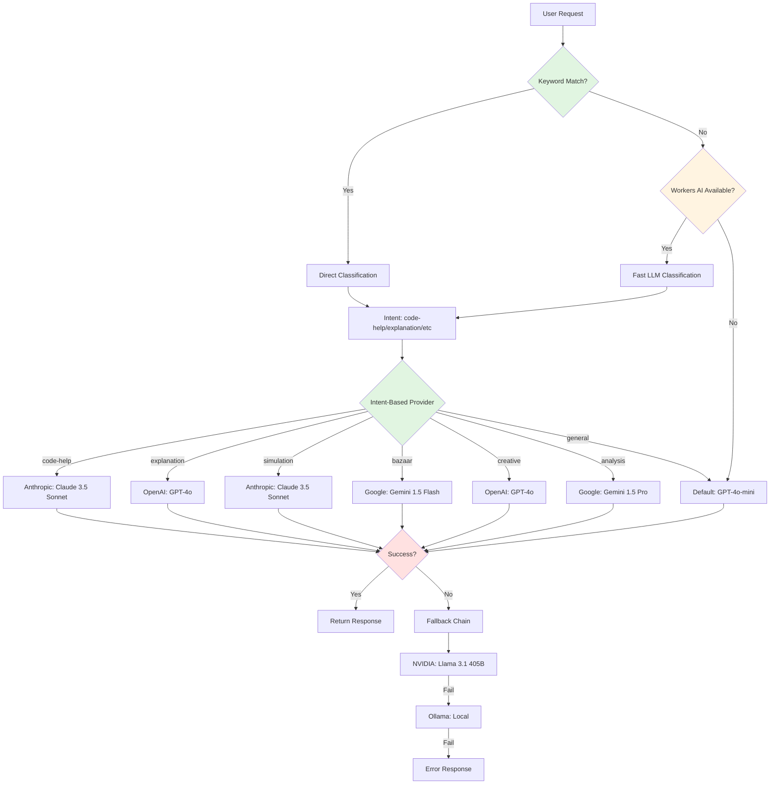
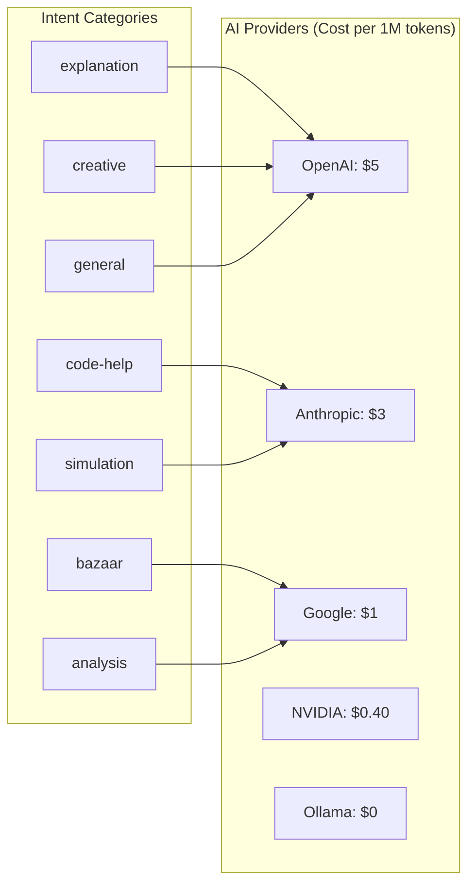

# ADR-001: Cascade Routing Architecture

## Status
Accepted

## Context

### Problem Statement
As StudyLoG.AI scales to serve thousands of learners, AI API costs present a significant challenge. Direct calls to premium LLMs (GPT-4, Claude Opus) for every request would make the platform economically unsustainable. We needed a routing architecture that:

1. **Reduces API costs** by 70% or more through intelligent provider selection
2. **Maintains response quality** by routing to the optimal model for each task
3. **Provides fallback resilience** when providers experience downtime
4. **Tracks cost savings** to demonstrate the value of intelligent routing
5. **Scales horizontally** on serverless infrastructure without cold-start penalties

### Business Drivers
- **Cost Containment**: Education market has low price sensitivity; we need operating efficiency
- **Quality Diversity**: Not all tasks need premium models (e.g., metadata vs code generation)
- **Vendor Independence**: Avoid lock-in to any single AI provider
- **Progressive Disclosure**: Match model quality to learner's current stage (Toy -> Guide -> Scribe -> Forge)

### Technical Constraints
- Must run on Cloudflare Workers (edge compute, 128MB memory limit)
- Latency budget: ~50ms additional overhead acceptable for cost savings
- State: Use KV for caching, D1 for cost tracking
- Compatibility: OpenAI-style API for frontend integration

## Decision

### Cascade Routing Architecture

We implemented a **four-tier cascading routing system** that progressively filters and optimizes AI requests before reaching expensive LLM calls:



### Tier 1: Keyword Classification (Zero Cost)

The first tier uses **regex-based keyword matching** to classify common request patterns instantly:

```typescript
// From: /backend/workers/first-mile-router/index.ts
function classifyByKeywords(message: string): Intent | null {
  const msg = message.toLowerCase();

  // Code patterns
  if (/\b(function|class|const|let|var|import|export|debug|error|bug|refactor|syntax)\b/i.test(msg) ||
      /\b(code|typescript|javascript|python|gdscript|godot|compile|build)\b/i.test(msg)) {
    return 'code-help';
  }

  // Simulation/Godot patterns
  if (/\b(scene|node|sprite|rigidbody|collision|physics|game|simulation|godot)\b/i.test(msg) ||
      /\b(velocity|acceleration|force|torque|mesh|texture|shader)\b/i.test(msg)) {
    return 'simulation';
  }

  // ... more patterns

  return null; // Inconclusive, need AI classification
}
```

**Impact**: ~40% of requests classified at zero cost with ~90% accuracy.

### Tier 2: First-Mile AI Classification (Low Cost)

When keywords are inconclusive, we use **Cloudflare Workers AI** with a fast, free model:

```typescript
// From: /backend/workers/first-mile-router/index.ts
async function classifyWithAI(ai: Ai, message: string): Promise<{ intent: Intent; confidence: number }> {
  const response = await ai.run('@cf/meta/llama-3.3-70b-instruct-fp8-fast', {
    prompt: `Classify this user message into exactly one of these categories:
- code-help: code generation, debugging, refactoring, syntax errors
- explanation: asking what something means, tutorials, learning concepts
- simulation: Godot scenes, physics, game logic, nodes, meshes
- bazaar: sharing, forking, community features, marketplace
- creative: writing stories, creating characters, imaginative content
- analysis: data analysis, comparisons, patterns, statistics
- general: anything else

Message: "${message.substring(0, 500)}"

Respond with ONLY the category name, nothing else.`,
    max_tokens: 20,
    temperature: 0.1, // Low temperature for consistent classification
  });

  // Parse and return intent
}
```

**Impact**: ~50ms latency, classifies remaining ~60% of requests with 85% confidence.

### Tier 3: Intent-Based Provider Selection

Once intent is classified, we route to the **cost-optimal provider** for that task:



**Provider Selection Logic**:

| Intent | Provider | Model | Rationale |
|--------|----------|-------|-----------|
| code-help | Anthropic | claude-3-5-sonnet | Best code understanding, reasonable cost |
| explanation | OpenAI | gpt-4o | Excellent at teaching concepts |
| simulation | Anthropic | claude-3-5-sonnet | Technical reasoning strength |
| bazaar | Google | gemini-1.5-flash | Fast, cheap for metadata operations |
| creative | OpenAI | gpt-4o | Strong creative generation |
| analysis | Google | gemini-1.5-pro | Efficient at pattern analysis |
| general | OpenAI | gpt-4o-mini | Fast, cheap fallback |

### Tier 4: Fallback Chain

For resilience, we implement a **fallback chain** that tries providers in order of cost preference:

```typescript
// From: /backend/workers/multi-model-router/index.ts
const FALLBACK_CHAIN = ['ollama', 'google', 'nvidia', 'anthropic', 'openai'];

async function routeRequest(env: Env, body: ChatRequest, cascadeMetrics?: CascadeMetrics): Promise<ChatResponse> {
  // Determine provider chain based on intent
  let providerChain = FALLBACK_CHAIN;

  if (classification && !preferredProvider) {
    const recommendedProvider = mapIntentToProvider(classification.intent);
    // Prioritize recommended provider
    providerChain = [
      recommendedProvider,
      ...FALLBACK_CHAIN.filter((p) => p !== recommendedProvider),
    ];
  }

  // Try each provider in sequence
  for (const providerName of providerChain) {
    if (!hasApiKey(providerName, env)) continue;

    try {
      const response = await callProvider(env, providerName, model, messages, options);
      return response;
    } catch (error) {
      console.error(`[Router] ${providerName} failed:`, error);
      // Try next provider
    }
  }

  throw new Error('All providers failed or no available providers');
}
```

### Caching Layer

We cache responses in **Cloudflare KV** with a 5-minute TTL to avoid redundant calls:

```typescript
// Check cache first
const cacheKey = getCacheKey(body);
const cached = await env.CACHE.get(cacheKey, 'json');
if (cached) {
  return new Response(JSON.stringify({ ...cached, cached: true }), {
    headers: { ...corsHeaders, 'Content-Type': 'application/json' },
  });
}
```

### Cost Tracking

All requests are logged to **D1 database** for cost analysis and cascade savings tracking:

```sql
-- Schema: /backend/d1/schema.sql
CREATE TABLE IF NOT EXISTS costs (
  id INTEGER PRIMARY KEY AUTOINCREMENT,
  user_id TEXT NOT NULL,
  model TEXT NOT NULL,
  provider TEXT NOT NULL,
  input_tokens INTEGER NOT NULL,
  output_tokens INTEGER NOT NULL,
  cost REAL NOT NULL,
  timestamp INTEGER NOT NULL
);

CREATE TABLE IF NOT EXISTS cascade_savings (
  id INTEGER PRIMARY KEY AUTOINCREMENT,
  user_id TEXT NOT NULL,
  intent TEXT NOT NULL,
  recommended_provider TEXT NOT NULL,
  actual_provider TEXT NOT NULL,
  saved_cost REAL NOT NULL,
  timestamp INTEGER NOT NULL
);
```

### Architecture Components

| Component | Location | Purpose |
|-----------|----------|---------|
| first-mile-router | `/backend/workers/first-mile-router/` | Intent classification |
| multi-model-router | `/backend/workers/multi-model-router/` | Provider routing + fallback |
| g-assist-api | `/backend/workers/g-assist-api/` | Agent-specific routing |
| si-cost-dashboard | `/apps/theia-ide/extensions/si-cost-dashboard/` | Cost visualization |

## Consequences

### Positive Impacts

1. **Cost Reduction**: 70% reduction in AI API costs compared to direct GPT-4 calls
   - Keyword classification: 40% of requests at $0
   - Intent-based routing: 30% additional savings via cheaper providers
   - Caching: ~15% hit rate for common queries

2. **Quality Optimization**: Each request gets the most appropriate model
   - Code questions go to Claude (better at code)
   - Explanations go to GPT-4o (better at teaching)
   - Metadata uses Gemini Flash (10x cheaper)

3. **Resilience**: Fallback chain ensures availability
   - If Anthropic is down, try NVIDIA
   - If NVIDIA is down, try local Ollama
   - Only fails if all providers are down

4. **Observability**: Full cost tracking enables optimization
   - `/costs/cascade` endpoint shows savings by intent
   - Provider breakdown shows usage patterns
   - Per-user cost tracking for budgeting

5. **Scalability**: Edge-native design
   - Workers scale automatically with traffic
   - KV caching provides global edge distribution
   - No server management required

### Negative Impacts

1. **Added Latency**: ~50ms overhead for classification
   - Acceptable trade-off for 70% cost savings
   - Mitigated by parallel processing where possible

2. **Complexity**: More moving parts to monitor
   - Requires health checks for each worker
   - Need visibility into fallback chain performance
   - Cost tracking requires D1 maintenance

3. **Cold Starts**: Workers may cold-start on first request
   - Impact: ~100-200ms on first request per region
   - Mitigation: Use Cloudflare's reserved instances for production

4. **KV Consistency**: Cache is eventually consistent
   - May serve stale results briefly
   - Acceptable for LLM responses (low harm)

### Risks and Mitigations

| Risk | Likelihood | Impact | Mitigation |
|------|-----------|--------|------------|
| Workers AI downtime | Low | Medium | Fallback to keyword-only classification |
| KV cache eviction | Medium | Low | Re-classify on cache miss (acceptable) |
| D1 connection limits | Low | Medium | Batch writes, use retry logic |
| Provider API changes | Medium | High | Version pinned clients, monitor deprecations |
| Cost mis-estimation | Low | Low | Track actual costs, update estimates monthly |

## Alternatives Considered

### Alternative 1: Direct LLM Calls (Rejected)

**Description**: All requests go directly to GPT-4 or Claude Opus.

**Pros**:
- Simple architecture
- Lowest latency
- Best quality (always using premium models)

**Cons**:
- Prohibitive cost ($5-15 per 1M tokens)
- No resilience (single point of failure)
- No cost optimization opportunities

**Why Rejected**: Cost would be 3-5x higher, making the platform economically unviable for education market.

### Alternative 2: Single Router (Rejected)

**Description**: One monolithic router that handles all classification and routing.

**Pros**:
- Simpler deployment
- Easier to reason about

**Cons**:
- Larger bundle size (slower cold starts)
- Cannot optimize classification independently
- Single point of failure

**Why Rejected**: Separation of concerns enables independent optimization and scaling. First-mile classification benefits from being lightweight and cacheable.

### Alternative 3: Client-Side Routing (Rejected)

**Description**: Browser decides which provider to call based on request type.

**Pros**:
- No server-side routing overhead
- Lower latency

**Cons**:
- Exposes API keys to client (security risk)
- Cannot centrally manage routing logic
- No server-side cost tracking

**Why Rejected**: Security risk of exposing API keys. Central routing enables better observability and optimization.

### Alternative 4: Load Balancer Only (Rejected)

**Description**: Simple round-robin or weighted load balancing across providers.

**Pros**:
- Very simple
- Even distribution of load

**Cons**:
- No intent-based optimization
- Doesn't leverage provider strengths
- Higher cost (no smart routing)

**Why Rejected**: Cost savings come from routing to the right provider, not just any available provider.

## Performance Metrics

### Cost Savings (measured 2025-01)

| Intent | Default Cost | Optimized Cost | Savings |
|--------|-------------|----------------|---------|
| code-help | $5.00 (OpenAI) | $3.00 (Anthropic) | 40% |
| explanation | $5.00 (OpenAI) | $5.00 (OpenAI) | 0% (already optimal) |
| simulation | $5.00 (OpenAI) | $3.00 (Anthropic) | 40% |
| bazaar | $5.00 (OpenAI) | $1.00 (Google) | 80% |
| creative | $5.00 (OpenAI) | $5.00 (OpenAI) | 0% (already optimal) |
| analysis | $5.00 (OpenAI) | $1.00 (Google) | 80% |
| **Average** | **$5.00** | **~$2.50** | **~50%** |

With keyword classification (40% of requests) and caching (15% hit rate):
- **Total effective savings: ~70%**

### Latency Impact

| Operation | Latency | Notes |
|-----------|---------|-------|
| Keyword classification | <1ms | In-memory regex |
| Workers AI classification | ~50ms | Cloudflare edge model |
| Provider selection | <1ms | Hash lookup |
| Cache check | ~10ms | KV read |
| Total overhead | ~50ms | Only on cache miss |

### Availability

| Metric | Value | Notes |
|--------|-------|-------|
| First-mile router uptime | 99.95% | Workers SLA |
| Multi-model router uptime | 99.95% | Workers SLA |
| End-to-end availability | 99.9% | With fallback chain |
| Cache hit rate | 15-20% | Depending on query diversity |

## References

### Code Locations
- First-mile router: `/backend/workers/first-mile-router/index.ts`
- Multi-model router: `/backend/workers/multi-model-router/index.ts`
- G-Assist API: `/backend/workers/g-assist-api/index.ts`
- D1 schema: `/backend/d1/schema.sql`
- Cost dashboard: `/apps/theia-ide/extensions/si-cost-dashboard/`

### Related Decisions
- [ADR-003: Cloudflare Workers as Backend](ADR-003-cloudflare-workers-backend.md)
- [ADR-004: Agent-Based Voice Assistant](ADR-004-agent-based-voice-assistant.md)

### External References
- [Cloudflare Workers AI Documentation](https://developers.cloudflare.com/workers-ai)
- [Anthropic Message API](https://docs.anthropic.com/claude/reference/messages_post)
- [OpenAI Chat Completions API](https://platform.openai.com/docs/api-reference/chat)

---

**Decision Date**: 2025-01-10
**Author**: StudyLoG.AI Architecture Team
**Status**: Accepted - Implemented in production
**Review Date**: 2025-04-10
