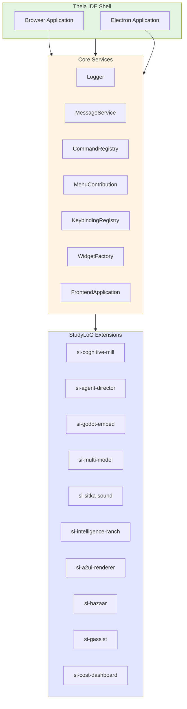
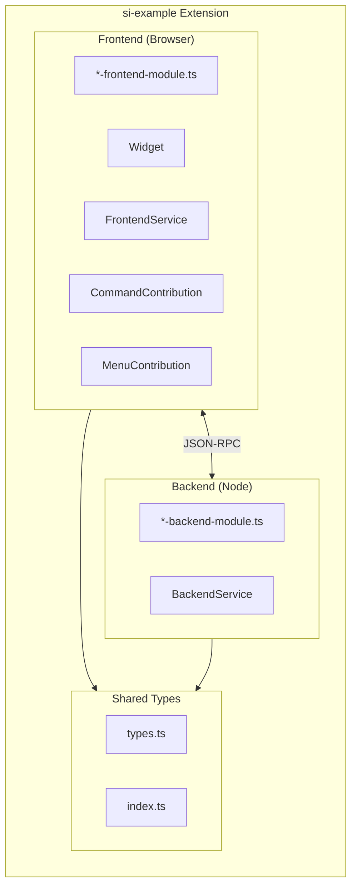
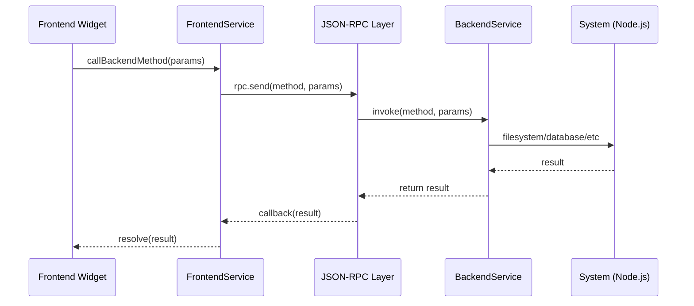

# ADR-002: Theia Extension Architecture

## Status
Accepted

## Context

### Problem Statement
StudyLoG.AI needs a customizable, extensible IDE shell that allows learners to:

1. **Customize their environment** - Even the IDE itself should be modifiable
2. **Progressively discover features** - Simple to start, powerful to master
3. **Access specialized tools** - Godot visualization, agent dashboards, circuit simulators
4. **Maintain VS Code compatibility** - Leverage existing VS Code extensions
5. **Deploy cross-platform** - Browser, desktop (Electron), and eventually native

We needed an architecture that supports our "every layer is a mill" philosophy - where each extension transforms inputs to outputs and can be combined in novel ways.

### Business Drivers

- **Education Market**: Students need a forgiving, explorable environment
- **Future-Proofing**: Investment in extension architecture pays dividends across all products (DMLoG, MakerLoG, etc.)
- **Community**: Extensions can be shared in the Bazaar (marketplace)
- **Progressive Disclosure**: Features unlock as learners advance (Toy -> Guide -> Scribe -> Forge)

### Technical Constraints

- Must support **VS Code extension API** for maximum compatibility
- Must run in **browser** (not just Electron)
- Must support **React-based widgets** for custom UI
- Must allow **bidirectional communication** between frontend and backend extensions
- Must support **hot reload** during development

### Existing Extensions (as of 2025-01)

| Extension | Purpose | Technology |
|-----------|---------|------------|
| si-cognitive-mill | Circuit/Arduino simulation | Ace Editor, React |
| si-agent-director | AI dashboard & orchestration | React, WebSocket |
| si-godot-embed | Godot 4.3 panel embedding | WebSocket, iframe |
| si-multi-model | LLM router UI | React, TypeScript |
| si-sitka-sound | Multi-agent ecosystems | React, Canvas |
| si-intelligence-ranch | Agent breeding/training | React |
| si-a2ui-renderer | Agent-to-UI protocol | React |
| si-bazaar | Community marketplace | React |
| si-gassist | Voice assistant | MediaRecorder API |
| si-cost-dashboard | Cost visualization | Recharts |

## Decision

### Theia with Inversify DI

We chose **Eclipse Theia** as our IDE shell with **Inversify** dependency injection for modular extension architecture.



### Extension Module Pattern

Each extension follows a **dual-module pattern** with separate frontend and backend modules:



### Frontend Module Structure

Frontend modules use **Inversify ContainerModule** for dependency injection:

```typescript
// From: /apps/theia-ide/extensions/si-godot-embed/src/browser/si-godot-panel-frontend-module.ts
import { ContainerModule } from '@theia/core/shared/inversify';
import { WidgetFactory } from '@theia/core/lib/browser';
import { CommandContribution, MenuContribution } from '@theia/core/lib/common';
import { GodotPanelWidget } from './godot-panel-widget';
import { GodotCommandContribution } from './godot-commands';
import { GodotMenuContribution } from './godot-menu';
import { GodotWebSocketService } from './godot-websocket';

export default new ContainerModule((bind) => {
  // Bind the Godot panel widget
  bind(GodotPanelWidget).toSelf();

  // Register as widget factory
  bind(WidgetFactory).toDynamicValue((ctx) => ({
    id: GodotPanelWidget.ID,
    createWidget: () => ctx.container.get(GodotPanelWidget),
  }));

  // Bind WebSocket service for Godot communication
  bind(GodotWebSocketService).toSelf().inSingletonScope();

  // Bind commands
  bind(GodotCommandContribution).toSelf();
  bind(CommandContribution).toService(GodotCommandContribution);

  // Bind menu contributions
  bind(MenuContribution).toService(GodotMenuContribution);
});
```

### Backend Module Structure

Backend modules expose services via **JSON-RPC** for frontend communication:

```typescript
// From: /apps/theia-ide/extensions/si-multi-model/src/node/si-multi-model-backend-module.ts
import { ContainerModule } from '@theia/core/shared/inversify';
import { ConnectionHandler, JsonRpcConnectionHandler } from '@theia/core/lib/node/messaging/proxy-factory';
import { MultiModelBackendService, MULTI_MODEL_SERVICE_PATH } from './multi-model-backend-service';
import { ModelRouter } from './model-router';

export default new ContainerModule((bind) => {
  // Bind model router
  bind(ModelRouter).toSelf().inSingletonScope();

  // Bind backend service
  bind(MultiModelBackendService).toSelf().inSingletonScope();

  // Export the service to frontend via JSON-RPC
  bind(ConnectionHandler).toDynamicValue(
    (ctx) =>
      new JsonRpcConnectionHandler(MULTI_MODEL_SERVICE_PATH, () => {
        return ctx.container.get(MultiModelBackendService);
      })
  );
});
```

### Widget Architecture

Custom widgets extend **Theia's Widget base class**:

```typescript
// Example widget structure
export class GodotPanelWidget extends Widget {
  static readonly ID = 'godot-panel:widget';
  static readonly LABEL = 'Godot Panel';

  protected readonly webSocketService: GodotWebSocketService;

  constructor(
    @inject(MessageService) protected readonly messageService: MessageService,
    @inject(GodotWebSocketService) webSocketService: GodotWebSocketService
  ) {
    super();
    this.id = GodotPanelWidget.ID;
    this.title.label = GodotPanelWidget.LABEL;
    this.title.iconClass = 'fa fa-gamepad';
    this.webSocketService = webSocketService;

    // Build widget UI
    this.render();
  }

  protected render(): void {
    // Create React or vanilla DOM elements
    this.node.appendChild(/* ... */);
  }

  protected override onAfterAttach(message: Message): void {
    super.onAfterAttach(message);
    // Initialize when widget is attached to DOM
  }
}
```

### Frontend-Backend Communication

Extensions communicate via **JSON-RPC over WebSocket**:



### React Widget Integration

For complex UI, we integrate **React components** into Theia widgets:

```typescript
// Example: Using React in a Theia widget
import { createRoot, Root } from 'react-dom/client';
import { ReactWidget } from '@theia/core/lib/browser/widgets/react-widget';

export class CostDashboardWidget extends ReactWidget {
  static readonly ID = 'cost-dashboard:widget';
  static readonly LABEL = 'Cost Dashboard';

  protected readonly root: Root;

  constructor(
    @inject(CostDashboardFrontendService) protected readonly service: CostDashboardFrontendService
  ) {
    super();
    this.id = CostDashboardWidget.ID;
    this.title.label = CostDashboardWidget.LABEL;
    this.title.iconClass = 'fa fa-chart-line';

    // Initialize React root
    this.root = createRoot(this.node);
    this.update();
  }

  protected async update(): Promise<void> {
    const data = await this.service.getCostData();
    this.root.render(
      <CostDashboardComponent data={data} />
    );
  }

  protected override onDispose(): void {
    this.root.unmount();
  }
}
```

### Command and Menu Integration

Extensions contribute **commands** and **menu items** to Theia's UI:

```typescript
// Command contribution
export class GodotCommandContribution implements CommandContribution {
  registerCommands(registry: CommandRegistry): void {
    registry.registerCommand({
      id: 'godot.start',
      label: 'Start Godot Server',
      iconClass: 'fa fa-play',
    });

    registry.registerCommand({
      id: 'godot.reload',
      label: 'Reload Scene',
      iconClass: 'fa fa-refresh',
    });
  }
}

// Menu contribution
export class GodotMenuContribution implements MenuContribution {
  registerMenus(menus: MenuModelRegistry): void {
    menus.registerMenuAction(CommonMenus.VIEW_CONTENTS, {
      commandId: 'godot.start',
      label: 'Start Godot Server',
      order: '0',
    });
  }
}
```

### Workspace Configuration

Each extension can define its **configuration schema**:

```json
{
  "$schema": "http://json-schema.org/schema",
  "type": "object",
  "properties": {
    "si-multi-model.defaultProvider": {
      "type": "string",
      "enum": ["openai", "anthropic", "google", "nvidia"],
      "default": "anthropic",
      "description": "Default AI provider for chat completions"
    },
    "si-multi-model.enableCache": {
      "type": "boolean",
      "default": true,
      "description": "Enable response caching"
    }
  }
}
```

### Monorepo Structure

Extensions are organized in a **Lerna workspace**:

```
apps/theia-ide/
├── extensions/
│   ├── si-cognitive-mill/         # Circuit simulation
│   │   ├── src/
│   │   │   ├── browser/           # Frontend module
│   │   │   ├── node/              # Backend module (if needed)
│   │   │   └── common/            # Shared types
│   │   ├── package.json
│   │   └── tsconfig.json
│   ├── si-agent-director/         # AI dashboard
│   ├── si-godot-embed/            # Godot integration
│   ├── si-multi-model/            # LLM router UI
│   ├── si-sitka-sound/            # Multi-agent simulation
│   ├── si-intelligence-ranch/     # Agent training
│   ├── si-a2ui-renderer/          # Agent-to-UI protocol
│   ├── si-bazaar/                 # Community marketplace
│   ├── si-gassist/                # Voice assistant
│   └── si-cost-dashboard/         # Cost visualization
├── browser-app/                   # Browser build target
├── electron-app/                  # Electron build target
├── lerna.json                     # Workspace config
└── package.json
```

## Consequences

### Positive Impacts

1. **VS Code Compatibility**: Leverage existing VS Code extensions
   - Marketplace has 100K+ extensions
   - Many work without modification in Theia
   - Lower barrier to contributor onboarding

2. **Modular Architecture**: Each extension is independently developed
   - Clear boundaries via inversify modules
   - Can test extensions in isolation
   - Easy to add/remove features

3. **Progressive Disclosure**: Features can be hidden/shown based on user level
   - New learners see minimal UI
   - Advanced features unlock through progress
   - Each "mill" reveals deeper complexity

4. **Cross-Platform Deployment**: Single codebase, multiple targets
   - Browser: Zero installation, accessible anywhere
   - Electron: Desktop app with native features
   - Future: Native mobile via Capacitor/RN

5. **Hot Reload Development**: Fast iteration during development
   - Changes reflect without full rebuild
   - Watch mode compiles extensions on save
   - Lerna orchestrates multi-extension builds

6. **Community Extensibility**: Users can create their own extensions
   - Same API we use internally
   - Can share in Bazaar
   - Progressive system: users become contributors

### Negative Impacts

1. **Learning Curve**: Theia architecture is more complex than vanilla web
   - Need to understand Inversify DI patterns
   - JSON-RPC communication adds complexity
   - Theia lifecycle requires learning

2. **Build Complexity**: Monorepo with multiple build targets
   - Lerna adds configuration overhead
   - TypeScript project references needed
   - Build times can be long for full rebuild

3. **Bundle Size**: Full Theia build is ~50MB (browser)
   - Larger than a pure web app
   - Mitigated by code splitting and lazy loading
   - Electron bundle is ~150MB

4. **Resource Usage**: More memory than lightweight editors
   - Multiple extensions run concurrently
   - Each widget maintains state
   - Mitigated by proper cleanup in dispose()

5. **Testing Complexity**: Need to test frontend, backend, and integration
   - Mock JSON-RPC for unit tests
   - Integration tests require full Theia setup
   - E2E tests add to CI time

### Risks and Mitigations

| Risk | Likelihood | Impact | Mitigation |
|------|-----------|--------|------------|
| Theia framework changes | Medium | Medium | Pin to specific version, track upstream |
| Extension conflicts | Low | High | Clear namespace conventions (si-*) |
| Performance degradation | Medium | High | Lazy load extensions, monitor metrics |
| Contributor onboarding | High | Medium | Good documentation, extension templates |
| VS Code API divergence | Low | Medium | Use stable APIs, abstract differences |

## Alternatives Considered

### Alternative 1: VS Code Extension API Only (Rejected)

**Description**: Build as a pure VS Code extension marketplace.

**Pros**:
- Largest existing extension ecosystem
- Familiar to many developers
- Microsoft backing and support

**Cons**:
- Cannot deeply customize the IDE shell
- Limited browser support (vscode.dev is read-only)
- Desktop app required for full features
- Cannot embed custom widgets like Godot panel

**Why Rejected**: Our vision requires the IDE itself to be customizable. VS Code is a product, not a framework. Theia is VS Code's open-source framework that allows deeper customization.

### Alternative 2: Monaco Editor + Custom UI (Rejected)

**Description**: Build custom UI around Monaco (VS Code's editor component).

**Pros**:
- Full control over UI
- Smaller bundle
- Simpler architecture

**Cons**:
- Lose VS Code extension compatibility
- Must rebuild all shell features (terminal, debugger, etc.)
- Higher development cost

**Why Rejected**: Would need to rebuild too much functionality. Theia provides these features out of the box with similar customization capability.

### Alternative 3: Pure Web Application (Rejected)

**Description**: Build as a vanilla React/Angular web app.

**Pros**:
- Simplest architecture
- Full control
- Best performance (smaller bundle)

**Cons**:
- No VS Code extension compatibility
- Must build editor features from scratch
- Harder to attract developers familiar with VS Code

**Why Rejected**: Would lose VS Code ecosystem and developer familiarity. Theia gives us browser-based deployment with extension compatibility.

### Alternative 4: Eclipse Theia without Inversify (Rejected)

**Description**: Use Theia but avoid dependency injection complexity.

**Pros**:
- Simpler mental model
- Less boilerplate

**Cons**:
- Lose Theia's architectural patterns
- Harder to integrate with other extensions
- Against framework conventions

**Why Rejected**: Inversify is core to Theia's architecture. Fighting the framework makes upgrades harder and integration more difficult.

## Extension Development Workflow

### Creating a New Extension

```bash
# Create new extension directory
mkdir apps/theia-ide/extensions/si-new-feature
cd apps/theia-ide/extensions/si-new-feature

# Initialize package.json
npm init -y

# Create TypeScript config
cat > tsconfig.json << 'EOF'
{
  "extends": "../../tsconfig.json",
  "compilerOptions": {
    "outDir": "lib",
    "rootDir": "src"
  },
  "include": ["src"]
}
EOF

# Create directory structure
mkdir -p src/browser src/node src/common

# Build and watch
npm run build
npm run watch
```

### Frontend Module Template

```typescript
// src/browser/si-new-feature-frontend-module.ts
import { ContainerModule } from '@theia/core/shared/inversify';
import { WidgetFactory } from '@theia/core/lib/browser';
import { CommandContribution, MenuContribution } from '@theia/core/lib/common';
import { NewFeatureWidget } from './new-feature-widget';
import { NewFeatureCommandContribution } from './new-feature-commands';
import { NewFeatureMenuContribution } from './new-feature-menu';

export default new ContainerModule((bind) => {
  // Widget
  bind(NewFeatureWidget).toSelf();
  bind(WidgetFactory).toDynamicValue((ctx) => ({
    id: NewFeatureWidget.ID,
    createWidget: () => ctx.container.get(NewFeatureWidget),
  }));

  // Commands
  bind(NewFeatureCommandContribution).toSelf();
  bind(CommandContribution).toService(NewFeatureCommandContribution);

  // Menus
  bind(MenuContribution).toService(NewFeatureMenuContribution);
});
```

### Backend Service Template

```typescript
// src/node/new-feature-backend-service.ts
import { injectable } from '@theia/core/shared/inversify';
import { WebSocketConnection } from '@theia/core/lib/browser/messaging/web-socket-connection';

export const NEW_FEATURE_SERVICE_PATH = '/services/new-feature';

export interface NewFeatureService {
  getData(): Promise<{ value: string }>;
}

@injectable()
export class NewFeatureBackendService implements NewFeatureService {
  async getData(): Promise<{ value: string }> {
    return { value: 'Hello from backend!' };
  }
}
```

## Performance Metrics

### Build Metrics

| Metric | Value | Notes |
|--------|-------|-------|
| Full build time | ~3 minutes | All extensions, browser + electron |
| Incremental build | ~5 seconds | Watch mode, single file change |
| Browser bundle size | ~50MB | Minified, before gzip |
| Electron bundle size | ~150MB | Includes Node.js runtime |

### Runtime Metrics

| Metric | Value | Notes |
|--------|-------|-------|
| Initial load | ~3 seconds | Browser, uncached |
| Extension activation | ~100ms | Per lazy-loaded extension |
| Widget render | ~50ms | React widgets |
| JSON-RPC round-trip | ~10ms | Local backend |

### Development Experience

| Metric | Value | Notes |
|--------|-------|-------|
| Hot reload time | ~2 seconds | TypeScript transpile only |
| Extension count | 10 | As of 2025-01 |
| LOC per extension | ~500-2000 | Varies by complexity |

## References

### Code Locations
- Theia configuration: `/apps/theia-ide/package.json`
- Example frontend module: `/apps/theia-ide/extensions/si-godot-embed/src/browser/si-godot-panel-frontend-module.ts`
- Example backend module: `/apps/theia-ide/extensions/si-multi-model/src/node/si-multi-model-backend-module.ts`
- Lerna configuration: `/apps/theia-ide/lerna.json`

### Related Decisions
- [ADR-001: Cascade Routing Architecture](ADR-001-cascade-routing-architecture.md) - Backend services used by extensions
- [ADR-003: Cloudflare Workers as Backend](ADR-003-cloudflare-workers-backend.md) - Backend architecture

### External References
- [Eclipse Theia Documentation](https://theia-ide.org/docs/)
- [Theia GitHub Repository](https://github.com/eclipse-theia/theia)
- [InversifyJS Documentation](https://inversify.io/)
- [VS Code Extension API](https://code.visualstudio.com/api)

---

**Decision Date**: 2025-01-10
**Author**: StudyLoG.AI Architecture Team
**Status**: Accepted - Implemented in production
**Review Date**: 2025-07-10
