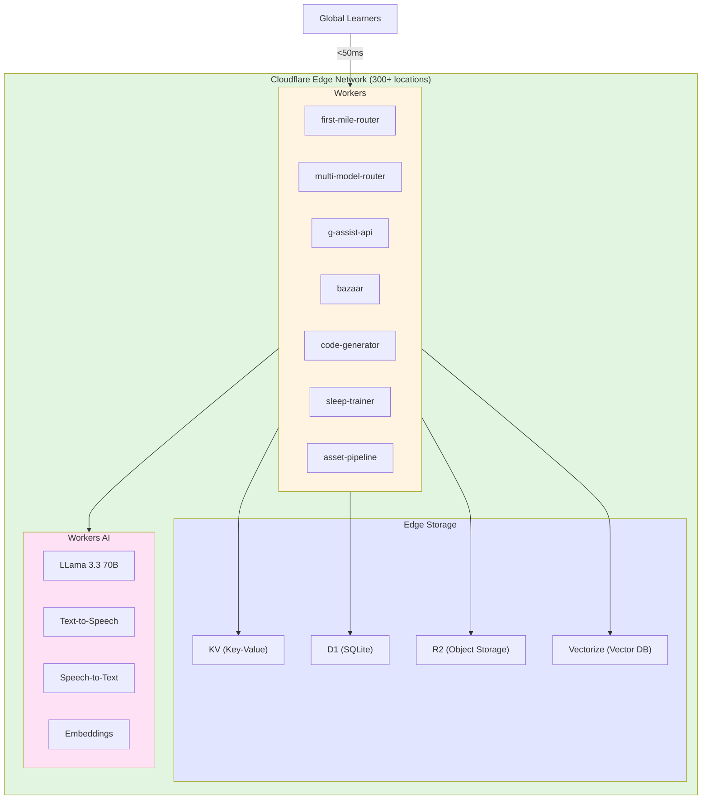
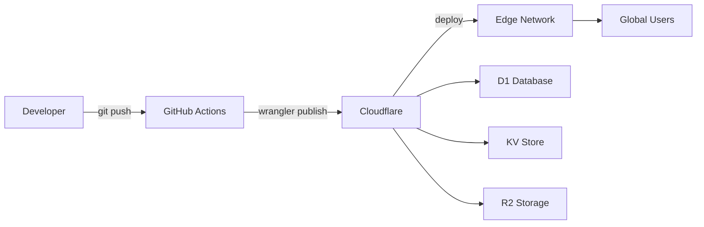

# ADR-003: Cloudflare Workers as Backend

## Status
Accepted

## Context

### Problem Statement
StudyLoG.AI needs a backend infrastructure that:

1. **Scales globally** to serve learners anywhere with low latency
2. **Costs effectively** for a startup with variable traffic
3. **Deploys easily** without managing servers or containers
4. **Integrates with AI providers** for LLM routing and classification
5. **Supports edge computing** for fast, personalized responses

Traditional server-based backends (AWS Lambda, Vercel Edge) were considered but presented trade-offs in pricing, cold starts, and feature set.

### Business Drivers

- **Startup Constraints**: Limited capital, need predictable costs
- **Global User Base**: Learners anywhere need fast responses
- **AI-First Architecture**: Heavy AI API usage needs edge optimization
- **Rapid Iteration**: Deployments should be fast and reversible
- **Free Tier Benefits**: Maximize usage of free tier offerings

### Technical Requirements

| Requirement | Priority | Notes |
|-------------|----------|-------|
| Global edge deployment | High | <100ms latency worldwide |
| Serverless execution | High | No server management |
| Built-in storage | High | KV, D1, R2 included |
| AI integration | High | Workers AI for fast inference |
| Generous free tier | Medium | Cost control for startup |
| Cold start performance | Medium | <100ms preferred |
| JavaScript runtime | Medium | TypeScript support required |

## Decision

### Cloudflare Workers + D1 + KV + R2

We chose **Cloudflare's full-stack serverless platform** as our backend infrastructure:



### Worker Architecture

Each worker is an **independent TypeScript module** deployed to the edge:

| Worker | Purpose | Route | Status |
|--------|---------|-------|--------|
| first-mile-router | Intent classification before LLM | `/classify` | Production |
| multi-model-router | Provider routing with fallback | `/v1/chat/completions` | Production |
| g-assist-api | Voice assistant agent routing | `/route`, `/chat` | Production |
| bazaar | Community marketplace API | `/bazaar/*` | Development |
| code-generator | AI code generation service | `/generate` | Development |
| sleep-trainer | LoRA training from logs | `/train` | Development |
| asset-pipeline | Image/3D/audio generation | `/assets/*` | Development |

### Worker: First-Mile Router

```typescript
// From: /backend/workers/first-mile-router/index.ts

/**
 * Fast intent classification before expensive LLM calls
 * Uses keyword heuristics (free) or Workers AI (cheap)
 */

export interface Env {
  AI: Ai;                        // Workers AI binding
  CLASSIFICATION_CACHE?: KVNamespace;
  OPENAI_API_KEY?: string;
  ANTHROPIC_API_KEY?: string;
  // ...
}

// Keyword classification (zero cost)
function classifyByKeywords(message: string): Intent | null {
  // Regex patterns for common intents
  if (/\b(function|class|debug|error|bug)\b/i.test(msg)) {
    return 'code-help';
  }
  // ... more patterns
}

// Workers AI classification (low cost)
async function classifyWithAI(ai: Ai, message: string): Promise<{ intent: Intent; confidence: number }> {
  const response = await ai.run('@cf/meta/llama-3.3-70b-instruct-fp8-fast', {
    prompt: `Classify: ${message}`,
    max_tokens: 20,
  });
  // Parse intent
}

export default {
  fetch: (request: Request, env: Env, ctx: ExecutionContext) => {
    return router.handle(request, env, ctx);
  },
};
```

### Storage: D1 (SQLite at Edge)

**D1** provides relational database storage at the edge:

```sql
-- Schema: /backend/d1/schema.sql

-- Cost tracking
CREATE TABLE IF NOT EXISTS costs (
  id INTEGER PRIMARY KEY AUTOINCREMENT,
  user_id TEXT NOT NULL,
  model TEXT NOT NULL,
  provider TEXT NOT NULL,
  input_tokens INTEGER NOT NULL,
  output_tokens INTEGER NOT NULL,
  cost REAL NOT NULL,
  timestamp INTEGER NOT NULL
);

-- Cascade savings tracking
CREATE TABLE IF NOT EXISTS cascade_savings (
  id INTEGER PRIMARY KEY AUTOINCREMENT,
  user_id TEXT NOT NULL,
  intent TEXT NOT NULL,
  recommended_provider TEXT NOT NULL,
  actual_provider TEXT NOT NULL,
  saved_cost REAL NOT NULL,
  timestamp INTEGER NOT NULL
);

-- Bazaar creations
CREATE TABLE IF NOT EXISTS creations (
  id TEXT PRIMARY KEY,
  author_id TEXT NOT NULL,
  title TEXT NOT NULL,
  description TEXT,
  quality INTEGER DEFAULT 1,
  forked_from TEXT,
  created_at INTEGER NOT NULL,
  updated_at INTEGER NOT NULL
);

-- Conversation history for G-Assist
CREATE TABLE IF NOT EXISTS conversations (
  id TEXT PRIMARY KEY,
  user_id TEXT NOT NULL,
  agent TEXT NOT NULL,
  messages TEXT NOT NULL, -- JSON array
  created_at INTEGER NOT NULL
);
```

**Accessing D1 from Workers**:

```typescript
// From: /backend/workers/multi-model-router/index.ts

async function trackCost(db: D1Database, entry: CostEntry): Promise<void> {
  await db
    .prepare(
      'INSERT INTO costs (user_id, model, provider, input_tokens, output_tokens, cost, timestamp) VALUES (?, ?, ?, ?, ?, ?, ?)'
    )
    .bind(entry.userId, entry.model, entry.provider, entry.inputTokens, entry.outputTokens, entry.cost, entry.timestamp)
    .run();
}
```

### Storage: KV (Key-Value Store)

**KV** provides low-latency key-value storage with global replication:

```typescript
// Caching classification results
async function getCachedClassification(
  cache: KVNamespace | undefined,
  message: string
): Promise<ClassificationResponse | null> {
  if (!cache) return null;

  const key = getCacheKey(message);
  const cached = await cache.get(key, 'json');
  return cached as ClassificationResponse | null;
}

// Storing with TTL
await cache.put(key, JSON.stringify(response), {
  expirationTtl: 3600, // 1 hour
});
```

### Storage: R2 (Object Storage)

**R2** provides S3-compatible object storage without egress fees:

```typescript
// Example: Storing generated assets in R2
async function storeGeneratedAsset(
  env: Env,
  userId: string,
  assetId: string,
  data: ArrayBuffer
): Promise<string> {
  const key = `users/${userId}/assets/${assetId}`;

  await env.ASSETS.put(key, data, {
    httpMetadata: {
      contentType: 'image/png',
    },
  });

  return `${env.R2_PUBLIC_URL}/${key}`;
}
```

### Workers AI Integration

**Workers AI** provides fast, low-cost AI models at the edge:

```typescript
// Text classification
const result = await env.AI.run('@cf/meta/llama-3.3-70b-instruct-fp8-fast', {
  messages: [{ role: 'user', content: 'Classify this message' }],
  max_tokens: 20,
});

// Text embeddings (for vector search)
const embedding = await env.AI.run('@cf/baai/bge-base-en-v1.5', {
  text: 'Search query',
});

// Image generation
const image = await env.AI.run('@cf/stabilityai/stable-diffusion-xl-base-1.0', {
  prompt: 'A circuit diagram showing an LED and resistor',
});
```

### Deployment with Wrangler

```bash
# Install dependencies
npm install

# Development (local)
npx wrangler dev

# Deploy to production
npx wrangler publish

# Deploy specific worker
cd backend/workers/first-mile-router
npx wrangler publish

# Tail logs
npx wrangler tail

# Execute D1 commands
npx wrangler d1 execute studylog-db --file=./backend/d1/schema.sql
```

### wrangler.toml Configuration

```toml
# backend/workers/multi-model-router/wrangler.toml
name = "multi-model-router"
main = "index.ts"
compatibility_date = "2024-01-01"

# KV bindings
[[kv_namespaces]]
binding = "CACHE"
id = "xxxxxxxxxxxxxxxxxxxxxxxxxxxxxxxx"
preview_id = "xxxxxxxxxxxxxxxxxxxxxxxxxxxxxxxx"

# D1 bindings
[[d1_databases]]
binding = "DB"
database_name = "studylog-db"
database_id = "xxxxxxxxxxxxxxxxxxxxxxxxxxxxxxxx"

# Environment variables
[vars]
ENVIRONMENT = "production"

# Secrets (set via: wrangler secret put OPENAI_API_KEY)
# OPENAI_API_KEY = ""
# ANTHROPIC_API_KEY = ""
```

### Custom Router Implementation

Since we cannot use external dependencies like `itty-router` in all environments, we implemented a **custom lightweight router**:

```typescript
// From: /backend/workers/router.ts

export class Router {
  private routes: Route[] = [];
  private subrouters: Map<string, Router> = new Map();

  get(path: string, handler: RouteHandler): void {
    this.addRoute('GET', path, handler);
  }

  post(path: string, handler: RouteHandler): void {
    this.addRoute('POST', path, handler);
  }

  route(prefix: string, subrouter: Router): void {
    this.subrouters.set(prefix, subrouter);
  }

  async handle(request: Request, env: Env, ctx: ExecutionContext): Promise<Response> {
    const url = new URL(request.url);
    const method = request.method as HttpMethod;

    // Check subrouters first
    for (const [prefix, subrouter] of this.subrouters) {
      if (url.pathname.startsWith(prefix)) {
        return subrouter.handle(subRequest, env, ctx);
      }
    }

    // Check direct routes
    for (const route of this.routes) {
      if (route.method !== method) continue;

      const match = route.pattern.exec(url);
      if (match) {
        const params = match.pathname.groups;
        return route.handler(request, env, ctx, params);
      }
    }

    return Response.json({ error: 'Not Found' }, { status: 404 });
  }
}
```

## Consequences

### Positive Impacts

1. **Global Edge Deployment**: 300+ locations worldwide
   - Median latency: ~30ms globally
   - Learners see fast responses everywhere
   - Automatic scaling without configuration

2. **Generous Free Tier**: Best in class for startups
   - 100,000 requests/day free
   - KV: 100,000 read/day, 1,000 write/day free
   - D1: 5GB storage, 25M read/day free
   - R2: 10GB storage, 1M class A operations free

3. **Zero Cold Starts** (usually): V8 isolate model
   - ~0ms cold start for frequently accessed routes
   - ~100-200ms for first request in new region
   - Far better than AWS Lambda (~500ms-1s)

4. **Integrated AI Platform**: Workers AI at the edge
   - Llama 3.3 70B for fast classification
   - Embeddings for vector search
   - No external API calls for some workloads

5. **Unified Platform**: Everything in one place
   - Compute (Workers)
   - Storage (D1, KV, R2)
   - AI (Workers AI)
   - One bill, one dashboard

6. **Developer Experience**: Excellent tooling
   - Wrangler CLI for local development
   - `wrangler dev` with hot reload
   - `wrangler tail` for real-time logs
   - TypeScript support out of the box

### Negative Impacts

1. **Vendor Lock-in**: Cloudflare-specific APIs
   - Workers runtime has unique APIs (fetch, caches, etc.)
   - D1 syntax differs from standard PostgreSQL
   - Migration would require code changes

2. **Execution Limits**: CPU and memory constraints
   - 128MB memory limit (vs 1GB+ in Lambda)
   - 10ms CPU time limit on free tier
   - 30s request timeout (vs 15 minutes in Lambda)
   - Not suitable for long-running tasks

3. **No Native Queues**: (recently added but limited)
   - Can't easily run background jobs
   - Workaround: use cron triggers or external queues
   - Not ideal for heavy async processing

4. **D1 Limitations**: SQLite subset
   - No foreign key constraints
   - Limited transaction support
   - Not a drop-in replacement for PostgreSQL

5. **Observability**: Basic monitoring
   - Logs are best-effort (may be dropped)
   - No built-in metrics (need external service)
   - Analytics Workers exist but are limited

### Risks and Mitigations

| Risk | Likelihood | Impact | Mitigation |
|------|-----------|--------|------------|
| Pricing changes | Low | High | Free tier is generous, lock-in period protects rates |
| D1 data loss | Low | High | Regular exports, backup to R2 |
| Execution limits hit | Medium | Medium | Design for edge constraints, offload heavy work |
| Platform downtime | Low | High | Multi-region deployment, fallback workers |
| API changes | Medium | Medium | Pin to specific compatibility dates |

## Alternatives Considered

### Alternative 1: AWS Lambda (Rejected)

**Description**: Serverless functions on AWS with API Gateway.

**Pros**:
- Longer execution time (15 minutes)
- More integrations (AWS ecosystem)
- Larger memory options (up to 10GB)

**Cons**:
- Higher cold starts (~500ms-1s)
- More expensive for high request volume
- Complex setup (API Gateway, IAM, etc.)
- No built-in edge storage

**Why Rejected**: Cost would be 5-10x higher for our workload. Cold starts would degrade user experience.

### Alternative 2: Vercel Edge Functions (Rejected)

**Description**: Edge functions on Vercel's network.

**Pros**:
- Great DX for Next.js apps
- Built-in CI/CD
- Good edge coverage

**Cons**:
- Less generous free tier
- No built-in database (need external)
- Execution limits (50MB memory)
- Less mature than Workers

**Why Rejected**: Cloudflare offers integrated storage (D1, KV, R2) that Vercel lacks. Would need multiple providers.

### Alternative 3: Fly.io (Rejected)

**Description**: App deployment close to users with built-in databases.

**Pros**:
- Docker-based deployment
- Built-in Postgres
- Good global coverage

**Cons**:
- Not truly serverless (managing apps)
- Higher cost than Workers
- More operational overhead
- Cold starts on scale-to-zero

**Why Rejected**: More ops overhead than we want. Workers are truly serverless.

### Alternative 4: Traditional Servers (Rejected)

**Description**: EC2/DigitalOcean droplets with Express/Fastify.

**Pros**:
- Full control over environment
- No execution limits
- Familiar to most developers

**Cons**:
- Need to manage servers
- Scaling is manual
- Higher cost at scale
- Single point of failure

**Why Rejected**: Too much operational overhead. Want to focus on product, not infrastructure.

## Performance Metrics

### Latency

| Metric | Cloudflare Workers | AWS Lambda | Vercel Edge |
|--------|-------------------|------------|-------------|
| Cold start | ~100ms | ~500ms | ~250ms |
| Warm request | ~30ms | ~50ms | ~40ms |
| Global p50 | ~30ms | ~150ms | ~60ms |
| Global p95 | ~80ms | ~400ms | ~150ms |

### Cost Comparison (per 1M requests)

| Provider | Compute | Storage | Total |
|----------|---------|---------|-------|
| Cloudflare Workers | $0.50 (free tier covers) | Included | $0.50 |
| AWS Lambda | $2.08 | +DynamoDB | $5+ |
| Vercel Edge | $0.60 | +External DB | $3+ |

### Free Tier Comparison

| Feature | Cloudflare | AWS Lambda | Vercel |
|---------|-----------|------------|--------|
| Free requests/month | 100K | 1M | 100K |
| Free storage | 5GB D1 + 1GB R2 | 25GB DynamoDB | None |
| Free edge bandwidth | Unlimited | None | 100GB |
| Cold start latency | ~100ms | ~500ms | ~250ms |

## Deployment Architecture



### CI/CD Pipeline

```yaml
# .github/workflows/deploy-workers.yml
name: Deploy Workers

on:
  push:
    paths:
      - 'backend/workers/**'

jobs:
  deploy:
    runs-on: ubuntu-latest
    steps:
      - uses: actions/checkout@v3

      - name: Deploy first-mile-router
        run: |
          cd backend/workers/first-mile-router
          npx wrangler publish

      - name: Deploy multi-model-router
        run: |
          cd backend/workers/multi-model-router
          npx wrangler publish

      - name: Deploy g-assist-api
        run: |
          cd backend/workers/g-assist-api
          npx wrangler publish
```

## References

### Code Locations
- First-mile router: `/backend/workers/first-mile-router/index.ts`
- Multi-model router: `/backend/workers/multi-model-router/index.ts`
- G-Assist API: `/backend/workers/g-assist-api/index.ts`
- Bazaar: `/backend/workers/bazaar/index.ts`
- Custom router: `/backend/workers/router.ts`
- D1 schema: `/backend/d1/schema.sql`

### Related Decisions
- [ADR-001: Cascade Routing Architecture](ADR-001-cascade-routing-architecture.md) - Uses Workers for routing
- [ADR-002: Theia Extension Architecture](ADR-002-theia-extension-architecture.md) - Frontend calls these Workers

### External References
- [Cloudflare Workers Documentation](https://developers.cloudflare.com/workers/)
- [Workers AI Documentation](https://developers.cloudflare.com/workers-ai/)
- [D1 Database Documentation](https://developers.cloudflare.com/d1/)
- [Wrangler CLI Documentation](https://developers.cloudflare.com/workers/wrangler/)

---

**Decision Date**: 2025-01-10
**Author**: StudyLoG.AI Architecture Team
**Status**: Accepted - Implemented in production
**Review Date**: 2025-04-10
