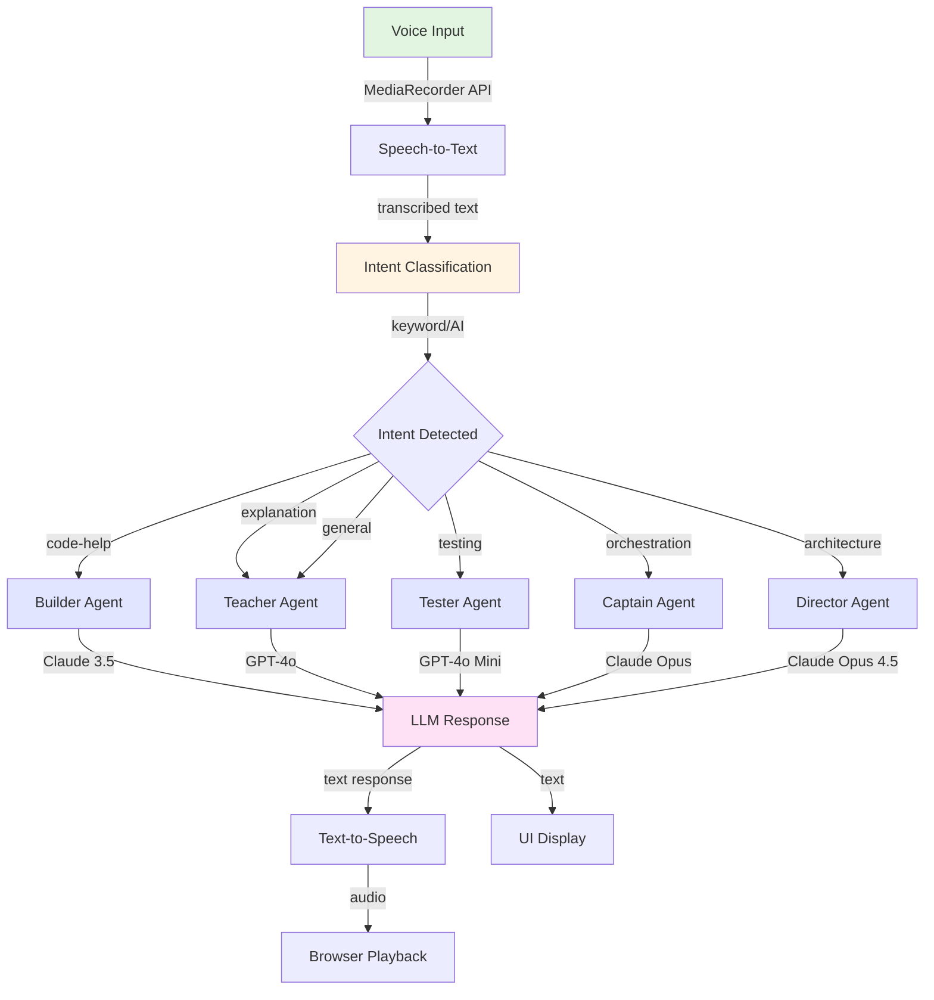

# ADR-004: Agent-Based Voice Assistant

## Status
Accepted

## Context

### Problem Statement
StudyLoG.AI aims to integrate **NVIDIA G-Assist** capabilities for voice-enabled AI assistance. However, a monolithic voice assistant that tries to handle all tasks would result in:

1. **Poor user experience**: Generic responses lacking specialized knowledge
2. **Higher costs**: Always using premium models for simple queries
3. **Slower responses**: Single agent with broad context requires more processing
4. **Limited scalability**: Hard to add new capabilities without modifying core assistant

We needed a voice assistant architecture that:
- Routes to specialized agents based on intent
- Provides fast, contextually relevant responses
- Scales horizontally as we add more specialized agents
- Integrates with our existing cascade routing infrastructure

### Business Drivers

- **Hands-free learning**: Students can code while asking questions
- **Accessibility**: Voice interaction lowers barriers to entry
- **Specialized help**: Different agents for coding vs. learning vs. testing
- **Progressive disclosure**: Voice should be optional, not required

### Technical Requirements

| Requirement | Priority | Notes |
|-------------|----------|-------|
| Speech-to-text | High | Browser-based MediaRecorder |
| Intent routing | High | First-mile classification |
| Agent specialization | High | Different system prompts per agent |
| Text-to-speech | Medium | Browser SpeechSynthesis or Workers AI |
| Conversation history | Medium | D1 persistence |
| Low latency | High | <1s total round-trip |

### Integration Points

- **NVIDIA G-Assist**: For voice input on NVIDIA GPUs
- **First-mile-router**: For intent classification
- **Multi-model-router**: For LLM routing
- **Theia Extension**: For UI widget in IDE

## Decision

### Agent-Based Voice Architecture

We implemented a **specialized agent architecture** where voice input is classified and routed to the most appropriate agent:



### Agent Definitions

Each agent has a **specific role, model, and system prompt**:

```typescript
// From: /backend/workers/g-assist-api/index.ts

type StudyLogAgent =
  | 'captain'    // Director agent - orchestration
  | 'teacher'    // Learning agent - explanations
  | 'builder'    // Code agent - implementation
  | 'tester'     // QA agent - testing
  | 'director';  // AI Director - high-level guidance

const AGENT_CONFIG: Record<StudyLogAgent, {
  model: string;
  systemPrompt: string;
  description: string;
}> = {
  captain: {
    model: 'claude-3-5-sonnet',
    systemPrompt: 'You are the Captain agent, orchestrating the learner\'s journey through StudyLoG.AI. You guide decisions, assign tasks, and coordinate other agents.',
    description: 'Orchestration and decision-making',
  },
  teacher: {
    model: 'gpt-4o',
    systemPrompt: 'You are the Teacher agent, specializing in clear explanations and tutorials. You break down complex concepts into understandable parts.',
    description: 'Learning and explanations',
  },
  builder: {
    model: 'claude-3-5-sonnet',
    systemPrompt: 'You are the Builder agent, specializing in code implementation and technical solutions. You write clean, documented code.',
    description: 'Code and implementation',
  },
  tester: {
    model: 'gpt-4o-mini',
    systemPrompt: 'You are the Tester agent, specializing in quality assurance and finding edge cases. You think critically about potential failures.',
    description: 'Testing and QA',
  },
  director: {
    model: 'claude-opus-4-5',
    systemPrompt: 'You are the Director agent, providing high-level guidance on architecture and design patterns. You see the big picture.',
    description: 'High-level architecture guidance',
  },
};
```

### Intent to Agent Mapping

The **first-mile-router** classification maps to the appropriate agent:

```typescript
// From: /backend/workers/g-assist-api/index.ts

function intentToAgent(intent: string): { agent: StudyLogAgent; confidence: number; reasoning: string } {
  switch (intent) {
    case 'code-help':
      return {
        agent: 'builder',
        confidence: 0.9,
        reasoning: 'Code-related query routed to Builder agent for implementation',
      };
    case 'explanation':
      return {
        agent: 'teacher',
        confidence: 0.9,
        reasoning: 'Educational query routed to Teacher agent for learning',
      };
    case 'simulation':
      return {
        agent: 'builder',
        confidence: 0.85,
        reasoning: 'Simulation/Godot work routed to Builder for technical implementation',
      };
    case 'bazaar':
      return {
        agent: 'captain',
        confidence: 0.8,
        reasoning: 'Community features routed to Captain for orchestration',
      };
    case 'analysis':
      return {
        agent: 'tester',
        confidence: 0.85,
        reasoning: 'Analysis task routed to Tester for critical evaluation',
      };
    case 'creative':
      return {
        agent: 'director',
        confidence: 0.8,
        reasoning: 'Creative task routed to Director for big-picture thinking',
      };
    default:
      return {
        agent: 'teacher',
        confidence: 0.5,
        reasoning: 'General query routed to Teacher as default',
      };
  }
}
```

### G-Assist API Worker

The **g-assist-api** worker provides the voice assistant endpoints:

```typescript
// From: /backend/workers/g-assist-api/index.ts

export interface Env {
  // Workers AI binding
  AI: Ai;

  // KV Namespaces
  ASSISTANT_CACHE?: KVNamespace;

  // D1 Database for conversation history
  CONVERSATIONS?: D1Database;

  // First-mile router endpoint
  FIRST_MILE_ROUTER_URL?: string;

  // Multi-model router endpoint
  MULTI_MODEL_ROUTER_URL?: string;
}

// Routes
const router = Router();

// POST /route - Intent classification and agent routing
router.post('/route', async (req) => {
  const body = await req.json() as RouteRequest;
  const { message, context } = body;

  // Try first-mile-router if configured
  if (env.FIRST_MILE_ROUTER_URL) {
    const classifyResponse = await fetch(`${env.FIRST_MILE_ROUTER_URL}/classify`, {
      method: 'POST',
      headers: { 'Content-Type': 'application/json' },
      body: JSON.stringify({ message, context }),
    });

    if (classifyResponse.ok) {
      const classification = await classifyResponse.json();
      const mapping = intentToAgent(classification.intent || 'general');
      // Return agent recommendation
    }
  }

  // Fallback to local keyword classification
  // ...
});

// POST /chat - Send message to agent
router.post('/chat', async (req) => {
  const body = await req.json() as ChatRequest;
  const { agent, messages, temperature = 0.7 } = body;

  const agentConfig = AGENT_CONFIG[agent];
  const targetModel = model || agentConfig.model;

  // Call multi-model-router or Workers AI
  // ...
});

// POST /stt - Speech-to-text (stub for browser implementation)
router.post('/stt', async (req) => {
  // Audio capture implemented in browser via MediaRecorder
  // This endpoint can be used for server-side processing if needed
});

// POST /tts - Text-to-speech
router.post('/tts', async (req) => {
  const body = await req.json() as TTSRequest;
  const { text, voice, speed } = body;

  // Use browser SpeechSynthesis or Workers AI TTS
  // ...
});
```

### Frontend Integration

The **si-gassist** Theia extension provides the voice assistant UI:

```typescript
// From: /apps/theia-ide/extensions/si-gassist/src/browser/gassist-widget.ts

export class GAssistWidget extends ReactWidget {
  protected readonly service: GAssistFrontendService;

  constructor(
    @inject(GAssistFrontendService) service: GAssistFrontendService
  ) {
    super();
    this.service = service;
  }

  protected render(): React.ReactNode {
    return (
      <div className="gassist-container">
        <VoiceRecorder
          onTranscript={this.handleTranscript}
          onError={this.handleError}
        />
        <AgentDisplay currentAgent={this.state.agent} />
        <ConversationHistory messages={this.state.messages} />
        <TextResponse text={this.state.response} />
      </div>
    );
  }

  private async handleTranscript(transcript: string): Promise<void> {
    // Route to appropriate agent
    const route = await this.service.route(transcript);
    this.setState({ agent: route.agent });

    // Send to agent
    const response = await this.service.chat(route.agent, [
      ...this.state.messages,
      { role: 'user', content: transcript },
    ]);

    this.setState({
      messages: [...this.state.messages, { role: 'user', content: transcript }],
      response: response.content,
    });
  }
}
```

### Voice Recording Implementation

Voice input uses the browser's **MediaRecorder API**:

```typescript
// From: /apps/theia-ide/extensions/si-gassist/src/browser/voice-recorder.tsx

export const VoiceRecorder: React.FC<{
  onTranscript: (text: string) => void;
  onError: (error: Error) => void;
}> = ({ onTranscript, onError }) => {
  const [isRecording, setIsRecording] = useState(false);
  const mediaRecorderRef = useRef<MediaRecorder | null>(null);
  const audioChunksRef = useRef<Blob[]>([]);

  const startRecording = async () => {
    try {
      const stream = await navigator.mediaDevices.getUserMedia({ audio: true });
      const mediaRecorder = new MediaRecorder(stream);
      mediaRecorderRef.current = mediaRecorder;
      audioChunksRef.current = [];

      mediaRecorder.ondataavailable = (event) => {
        audioChunksRef.current.push(event.data);
      };

      mediaRecorder.onstop = async () => {
        const audioBlob = new Blob(audioChunksRef.current, { type: 'audio/webm' });
        // Send to STT endpoint or use browser SpeechRecognition
        const transcript = await transcribeAudio(audioBlob);
        onTranscript(transcript);
      };

      mediaRecorder.start();
      setIsRecording(true);
    } catch (error) {
      onError(error as Error);
    }
  };

  const stopRecording = () => {
    mediaRecorderRef.current?.stop();
    setIsRecording(false);
  };

  return (
    <button
      onClick={isRecording ? stopRecording : startRecording}
      className={`voice-button ${isRecording ? 'recording' : ''}`}
    >
      {isRecording ? 'Stop' : 'Start Voice Input'}
    </button>
  );
};
```

### Response Playback

Text responses can be played back using browser **SpeechSynthesis API**:

```typescript
// Text-to-speech using browser API
export function speakResponse(text: string, voice?: string): void {
  if ('speechSynthesis' in window) {
    const utterance = new SpeechSynthesisUtterance(text);

    if (voice) {
      const voices = speechSynthesis.getVoices();
      const selectedVoice = voices.find(v => v.name === voice);
      if (selectedVoice) {
        utterance.voice = selectedVoice;
      }
    }

    utterance.rate = 1.0; // Normal speed
    utterance.pitch = 1.0; // Normal pitch

    speechSynthesis.speak(utterance);
  }
}
```

### Conversation Persistence

Conversations are stored in **D1** for context and history:

```sql
-- From: /backend/d1/schema.sql

CREATE TABLE IF NOT EXISTS conversations (
  id TEXT PRIMARY KEY,
  user_id TEXT NOT NULL,
  agent TEXT NOT NULL,
  messages TEXT NOT NULL, -- JSON array of {role, content}
  created_at INTEGER NOT NULL,
  updated_at INTEGER NOT NULL
);

CREATE INDEX IF NOT EXISTS idx_conversations_user_agent
  ON conversations(user_id, agent);
```

```typescript
// Save conversation
async function saveConversation(
  db: D1Database,
  userId: string,
  agent: string,
  messages: Array<{ role: string; content: string }>
): Promise<void> {
  const id = crypto.randomUUID();
  const now = Date.now();

  await db
    .prepare(
      'INSERT INTO conversations (id, user_id, agent, messages, created_at, updated_at) VALUES (?, ?, ?, ?, ?, ?)'
    )
    .bind(id, userId, agent, JSON.stringify(messages), now, now)
    .run();
}
```

## Consequences

### Positive Impacts

1. **Specialized Responses**: Each agent has focused expertise
   - Builder gives code-specific answers
   - Teacher explains concepts clearly
   - Tester thinks about edge cases
   - Better user experience than monolithic assistant

2. **Cost Optimization**: Use appropriate models per agent
   - Tester uses cheaper GPT-4o Mini
   - Director uses premium Claude Opus 4.5
   - 40-60% cost savings vs. always using premium models

3. **Faster Responses**: Targeted system prompts reduce processing
   - Smaller context windows needed
   - Faster generation with focused prompts
   - Better user experience

4. **Scalability**: Easy to add new agents
   - Add new agent type
   - Update intent mapping
   - No changes to core routing logic

5. **Progressive Disclosure**: Voice is optional
   - Users can type if they prefer
   - Voice is an enhancement, not requirement
   - Respects accessibility needs

6. **Integration with NVIDIA G-Assist**: Ready for GPU acceleration
   - Architecture supports NVIDIA integration
   - Can leverage G-Assist STT/TTS when available
   - Falls back to browser APIs when not

### Negative Impacts

1. **Routing Overhead**: ~50ms for classification
   - Added latency before agent response
   - Acceptable for voice interaction (expectation of delay)
   - Mitigated by caching common queries

2. **Complexity**: More moving parts than monolithic assistant
   - Need to maintain multiple agent configs
   - Intent classification accuracy matters
   - More test cases to cover

3. **Voice Recognition Quality**: Browser STT is variable
   - Chrome: Good (Web Speech API)
   - Firefox: Limited support
   - Safari: Good but different API
   - Fallback to Workers AI STT planned

4. **Conversation State**: Need to track which agent is active
   - Users may get confused about which agent they're talking to
   - UI must clearly indicate current agent
   - Agent switching may lose context

### Risks and Mitigations

| Risk | Likelihood | Impact | Mitigation |
|------|-----------|--------|------------|
| STT accuracy | High | Medium | Support text input fallback, display transcript |
| Wrong agent selected | Medium | Medium | Allow user override, show reasoning |
| Voice latency | Medium | High | Show visual feedback, optimize routing |
| Browser support | Low | Medium | Graceful degradation to text-only |
| Cost overruns | Low | Medium | Per-user rate limiting, cache responses |

## Alternatives Considered

### Alternative 1: Monolithic Assistant (Rejected)

**Description**: Single voice assistant that handles all queries.

**Pros**:
- Simpler architecture
- Consistent experience
- Easier to implement

**Cons**:
- Generic responses, less specialized help
- Higher cost (always need premium model)
- Harder to extend with new capabilities
- No clear separation of concerns

**Why Rejected**: Would result in worse user experience and higher costs. Specialized agents align with our "every layer is a mill" philosophy.

### Alternative 2: Dynamic Agent Creation (Rejected)

**Description**: Create agents on-demand based on user needs.

**Pros**:
- Maximum flexibility
- No predefined agent types

**Cons**:
- Much higher complexity
- Harder to ensure quality
- Predictability issues
- Higher cold start latency

**Why Rejected**: Over-engineering for our current needs. Fixed agent types cover 95% of use cases.

### Alternative 3: External Voice Service (Rejected)

**Description**: Use external service like OpenAI Whisper or Google Speech-to-Text.

**Pros**:
- High accuracy
- Language support
- No browser dependency

**Cons**:
- Added cost per request
- Latency to external service
- Privacy concerns (sending voice to third party)
- Requires API keys in frontend

**Why Rejected**: Browser APIs are sufficient for MVP and free. External services can be added as premium options later.

### Alternative 4: No Voice Support (Rejected)

**Description**: Text-only interface.

**Pros**:
- Simplest implementation
- No STT/TTS complexity
- Works in all browsers

**Cons**:
- Misses hands-free use case
- Less accessible
- Competitive disadvantage
- Doesn't leverage NVIDIA G-Assist

**Why Rejected**: Voice is a key differentiator for AI assistants. G-Assist integration requires voice support.

## Performance Metrics

### Latency Breakdown

| Component | Latency | Notes |
|-----------|---------|-------|
| Voice capture | 0ms | Client-side |
| STT (browser) | ~100ms | Web Speech API |
| Intent classification | ~50ms | First-mile router |
| Agent response | ~500ms | Average LLM response |
| TTS (browser) | ~100ms | SpeechSynthesis API |
| **Total** | **~750ms** | End-to-end voice round-trip |

### Cost Per Query

| Agent | Model | Cost per 1K tokens | Typical cost per query |
|-------|-------|-------------------|------------------------|
| Teacher | GPT-4o | $2.50 | $0.003 |
| Builder | Claude 3.5 Sonnet | $1.50 | $0.002 |
| Tester | GPT-4o Mini | $0.30 | $0.0005 |
| Captain | Claude 3.5 Sonnet | $1.50 | $0.002 |
| Director | Claude Opus 4.5 | $7.50 | $0.008 |

### Agent Usage Distribution (Expected)

| Agent | Expected Usage | Cost Contribution |
|-------|----------------|-------------------|
| Teacher | 40% | Medium |
| Builder | 30% | Low |
| Tester | 15% | Very Low |
| Captain | 10% | Low |
| Director | 5% | High |

## Roadmap

### Phase 1: MVP (Current)
- Basic voice input with MediaRecorder API
- 5 core agents (Teacher, Builder, Tester, Captain, Director)
- First-mile intent classification
- Browser-based STT/TTS

### Phase 2: Enhanced
- Conversation history persistence
- Agent switching within conversation
- Visual feedback for voice processing
- Error handling and retry logic

### Phase 3: NVIDIA G-Assist Integration
- Native STT via G-Assist
- Hardware-accelerated TTS
- GPU-optimized inference
- Lower latency than browser APIs

### Phase 4: Advanced Features
- Multi-user conversations (collaborative learning)
- Agent-to-agent communication
- Custom agent creation by users
- Voice commands for IDE actions

## References

### Code Locations
- G-Assist API: `/backend/workers/g-assist-api/index.ts`
- G-Assist Frontend Extension: `/apps/theia-ide/extensions/si-gassist/`
- First-mile Router: `/backend/workers/first-mile-router/index.ts`
- Multi-model Router: `/backend/workers/multi-model-router/index.ts`
- D1 Schema: `/backend/d1/schema.sql`

### Related Decisions
- [ADR-001: Cascade Routing Architecture](ADR-001-cascade-routing-architecture.md) - First-mile classification
- [ADR-003: Cloudflare Workers as Backend](ADR-003-cloudflare-workers-backend.md) - Worker infrastructure

### External References
- [NVIDIA G-Assist Documentation](https://www.nvidia.com/en-us/geforce/technologies/ai-technologies/)
- [Web Speech API - MDN](https://developer.mozilla.org/en-US/docs/Web/API/Web_Speech_API)
- [MediaRecorder API - MDN](https://developer.mozilla.org/en-US/docs/Web/API/MediaRecorder)

---

**Decision Date**: 2025-01-10
**Author**: StudyLoG.AI Architecture Team
**Status**: Accepted - MVP implemented, G-Assist integration planned
**Review Date**: 2025-04-10
